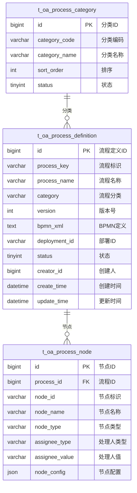

# 流程管理 - 数据结构设计

> **版本**: v1.0.0  
> **创建日期**: 2025-12-17

---

## 📊 ER图



---

## 📋 表结构详细设计

### t_oa_process_definition (流程定义表)

```sql
CREATE TABLE t_oa_process_definition (
    id BIGINT PRIMARY KEY AUTO_INCREMENT COMMENT '流程定义ID',
    process_key VARCHAR(50) NOT NULL COMMENT '流程标识',
    process_name VARCHAR(100) NOT NULL COMMENT '流程名称',
    category VARCHAR(50) COMMENT '流程分类',
    version INT DEFAULT 1 COMMENT '版本号',
    bpmn_xml TEXT COMMENT 'BPMN定义XML',
    deployment_id VARCHAR(64) COMMENT 'Activiti部署ID',
    process_definition_id VARCHAR(64) COMMENT 'Activiti流程定义ID',
    description VARCHAR(500) COMMENT '流程描述',
    form_key VARCHAR(50) COMMENT '关联表单标识',
    status TINYINT DEFAULT 1 COMMENT '状态:0禁用1启用2挂起',
    creator_id BIGINT COMMENT '创建人ID',
    create_time DATETIME NOT NULL DEFAULT CURRENT_TIMESTAMP COMMENT '创建时间',
    update_time DATETIME NOT NULL DEFAULT CURRENT_TIMESTAMP ON UPDATE CURRENT_TIMESTAMP COMMENT '更新时间',
    deleted_flag TINYINT DEFAULT 0 COMMENT '删除标记',
    UNIQUE KEY uk_process_key_version (process_key, version),
    INDEX idx_category (category),
    INDEX idx_status (status)
) ENGINE=InnoDB DEFAULT CHARSET=utf8mb4 COMMENT='流程定义表';
```

### t_oa_process_node (流程节点表)

```sql
CREATE TABLE t_oa_process_node (
    id BIGINT PRIMARY KEY AUTO_INCREMENT COMMENT '节点ID',
    process_id BIGINT NOT NULL COMMENT '流程定义ID',
    node_id VARCHAR(50) NOT NULL COMMENT '节点标识',
    node_name VARCHAR(100) NOT NULL COMMENT '节点名称',
    node_type VARCHAR(20) NOT NULL COMMENT '节点类型:USER_TASK/EXCLUSIVE_GATEWAY/PARALLEL_GATEWAY',
    assignee_type VARCHAR(20) COMMENT '处理人类型:USER/ROLE/DEPT/EXPRESSION',
    assignee_value VARCHAR(200) COMMENT '处理人值',
    form_key VARCHAR(50) COMMENT '节点表单标识',
    node_config JSON COMMENT '节点配置JSON',
    sort_order INT DEFAULT 0 COMMENT '排序',
    create_time DATETIME NOT NULL DEFAULT CURRENT_TIMESTAMP COMMENT '创建时间',
    INDEX idx_process_id (process_id),
    INDEX idx_node_id (node_id),
    FOREIGN KEY (process_id) REFERENCES t_oa_process_definition(id) ON DELETE CASCADE
) ENGINE=InnoDB DEFAULT CHARSET=utf8mb4 COMMENT='流程节点表';
```

---

## 🔧 字段枚举说明

### 节点类型

| 值 | 说明 |
|------|------|
| START_EVENT | 开始事件 |
| END_EVENT | 结束事件 |
| USER_TASK | 用户任务 |
| EXCLUSIVE_GATEWAY | 排他网关 |
| PARALLEL_GATEWAY | 并行网关 |
| SUB_PROCESS | 子流程 |

### 处理人类型

| 值 | 说明 |
|------|------|
| USER | 指定用户 |
| ROLE | 指定角色 |
| DEPT | 指定部门 |
| EXPRESSION | 表达式 |
| INITIATOR | 流程发起人 |
| LEADER | 发起人主管 |

---

**📝 文档维护**: IOE-DREAM架构团队 | 2025-12-17
