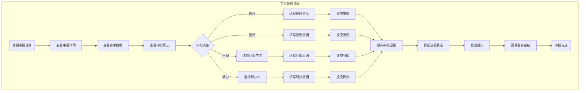
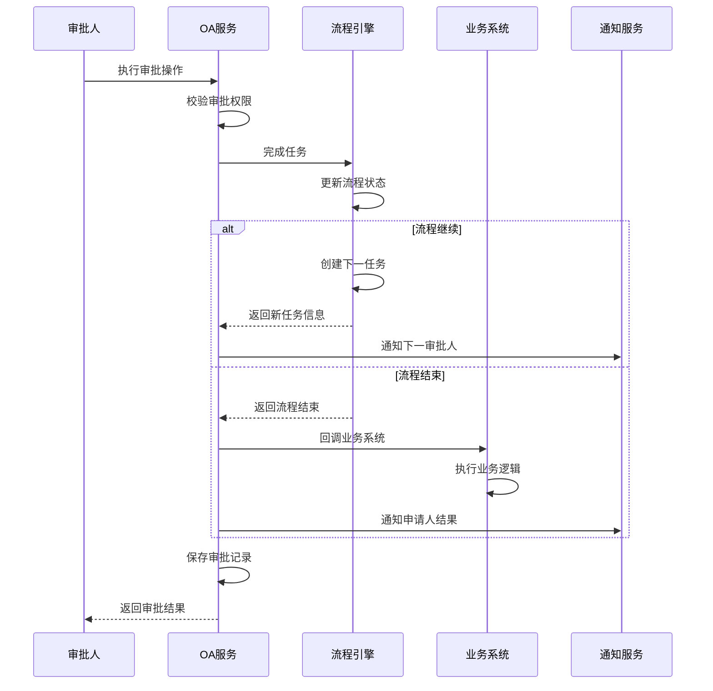
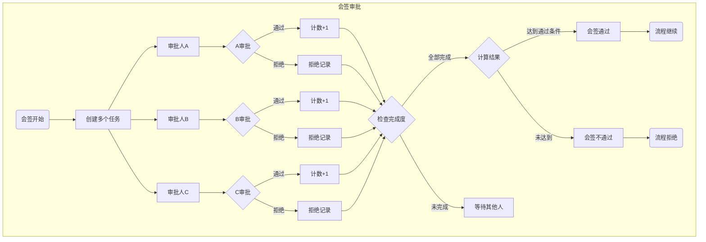

# 审批管理 - 业务流程图

> **版本**: v1.0.0  
> **创建日期**: 2025-12-17

---

## 📊 审批处理流程

```mermaid
graph TB
    subgraph 审批处理流程
        Start(收到审批任务) --> ViewDetail[查看申请详情]
        ViewDetail --> ViewForm[查看表单数据]
        ViewForm --> ViewHistory[查看审批历史]
        ViewHistory --> Decision{审批决策}
        
        Decision -->|通过| InputApproveComment[填写通过意见]
        Decision -->|拒绝| InputRejectReason[填写拒绝原因]
        Decision -->|回退| SelectRollbackNode[选择回退节点]
        Decision -->|转办| SelectTransferee[选择转办人]
        
        InputApproveComment --> SubmitApprove[提交审批]
        InputRejectReason --> SubmitReject[提交拒绝]
        SelectRollbackNode --> InputRollbackReason[填写回退原因]
        InputRollbackReason --> SubmitRollback[提交回退]
        SelectTransferee --> InputTransferReason[填写转办原因]
        InputTransferReason --> SubmitTransfer[提交转办]
        
        SubmitApprove --> SaveRecord[保存审批记录]
        SubmitReject --> SaveRecord
        SubmitRollback --> SaveRecord
        SubmitTransfer --> SaveRecord
        
        SaveRecord --> UpdateFlow[更新流程状态]
        UpdateFlow --> SendNotify[发送通知]
        SendNotify --> CallbackBiz[回调业务系统]
        CallbackBiz --> End(审批完成)
    end
```

---

## 📊 审批流转时序图

```mermaid
sequenceDiagram
    participant Approver as 审批人
    participant OA as OA服务
    participant Engine as 流程引擎
    participant Biz as 业务系统
    participant Notify as 通知服务
    
    Approver->>OA: 执行审批操作
    OA->>OA: 校验审批权限
    OA->>Engine: 完成任务
    Engine->>Engine: 更新流程状态
    
    alt 流程继续
        Engine->>Engine: 创建下一任务
        Engine-->>OA: 返回新任务信息
        OA->>Notify: 通知下一审批人
    else 流程结束
        Engine-->>OA: 返回流程结束
        OA->>Biz: 回调业务系统
        Biz->>Biz: 执行业务逻辑
        OA->>Notify: 通知申请人结果
    end
    
    OA->>OA: 保存审批记录
    OA-->>Approver: 返回审批结果
```

---

## 📊 会签审批流程

```mermaid
graph TB
    subgraph 会签审批
        Start(会签开始) --> CreateTasks[创建多个任务]
        CreateTasks --> Task1[审批人A]
        CreateTasks --> Task2[审批人B]
        CreateTasks --> Task3[审批人C]
        
        Task1 --> Result1{A审批}
        Task2 --> Result2{B审批}
        Task3 --> Result3{C审批}
        
        Result1 -->|通过| CountA[计数+1]
        Result1 -->|拒绝| RejectA[拒绝记录]
        Result2 -->|通过| CountB[计数+1]
        Result2 -->|拒绝| RejectB[拒绝记录]
        Result3 -->|通过| CountC[计数+1]
        Result3 -->|拒绝| RejectC[拒绝记录]
        
        CountA --> CheckComplete{检查完成度}
        CountB --> CheckComplete
        CountC --> CheckComplete
        RejectA --> CheckComplete
        RejectB --> CheckComplete
        RejectC --> CheckComplete
        
        CheckComplete -->|全部完成| CalcResult{计算结果}
        CheckComplete -->|未完成| Wait[等待其他人]
        
        CalcResult -->|达到通过条件| Pass[会签通过]
        CalcResult -->|未达到| Fail[会签不通过]
        
        Pass --> End(流程继续)
        Fail --> Reject(流程拒绝)
    end
```

---

**📝 文档维护**: IOE-DREAM架构团队 | 2025-12-17
