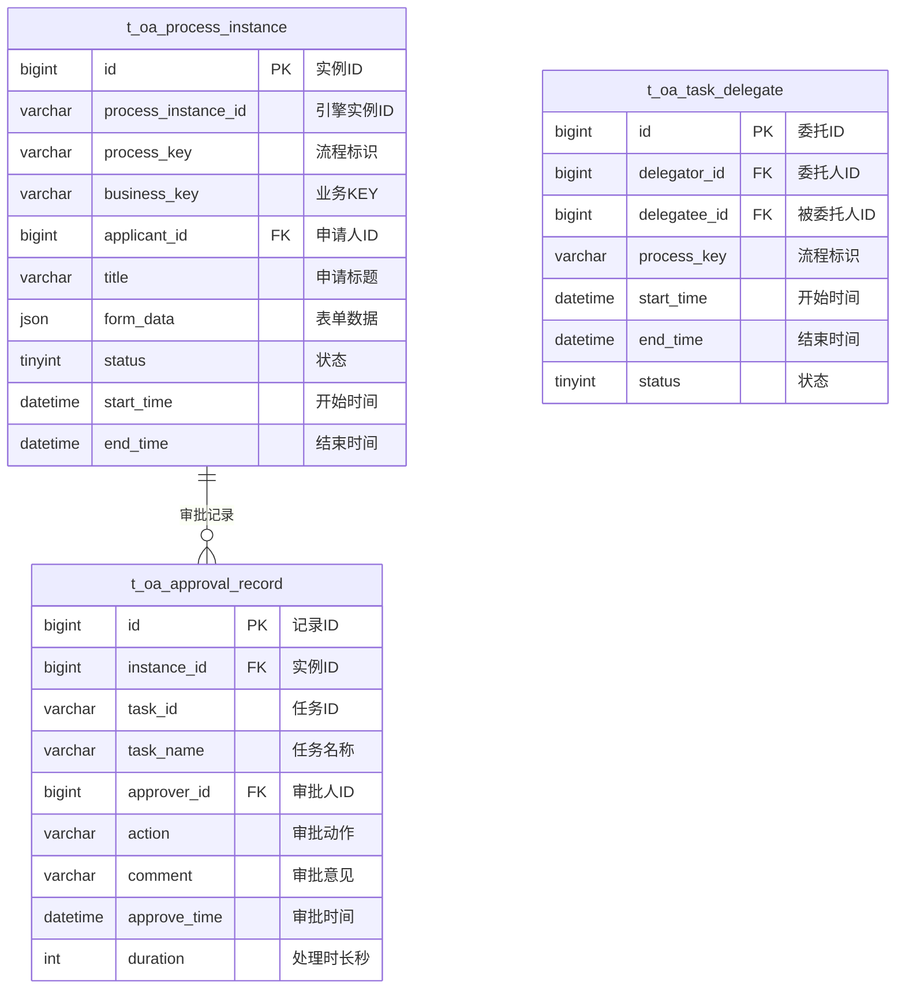

# 审批管理 - 数据结构设计

> **版本**: v1.0.0  
> **创建日期**: 2025-12-17

---

## 📊 ER图



---

## 📋 表结构详细设计

### t_oa_process_instance (流程实例表)

```sql
CREATE TABLE t_oa_process_instance (
    id BIGINT PRIMARY KEY AUTO_INCREMENT COMMENT '实例ID',
    process_instance_id VARCHAR(64) NOT NULL COMMENT 'Activiti实例ID',
    process_key VARCHAR(50) NOT NULL COMMENT '流程标识',
    process_name VARCHAR(100) COMMENT '流程名称',
    business_key VARCHAR(100) COMMENT '业务KEY',
    applicant_id BIGINT NOT NULL COMMENT '申请人ID',
    applicant_name VARCHAR(50) COMMENT '申请人姓名',
    title VARCHAR(200) NOT NULL COMMENT '申请标题',
    form_data JSON COMMENT '表单数据JSON',
    current_node VARCHAR(100) COMMENT '当前节点',
    current_approvers VARCHAR(500) COMMENT '当前审批人IDs',
    status TINYINT DEFAULT 0 COMMENT '状态:0进行中1已完成2已拒绝3已撤回4已终止',
    start_time DATETIME NOT NULL COMMENT '开始时间',
    end_time DATETIME COMMENT '结束时间',
    duration INT COMMENT '总时长秒',
    create_time DATETIME NOT NULL DEFAULT CURRENT_TIMESTAMP COMMENT '创建时间',
    update_time DATETIME NOT NULL DEFAULT CURRENT_TIMESTAMP ON UPDATE CURRENT_TIMESTAMP COMMENT '更新时间',
    UNIQUE KEY uk_process_instance_id (process_instance_id),
    INDEX idx_process_key (process_key),
    INDEX idx_applicant_id (applicant_id),
    INDEX idx_status (status),
    INDEX idx_start_time (start_time)
) ENGINE=InnoDB DEFAULT CHARSET=utf8mb4 COMMENT='流程实例表';
```

### t_oa_approval_record (审批记录表)

```sql
CREATE TABLE t_oa_approval_record (
    id BIGINT PRIMARY KEY AUTO_INCREMENT COMMENT '记录ID',
    instance_id BIGINT NOT NULL COMMENT '流程实例ID',
    process_instance_id VARCHAR(64) NOT NULL COMMENT 'Activiti实例ID',
    task_id VARCHAR(64) NOT NULL COMMENT '任务ID',
    task_name VARCHAR(100) COMMENT '任务名称',
    task_key VARCHAR(50) COMMENT '任务标识',
    approver_id BIGINT NOT NULL COMMENT '审批人ID',
    approver_name VARCHAR(50) COMMENT '审批人姓名',
    action VARCHAR(20) NOT NULL COMMENT '审批动作:APPROVE/REJECT/ROLLBACK/TRANSFER/DELEGATE',
    comment VARCHAR(500) COMMENT '审批意见',
    approve_time DATETIME NOT NULL COMMENT '审批时间',
    duration INT COMMENT '处理时长秒',
    create_time DATETIME NOT NULL DEFAULT CURRENT_TIMESTAMP COMMENT '创建时间',
    INDEX idx_instance_id (instance_id),
    INDEX idx_process_instance_id (process_instance_id),
    INDEX idx_approver_id (approver_id),
    INDEX idx_approve_time (approve_time)
) ENGINE=InnoDB DEFAULT CHARSET=utf8mb4 COMMENT='审批记录表';
```

### t_oa_task_delegate (任务委托表)

```sql
CREATE TABLE t_oa_task_delegate (
    id BIGINT PRIMARY KEY AUTO_INCREMENT COMMENT '委托ID',
    delegator_id BIGINT NOT NULL COMMENT '委托人ID',
    delegator_name VARCHAR(50) COMMENT '委托人姓名',
    delegatee_id BIGINT NOT NULL COMMENT '被委托人ID',
    delegatee_name VARCHAR(50) COMMENT '被委托人姓名',
    process_key VARCHAR(50) COMMENT '流程标识,空为全部',
    start_time DATETIME NOT NULL COMMENT '生效开始时间',
    end_time DATETIME NOT NULL COMMENT '生效结束时间',
    reason VARCHAR(200) COMMENT '委托原因',
    status TINYINT DEFAULT 1 COMMENT '状态:0失效1生效',
    create_time DATETIME NOT NULL DEFAULT CURRENT_TIMESTAMP COMMENT '创建时间',
    INDEX idx_delegator_id (delegator_id),
    INDEX idx_delegatee_id (delegatee_id),
    INDEX idx_status_time (status, start_time, end_time)
) ENGINE=InnoDB DEFAULT CHARSET=utf8mb4 COMMENT='任务委托表';
```

---

## 🔧 状态枚举

### 流程实例状态

| 值 | 说明 |
|------|------|
| 0 | 进行中 |
| 1 | 已完成(通过) |
| 2 | 已拒绝 |
| 3 | 已撤回 |
| 4 | 已终止 |

### 审批动作

| 值 | 说明 |
|------|------|
| APPROVE | 审批通过 |
| REJECT | 审批拒绝 |
| ROLLBACK | 回退 |
| TRANSFER | 转办 |
| DELEGATE | 委托 |
| ADD_SIGN | 加签 |
| SUB_SIGN | 减签 |

---

**📝 文档维护**: IOE-DREAM架构团队 | 2025-12-17
