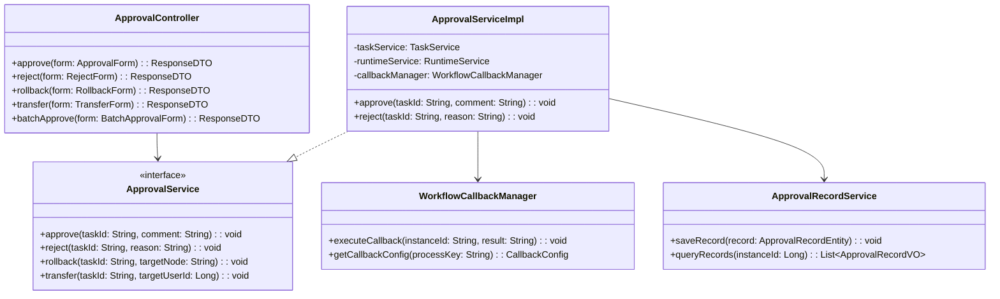

# 审批管理 - 详细设计

> **版本**: v1.0.0  
> **创建日期**: 2025-12-17

---

## 📊 类结构设计



---

## 🔧 API接口设计

### 审批通过

```
POST /api/oa/v1/approval/approve
```

**请求参数**:
```json
{
  "taskId": "task-001",
  "comment": "同意，符合规定",
  "variables": {
    "amount": 5000
  }
}
```

**响应**:
```json
{
  "code": 0,
  "msg": "审批成功",
  "data": {
    "processInstanceId": "instance-001",
    "nextNode": "部门主管审批",
    "nextApprovers": ["张三", "李四"]
  }
}
```

### 审批拒绝

```
POST /api/oa/v1/approval/reject
```

**请求参数**:
```json
{
  "taskId": "task-001",
  "reason": "金额超出预算，请修改后重新提交"
}
```

### 任务回退

```
POST /api/oa/v1/approval/rollback
```

**请求参数**:
```json
{
  "taskId": "task-001",
  "targetNodeId": "node-apply",
  "reason": "信息不完整，请补充"
}
```

### 批量审批

```
POST /api/oa/v1/approval/batch
```

**请求参数**:
```json
{
  "taskIds": ["task-001", "task-002", "task-003"],
  "action": "APPROVE",
  "comment": "批量审批通过"
}
```

---

## 📋 回调机制设计

### 回调配置表

```sql
CREATE TABLE t_oa_workflow_callback (
    id BIGINT PRIMARY KEY AUTO_INCREMENT,
    process_key VARCHAR(50) NOT NULL COMMENT '流程标识',
    callback_url VARCHAR(200) NOT NULL COMMENT '回调地址',
    callback_method VARCHAR(10) DEFAULT 'POST' COMMENT '请求方法',
    retry_times INT DEFAULT 3 COMMENT '重试次数',
    timeout INT DEFAULT 5000 COMMENT '超时毫秒',
    status TINYINT DEFAULT 1 COMMENT '状态',
    create_time DATETIME NOT NULL DEFAULT CURRENT_TIMESTAMP
) ENGINE=InnoDB DEFAULT CHARSET=utf8mb4;
```

### 回调请求格式

```json
{
  "processInstanceId": "instance-001",
  "processKey": "access_permission_apply",
  "businessKey": "apply-20251217-001",
  "result": "APPROVED",
  "applicantId": 1001,
  "formData": {
    "areaId": 100,
    "validDays": 30
  },
  "approvalRecords": [
    {
      "approver": "张三",
      "action": "APPROVE",
      "comment": "同意",
      "time": "2025-12-17 10:30:00"
    }
  ]
}
```

---

## 📈 性能优化

1. **任务缓存**: Redis缓存待办任务列表
2. **异步回调**: 审批完成后异步执行业务回调
3. **批量处理**: 支持批量审批减少数据库交互
4. **索引优化**: 审批记录表按时间分区

---

**📝 文档维护**: IOE-DREAM架构团队 | 2025-12-17
