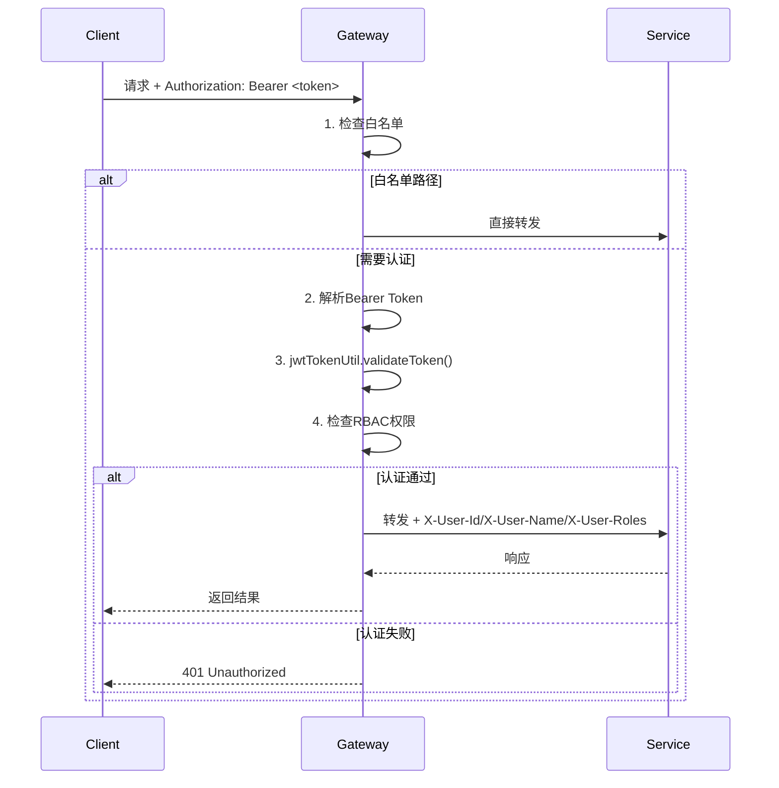

# 网关服务模块设计文档

> **版本**: v1.0.0  
> **更新日期**: 2025-12-17  
> **微服务**: ioedream-gateway-service (端口: 8080)

---

## 1. 模块概述

API网关是IOE-DREAM系统的统一入口，负责请求路由、负载均衡、限流、JWT认证、RBAC权限控制等核心功能。

### 技术栈

| 技术 | 版本 | 用途 |
|------|------|------|
| Spring Cloud Gateway | 2025.x | 网关核心(WebFlux) |
| Sa-Token / JWT | - | 认证授权 |
| Redis + Redisson | - | 分布式缓存/限流 |
| Nacos | 2.x | 服务发现/配置中心 |

### 核心类

| 类名 | 职责 |
|------|------|
| `JwtAuthenticationGlobalFilter` | JWT鉴权全局过滤器 |
| `RateLimitManager` | 限流管理器 |
| `RouteManager` | 路由管理器 |
| `WebFluxSecurityConfig` | 安全配置(白名单等) |

---

## 2. 路由配置

### 2.1 路由规则（基于application.yml）

| 路由ID | 路径前缀 | 目标服务 | 说明 |
|--------|----------|----------|------|
| ioedream-device-comm-service | `/api/v1/device/**`, `/api/v1/biometric/**` | lb://ioedream-device-comm-service | 设备通讯 |
| ioedream-access-service | `/api/v1/access/**`, `/api/v1/mobile/access/**` | lb://ioedream-access-service | 门禁服务 |
| ioedream-attendance-service | `/api/v1/attendance/**`, `/api/attendance/mobile/**` | lb://ioedream-attendance-service | 考勤服务 |
| ioedream-consume-service | `/api/v1/consume/**`, `/api/v1/payment/**` | lb://ioedream-consume-service | 消费服务 |
| ioedream-visitor-service | `/api/v1/visitor/**`, `/api/v1/mobile/visitor/**` | lb://ioedream-visitor-service | 访客服务 |
| ioedream-video-service | `/api/v1/video/**`, `/api/v1/mobile/video/**` | lb://ioedream-video-service | 视频服务 |
| ioedream-oa-service | `/api/v1/approval/**`, `/api/v1/workflow/**` | lb://ioedream-oa-service | OA服务 |
| ioedream-common-service | `/api/v1/system/**`, `/admin/**`, `/employee/**`等 | lb://ioedream-common-service | 公共服务 |

### 2.2 兼容路由（Legacy → Canonical）

```yaml
# 旧路径自动重写为规范路径
/access/** → /api/v1/access/**
/attendance/** → /api/v1/attendance/**
/consume/** → /api/v1/consume/**
/visitor/** → /api/v1/visitor/**
/video/** → /api/v1/video/**
/device/** → /api/v1/device/**
/system/** → /api/v1/system/**
```

---

## 3. 限流策略

### 3.1 RateLimitManager实现

```java
// 核心限流逻辑（滑动窗口算法）
public boolean isAllowed(String key) {
    RateLimitConfig config = configCache.getOrDefault(key, getDefaultConfig());
    // 检查时间窗口，重置计数器
    // 判断是否超过maxRequests
}
```

### 3.2 默认限流配置

| 参数 | 默认值 | 说明 |
|------|--------|------|
| maxRequests | 100 | 单窗口最大请求数 |
| windowMs | 60000 | 时间窗口(1分钟) |
| strategy | SLIDING_WINDOW | 滑动窗口算法 |

### 3.3 限流管理API

| 方法 | 功能 |
|------|------|
| `isAllowed(key)` | 检查是否允许请求 |
| `setRateLimitConfig(key, config)` | 设置限流配置 |
| `getRateLimitConfig(key)` | 获取限流配置 |
| `getStatistics()` | 获取限流统计 |
| `resetAllCounters()` | 重置所有计数器 |

---

## 4. 安全策略

### 4.1 JWT认证流程（JwtAuthenticationGlobalFilter）



### 4.2 静态白名单

```java
// JwtAuthenticationGlobalFilter.getStaticWhitelistFallback()
String[] STATIC_WHITE_LIST = {
    "/actuator/**",
    "/doc.html",
    "/swagger-ui/**",
    "/v3/api-docs/**",
    "/swagger-resources/**",
    "/webjars/**",
    "/favicon.ico",
    "/api/v1/auth/**",
    "/login/**",
    "/public/**",
    "/static/**",
    "/gateway/health"
};
```

### 4.3 请求头透传

| 请求头 | 说明 |
|--------|------|
| `X-User-Id` | 用户ID |
| `X-User-Name` | 用户名 |
| `X-User-Roles` | 用户角色(CSV) |
| `X-User-Permissions` | 用户权限(CSV) |

### 4.4 RBAC权限控制

```yaml
# RbacProperties配置
rbac:
  enabled: true
  rules:
    - pathPatterns: ["/api/v1/system/**"]
      requiredAnyRoles: ["ADMIN"]
    - pathPatterns: ["/api/v1/access/**"]
      requiredAnyPermissions: ["access:read", "access:write"]
```

---

## 5. 跨域配置

```yaml
# application.yml
globalcors:
  cors-configurations:
    '[/**]':
      allowedOriginPatterns:
        - "http://localhost:*"
        - "http://127.0.0.1:*"
        - "http://192.168.*.*:*"
      allowedMethods: [GET, POST, PUT, DELETE, OPTIONS, HEAD]
      allowedHeaders: "*"
      allowCredentials: true
      maxAge: 3600
```

---

## 6. 监控配置

### 6.1 Actuator端点

```yaml
management:
  endpoints:
    web:
      exposure:
        include: health,info,metrics,prometheus,gateway
      base-path: /actuator
```

### 6.2 追踪配置

```yaml
management:
  tracing:
    enabled: false  # 禁用避免Zipkin连接警告
    sampling:
      probability: 1.0
```

---

## 7. 性能指标

| 指标 | 要求 |
|------|------|
| 网关自身延迟 | < 10ms |
| 吞吐量 | ≥ 10000 QPS |
| 可用性 | ≥ 99.99% |

---

## 8. 配置文件结构

```
src/main/resources/
├── application.yml              # 主配置
├── application-dev.yml          # 开发环境
├── application-prod.yml         # 生产环境
├── application-docker.yml       # Docker环境
├── application-security.yml     # 安全配置
├── application-resilience4j.yml # 熔断配置
├── application-monitoring.yml   # 监控配置
├── application-performance.yml  # 性能配置
└── application-captcha.yml      # 验证码配置
```

---

**📝 文档维护**: IOE-DREAM架构团队
