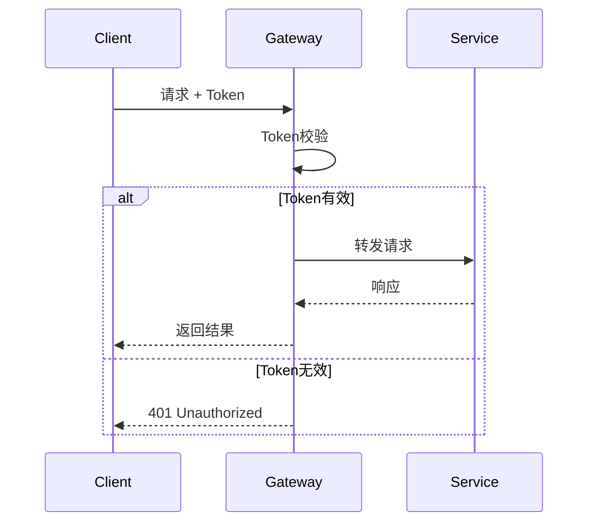

# 网关服务模块设计文档

> **版本**: v1.0.0  
> **更新日期**: 2025-12-17  
> **微服务**: ioedream-gateway-service (端口: 8080)

---

## 1. 模块概述

API网关是IOE-DREAM系统的统一入口，负责请求路由、负载均衡、限流熔断、安全认证等核心功能。

### 技术栈
| 技术 | 版本 | 用途 |
|------|------|------|
| Spring Cloud Gateway | 4.x | 网关核心 |
| Sa-Token | 1.37+ | 认证授权 |
| Sentinel | 1.8+ | 限流熔断 |
| Nacos | 2.x | 服务发现 |

---

## 2. 路由配置

### 2.1 路由规则

| 路径前缀 | 目标服务 | 端口 | 说明 |
|----------|----------|------|------|
| /api/common/** | ioedream-common-service | 8088 | 公共服务 |
| /api/device/** | ioedream-device-comm-service | 8087 | 设备通讯 |
| /api/access/** | ioedream-access-service | 8090 | 门禁服务 |
| /api/attendance/** | ioedream-attendance-service | 8091 | 考勤服务 |
| /api/ivs/** | ioedream-video-service | 8092 | 视频服务 |
| /api/consume/** | ioedream-consume-service | 8094 | 消费服务 |
| /api/visitor/** | ioedream-visitor-service | 8095 | 访客服务 |

### 2.2 路由配置示例

```yaml
spring:
  cloud:
    gateway:
      routes:
        - id: common-service
          uri: lb://ioedream-common-service
          predicates:
            - Path=/api/common/**
          filters:
            - StripPrefix=2
            - AddRequestHeader=X-Request-Source, gateway
            
        - id: access-service
          uri: lb://ioedream-access-service
          predicates:
            - Path=/api/access/**
          filters:
            - StripPrefix=2
```

---

## 3. 限流策略

### 3.1 限流规则

| 资源 | 限流类型 | QPS | 说明 |
|------|----------|-----|------|
| 全局 | 网关级 | 10000 | 系统总体限流 |
| 登录接口 | 接口级 | 100 | 防暴力破解 |
| 文件上传 | 接口级 | 50 | 带宽保护 |
| 普通API | 用户级 | 200 | 单用户限流 |
| 设备API | IP级 | 500 | 设备接入限流 |

### 3.2 限流配置

```yaml
sentinel:
  flow:
    # 全局限流
    - resource: gateway_global
      grade: 1  # QPS
      count: 10000
      strategy: 0
      
    # 登录接口限流
    - resource: /api/common/auth/login
      grade: 1
      count: 100
      strategy: 0
      
    # 用户级限流
    - resource: user_rate_limit
      grade: 1
      count: 200
      strategy: 0
      controlBehavior: 0  # 快速失败
```

### 3.3 熔断策略

| 资源 | 熔断条件 | 熔断时长 | 恢复策略 |
|------|----------|----------|----------|
| 下游服务 | 异常比例>50% | 30秒 | 半开探测 |
| 慢调用 | RT>3秒且比例>50% | 60秒 | 半开探测 |

---

## 4. 安全策略

### 4.1 认证流程



### 4.2 白名单配置

```yaml
security:
  whitelist:
    - /api/common/auth/login
    - /api/common/auth/captcha
    - /api/common/health
    - /api/visitor/qrcode/verify
    - /ws/**
```

### 4.3 安全过滤器

| 过滤器 | 顺序 | 功能 |
|--------|------|------|
| XssFilter | 1 | XSS攻击防护 |
| SqlInjectionFilter | 2 | SQL注入防护 |
| TokenAuthFilter | 3 | Token认证 |
| RateLimitFilter | 4 | 限流检查 |
| LoggingFilter | 5 | 请求日志 |

### 4.4 请求头处理

```yaml
headers:
  add:
    - X-Request-Id: ${uuid}
    - X-Request-Time: ${timestamp}
  remove:
    - X-Forwarded-For
  secure:
    - X-Content-Type-Options: nosniff
    - X-Frame-Options: DENY
    - X-XSS-Protection: 1; mode=block
```

---

## 5. 负载均衡

### 5.1 负载策略

| 策略 | 适用场景 |
|------|----------|
| RoundRobin | 默认策略，轮询 |
| WeightedResponse | 响应时间权重 |
| Random | 随机选择 |

### 5.2 健康检查

```yaml
health-check:
  enabled: true
  interval: 10s
  timeout: 3s
  unhealthyThreshold: 3
```

---

## 6. 性能指标

| 指标 | 要求 |
|------|------|
| 请求延迟 | < 10ms (网关自身) |
| 吞吐量 | ≥ 10000 QPS |
| 可用性 | ≥ 99.99% |
| 连接数 | ≥ 50000 |

---

## 7. 监控告警

### 7.1 监控指标

- 请求QPS / 响应时间 / 错误率
- 限流触发次数 / 熔断状态
- 下游服务健康状态
- JVM内存 / GC / 线程数

### 7.2 告警规则

| 指标 | 阈值 | 级别 |
|------|------|------|
| 错误率 | > 5% | 严重 |
| P99延迟 | > 500ms | 警告 |
| 熔断触发 | 任意 | 严重 |
| 限流触发 | > 100次/分 | 警告 |

---

**📝 文档维护**: IOE-DREAM架构团队
