# 考勤管理模块业务功能流程设计

## 1. 模块概述

### 1.1 业务定位
考勤管理模块是IOE-DREAM智慧园区安防综合管理平台的核心业务模块之一，负责员工考勤数据的采集、计算、管理和分析。该模块支持多种打卡方式、智能排班、异常管理、加班处理等完整考勤管理功能。

### 1.2 核心价值
- **统一考勤管理**：整合多种考勤方式，实现统一考勤管理
- **智能数据处理**：基于规则引擎的智能考勤计算和异常检测
- **灵活排班支持**：支持多种排班模式，包括三班倒、四班三倒等
- **完整异常处理**：支持请假、补签、加班、调班、销假等异常处理
- **实时监控预警**：实时监控考勤状态，及时预警异常情况

### 1.3 技术架构
- **微服务架构**：基于Spring Boot 3.5.8的独立考勤微服务
- **数据库设计**：MySQL 8.0 + MyBatis-Plus 3.5.15
- **缓存策略**：Redis + Caffeine多级缓存
- **API设计**：RESTful API + OpenAPI 3.0规范

---

## 2. 核心业务功能模块

### 2.1 考勤管理模块

#### 2.1.1 区域人员管理
**功能描述**：管理考勤区域和人员权限，支持员工在指定区域的考勤权限配置。

**业务流程**：
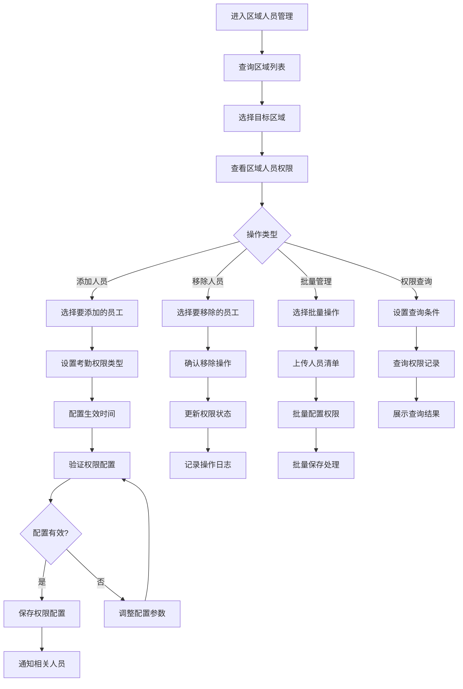
```mermaid
flowchart TD
    A[进入区域人员管理] --> B[查询区域列表]
    B --> C[选择目标区域]
    C --> D[查看区域人员权限]
    D --> E{操作类型}

    E -->|添加人员| F[选择要添加的员工]
    F --> G[设置考勤权限类型]
    G --> H[配置生效时间]
    H --> I[验证权限配置]
    I --> J{配置有效?}
    J -->|是| K[保存权限配置]
    J -->|否| L[调整配置参数]
    L --> I
    K --> M[通知相关人员]

    E -->|移除人员| N[选择要移除的员工]
    N --> O[确认移除操作]
    O --> P[更新权限状态]
    P --> Q[记录操作日志]

    E -->|批量管理| R[选择批量操作]
    R --> S[上传人员清单]
    S --> T[批量配置权限]
    T --> U[批量保存处理]

    E -->|权限查询| V[设置查询条件]
    V --> W[查询权限记录]
    W --> X[展示查询结果]
```

**关键功能点**：
- 区域权限分级管理（查看/编辑/审批）
- 权限有效期管理
- 批量人员权限配置
- 权限变更历史记录

#### 2.1.2 考勤设备管理
**功能描述**：管理考勤相关设备，包括考勤机、门禁设备、移动端设备等。

**业务流程**：
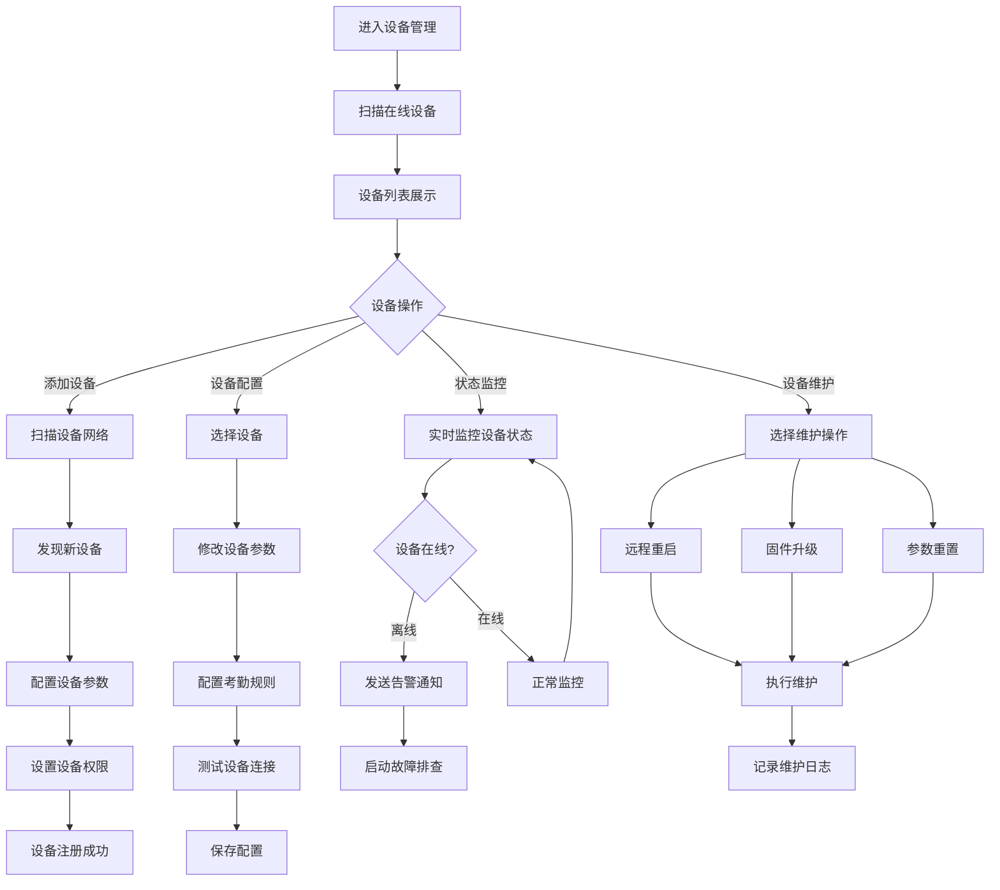
```mermaid
flowchart TD
    A[进入设备管理] --> B[扫描在线设备]
    B --> C[设备列表展示]
    C --> D{设备操作}

    D -->|添加设备| E[扫描设备网络]
    E --> F[发现新设备]
    F --> G[配置设备参数]
    G --> H[设置设备权限]
    H --> I[设备注册成功]

    D -->|设备配置| J[选择设备]
    J --> K[修改设备参数]
    K --> L[配置考勤规则]
    L --> M[测试设备连接]
    M --> N[保存配置]

    D -->|状态监控| O[实时监控设备状态]
    O --> P{设备在线?}
    P -->|离线| Q[发送告警通知]
    P -->|在线| R[正常监控]
    Q --> S[启动故障排查]
    R --> O

    D -->|设备维护| T[选择维护操作]
    T --> U[远程重启]
    T --> V[固件升级]
    T --> W[参数重置]
    U --> X[执行维护]
    V --> X
    W --> X
    X --> Y[记录维护日志]
```

**关键功能点**：
- 多品牌考勤机兼容
- 设备状态实时监控
- 远程设备维护
- 设备故障自动告警

### 2.2 基础信息模块

#### 2.2.1 考勤参数规则配置
**功能描述**：配置考勤计算规则、预警规则、通知规则等基础参数。

**考勤计算规则配置流程**：
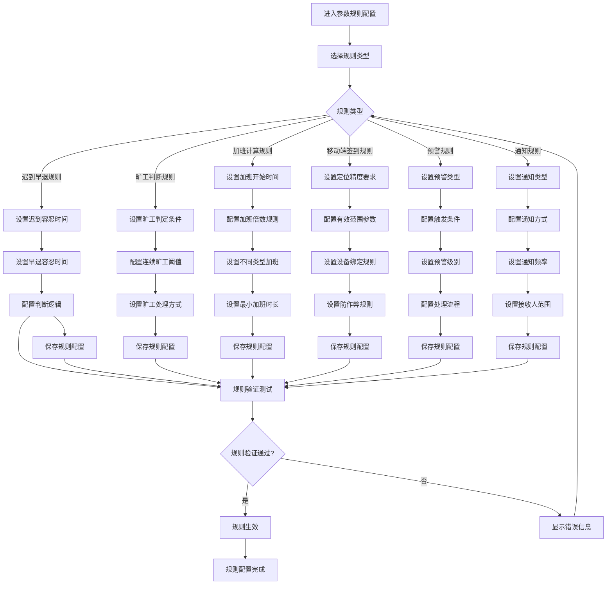
```mermaid
flowchart TD
    A[进入参数规则配置] --> B[选择规则类型]
    B --> C{规则类型}

    C -->|迟到早退规则| D[设置迟到容忍时间]
    D --> E[设置早退容忍时间]
    E --> F[配置判断逻辑]
    F --> G[保存规则配置]

    C -->|旷工判断规则| H[设置旷工判定条件]
    H --> I[配置连续旷工阈值]
    I --> J[设置旷工处理方式]
    J --> K[保存规则配置]

    C -->|加班计算规则| L[设置加班开始时间]
    L --> M[配置加班倍数规则]
    M --> N[设置不同类型加班]
    N --> O[设置最小加班时长]
    O --> P[保存规则配置]

    C -->|移动端签到规则| Q[设置定位精度要求]
    Q --> R[配置有效范围参数]
    R --> S[设置设备绑定规则]
    S --> T[设置防作弊规则]
    T --> U[保存规则配置]

    C -->|预警规则| V[设置预警类型]
    V --> W[配置触发条件]
    W --> X[设置预警级别]
    X --> Y[配置处理流程]
    Y --> Z[保存规则配置]

    C -->|通知规则| AA[设置通知类型]
    AA --> BB[配置通知方式]
    BB --> CC[设置通知频率]
    CC --> DD[设置接收人范围]
    DD --> EE[保存规则配置]

    F --> FF[规则验证测试]
    G --> FF
    K --> FF
    P --> FF
    U --> FF
    Z --> FF
    EE --> FF
    FF --> GG{规则验证通过?}
    GG -->|是| HH[规则生效]
    GG -->|否| II[显示错误信息]
    II --> C
    HH --> JJ[规则配置完成]
```

**关键功能点**：
- 灵活的规则配置引擎
- 多层级预警机制
- 个性化通知设置
- 规则版本管理

#### 2.2.2 假种管理
**功能描述**：管理各类请假类型，配置请假规则和审批流程。

**假种管理流程**：
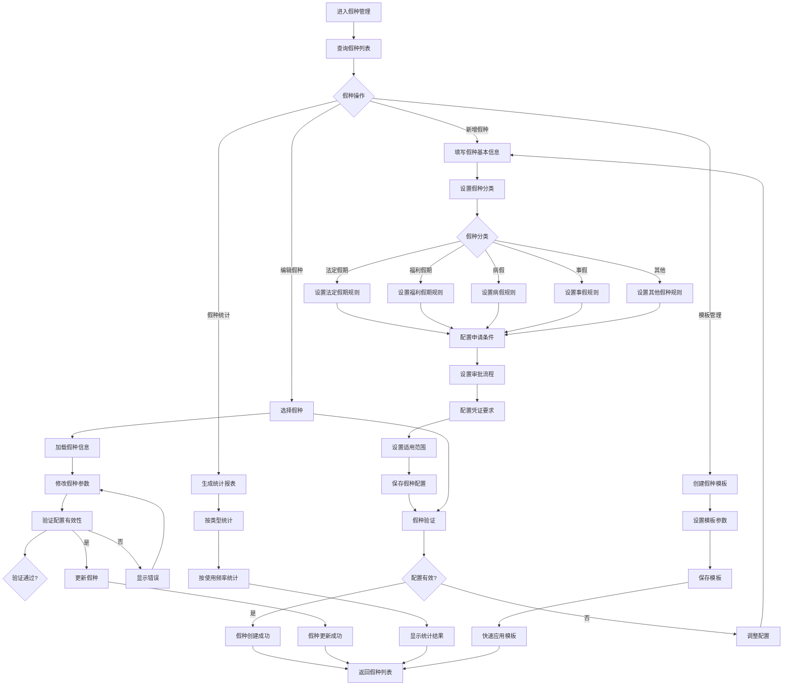
```mermaid
flowchart TD
    A[进入假种管理] --> B[查询假种列表]
    B --> C{假种操作}

    C -->|新增假种| D[填写假种基本信息]
    D --> E[设置假种分类]
    E --> F{假种分类}
    F -->|法定假期| G[设置法定假期规则]
    F -->|福利假期| H[设置福利假期规则]
    F -->|病假| I[设置病假规则]
    F -->|事假| J[设置事假规则]
    F -->|其他| K[设置其他假种规则]

    G --> L[配置申请条件]
    H --> L
    I --> L
    J --> L
    K --> L
    L --> M[设置审批流程]
    M --> N[配置凭证要求]
    N --> O[设置适用范围]
    O --> P[保存假种配置]

    C -->|编辑假种| Q[选择假种]
    Q --> R[加载假种信息]
    R --> S[修改假种参数]
    S --> T[验证配置有效性]
    T --> U{验证通过?}
    T -->|是| V[更新假种]
    T -->|否| W[显示错误]
    W --> S
    V --> X[假种更新成功]

    C -->|假种统计| Y[生成统计报表]
    Y --> Z[按类型统计]
    Z --> AA[按使用频率统计]
    AA --> BB[显示统计结果]

    C -->|模板管理| CC[创建假种模板]
    CC --> DD[设置模板参数]
    DD --> EE[保存模板]
    EE --> FF[快速应用模板]

    P --> GG[假种验证]
    Q --> GG
    GG --> HH{配置有效?}
    HH -->|是| II[假种创建成功]
    HH -->|否| JJ[调整配置]
    JJ --> D
    II --> KK[返回假种列表]
    X --> KK
    BB --> KK
    FF --> KK
```

**关键功能点**：
- 全面的假种类型支持
- 灵活的审批流程配置
- 假种使用统计和分析
- 假种模板快速复制

#### 2.2.3 报表推送配置
**功能描述**：配置各类考勤报表的自动推送规则和推送方式。

**报表推送配置流程**：
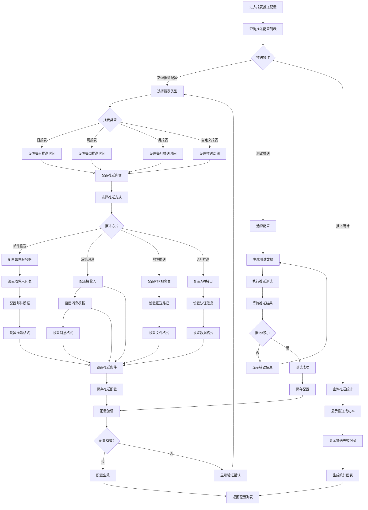
```mermaid
flowchart TD
    A[进入报表推送配置] --> B[查询推送配置列表]
    B --> C{推送操作}

    C -->|新增推送配置| D[选择报表类型]
    D --> E{报表类型}
    E -->|日报表| F[设置每日推送时间]
    E -->|周报表| G[设置每周推送时间]
    E -->|月报表| H[设置每月推送时间]
    E -->|自定义报表| I[设置推送周期]

    F --> J[配置推送内容]
    G --> J
    H --> J
    I --> J
    J --> K[选择推送方式]
    K --> L{推送方式}

    L -->|邮件推送| M[配置邮件服务器]
    M --> N[设置收件人列表]
    N --> O[配置邮件模板]
    O --> P[设置推送格式]

    L -->|系统消息| Q[配置接收人]
    Q --> R[设置消息模板]
    R --> S[设置消息格式]

    L -->|FTP推送| T[配置FTP服务器]
    T --> U[设置推送路径]
    U --> V[设置文件格式]

    L -->|API推送| W[配置API接口]
    W --> X[设置认证信息]
    X --> Y[设置数据格式]

    P --> Z[设置推送条件]
    Q --> Z
    R --> Z
    S --> Z
    V --> Z
    Y --> Z
    Z --> AA[保存推送配置]

    C -->|测试推送| AB[选择配置]
    AB --> AC[生成测试数据]
    AC --> AD[执行推送测试]
    AD --> AE[等待推送结果]
    AE --> AF{推送成功?}
    AF -->|否| AG[显示错误信息]
    AF -->|是| AH[测试成功]
    AG --> AC
    AH --> AI[保存配置]

    C -->|推送统计| AJ[查询推送统计]
    AJ --> AK[显示推送成功率]
    AK --> AL[显示推送失败记录]
    AL --> AM[生成统计图表]

    AA --> AN[配置验证]
    AI --> AN
    AN --> AO{配置有效?}
    AO -->|是| AP[配置生效]
    AO -->|否| AQ[显示验证错误]
    AQ --> D
    AP --> AR[返回配置列表]
    AM --> AR
```

**关键功能点**：
- 多种推送方式支持
- 灵活的推送周期配置
- 推送效果统计分析
- 推送失败自动重试

### 2.3 班次时间管理模块

#### 2.3.1 班次配置管理
**功能描述**：管理各类班次时间配置，支持固定班次、弹性班次、三班倒、四班三倒等模式。

**班次配置流程**：
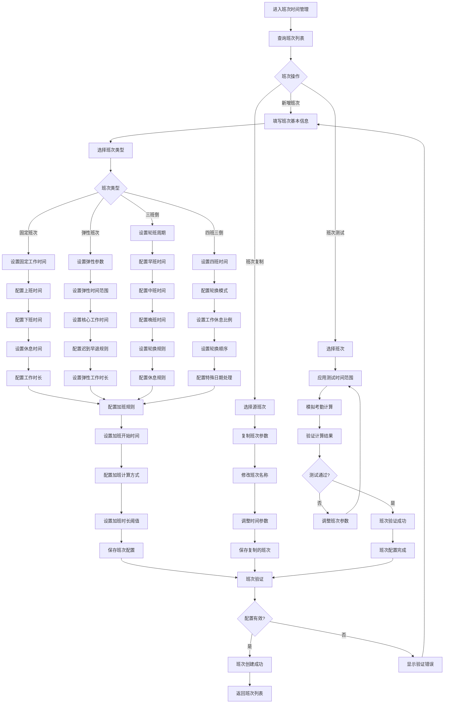
```mermaid
flowchart TD
    A[进入班次时间管理] --> B[查询班次列表]
    B --> C{班次操作}

    C -->|新增班次| D[填写班次基本信息]
    D --> E[选择班次类型]
    E --> F{班次类型}

    F -->|固定班次| G[设置固定工作时间]
    G --> H[配置上班时间]
    H --> I[配置下班时间]
    I --> J[设置休息时间]
    J --> K[配置工作时长]

    F -->|弹性班次| L[设置弹性参数]
    L --> M[设置弹性时间范围]
    M --> N[设置核心工作时间]
    N --> O[配置迟到早退规则]
    O --> P[设置弹性工作时长]

    F -->|三班倒| Q[设置轮班周期]
    Q --> R[配置早班时间]
    R --> S[配置中班时间]
    S --> T[配置晚班时间]
    T --> U[设置轮换规则]
    U --> V[配置休息规则]

    F -->|四班三倒| W[设置四班时间]
    W --> X[配置轮换模式]
    X --> Y[设置工作休息比例]
    Y --> Z[设置轮换顺序]
    Z --> AA[配置特殊日期处理]

    K --> BB[配置加班规则]
    P --> BB
    V --> BB
    AA --> BB
    BB --> CC[设置加班开始时间]
    CC --> DD[配置加班计算方式]
    DD --> EE[设置加班时长阈值]
    EE --> FF[保存班次配置]

    C -->|班次复制| GG[选择源班次]
    GG --> HH[复制班次参数]
    HH --> II[修改班次名称]
    II --> JJ[调整时间参数]
    JJ --> KK[保存复制的班次]

    C -->|班次测试| LL[选择班次]
    LL --> MM[应用测试时间范围]
    MM --> NN[模拟考勤计算]
    NN --> OO[验证计算结果]
    OO --> PP{测试通过?}
    PP -->|否| QQ[调整班次参数]
    PP -->|是| RR[班次验证成功]
    QQ --> MM
    RR --> SS[班次配置完成]

    FF --> TT[班次验证]
    KK --> TT
    SS --> TT
    TT --> UU{配置有效?}
    UU -->|是| VV[班次创建成功]
    UU -->|否| WW[显示验证错误]
    WW --> D
    VV --> XX[返回班次列表]
```

**关键功能点**：
- 多种班次模式支持
- 智能班次验证
- 班次模板复制
- 班次生效时间管理

#### 2.3.2 时间段管理
**功能描述**：管理班次中的时间段配置，支持多时间段组合。

**时间段配置流程**：
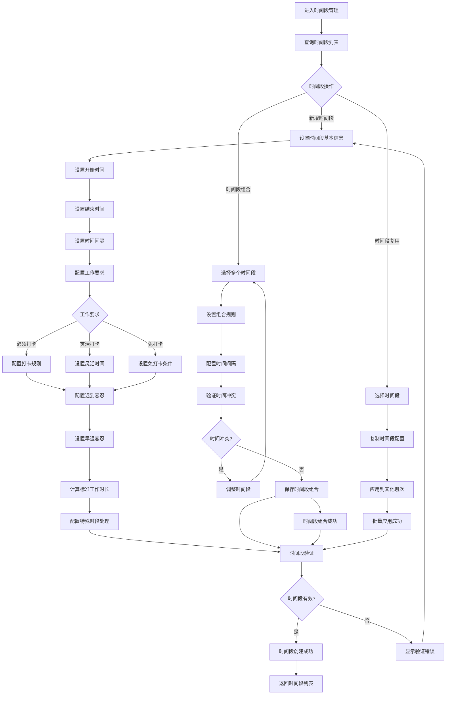
```mermaid
flowchart TD
    A[进入时间段管理] --> B[查询时间段列表]
    B --> C{时间段操作}

    C -->|新增时间段| D[设置时间段基本信息]
    D --> E[设置开始时间]
    E --> F[设置结束时间]
    F --> G[设置时间间隔]
    G --> H[配置工作要求]
    H --> I{工作要求}

    I -->|必须打卡| J[配置打卡规则]
    I -->|灵活打卡| K[设置灵活时间]
    I -->|免打卡| L[设置免打卡条件]

    J --> M[配置迟到容忍]
    K --> M
    L --> M
    M --> N[设置早退容忍]
    N --> O[计算标准工作时长]
    O --> P[配置特殊时段处理]

    C -->|时间段组合| Q[选择多个时间段]
    Q --> R[设置组合规则]
    R --> S[配置时间间隔]
    S --> T[验证时间冲突]
    T --> U{时间冲突?}
    U -->|是| V[调整时间段]
    U -->|否| W[保存时间段组合]
    V --> Q
    W --> X[时间段组合成功]

    C -->|时间段复用| Y[选择时间段]
    Y --> Z[复制时间段配置]
    Z --> AA[应用到其他班次]
    AA --> BB[批量应用成功]

    P --> CC[时间段验证]
    W --> CC
    X --> CC
    BB --> CC
    CC --> DD{时间段有效?}
    DD -->|是| EE[时间段创建成功]
    DD -->|否| FF[显示验证错误]
    FF --> D
    EE --> GG[返回时间段列表]
```

**关键功能点**：
- 灵活的时间段配置
- 时间段智能组合
- 时间段模板复用
- 时间冲突检测

### 2.4 排班管理模块

#### 2.4.1 排班日历管理
**功能描述**：管理员工排班日历，支持个人排班、分组排班、智能排班等功能。

**排班日历流程**：
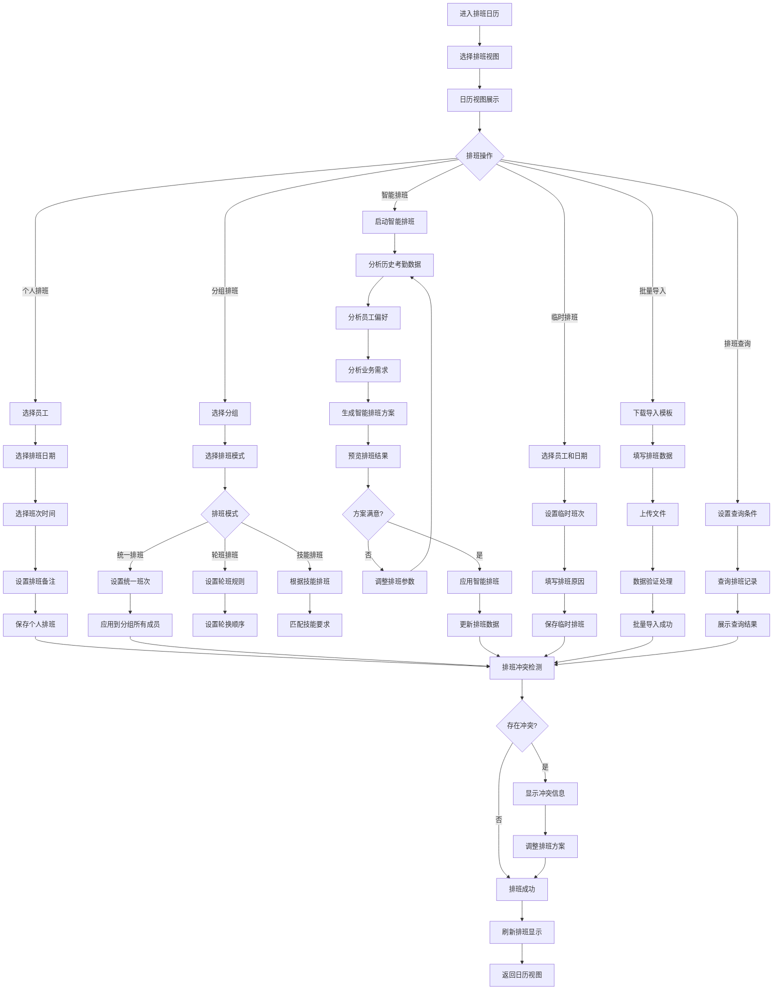
```mermaid
flowchart TD
    A[进入排班日历] --> B[选择排班视图]
    B --> C[日历视图展示]
    C --> D{排班操作}

    D -->|个人排班| E[选择员工]
    E --> F[选择排班日期]
    F --> G[选择班次时间]
    G --> H[设置排班备注]
    H --> I[保存个人排班]

    D -->|分组排班| J[选择分组]
    J --> K[选择排班模式]
    K --> L{排班模式}
    L -->|统一排班| M[设置统一班次]
    L -->|轮班排班| N[设置轮班规则]
    L -->|技能排班| O[根据技能排班]

    M --> P[应用到分组所有成员]
    N --> Q[设置轮换顺序]
    O --> R[匹配技能要求]

    D -->|智能排班| S[启动智能排班]
    S --> T[分析历史考勤数据]
    T --> U[分析员工偏好]
    U --> V[分析业务需求]
    V --> W[生成智能排班方案]
    W --> X[预览排班结果]
    X --> Y{方案满意?}
    Y -->|否| Z[调整排班参数]
    Y -->|是| AA[应用智能排班]
    Z --> T
    AA --> BB[更新排班数据]

    D -->|临时排班| CC[选择员工和日期]
    CC --> DD[设置临时班次]
    DD --> EE[填写排班原因]
    EE --> FF[保存临时排班]

    D -->|批量导入| GG[下载导入模板]
    GG --> HH[填写排班数据]
    HH --> II[上传文件]
    II --> JJ[数据验证处理]
    JJ --> KK[批量导入成功]

    D -->|排班查询| LL[设置查询条件]
    LL --> MM[查询排班记录]
    MM --> NN[展示查询结果]

    I --> OO[排班冲突检测]
    P --> OO
    BB --> OO
    FF --> OO
    KK --> OO
    NN --> OO
    OO --> PP{存在冲突?}
    PP -->|是| QQ[显示冲突信息]
    PP -->|否| RR[排班成功]
    QQ --> SS[调整排班方案]
    RR --> TT[刷新排班显示]
    SS --> RR
    TT --> UU[返回日历视图]
```

**关键功能点**：
- 多种排班模式支持
- AI智能排班算法
- 排班冲突自动检测
- 批量排班操作

#### 2.4.2 排班规则配置
**功能描述**：配置排班相关规则，包括排班约束、公平性规则等。

**排班规则配置流程**：
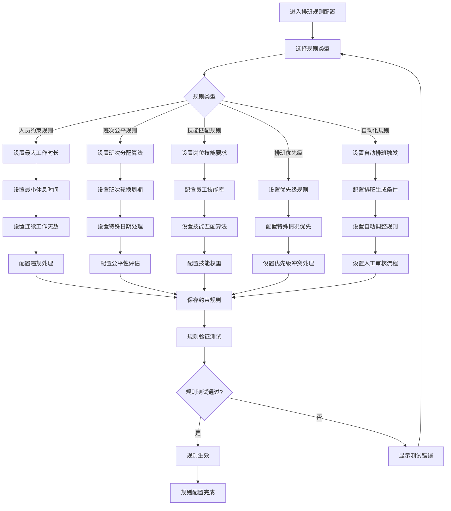
```mermaid
flowchart TD
    A[进入排班规则配置] --> B[选择规则类型]
    B --> C{规则类型}

    C -->|人员约束规则| D[设置最大工作时长]
    D --> E[设置最小休息时间]
    E --> F[设置连续工作天数]
    F --> G[配置违规处理]

    C -->|班次公平规则| H[设置班次分配算法]
    H --> I[设置班次轮换周期]
    I --> J[设置特殊日期处理]
    J --> K[配置公平性评估]

    C -->|技能匹配规则| L[设置岗位技能要求]
    L --> M[配置员工技能库]
    M --> N[设置技能匹配算法]
    N --> O[配置技能权重]

    C -->|排班优先级| P[设置优先级规则]
    P --> Q[配置特殊情况优先]
    Q --> R[设置优先级冲突处理]

    C -->|自动化规则| S[设置自动排班触发]
    S --> T[配置排班生成条件]
    T --> U[设置自动调整规则]
    U --> V[设置人工审核流程]

    G --> WW[保存约束规则]
    K --> WW
    O --> WW
    R --> WW
    V --> WW
    WW --> XX[规则验证测试]

    XX --> YY{规则测试通过?}
    YY -->|是| ZZ[规则生效]
    YY -->|否| AAA[显示测试错误]
    AAA --> B
    ZZ --> BBB[规则配置完成]
```

**关键功能点**：
- 全面的排班约束规则
- 公平性保证机制
- 智能技能匹配
- 自动化排班支持

### 2.5 异常管理模块

#### 2.5.1 异常申请管理
**功能描述**：管理各类考勤异常申请，包括请假、补签、加班、调班、销假等。

**异常申请流程**：
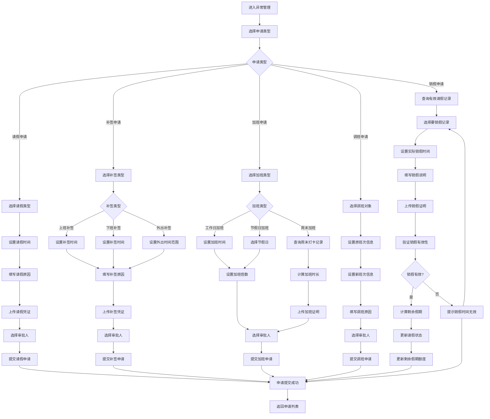
```mermaid
flowchart TD
    A[进入异常管理] --> B[选择申请类型]
    B --> C{申请类型}

    C -->|请假申请| D[选择请假类型]
    D --> E[设置请假时间]
    E --> F[填写请假原因]
    F --> G[上传请假凭证]
    G --> H[选择审批人]
    H --> I[提交请假申请]

    C -->|补签申请| J[选择补签类型]
    J --> K{补签类型}
    K -->|上班补签| L[设置补签时间]
    K -->|下班补签| M[设置补签时间]
    K -->|外出补签| N[设置外出时间范围]
    L --> O[填写补签原因]
    M --> O
    N --> O
    O --> P[上传补签凭证]
    P --> Q[选择审批人]
    Q --> R[提交补签申请]

    C -->|加班申请| S[选择加班类型]
    S --> T{加班类型}
    T -->|工作日加班| U[设置加班时间]
    T -->|周末加班| V[查询周末打卡记录]
    T -->|节假日加班| W[选择节假日]
    U --> X[填写加班原因]
    V --> Y[计算加班时长]
    W --> X[设置加班倍数]
    Y --> Z[上传加班证明]
    X --> AA[选择审批人]
    Z --> AA
    AA --> BB[提交加班申请]

    C -->|调班申请| CC[选择调班对象]
    CC --> DD[设置原班次信息]
    DD --> EE[设置新班次信息]
    EE --> FF[填写调班原因]
    FF --> GG[选择审批人]
    GG --> HH[提交调班申请]

    C -->|销假申请| II[查询有效请假记录]
    II --> JJ[选择要销假记录]
    JJ --> KK[设置实际销假时间]
    KK --> LL[填写销假说明]
    LL --> MM[上传销假证明]
    MM --> NN[验证销假有效性]
    NN --> OO{销假有效?}
    OO -->|是| PP[计算剩余假期]
    OO -->|否| QQ[提示销假时间无效]
    PP --> RR[更新请假状态]
    QQ --> JJ
    RR --> SS[更新剩余假期额度]

    I --> TT[申请提交成功]
    R --> TT
    BB --> TT
    HH --> TT
    SS --> TT
    QQ --> TT
    TT --> UU[返回申请列表]
```

**关键功能点**：
- 统一的异常申请入口
- 智能的申请验证
- 完整的审批流程
- 自动化的状态更新

#### 2.5.2 异常审批流程
**功能描述**：处理各类异常申请的审批工作流。

**异常审批流程**：
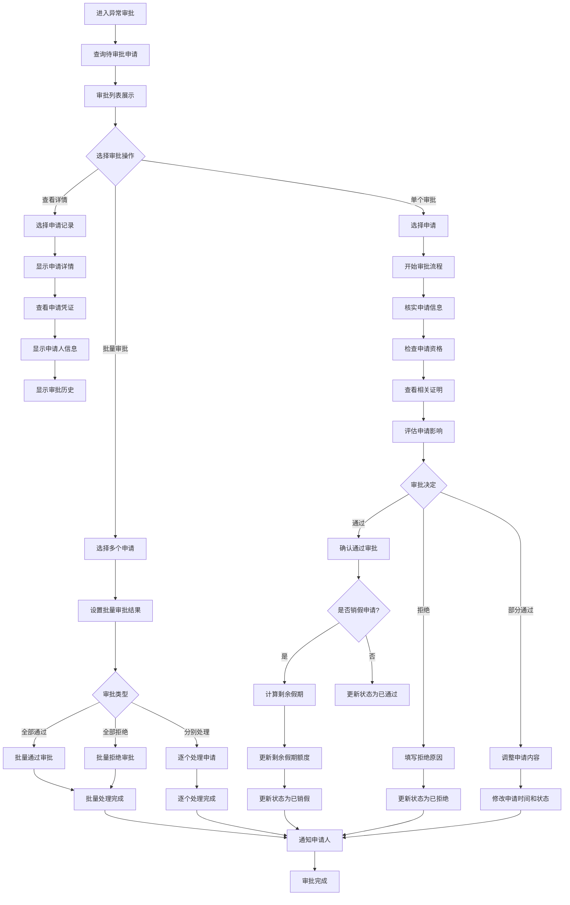
```mermaid
flowchart TD
    A[进入异常审批] --> B[查询待审批申请]
    B --> C[审批列表展示]
    C --> D{选择审批操作}

    D -->|查看详情| E[选择申请记录]
    E --> F[显示申请详情]
    F --> G[查看申请凭证]
    G --> H[显示申请人信息]
    H --> I[显示审批历史]

    D -->|批量审批| J[选择多个申请]
    J --> K[设置批量审批结果]
    K --> L{审批类型}
    L -->|全部通过| M[批量通过审批]
    L -->|全部拒绝| N[批量拒绝审批]
    L -->|分别处理| O[逐个处理申请]

    D -->|单个审批| P[选择申请]
    P --> Q[开始审批流程]
    Q --> R[核实申请信息]
    R --> S[检查申请资格]
    S --> T[查看相关证明]
    T --> U[评估申请影响]
    U --> V{审批决定}

    V -->|通过| W[确认通过审批]
    V -->|拒绝| X[填写拒绝原因]
    V -->|部分通过| Y[调整申请内容]

    W --> Z{是否销假申请?}
    Z -->|是| AA[计算剩余假期]
    Z -->|否| AB[更新状态为已通过]
    AA --> AC[更新剩余假期额度]
    AC --> AD[更新状态为已销假]

    X --> AE[更新状态为已拒绝]
    Y --> AF[修改申请时间和状态]

    M --> AG[批量处理完成]
    N --> AG
    O --> AH[逐个处理完成]

    AD --> AI[通知申请人]
    AE --> AI
    AF --> AI
    AG --> AI
    AH --> AI
    AI --> AJ[审批完成]
```

**关键功能点**：
- 灵活的审批处理方式
- 智能的资格验证
- 批量审批支持
- 完整的审批记录

### 2.6 考勤计算模块

#### 2.6.1 考勤数据计算
**功能描述**：根据打卡记录和排班信息进行考勤计算，生成考勤结果。

**考勤计算流程**：
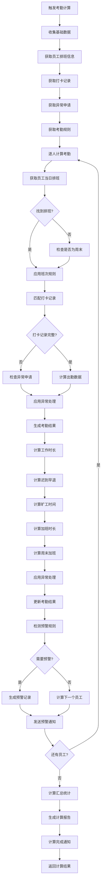
```mermaid
flowchart TD
    A[触发考勤计算] --> B[收集基础数据]
    B --> C[获取员工排班信息]
    C --> D[获取打卡记录]
    D --> E[获取异常申请]
    E --> F[获取考勤规则]

    F --> G[逐人计算考勤]
    G --> H[获取员工当日排班]
    H --> I{找到排班?}
    I -->|否| J[检查是否为周末]
    I -->|是| K[应用班次规则]

    J --> K
    K --> L[匹配打卡记录]
    L --> M{打卡记录完整?}
    M -->|否| N[检查异常申请]
    M -->|是| O[计算出勤数据]

    N --> P[应用异常处理]
    O --> P
    P --> Q[生成考勤结果]

    Q --> R[计算工作时长]
    R --> S[计算迟到早退]
    S --> T[计算旷工时间]
    T --> U[计算加班时长]
    U --> V[计算周末加班]
    V --> W[应用异常处理]

    W --> X[更新考勤结果]
    X --> Y[检测预警规则]
    Y --> Z{需要预警?}
    Z -->|是| AA[生成预警记录]
    Z -->|否| BB[计算下一个员工]
    AA --> CC[发送预警通知]
    BB --> CC

    CC --> DD{还有员工?}
    DD -->|是| G
    DD -->|否| EE[计算汇总统计]
    EE --> FF[生成计算报告]
    FF --> GG[计算完成通知]

    GG --> HH[返回计算结果]
```

**关键功能点**：
- 智能的班次匹配算法
- 精确的考勤数据计算
- 自动异常检测
- 实时预警通知

#### 2.6.2 考勤结果查询
**功能描述**：查询和展示考勤计算结果，支持多维度查询和统计。

**考勤结果查询流程**：
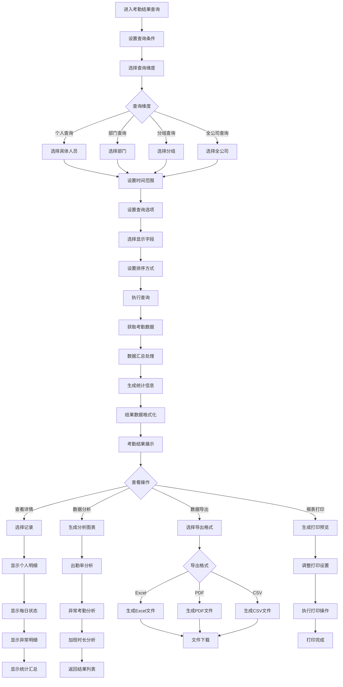
```mermaid
flowchart TD
    A[进入考勤结果查询] --> B[设置查询条件]
    B --> C[选择查询维度]
    C --> D{查询维度}

    D -->|个人查询| E[选择具体人员]
    D -->|部门查询| F[选择部门]
    D -->|分组查询| G[选择分组]
    D -->|全公司查询| H[选择全公司]

    E --> I[设置时间范围]
    F --> I
    G --> I
    H --> I
    I --> J[设置查询选项]
    J --> K[选择显示字段]
    K --> L[设置排序方式]
    L --> M[执行查询]

    M --> N[获取考勤数据]
    N --> O[数据汇总处理]
    O --> P[生成统计信息]
    P --> Q[结果数据格式化]
    Q --> R[考勤结果展示]
    R --> S{查看操作}

    S -->|查看详情| T[选择记录]
    T --> U[显示个人明细]
    U --> V[显示每日状态]
    V --> W[显示异常明细]
    W --> X[显示统计汇总]

    S -->|数据导出| Y[选择导出格式]
    Y --> Z{导出格式}
    Z -->|Excel| AA[生成Excel文件]
    Z -->|PDF| AB[生成PDF文件]
    Z -->|CSV| AC[生成CSV文件]

    S -->|报表打印| AD[生成打印预览]
    AD --> AE[调整打印设置]
    AE --> AF[执行打印操作]

    S -->|数据分析| AG[生成分析图表]
    AG --> AH[出勤率分析]
    AH --> AI[异常考勤分析]
    AI --> AJ[加班时长分析]

    AA --> AK[文件下载]
    AB --> AK
    AC --> AK
    AF --> AL[打印完成]
    AJ --> AM[返回结果列表]
```

**关键功能点**：
- 多维度查询支持
- 丰富的数据展示方式
- 灵活的导出功能
- 直观的数据分析图表

### 2.7 考勤汇总报表模块

#### 2.7.1 考勤统计报表
**功能描述**：生成各类考勤统计报表，支持日报、周报、月报等多种类型。

**考勤统计报表流程**：
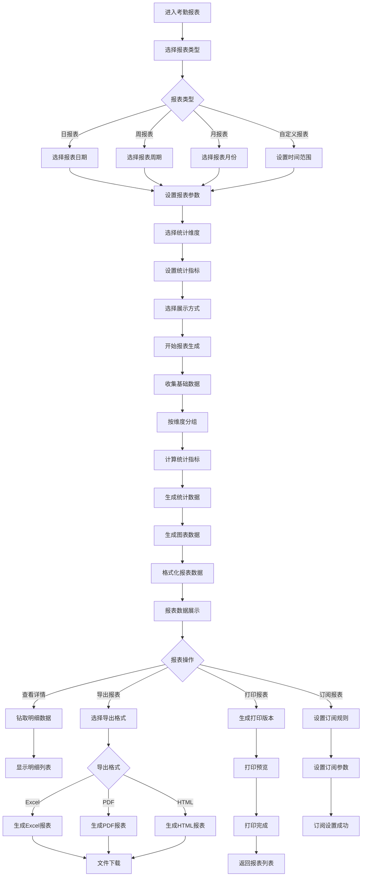
```mermaid
flowchart TD
    A[进入考勤报表] --> B[选择报表类型]
    B --> C{报表类型}

    C -->|日报表| D[选择报表日期]
    C -->|周报表| E[选择报表周期]
    C -->|月报表| F[选择报表月份]
    C -->|自定义报表| G[设置时间范围]

    D --> H[设置报表参数]
    E --> H
    F --> H
    G --> H
    H --> I[选择统计维度]
    I --> J[设置统计指标]
    J --> K[选择展示方式]
    K --> L[开始报表生成]

    L --> M[收集基础数据]
    M --> N[按维度分组]
    N --> O[计算统计指标]
    O --> P[生成统计数据]
    P --> Q[生成图表数据]
    Q --> R[格式化报表数据]
    R --> S[报表数据展示]

    S --> T{报表操作}
    T -->|查看详情| U[钻取明细数据]
    T -->|导出报表| V[选择导出格式]
    T -->|打印报表| W[生成打印版本]
    T -->|订阅报表| X[设置订阅规则]

    U --> Y[显示明细列表]
    V --> Z{导出格式}
    Z -->|Excel| AA[生成Excel报表]
    Z -->|PDF| AB[生成PDF报表]
    Z -->|HTML| AC[生成HTML报表]

    W --> AD[打印预览]
    X --> AE[设置订阅参数]

    AA --> AF[文件下载]
    AB --> AF
    AC --> AF
    AD --> AG[打印完成]
    AE --> AH[订阅设置成功]

    AG --> AI[返回报表列表]
```

**关键功能点**：
- 多种报表类型支持
- 丰富的统计指标
- 图表化数据展示
- 报表订阅功能

---

## 3. 跨模块业务流程

### 3.1 考勤-OA工作流集成
**集成场景**：考勤异常申请通过OA工作流进行审批处理。

**集成流程**：
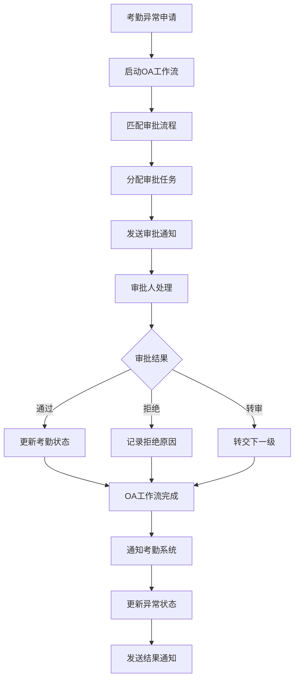
```mermaid
flowchart TD
    A[考勤异常申请] --> B[启动OA工作流]
    B --> C[匹配审批流程]
    C --> D[分配审批任务]
    D --> E[发送审批通知]
    E --> F[审批人处理]
    F --> G{审批结果}
    G -->|通过| H[更新考勤状态]
    G -->|拒绝| I[记录拒绝原因]
    G -->|转审| J[转交下一级]

    H --> K[OA工作流完成]
    I --> K
    J --> K
    K --> L[通知考勤系统]
    L --> M[更新异常状态]
    M --> N[发送结果通知]
```

**集成优势**：
- 统一的审批流程
- 完整的审批记录
- 实时状态同步

### 3.2 考勤-通知系统集成
**集成场景**：考勤异常和预警信息通过通知系统及时推送。

**集成流程**：
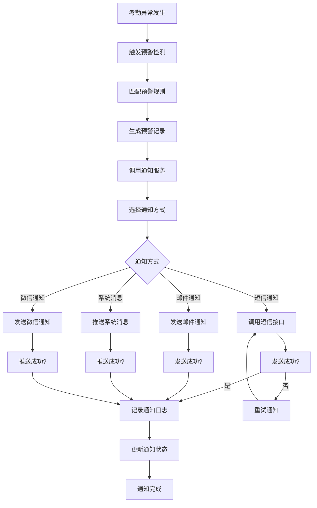
```mermaid
flowchart TD
    A[考勤异常发生] --> B[触发预警检测]
    B --> C[匹配预警规则]
    C --> D[生成预警记录]
    D --> E[调用通知服务]
    E --> F[选择通知方式]
    F --> G{通知方式}

    G -->|短信通知| H[调用短信接口]
    G -->|邮件通知| I[发送邮件通知]
    G -->|系统消息| J[推送系统消息]
    G -->|微信通知| K[发送微信通知]

    H --> L[发送成功?]
    I --> M[发送成功?]
    J --> N[推送成功?]
    K --> O[推送成功?]

    L -->|是| P[记录通知日志]
    L -->|否| Q[重试通知]
    M --> P
    N --> P
    O --> P
    Q --> H

    P --> R[更新通知状态]
    R --> S[通知完成]
```

**集成优势**：
- 多渠道通知支持
- 通知状态跟踪
- 自动重试机制

### 3.3 考勤-设备通讯集成
**集成场景**：考勤数据通过设备通讯服务从各类设备采集。

**集成流程**：
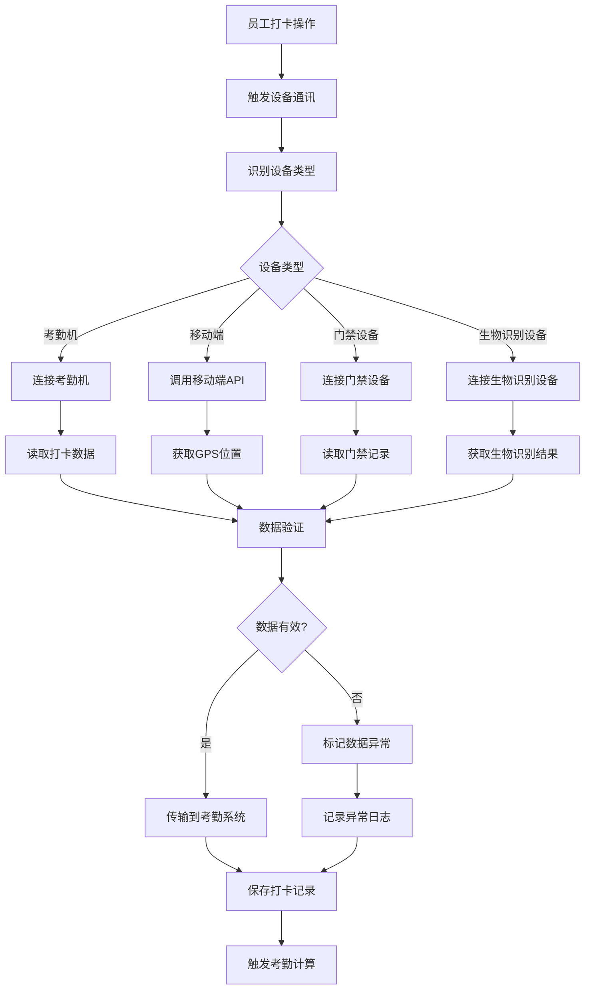
```mermaid
flowchart TD
    A[员工打卡操作] --> B[触发设备通讯]
    B --> C[识别设备类型]
    C --> D{设备类型}

    D -->|考勤机| E[连接考勤机]
    D -->|移动端| F[调用移动端API]
    D -->|门禁设备| G[连接门禁设备]
    D -->|生物识别设备| H[连接生物识别设备]

    E --> I[读取打卡数据]
    F --> J[获取GPS位置]
    G --> K[读取门禁记录]
    H --> L[获取生物识别结果]

    I --> M[数据验证]
    J --> M
    K --> M
    L --> M
    M --> N{数据有效?}
    N -->|否| O[标记数据异常]
    N -->|是| P[传输到考勤系统]

    O --> Q[记录异常日志]
    P --> R[保存打卡记录]
    Q --> R
    R --> S[触发考勤计算]
```

**集成优势**：
- 多设备类型支持
- 统一数据格式
- 实时数据传输

---

## 4. 前端界面设计

### 4.1 页面架构设计

#### 4.1.1 主导航结构
```
考勤管理
├── 考勤管理
│   ├── 区域人员管理
│   └── 考勤设备管理
├── 基础信息
│   ├── 考勤参数规则
│   ├── 假种管理
│   └── 报表推送配置
├── 班次时间管理
│   ├── 班次配置
│   └── 时间段管理
├── 排班管理
│   ├── 排班日历
│   ├── 排班规则配置
│   └── 智能排班
├── 异常管理
│   ├── 异常申请
│   ├── 异常审批
│   └── 异常统计
├── 考勤汇总报表
│   ├── 考勤计算
│   ├── 结果查询
│   └── 统计报表
└── 系统管理
    ├── 数据导入导出
    ├── 系统配置
    └── 操作日志
```

#### 4.1.2 响应式设计
- **PC端**：完整的后台管理功能
- **移动端**：简化的打卡和查询功能
- **平板端**：优化的数据展示和分析功能

### 4.2 核心页面设计

#### 4.2.1 排班日历页面
**页面功能**：
- 月历视图展示
- 拖拽式排班操作
- 多维度数据筛选
- 实时状态更新

**交互设计**：
- 拖拽排班：直接在日历上拖拽员工进行排班
- 快捷操作：右键菜单快速操作
- 批量处理：支持多选批量操作
- 实时预览：操作后立即显示效果

#### 4.2.2 异常申请页面
**页面功能**：
- 统一的申请入口
- 智能表单填写
- 凭证上传管理
- 进度跟踪展示

**交互设计**：
- 智能填充：根据历史数据预填表单
- 实时验证：表单数据实时校验
- 进度提示：申请进度实时更新
- 消息通知：重要节点消息提醒

#### 4.2.3 考勤报表页面
**页面功能**：
- 多维度数据展示
- 交互式图表
- 自定义报表
- 定时报送

**交互设计**：
- 钻取分析：点击数据钻取明细
- 图表交互：hover显示详细信息
- 自定义列：可配置显示列
- 一键导出：快速数据导出

---

## 5. 技术实现要点

### 5.1 数据库设计

#### 5.1.1 分表策略
```sql
-- 考勤记录按月分表
CREATE TABLE clock_records_202401 LIKE clock_records;
CREATE TABLE clock_records_202402 LIKE clock_records;

-- 考勤结果按月分表
CREATE TABLE attendance_results_202401 LIKE attendance_results;
CREATE TABLE attendance_results_202402 LIKE attendance_results;
```

#### 5.1.2 索引优化
```sql
-- 打卡记录查询索引
CREATE INDEX idx_clock_records_employee_time ON clock_records(employee_id, clock_time);
CREATE INDEX idx_clock_records_device_time ON clock_records(device_id, clock_time);

-- 考勤结果查询索引
CREATE INDEX idx_attendance_results_employee_date ON attendance_results(employee_id, attendance_date);
CREATE INDEX idx_attendance_results_shift_date ON attendance_results(shift_id, attendance_date);
```

### 5.2 缓存策略

#### 5.2.1 多级缓存架构
```
L1缓存（本地）: Caffeine缓存，存储热点数据
L2缓存（分布式）: Redis缓存，共享数据
L3缓存（网关）: 接口响应缓存，减少网络调用
```

#### 5.2.2 缓存配置
```java
// 班次数据缓存（30分钟）
@Cacheable(value = "shift", key = "#shiftId")
public ShiftEntity getShiftById(Long shiftId) {
    return shiftDao.selectById(shiftId);
}

// 员工排班缓存（1小时）
@Cacheable(value = "schedule", key = "#employeeId + ':' + #date")
public List<ScheduleEntity> getEmployeeSchedule(Long employeeId, Date date) {
    return scheduleDao.selectByEmployeeAndDate(employeeId, date);
}
```

### 5.3 性能优化

#### 5.3.1 批量处理优化
```java
// 批量考勤计算
@Transactional(rollbackFor = Exception.class)
public void batchCalculateAttendance(List<Long> employeeIds, Date startDate, Date endDate) {
    // 分批处理，每批100人
    int batchSize = 100;
    for (int i = 0; i < employeeIds.size(); i += batchSize) {
        int end = Math.min(i + batchSize, employeeIds.size());
        List<Long> batchIds = employeeIds.subList(i, end);
        processBatchAttendance(batchIds, startDate, endDate);
    }
}
```

#### 5.3.2 异步计算
```java
// 异步考勤计算
@Async("attendanceCalculation")
public CompletableFuture<Void> asyncCalculateAttendance(Long employeeId, Date date) {
    return CompletableFuture.runAsync(() -> {
        calculateAttendanceSync(employeeId, date);
    });
}
```

### 5.4 安全设计

#### 5.4.1 数据加密
```java
// 敏感数据加密存储
@Convert(converter = SensitiveDataConverter.class)
private String employeeName;

// 考勤数据脱敏展示
public String maskEmployeeName(String name) {
    if (name == null || name.length() <= 2) {
        return "***";
    }
    return name.substring(0, 1) + "***" + name.substring(name.length() - 1);
}
```

#### 5.4.2 权限控制
```java
// 基于角色的权限控制
@PreAuthorize("hasRole('ATTENDANCE_MANAGER')")
public ResponseDTO<List<AttendanceVO>> getAllAttendanceResults() {
    // 获取所有考勤结果
}

// 基于数据的权限控制
@PreAuthorize("@attendanceSecurity.hasPermission(#employeeId, 'VIEW')")
public ResponseDTO<AttendanceVO> getEmployeeAttendance(Long employeeId) {
    // 获取个人考勤数据
}
```

---

## 6. 异常处理机制

### 6.1 业务异常处理
```java
// 自定义业务异常
@RestControllerAdvice
@Slf4j
public class AttendanceExceptionHandler {

    @ExceptionHandler(AttendanceException.class)
    public ResponseDTO<Void> handleAttendanceException(AttendanceException e) {
        log.warn("考勤业务异常: {}", e.getMessage());
        return ResponseDTO.error(e.getCode(), e.getMessage());
    }

    @ExceptionHandler(ShiftConflictException.class)
    public ResponseDTO<Void> handleShiftConflictException(ShiftConflictException e) {
        log.error("排班冲突异常: {}", e.getMessage());
        return ResponseDTO.error("SHIFT_CONFLICT", "排班时间冲突，请检查排班设置");
    }
}
```

### 6.2 系统异常处理
```java
// 系统异常监控
@Component
@Slf4j
public class AttendanceHealthMonitor {

    @EventListener
    public void handleCalculationException(CalculationExceptionEvent event) {
        log.error("考勤计算异常: 员工ID={}, 日期={}, 错误信息={}",
            event.getEmployeeId(), event.getDate(), event.getError());

        // 发送告警通知
        sendAlertNotification(event);

        // 记录异常日志
        saveErrorLog(event);
    }
}
```

---

## 7. 监控告警

### 7.1 业务监控指标
- **考勤率统计**: 整体和个人考勤率
- **异常率监控**: 各类异常发生频率
- **设备在线率**: 考勤设备在线状态
- **计算性能**: 考勤计算耗时统计

### 7.2 系统监控指标
- **API响应时间**: 接口响应性能
- **数据库性能**: 查询和更新性能
- **缓存命中率**: 各级缓存使用情况
- **错误率统计**: 系统错误发生率

### 7.3 告警规则
- **实时告警**: 严重异常立即告警
- **定期报告**: 每日/每周/每月统计报告
- **趋势分析**: 数据变化趋势分析
- **容量预警**: 资源使用率预警

---

## 8. 扩展性设计

### 8.1 插件化架构
- **规则引擎插件**: 支持自定义考勤规则
- **通知插件**: 支持自定义通知方式
- **设备插件**: 支持新设备类型接入
- **报表插件**: 支持自定义报表格式

### 8.2 配置化管理
- **规则配置**: 支持动态规则配置
- **参数调整**: 支持运行时参数调整
- **功能开关**: 支持功能模块开关
- **版本管理**: 支持配置版本回滚

### 8.3 多租户支持
- **数据隔离**: 租户数据完全隔离
- **配置隔离**: 租户配置独立管理
- **权限隔离**: 租户权限分级管理
- **资源隔离**: 租户资源独立分配

---

本文档涵盖了考勤管理模块的完整业务功能设计，为系统开发和实施提供了详细的指导。所有功能设计都遵循四层架构规范，确保系统的可维护性和扩展性。