# 考勤系统跨模块业务流程说明

> **集成范围**: 门禁系统 + 消费系统 + 访客系统 + 视频监控 + OA系统 + 薪酬系统
> **交互方式**: API接口 + 事件消息 + 数据同步 + 实时通知
> **技术架构**: 微服务架构 + 消息队列 + 分布式事务 + 事件驱动
> **更新日期**: 2025-12-16

---

## 📋 跨模块集成概述

考勤系统作为IOE-DREAM智慧园区安防综合管理平台的核心模块，与多个业务系统深度集成，形成完整的业务闭环，通过数据共享和流程联动，提升整体运营效率和用户体验。

### 🎯 集成目标

- **数据一致**: 确保各模块间用户信息、组织架构数据的一致性
- **流程联动**: 实现跨模块的业务流程自动化和智能化
- **体验优化**: 通过系统集成，提供一体化的用户体验
- **效率提升**: 减少重复操作，提高整体运营效率
- **风险控制**: 通过多模块数据验证，降低业务风险

---

## 🚪 考勤-门禁系统集成

### 1. 联动打卡流程

#### 1.1 门禁联动打卡

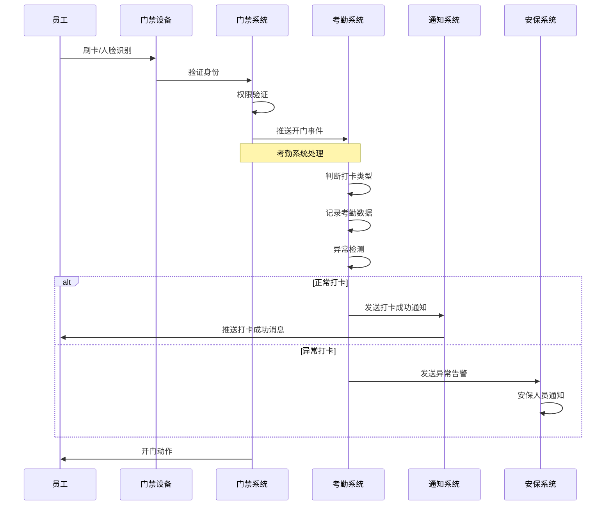

**集成要点**:
- **实时同步**: 门禁开门事件实时同步到考勤系统
- **智能判断**: 根据时间和位置智能判断上班/下班打卡
- **异常处理**: 异常时间开门触发安保预警机制
- **数据一致性**: 确保门禁记录与考勤记录的一致性

#### 1.2 权限联动管理

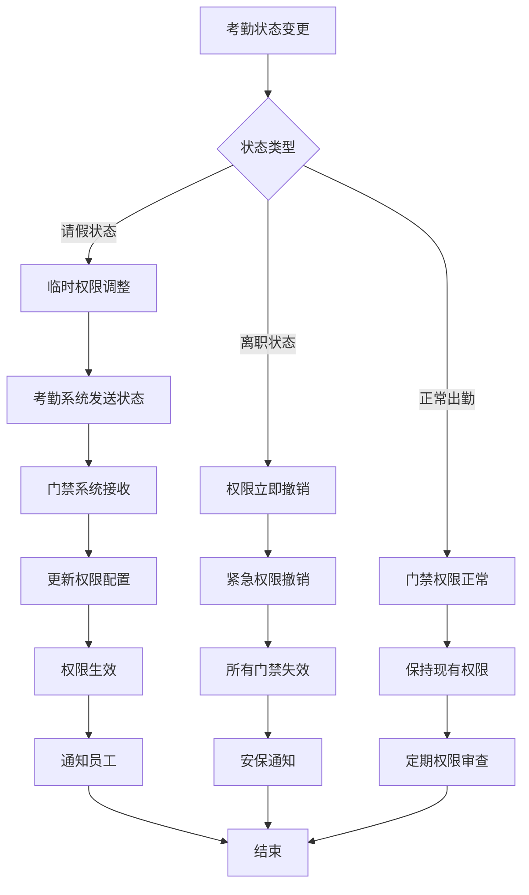

### 2. 数据接口规范

#### 2.1 门禁事件推送接口
```json
POST /api/v1/attendance/access/event
{
  "event_type": "DOOR_OPEN",
  "user_id": 1001,
  "device_id": "ACC001",
  "event_time": "2025-01-15T09:00:00Z",
  "location": "总部大楼1号门",
  "access_result": "SUCCESS",
  "biometric_type": "FACE",
  "confidence_score": 0.95
}
```

#### 2.2 考勤状态查询接口
```json
GET /api/v1/access/attendance/status?user_id=1001&date=2025-01-15

Response:
{
  "code": 200,
  "message": "success",
  "data": {
    "user_id": 1001,
    "attendance_date": "2025-01-15",
    "check_in_time": "09:00:00",
    "check_out_time": null,
    "attendance_status": "NORMAL",
    "access_permission": true
  }
}
```

---

## 💳 考勤-消费系统集成

### 1. 工作餐消费流程

#### 1.1 基于考勤的消费验证

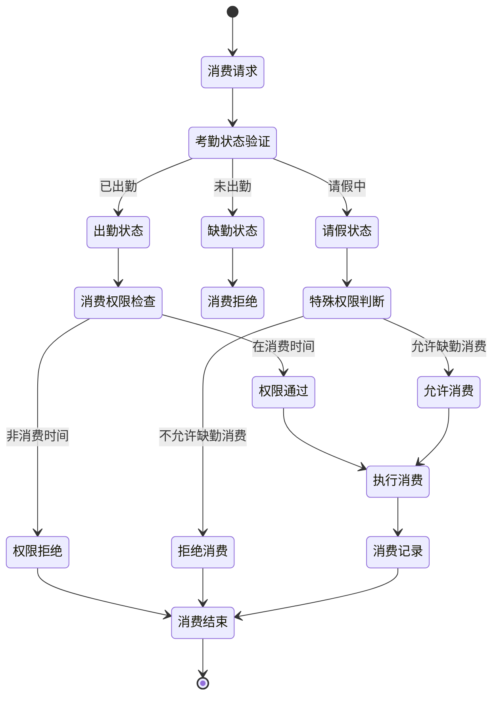

#### 1.2 消费数据与考勤联动

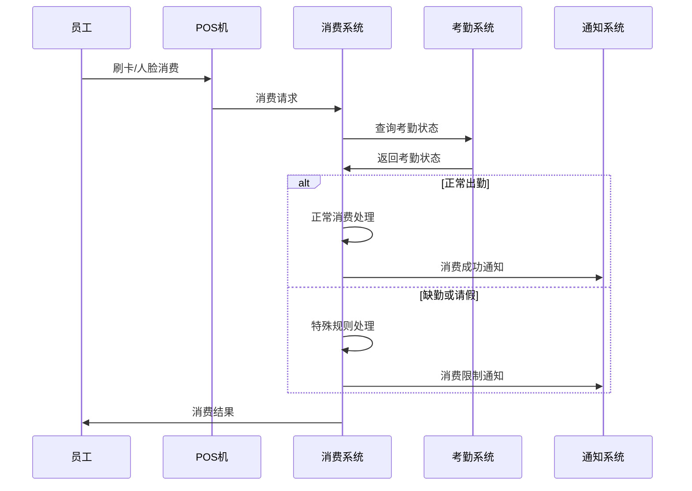

### 2. 补贴发放联动

#### 2.1 考勤补贴计算

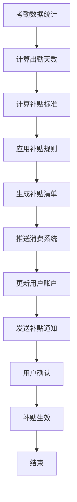

---

## 👥 考勤-访客系统集成

### 1. 访客考勤管理

#### 1.1 访客打卡流程

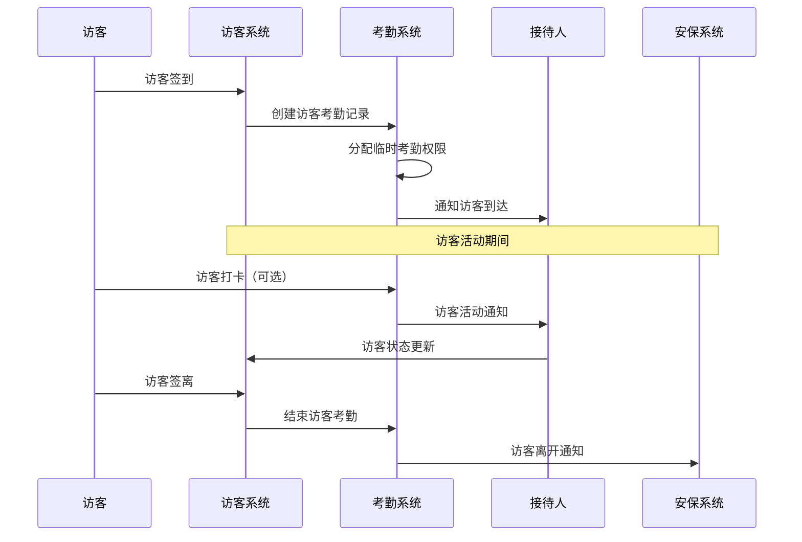

#### 1.2 访客考勤统计

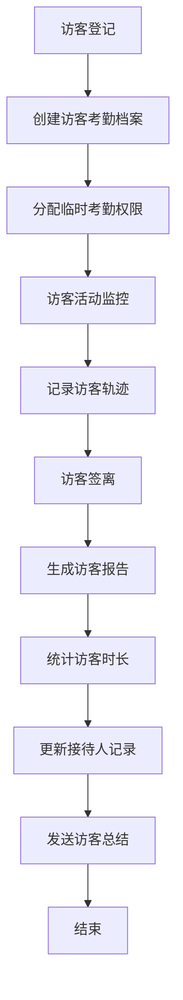

---

## 📹 考勤-视频监控系统集成

### 1. 视频考勤联动

#### 1.1 考勤视频验证

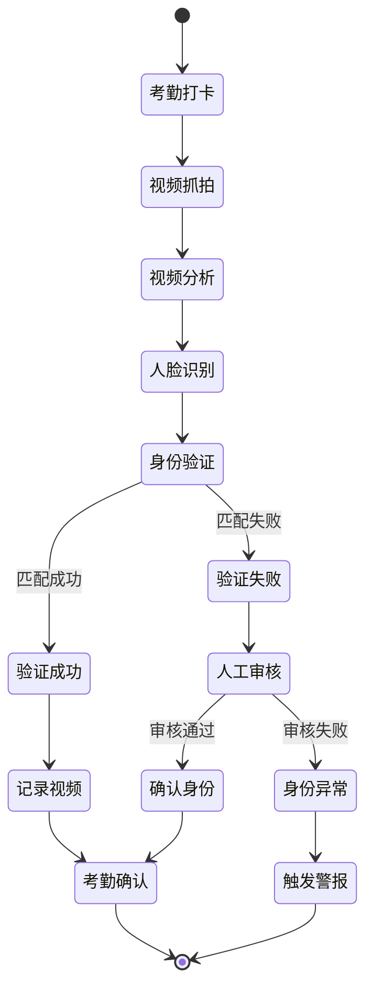

#### 1.2 异常行为检测

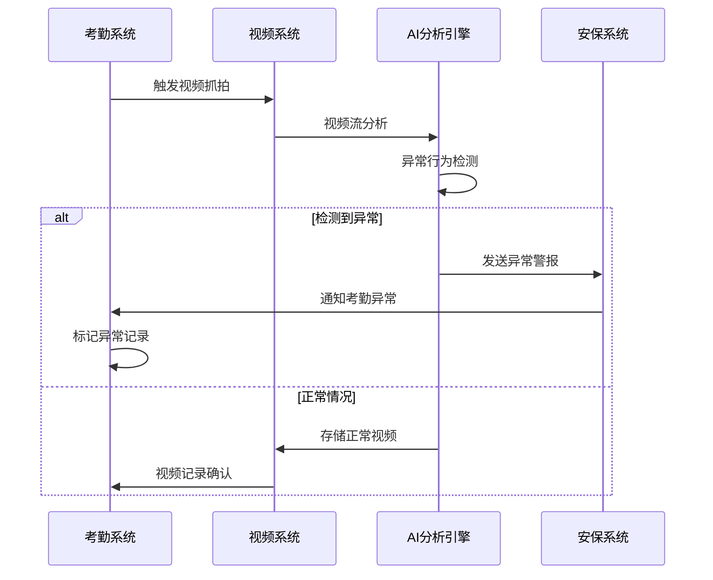

### 2. 视频数据存储

#### 2.1 考勤视频关联

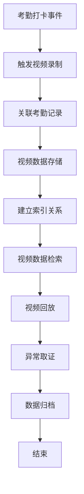

---

## 🏢 考勤-OA系统集成

### 1. 组织架构同步

#### 1.1 组织数据同步流程

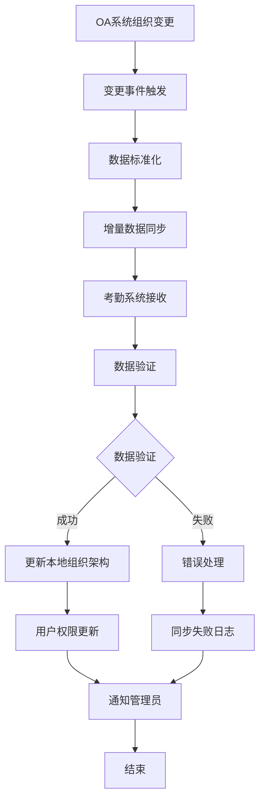

#### 1.2 请假审批联动

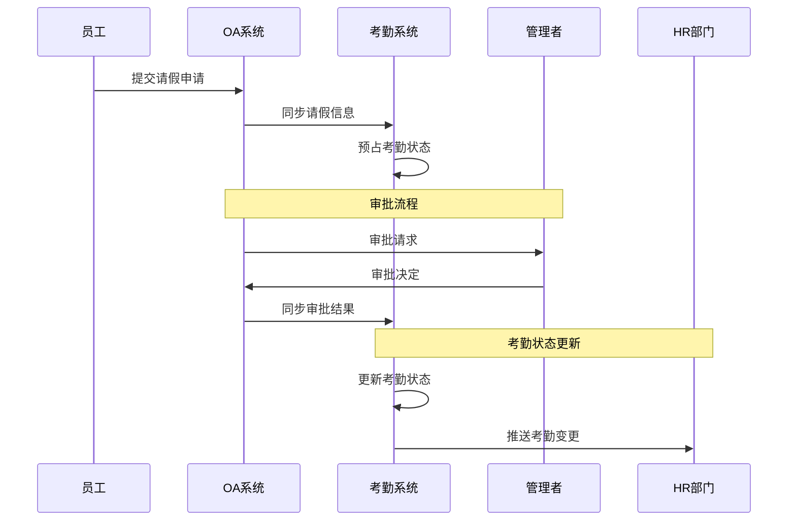

### 2. 工作流集成

#### 2.1 审批工作流

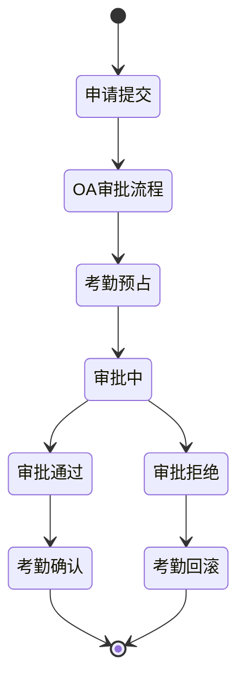

---

## 💰 考勤-薪酬系统集成

### 1. 薪酬计算联动

#### 1.1 考勤数据推送

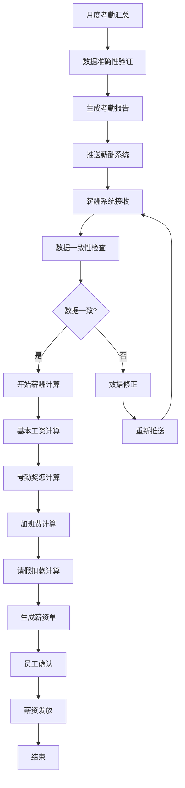

#### 1.2 实时数据同步

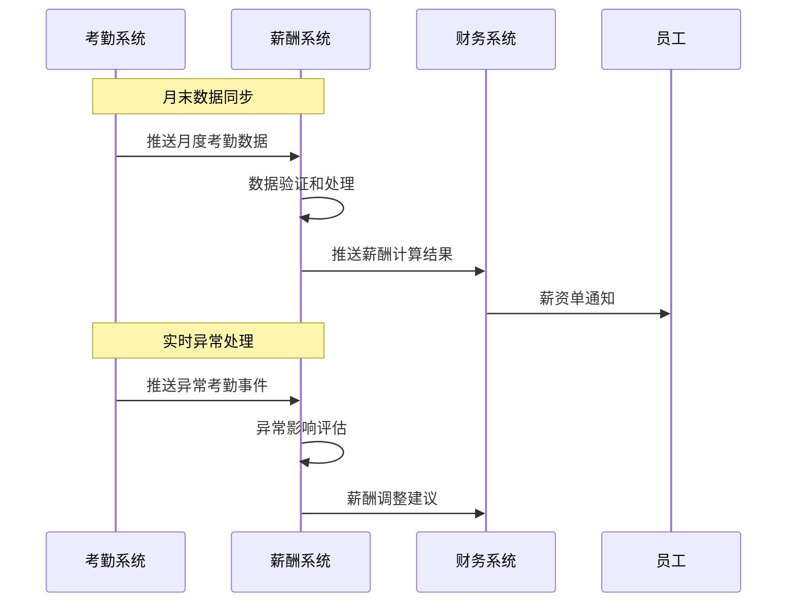

### 2. 成本分析集成

#### 2.1 人力成本分析

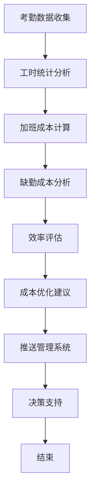

---

## 📢 考勤-通知系统集成

### 1. 多渠道通知

#### 1.1 通知事件触发

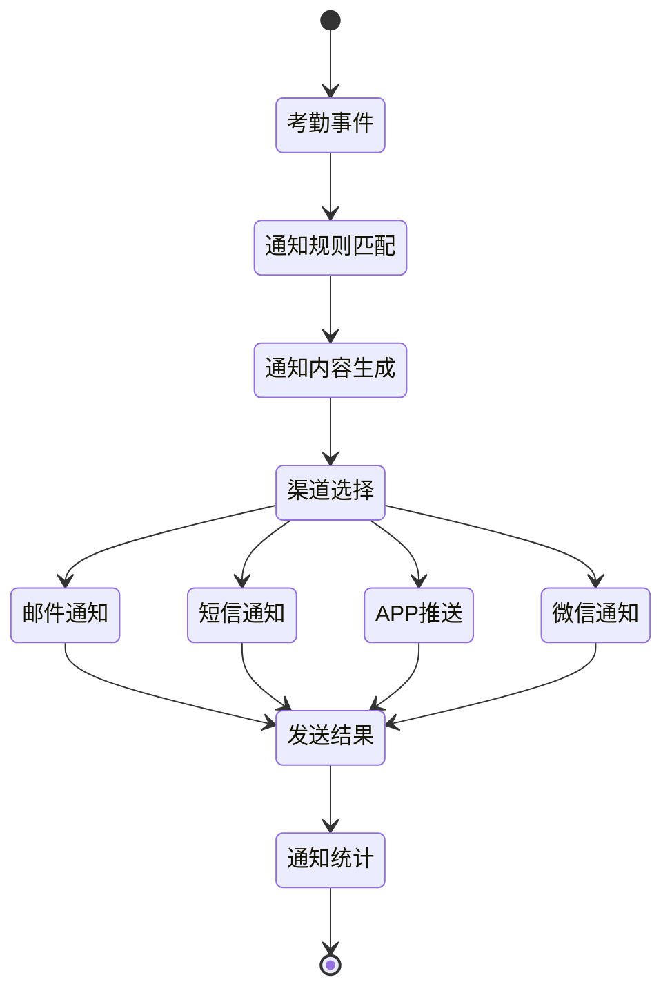

#### 1.2 智能通知策略

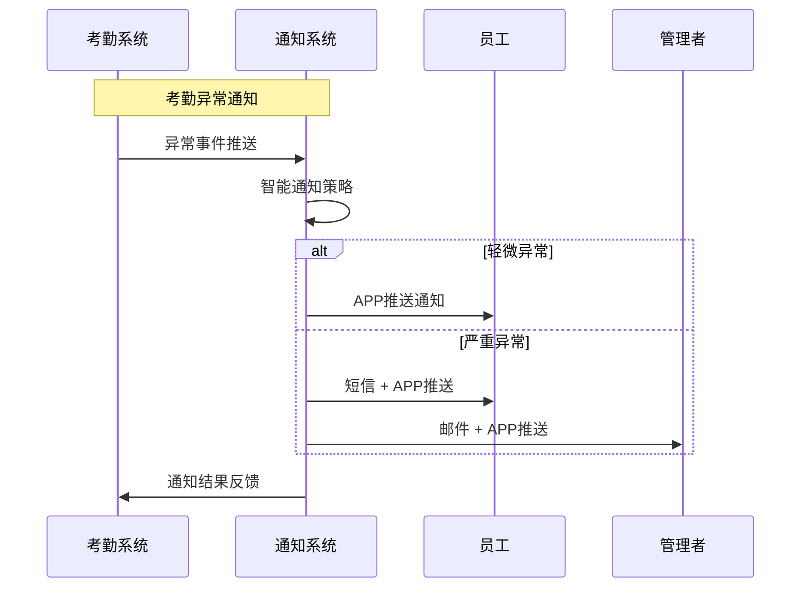

---

## 🔧 技术集成架构

### 1. 微服务通信架构

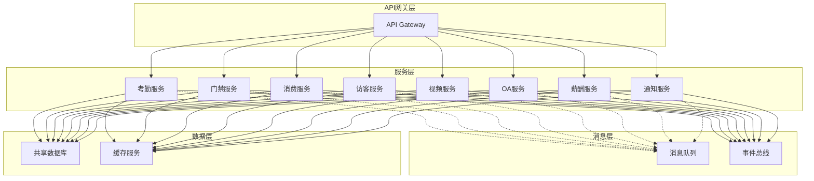

### 2. 数据一致性保障

#### 2.1 分布式事务处理

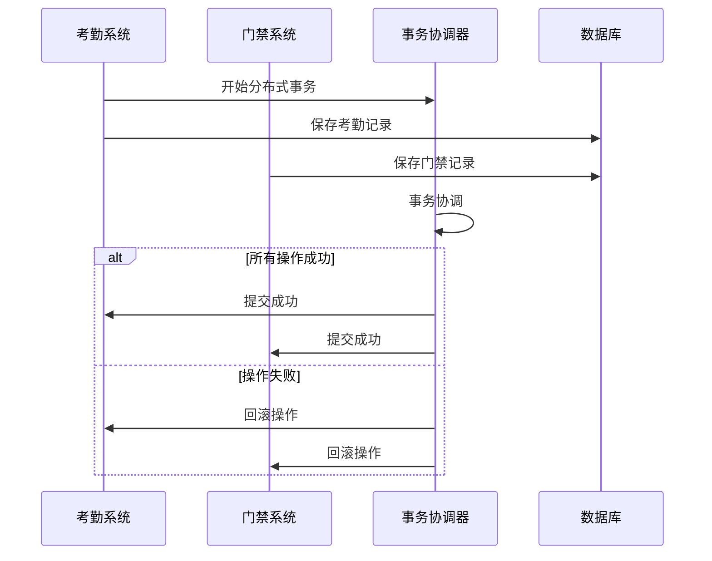

---

## 📊 集成监控与治理

### 1. 集成健康监控

#### 1.1 服务监控指标

- **接口可用性**: 各系统间接口的可用率和响应时间
- **数据同步延迟**: 数据在各系统间同步的时间延迟
- **事务成功率**: 分布式事务的成功率和失败率
- **异常处理效率**: 异常情况的处理时间和解决率

#### 1.2 监控仪表板

```mermaid
flowchart TD
    A[集成监控数据采集] --> B[实时数据处理]
    B --> C[状态指标计算]
    C --> D[异常检测]
    D --> E[告警触发]
    E --> F[仪表板展示]
    F --> G[运维通知]
    G --> H[问题处理]
    H --> I[处理反馈]
    I --> J[优化建议]
    J --> K[持续改进]
    K --> A
```

### 2. 数据治理

#### 2.1 数据质量管控

```mermaid
stateDiagram-v2
    [*] --> 数据采集
    数据采集 --> 数据清洗
    数据清洗 --> 数据验证
    数据验证 --> 数据标准化
    数据标准化 --> 数据同步
    数据同步 --> 质量检查

    质量检查 --> 质量合格: 数据质量满足要求
    质量检查 --> 质量不合格: 数据质量问题

    质量合格 --> 数据应用
    质量不合格 --> 问题修复
    问题修复 --> 数据采集

    数据应用 --> [*]
```

---

## 🚀 集成优化策略

### 1. 性能优化

#### 1.1 接口性能优化
- **连接池优化**: 合理配置数据库连接池参数
- **缓存策略**: 热点数据缓存，减少数据库访问
- **批量处理**: 批量数据同步，提高处理效率
- **异步处理**: 非关键路径异步处理，提高响应速度

#### 1.2 数据传输优化
- **数据压缩**: 大数据量传输时启用压缩
- **增量同步**: 只同步变更数据，减少传输量
- **分页处理**: 大数据量查询时使用分页
- **索引优化**: 优化数据库索引，提高查询效率

### 2. 扩展性设计

#### 2.1 水平扩展能力
- **服务无状态**: 设计无状态服务，支持水平扩展
- **数据分片**: 大数据量表按时间或用户ID分片
- **负载均衡**: 多实例部署，负载均衡分发
- **弹性伸缩**: 根据负载自动调整服务实例数量

#### 2.2 业务扩展能力
- **插件化架构**: 支持新业务模块的快速接入
- **配置化规则**: 业务规则配置化，支持灵活调整
- **版本兼容**: 支持多版本API兼容，平滑升级
- **开放接口**: 提供标准化接口，支持第三方集成

---

## 📚 集成规范与标准

### 1. API接口规范

#### 1.1 接口设计标准
- **RESTful设计**: 遵循RESTful API设计原则
- **统一响应格式**: 使用统一的JSON响应格式
- **版本管理**: 接口版本化管理，向后兼容
- **安全认证**: 统一的JWT令牌认证机制

#### 1.2 数据格式标准
```json
{
  "code": 200,
  "message": "success",
  "data": {
    "business_data": {}
  },
  "timestamp": 1642234567890,
  "trace_id": "trace-123456789"
}
```

### 2. 事件标准

#### 2.1 事件格式标准
```json
{
  "event_id": "evt-123456789",
  "event_type": "ATTENDANCE_CHECK_IN",
  "event_source": "attendance-service",
  "event_time": "2025-01-15T09:00:00Z",
  "event_data": {
    "user_id": 1001,
    "device_id": "DEV001"
  }
}
```

---

**💡 考勤系统跨模块集成通过标准化接口、事件驱动和数据同步，实现了各业务系统间的深度联动，为智慧园区提供了一体化的管理体验。**