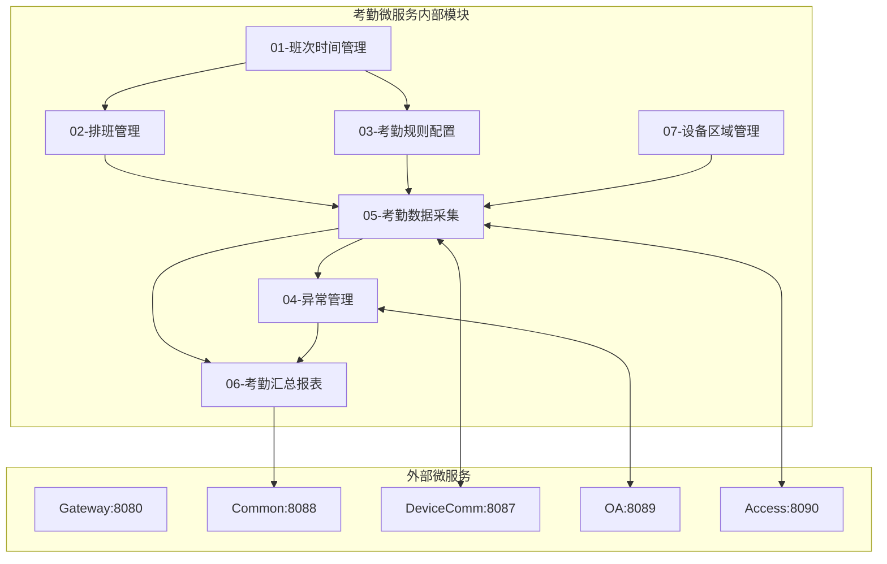
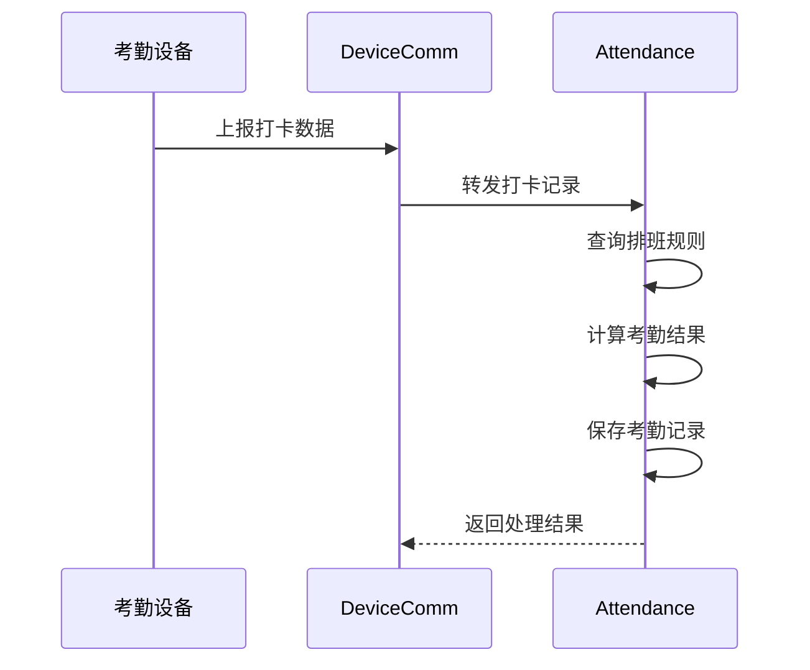
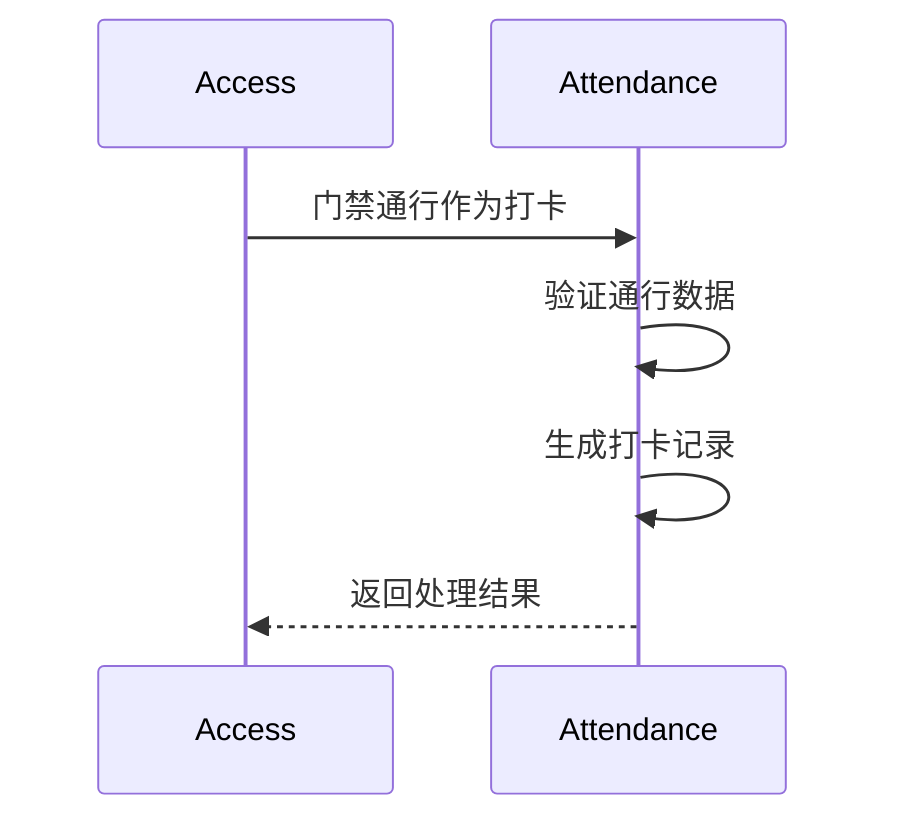
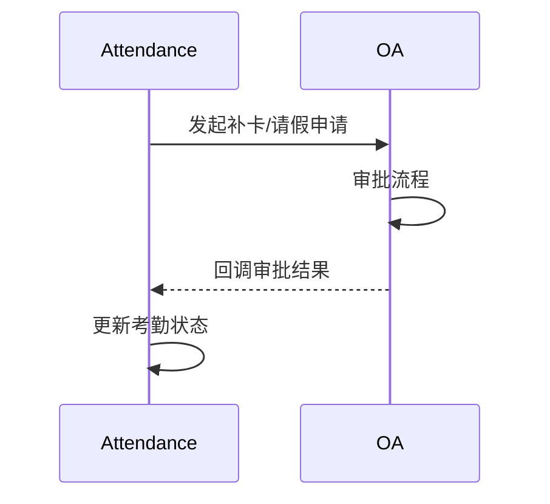
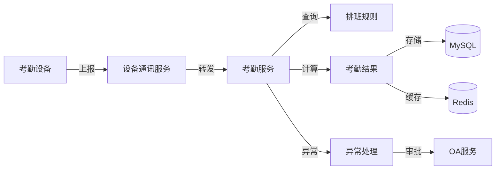

# 考勤管理模块 - 模块间关联设计文档

> **版本**: v1.0.0  
> **微服务**: ioedream-attendance-service (8091)  
> **创建日期**: 2025-12-17

---

## 📊 模块关联全景图



---

## 🔗 内部模块关联详细设计

### 1. 班次时间管理 ↔ 排班管理

| 关联点 | 说明 | 数据流向 |
|--------|------|----------|
| 班次引用 | 排班时选择班次 | SHIFT → SCHED |
| 时间继承 | 排班继承班次时间规则 | SHIFT → SCHED |
| 班次修改 | 班次变更影响排班 | SHIFT → SCHED |

**关键接口**:
```java
// ShiftService.java
List<ShiftVO> getAvailableShifts(Long departmentId);

// ScheduleService.java
void assignSchedule(Long employeeId, Long shiftId, LocalDate date);
```

### 2. 排班管理 ↔ 考勤数据采集

| 关联点 | 说明 | 数据流向 |
|--------|------|----------|
| 排班查询 | 采集时查询当日排班 | SCHED → COLLECT |
| 打卡校验 | 根据排班判断打卡是否有效 | SCHED → COLLECT |
| 加班识别 | 识别加班打卡记录 | SCHED → COLLECT |

**关键接口**:
```java
// ScheduleService.java
ScheduleVO getEmployeeSchedule(Long employeeId, LocalDate date);

// AttendanceCollectService.java
void processClockRecord(ClockRecordDTO record);
```

### 3. 考勤规则配置 ↔ 考勤数据采集

| 关联点 | 说明 | 数据流向 |
|--------|------|----------|
| 规则应用 | 打卡时应用考勤规则 | RULE → COLLECT |
| 迟到判定 | 根据规则判定迟到 | RULE → COLLECT |
| 早退判定 | 根据规则判定早退 | RULE → COLLECT |

**关键接口**:
```java
// AttendanceRuleService.java
AttendanceRuleVO getApplicableRule(Long employeeId, LocalDate date);

// AttendanceCalculateService.java
AttendanceResultVO calculate(ClockRecordDTO record, AttendanceRuleVO rule);
```

### 4. 考勤数据采集 ↔ 异常管理

| 关联点 | 说明 | 数据流向 |
|--------|------|----------|
| 异常生成 | 采集时发现异常自动记录 | COLLECT → EXCEPT |
| 状态同步 | 异常处理后更新考勤状态 | EXCEPT → COLLECT |

**关键接口**:
```java
// AttendanceExceptionService.java
void createException(AttendanceExceptionDTO exception);
void handleException(Long exceptionId, HandleForm form);
```

---

## 🌐 外部微服务关联设计

### 1. 考勤服务 ↔ 设备通讯服务 (8087)



**关键API**:
```
POST /api/attendance/v1/clock/receive    # 接收打卡数据
POST /api/attendance/v1/device/sync      # 同步设备人员
```

### 2. 考勤服务 ↔ 门禁服务 (8090)



**关键API**:
```
POST /api/attendance/v1/clock/from-access  # 门禁数据作为打卡
```

### 3. 考勤服务 ↔ OA服务 (8089)



**关键API**:
```
POST /api/oa/v1/workflow/attendance/apply  # 考勤申请
POST /api/attendance/v1/workflow/callback  # 审批回调
```

---

## 📋 数据流转设计

### 打卡数据流



---

## 🔧 接口契约规范

| 调用方 | 被调用方 | 接口 | 超时 | 重试 |
|--------|----------|------|------|------|
| ATT | DC | receiveClockData | 2s | 3次 |
| ATT | OA | startWorkflow | 5s | 2次 |
| ACC | ATT | clockFromAccess | 1s | 2次 |

---

**📝 文档维护**: IOE-DREAM架构团队 | 2025-12-17
