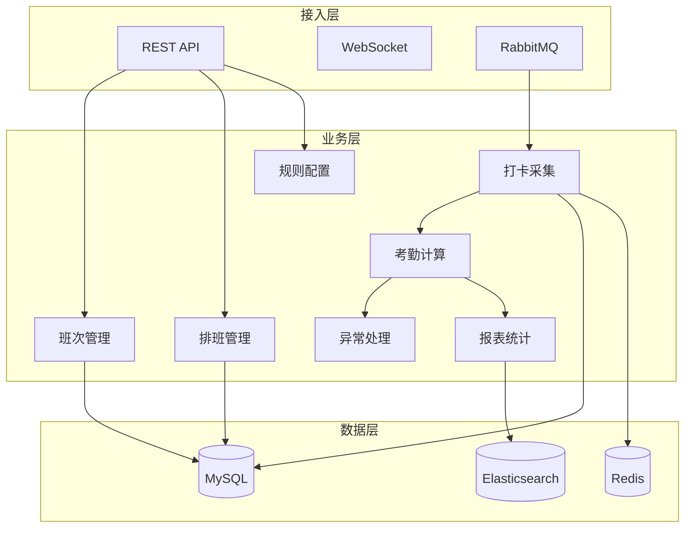
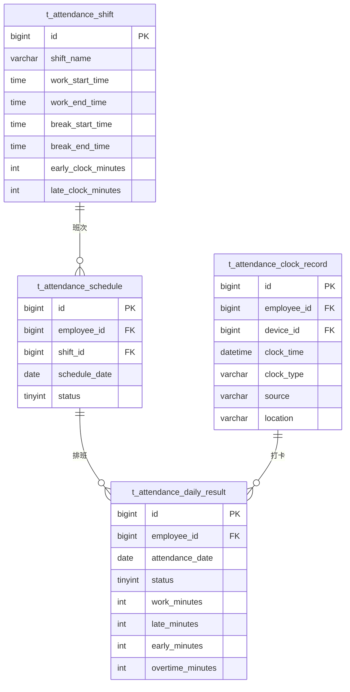

# 考勤管理微服务 - 总体设计文档

> **版本**: v1.0.0  
> **微服务**: ioedream-attendance-service (8091)  
> **创建日期**: 2025-12-17

---

## 📋 模块概述

考勤管理微服务负责企业员工考勤的全生命周期管理，包括班次配置、排班管理、打卡采集、考勤计算、异常处理和报表统计。

---

## 🏗️ 系统架构



---

## 📁 代码结构

```
ioedream-attendance-service/src/main/java/net/lab1024/sa/attendance/
├── AttendanceApplication.java              # 启动类
├── controller/                             # Controller层
│   ├── ShiftController.java               # 班次管理
│   ├── ScheduleController.java            # 排班管理
│   ├── AttendanceRuleController.java      # 规则配置
│   ├── ClockRecordController.java         # 打卡记录
│   ├── AttendanceExceptionController.java # 异常管理
│   └── AttendanceReportController.java    # 报表统计
├── service/                                # Service层
│   ├── ShiftService.java
│   ├── ScheduleService.java
│   ├── AttendanceRuleService.java
│   ├── ClockRecordService.java
│   ├── AttendanceCalculateService.java
│   ├── AttendanceExceptionService.java
│   └── AttendanceReportService.java
├── dao/                                    # DAO层
│   ├── ShiftDao.java
│   ├── ScheduleDao.java
│   ├── AttendanceRuleDao.java
│   ├── ClockRecordDao.java
│   └── AttendanceExceptionDao.java
├── domain/                                 # 领域对象
│   ├── entity/
│   ├── form/
│   └── vo/
└── manager/                                # Manager层
    ├── AttendanceCalculateManager.java
    └── AttendanceStatisticsManager.java
```

---

## 🎯 核心功能模块

### 1. 班次时间管理
- 班次定义（早班、中班、晚班、弹性班）
- 工作时间段配置
- 休息时间配置
- 打卡时间窗口设置

### 2. 排班管理
- 固定排班
- 轮班排班
- 弹性排班
- 调班申请

### 3. 考勤规则配置
- 迟到早退规则
- 加班规则
- 请假规则
- 外勤规则

### 4. 考勤数据采集
- 设备打卡采集
- 门禁通行采集
- 移动端打卡
- 外勤打卡（GPS）

### 5. 异常管理
- 缺卡异常
- 迟到早退
- 旷工处理
- 补卡申请

### 6. 考勤汇总报表
- 日报表
- 月报表
- 部门统计
- 导出功能

---

## 📊 数据库设计

### 核心表结构

| 表名 | 说明 |
|------|------|
| t_attendance_shift | 班次定义表 |
| t_attendance_schedule | 排班记录表 |
| t_attendance_rule | 考勤规则表 |
| t_attendance_clock_record | 打卡记录表 |
| t_attendance_daily_result | 日考勤结果表 |
| t_attendance_exception | 考勤异常表 |
| t_attendance_leave | 请假记录表 |
| t_attendance_overtime | 加班记录表 |

### ER图



---

## 🔧 API接口设计

### 班次管理

| 方法 | 路径 | 说明 |
|------|------|------|
| GET | /api/attendance/v1/shift/list | 班次列表 |
| POST | /api/attendance/v1/shift/add | 新增班次 |
| PUT | /api/attendance/v1/shift/update | 更新班次 |
| DELETE | /api/attendance/v1/shift/{id} | 删除班次 |

### 排班管理

| 方法 | 路径 | 说明 |
|------|------|------|
| GET | /api/attendance/v1/schedule/query | 查询排班 |
| POST | /api/attendance/v1/schedule/batch | 批量排班 |
| PUT | /api/attendance/v1/schedule/adjust | 调整排班 |

### 打卡记录

| 方法 | 路径 | 说明 |
|------|------|------|
| POST | /api/attendance/v1/clock/receive | 接收打卡 |
| POST | /api/attendance/v1/clock/mobile | 移动打卡 |
| GET | /api/attendance/v1/clock/records | 打卡记录 |

### 考勤报表

| 方法 | 路径 | 说明 |
|------|------|------|
| GET | /api/attendance/v1/report/daily | 日报表 |
| GET | /api/attendance/v1/report/monthly | 月报表 |
| POST | /api/attendance/v1/report/export | 导出报表 |

---

## 📈 性能指标

| 指标项 | 要求 |
|--------|------|
| 打卡处理延迟 | ≤ 500ms |
| 日报表生成 | ≤ 5s |
| 月报表生成 | ≤ 30s |
| 并发打卡支持 | ≥ 1000次/秒 |
| 数据保存周期 | ≥ 3年 |

---

**📝 文档维护**: IOE-DREAM架构团队 | 2025-12-17
