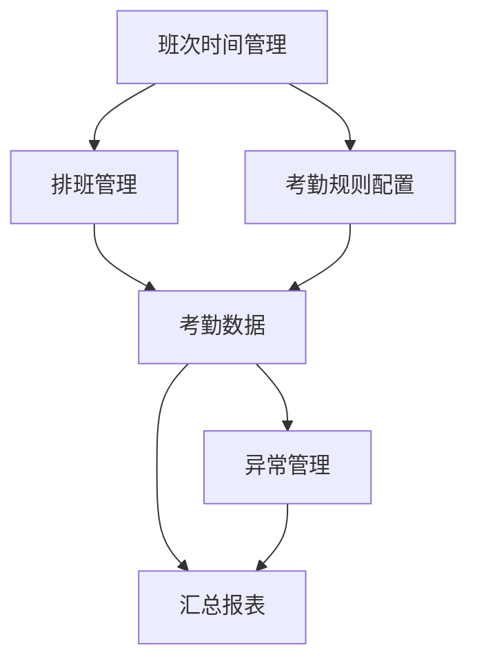

# 考勤管理模块 - 功能说明文档

> **版本**: v2.0.0  
> **更新日期**: 2025-12-17  
> **文档类型**: 功能需求说明书

---

## 1. 模块概述

### 1.1 业务背景

考勤管理是企业人力资源管理的核心环节，传统考勤系统存在以下痛点：
- 考勤方式单一，无法满足多场景需求
- 排班管理复杂，人工操作效率低
- 异常处理流程繁琐，审批周期长
- 数据统计不及时，报表生成困难

### 1.2 解决方案

IOE-DREAM考勤管理模块提供：
- **多模态考勤**: 支持刷卡、人脸、指纹、移动端等多种打卡方式
- **智能排班**: 支持多种排班模式，自动化排班算法
- **流程化异常处理**: 请假、加班、补签等申请审批流程化
- **实时数据统计**: 考勤数据实时计算，报表自动生成

### 1.3 目标用户

| 角色 | 使用场景 |
|------|----------|
| **普通员工** | 打卡、查看考勤、提交异常申请 |
| **部门主管** | 查看部门考勤、审批申请、排班管理 |
| **HR管理员** | 规则配置、报表统计、系统管理 |
| **系统管理员** | 设备管理、系统配置、权限管理 |

---

## 2. 功能架构

### 2.1 功能模块划分

```
考勤管理模块
├── 班次时间管理
│   ├── 时间段管理
│   ├── 班次管理
│   └── 班次时间段关联
├── 排班管理
│   ├── 排班日历
│   ├── 排班模板
│   ├── 临时排班
│   └── 智能排班
├── 考勤规则配置
│   ├── 考勤基础规则
│   ├── 考勤点管理
│   ├── 移动端配置
│   ├── 预警规则
│   └── 通知规则
├── 异常管理
│   ├── 假种管理
│   ├── 请假申请
│   ├── 加班申请
│   ├── 调班申请
│   ├── 补签申请
│   └── 销假管理
├── 考勤数据
│   ├── 打卡记录
│   ├── 考勤计算
│   └── 考勤结果
└── 汇总报表
    ├── 月度汇总
    ├── 出勤统计
    ├── 异常统计
    └── 报表导出
```

### 2.2 功能清单

| 功能模块 | 功能点 | 优先级 | 状态 |
|----------|--------|--------|------|
| **班次时间管理** | 时间段CRUD | P0 | 待开发 |
| | 班次CRUD | P0 | 待开发 |
| | 班次时间段关联 | P0 | 待开发 |
| | 跨日班次支持 | P1 | 待开发 |
| **排班管理** | 排班日历展示 | P0 | 待开发 |
| | 手动排班 | P0 | 待开发 |
| | 批量排班 | P1 | 待开发 |
| | 排班模板 | P1 | 待开发 |
| | 临时排班覆盖 | P1 | 待开发 |
| | 智能排班算法 | P2 | 待开发 |
| **考勤规则配置** | 基础规则配置 | P0 | 待开发 |
| | 考勤点管理 | P1 | 待开发 |
| | 移动端配置 | P1 | 待开发 |
| | 预警规则配置 | P1 | 待开发 |
| | 通知规则配置 | P1 | 待开发 |
| | 设备联动规则 | P2 | 待开发 |
| **异常管理** | 假种管理 | P0 | 待开发 |
| | 请假申请 | P0 | 待开发 |
| | 加班申请 | P0 | 待开发 |
| | 补签申请 | P0 | 待开发 |
| | 调班申请 | P1 | 待开发 |
| | 销假管理 | P1 | 待开发 |
| | 多级审批 | P1 | 待开发 |
| **考勤数据** | 打卡记录采集 | P0 | 待开发 |
| | 考勤结果计算 | P0 | 待开发 |
| | 迟到早退判定 | P0 | 待开发 |
| | 加班时长计算 | P1 | 待开发 |
| **汇总报表** | 月度考勤汇总 | P0 | 待开发 |
| | 出勤率统计 | P1 | 待开发 |
| | 异常统计分析 | P1 | 待开发 |
| | 报表导出 | P1 | 待开发 |

---

## 3. 子模块功能详述

### 3.1 班次时间管理

#### 3.1.1 时间段管理

**功能描述**: 管理工作时间段的基础配置，定义上下班时间、容忍度等。

**功能点**:
- 时间段新增/编辑/删除/查询
- 设置开始时间和结束时间
- 配置迟到/早退容忍时间
- 设置是否必须签到/签退
- 配置加班规则

**业务规则**:
- 时间段编码全局唯一
- 结束时间必须大于开始时间（支持跨日）
- 工作时长自动计算

#### 3.1.2 班次管理

**功能描述**: 管理班次配置，支持多种班次类型。

**班次类型**:
| 类型 | 说明 | 示例 |
|------|------|------|
| 规律班次 | 固定时间的标准班次 | 标准班 9:00-18:00 |
| 弹性班次 | 有弹性时间的班次 | 弹性班 8:00-20:00核心10:00-16:00 |
| 三班倒 | 8小时一轮的三班制 | 早班/中班/夜班 |
| 四班三倒 | 每天三班，四班轮换 | 轮班制 |

**功能点**:
- 班次新增/编辑/删除/查询
- 配置班次类型和轮班周期
- 设置弹性时间和核心时间
- 班次复制功能

#### 3.1.3 班次时间段关联

**功能描述**: 将时间段关联到班次，支持一个班次包含多个时间段。

**功能点**:
- 为班次添加/移除时间段
- 设置时间段顺序
- 时间段冲突检测
- 班次时间线预览

---

### 3.2 排班管理

#### 3.2.1 排班日历

**功能描述**: 以日历形式展示和管理员工排班。

**功能点**:
- 月历/周历视图切换
- 按员工/部门/班次筛选
- 拖拽式排班调整
- 排班冲突实时提示

#### 3.2.2 排班模板

**功能描述**: 创建和管理排班模板，支持批量应用。

**模板类型**:
- 部门模板：适用于整个部门
- 岗位模板：适用于特定岗位
- 个人模板：适用于特定员工

**功能点**:
- 模板新增/编辑/删除/查询
- 配置排班周期和模式
- 模板批量应用
- 模板复制功能

#### 3.2.3 临时排班覆盖

**功能描述**: 支持临时调整排班，覆盖原有排班。

**功能点**:
- 创建临时排班记录
- 设置覆盖优先级
- 支持整班或部分时段覆盖
- 记录覆盖原因

#### 3.2.4 智能排班

**功能描述**: 基于算法自动生成最优排班方案。

**功能点**:
- 配置排班约束条件
- 设置优化目标（成本/公平性）
- 执行智能排班计算
- 多方案对比选择

---

### 3.3 考勤规则配置

#### 3.3.1 考勤基础规则

**功能描述**: 配置考勤计算的基础规则。

**规则类型**:
- 迟到早退规则：判定标准和容忍时间
- 旷工规则：旷工判定条件
- 加班规则：加班认定和计算方式
- 出勤统计规则：出勤率计算方式

**功能点**:
- 规则新增/编辑/删除/查询
- 配置规则参数（JSON格式）
- 设置适用范围（部门/岗位/员工）
- 规则启用/禁用

#### 3.3.2 考勤点管理

**功能描述**: 管理GPS虚拟考勤点。

**功能点**:
- 考勤点新增/编辑/删除/查询
- 设置经纬度坐标
- 配置有效打卡半径
- 关联考勤设备
- 地图可视化展示

#### 3.3.3 移动端配置

**功能描述**: 配置移动端打卡规则。

**功能点**:
- GPS定位精度要求
- 打卡时间窗口限制
- 设备绑定规则
- 防作弊规则配置

#### 3.3.4 预警规则

**功能描述**: 配置考勤异常预警规则。

**预警类型**:
| 类型 | 说明 | 示例 |
|------|------|------|
| 未打卡预警 | 连续未打卡 | 连续3天未打卡 |
| 考勤异常预警 | 频繁异常 | 7天内迟到3次 |
| 设备联动预警 | 双重验证失败 | 人脸+门禁不匹配 |

**功能点**:
- 预警规则配置
- 设置预警阈值和级别
- 配置设备联动规则
- 预警升级机制

#### 3.3.5 通知规则

**功能描述**: 配置考勤相关通知规则。

**通知类型**:
- 打卡提醒：上下班前提醒打卡
- 未打卡通知：未打卡后通知
- 考勤异常通知：异常情况通知
- 审批通知：申请审批状态通知

**功能点**:
- 通知规则配置
- 设置触发条件
- 配置通知渠道（短信/邮件/微信/钉钉）
- 频率控制设置

---

### 3.4 异常管理

#### 3.4.1 假种管理

**功能描述**: 管理请假类型配置。

**假种分类**:
| 分类 | 假种 | 说明 |
|------|------|------|
| 法定假期 | 年假、婚假、产假 | 带薪假期 |
| 福利假期 | 调休、陪产假 | 公司福利 |
| 病假 | 病假 | 需要证明 |
| 事假 | 事假 | 可能扣薪 |

**功能点**:
- 假种新增/编辑/删除/查询
- 配置年度额度和单次限制
- 设置是否需要证明
- 配置扣薪规则
- 设置审批流程

#### 3.4.2 请假申请

**功能描述**: 员工提交请假申请。

**功能点**:
- 选择假种和时间范围
- 填写请假原因
- 上传证明材料
- 查看剩余假期额度
- 申请状态跟踪

#### 3.4.3 加班申请

**功能描述**: 员工提交加班申请。

**加班类型**:
- 平时加班：工作日延长工作
- 周末加班：周六日加班
- 节假日加班：法定节假日加班

**功能点**:
- 选择加班类型和时间
- 填写加班原因
- 计算预计加班时长
- 选择补偿方式（调休/加班费）

#### 3.4.4 补签申请

**功能描述**: 员工申请补签打卡记录。

**功能点**:
- 选择补签类型（签到/签退）
- 填写实际打卡时间
- 说明补签原因
- 上传证明材料

#### 3.4.5 调班申请

**功能描述**: 员工申请调换班次。

**调班类型**:
- 个人调班：调整自己的班次
- 员工互换：与其他员工交换班次

**功能点**:
- 选择调班日期和班次
- 选择交换对象（如需）
- 填写调班原因
- 双方确认机制

#### 3.4.6 销假管理

**功能描述**: 处理提前结束请假的情况。

**功能点**:
- 关联原请假申请
- 设置实际销假时间
- 计算销假时长
- 恢复假期额度

#### 3.4.7 审批管理

**功能描述**: 处理各类异常申请的审批。

**功能点**:
- 待审批列表
- 审批详情查看
- 通过/拒绝操作
- 填写审批意见
- 批量审批
- 审批历史查询

---

### 3.5 考勤数据

#### 3.5.1 打卡记录

**功能描述**: 采集和管理打卡记录。

**打卡方式**:
- 考勤机打卡
- 门禁刷卡
- 移动端打卡
- 人脸识别打卡

**功能点**:
- 打卡记录查询
- 打卡明细导出
- 异常打卡标记
- 打卡照片查看

#### 3.5.2 考勤计算

**功能描述**: 根据打卡记录计算考勤结果。

**计算内容**:
- 出勤状态判定（正常/迟到/早退/旷工）
- 工作时长计算
- 加班时长计算
- 异常次数统计

**功能点**:
- 自动考勤计算
- 手动重新计算
- 计算结果查询
- 异常数据修正

#### 3.5.3 考勤结果

**功能描述**: 展示和管理考勤计算结果。

**功能点**:
- 日考勤结果查询
- 考勤状态筛选
- 结果数据导出
- 异常数据处理

---

### 3.6 汇总报表

#### 3.6.1 月度汇总

**功能描述**: 按月汇总员工考勤数据。

**汇总内容**:
- 应出勤天数
- 实际出勤天数
- 迟到/早退次数
- 旷工天数
- 请假天数
- 加班时长
- 出勤率

**功能点**:
- 月度汇总查询
- 按部门/员工筛选
- 汇总数据导出

#### 3.6.2 出勤统计

**功能描述**: 多维度出勤数据统计分析。

**统计维度**:
- 按部门统计
- 按岗位统计
- 按时间段统计
- 趋势分析

**功能点**:
- 统计图表展示
- 数据钻取分析
- 对比分析

#### 3.6.3 异常统计

**功能描述**: 考勤异常数据统计分析。

**统计内容**:
- 异常类型分布
- 异常趋势分析
- 异常处理率
- 预警处理统计

**功能点**:
- 异常统计查询
- 异常排行榜
- 预警处理跟踪

#### 3.6.4 报表导出

**功能描述**: 支持多种格式报表导出。

**导出格式**:
- Excel格式
- PDF格式
- CSV格式

**功能点**:
- 自定义报表模板
- 定时报表推送
- 报表下载历史

---

## 4. 功能依赖关系

### 4.1 模块内部依赖



### 4.2 外部模块依赖

| 依赖模块 | 依赖内容 | 调用方式 |
|----------|----------|----------|
| common-service | 员工信息、部门信息 | GatewayServiceClient |
| device-comm-service | 设备信息、打卡数据 | GatewayServiceClient |
| oa-service | 审批流程 | GatewayServiceClient |

---

## 5. 非功能需求概述

### 5.1 性能要求

| 指标 | 要求 |
|------|------|
| 打卡响应时间 | < 500ms |
| 考勤计算时间 | < 3s (单人单月) |
| 报表生成时间 | < 10s (千人月度) |
| 并发打卡支持 | > 1000 TPS |

### 5.2 可靠性要求

| 指标 | 要求 |
|------|------|
| 系统可用性 | ≥ 99.9% |
| 数据一致性 | 强一致性 |
| 数据备份 | 每日增量 + 每周全量 |

### 5.3 安全要求

- 打卡数据防篡改
- 敏感信息脱敏
- 操作审计日志
- 权限细粒度控制

---

*本文档持续更新中，详细设计请参阅各子模块文档*

