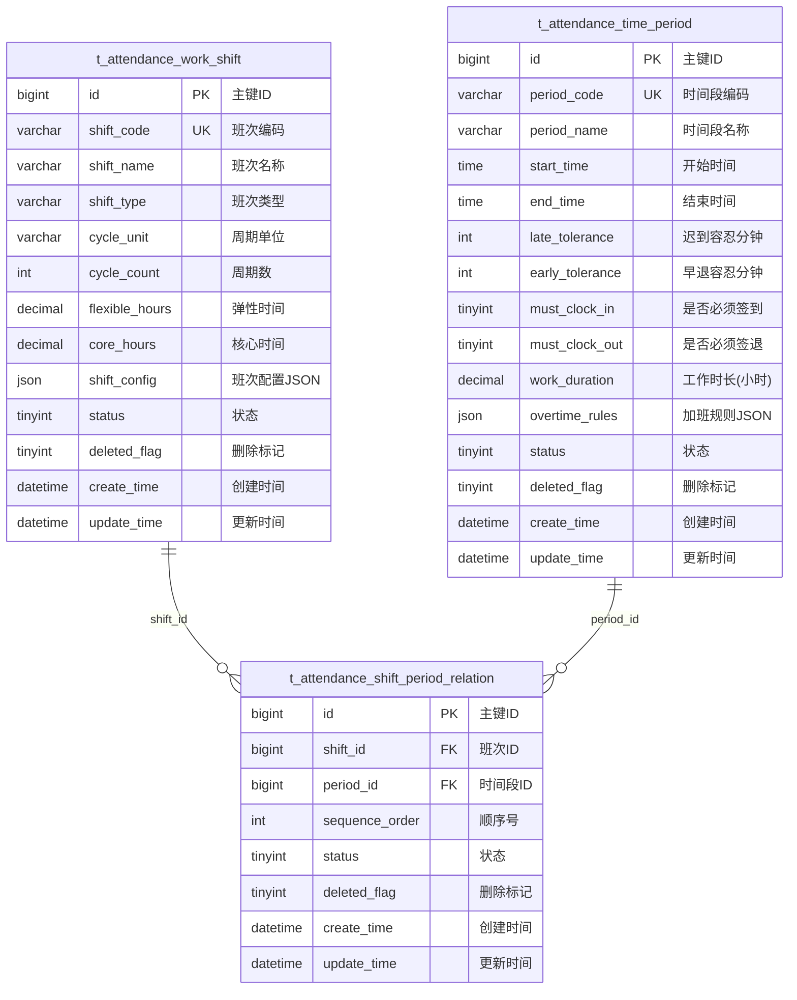
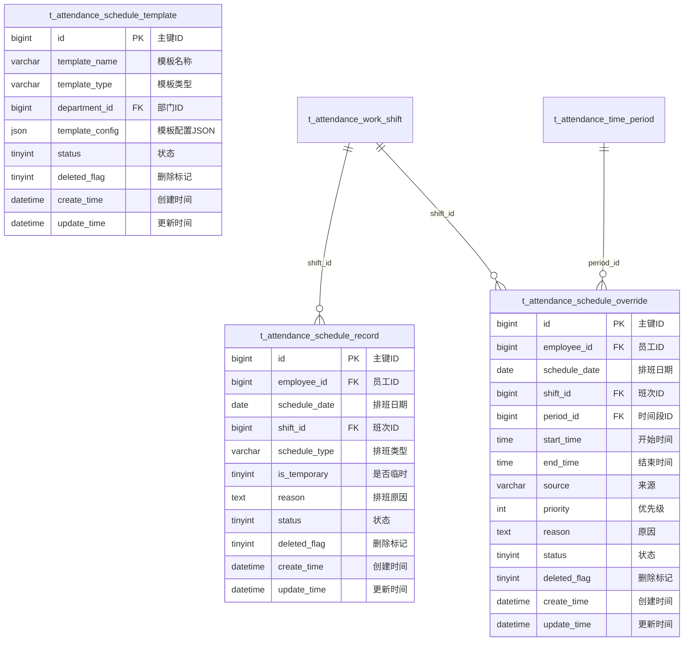
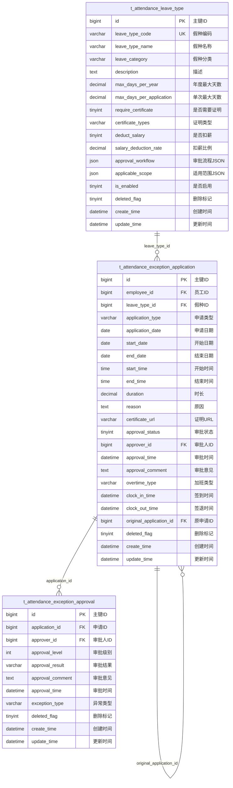
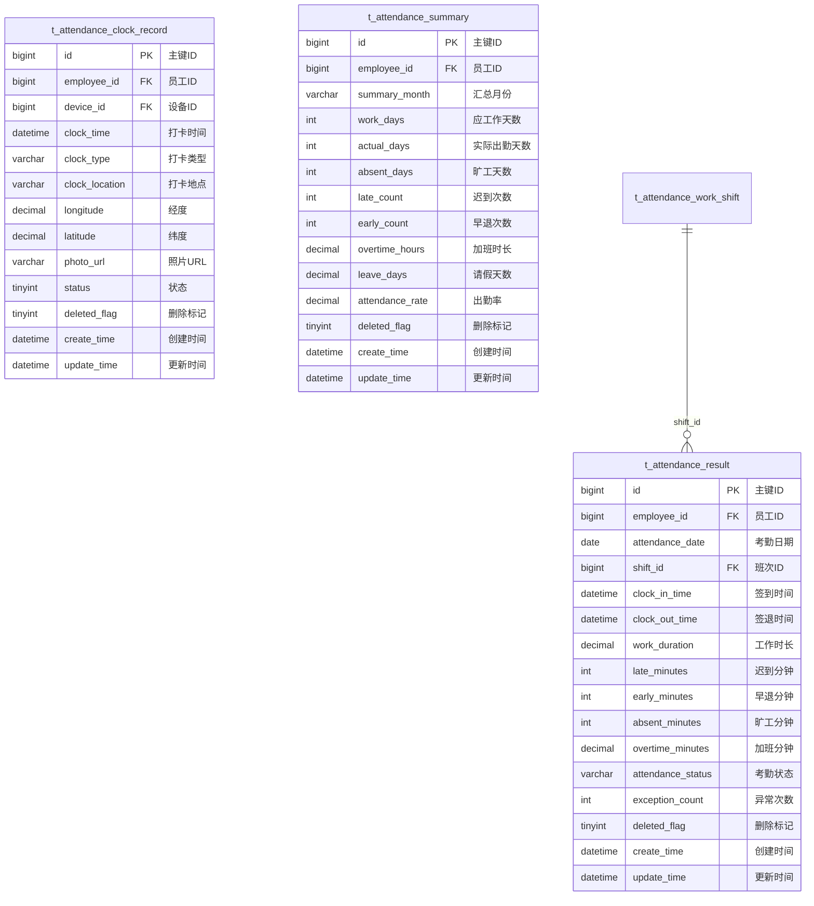

# 考勤管理模块 - 数据库设计文档

> **版本**: v2.0.0  
> **更新日期**: 2025-12-17  
> **数据库**: MySQL 8.0  
> **ORM框架**: MyBatis-Plus 3.5.15

---

## 1. 设计概述

### 1.1 设计原则

- **统一前缀**: 所有表使用 `t_attendance_` 前缀
- **软删除**: 使用 `deleted_flag` 字段标记删除
- **审计字段**: 统一包含 `create_time`、`update_time`
- **JSON配置**: 复杂配置使用JSON字段存储
- **分表策略**: 大数据量表按月分表

### 1.2 表清单

| 序号 | 表名 | 说明 | 子模块 |
|------|------|------|--------|
| 1 | t_attendance_time_period | 时间段表 | 班次时间管理 |
| 2 | t_attendance_work_shift | 班次表 | 班次时间管理 |
| 3 | t_attendance_shift_period_relation | 班次时间段关联表 | 班次时间管理 |
| 4 | t_attendance_schedule_record | 排班记录表 | 排班管理 |
| 5 | t_attendance_schedule_template | 排班模板表 | 排班管理 |
| 6 | t_attendance_schedule_override | 临时排班覆盖表 | 排班管理 |
| 7 | t_attendance_rule | 考勤规则表 | 考勤规则配置 |
| 8 | t_attendance_point | 考勤点表 | 考勤规则配置 |
| 9 | t_attendance_warning_rule | 预警规则表 | 考勤规则配置 |
| 10 | t_attendance_notification_rule | 通知规则表 | 考勤规则配置 |
| 11 | t_attendance_mobile_config | 移动端配置表 | 考勤规则配置 |
| 12 | t_attendance_leave_type | 假种配置表 | 异常管理 |
| 13 | t_attendance_exception_application | 异常申请表 | 异常管理 |
| 14 | t_attendance_exception_approval | 异常审批表 | 异常管理 |
| 15 | t_attendance_clock_record | 打卡记录表 | 考勤数据 |
| 16 | t_attendance_result | 考勤结果表 | 考勤数据 |
| 17 | t_attendance_summary | 考勤汇总表 | 汇总报表 |
| 18 | t_attendance_warning_record | 预警记录表 | 汇总报表 |

---

## 2. ER图设计

### 2.1 班次时间管理模块ER图



### 2.2 排班管理模块ER图



### 2.3 异常管理模块ER图



### 2.4 考勤数据模块ER图



---

## 3. 表结构详细设计

### 3.1 时间段表 (t_attendance_time_period)

```sql
CREATE TABLE t_attendance_time_period (
    id BIGINT NOT NULL AUTO_INCREMENT COMMENT '主键ID',
    period_code VARCHAR(50) NOT NULL COMMENT '时间段编码',
    period_name VARCHAR(100) NOT NULL COMMENT '时间段名称',
    start_time TIME NOT NULL COMMENT '开始时间',
    end_time TIME NOT NULL COMMENT '结束时间',
    late_tolerance INT NOT NULL DEFAULT 0 COMMENT '迟到容忍分钟数',
    early_tolerance INT NOT NULL DEFAULT 0 COMMENT '早退容忍分钟数',
    must_clock_in TINYINT NOT NULL DEFAULT 1 COMMENT '是否必须签到:0-否,1-是',
    must_clock_out TINYINT NOT NULL DEFAULT 1 COMMENT '是否必须签退:0-否,1-是',
    work_duration DECIMAL(5,2) COMMENT '工作时长(小时)',
    overtime_rules JSON COMMENT '加班规则配置JSON',
    status TINYINT NOT NULL DEFAULT 1 COMMENT '状态:0-禁用,1-启用',
    deleted_flag TINYINT NOT NULL DEFAULT 0 COMMENT '删除标记:0-未删除,1-已删除',
    create_time DATETIME NOT NULL DEFAULT CURRENT_TIMESTAMP COMMENT '创建时间',
    update_time DATETIME NOT NULL DEFAULT CURRENT_TIMESTAMP ON UPDATE CURRENT_TIMESTAMP COMMENT '更新时间',
    PRIMARY KEY (id),
    UNIQUE KEY uk_period_code (period_code),
    KEY idx_status (status)
) ENGINE=InnoDB DEFAULT CHARSET=utf8mb4 COMMENT='考勤时间段表';
```

### 3.2 班次表 (t_attendance_work_shift)

```sql
CREATE TABLE t_attendance_work_shift (
    id BIGINT NOT NULL AUTO_INCREMENT COMMENT '主键ID',
    shift_code VARCHAR(50) NOT NULL COMMENT '班次编码',
    shift_name VARCHAR(100) NOT NULL COMMENT '班次名称',
    shift_type VARCHAR(50) NOT NULL COMMENT '班次类型:regular-规律班次,flexible-弹性班次,rotating-轮班',
    cycle_unit VARCHAR(20) COMMENT '周期单位:day-天,week-周,month-月',
    cycle_count INT COMMENT '周期数',
    flexible_hours DECIMAL(5,2) COMMENT '弹性工作时间(小时)',
    core_hours DECIMAL(5,2) COMMENT '核心工作时间(小时)',
    shift_config JSON COMMENT '班次配置JSON',
    status TINYINT NOT NULL DEFAULT 1 COMMENT '状态:0-禁用,1-启用',
    deleted_flag TINYINT NOT NULL DEFAULT 0 COMMENT '删除标记:0-未删除,1-已删除',
    create_time DATETIME NOT NULL DEFAULT CURRENT_TIMESTAMP COMMENT '创建时间',
    update_time DATETIME NOT NULL DEFAULT CURRENT_TIMESTAMP ON UPDATE CURRENT_TIMESTAMP COMMENT '更新时间',
    PRIMARY KEY (id),
    UNIQUE KEY uk_shift_code (shift_code),
    KEY idx_shift_type (shift_type),
    KEY idx_status (status)
) ENGINE=InnoDB DEFAULT CHARSET=utf8mb4 COMMENT='考勤班次表';
```

### 3.3 班次时间段关联表 (t_attendance_shift_period_relation)

```sql
CREATE TABLE t_attendance_shift_period_relation (
    id BIGINT NOT NULL AUTO_INCREMENT COMMENT '主键ID',
    shift_id BIGINT NOT NULL COMMENT '班次ID',
    period_id BIGINT NOT NULL COMMENT '时间段ID',
    sequence_order INT NOT NULL DEFAULT 1 COMMENT '顺序号',
    status TINYINT NOT NULL DEFAULT 1 COMMENT '状态:0-禁用,1-启用',
    deleted_flag TINYINT NOT NULL DEFAULT 0 COMMENT '删除标记:0-未删除,1-已删除',
    create_time DATETIME NOT NULL DEFAULT CURRENT_TIMESTAMP COMMENT '创建时间',
    update_time DATETIME NOT NULL DEFAULT CURRENT_TIMESTAMP ON UPDATE CURRENT_TIMESTAMP COMMENT '更新时间',
    PRIMARY KEY (id),
    UNIQUE KEY uk_shift_period (shift_id, period_id),
    KEY idx_shift_id (shift_id),
    KEY idx_period_id (period_id)
) ENGINE=InnoDB DEFAULT CHARSET=utf8mb4 COMMENT='班次时间段关联表';
```

### 3.4 排班记录表 (t_attendance_schedule_record)

```sql
CREATE TABLE t_attendance_schedule_record (
    id BIGINT NOT NULL AUTO_INCREMENT COMMENT '主键ID',
    employee_id BIGINT NOT NULL COMMENT '员工ID',
    schedule_date DATE NOT NULL COMMENT '排班日期',
    shift_id BIGINT NOT NULL COMMENT '班次ID',
    schedule_type VARCHAR(50) NOT NULL DEFAULT 'normal' COMMENT '排班类型:normal-正常,temporary-临时,overtime-加班',
    is_temporary TINYINT NOT NULL DEFAULT 0 COMMENT '是否临时排班:0-否,1-是',
    reason TEXT COMMENT '排班原因',
    status TINYINT NOT NULL DEFAULT 1 COMMENT '状态:0-取消,1-正常',
    deleted_flag TINYINT NOT NULL DEFAULT 0 COMMENT '删除标记:0-未删除,1-已删除',
    create_time DATETIME NOT NULL DEFAULT CURRENT_TIMESTAMP COMMENT '创建时间',
    update_time DATETIME NOT NULL DEFAULT CURRENT_TIMESTAMP ON UPDATE CURRENT_TIMESTAMP COMMENT '更新时间',
    PRIMARY KEY (id),
    UNIQUE KEY uk_employee_date (employee_id, schedule_date),
    KEY idx_employee_id (employee_id),
    KEY idx_schedule_date (schedule_date),
    KEY idx_shift_id (shift_id)
) ENGINE=InnoDB DEFAULT CHARSET=utf8mb4 COMMENT='排班记录表';
```

### 3.5 排班模板表 (t_attendance_schedule_template)

```sql
CREATE TABLE t_attendance_schedule_template (
    id BIGINT NOT NULL AUTO_INCREMENT COMMENT '主键ID',
    template_name VARCHAR(100) NOT NULL COMMENT '模板名称',
    template_type VARCHAR(50) NOT NULL COMMENT '模板类型:department-部门,position-岗位,personal-个人',
    department_id BIGINT COMMENT '部门ID',
    template_config JSON NOT NULL COMMENT '模板配置JSON',
    status TINYINT NOT NULL DEFAULT 1 COMMENT '状态:0-禁用,1-启用',
    deleted_flag TINYINT NOT NULL DEFAULT 0 COMMENT '删除标记:0-未删除,1-已删除',
    create_time DATETIME NOT NULL DEFAULT CURRENT_TIMESTAMP COMMENT '创建时间',
    update_time DATETIME NOT NULL DEFAULT CURRENT_TIMESTAMP ON UPDATE CURRENT_TIMESTAMP COMMENT '更新时间',
    PRIMARY KEY (id),
    KEY idx_template_type (template_type),
    KEY idx_department_id (department_id)
) ENGINE=InnoDB DEFAULT CHARSET=utf8mb4 COMMENT='排班模板表';
```

### 3.6 临时排班覆盖表 (t_attendance_schedule_override)

```sql
CREATE TABLE t_attendance_schedule_override (
    id BIGINT NOT NULL AUTO_INCREMENT COMMENT '主键ID',
    employee_id BIGINT NOT NULL COMMENT '员工ID',
    schedule_date DATE NOT NULL COMMENT '排班日期',
    shift_id BIGINT COMMENT '班次ID(整班覆盖)',
    period_id BIGINT COMMENT '时间段ID',
    start_time TIME COMMENT '开始时间(自定义)',
    end_time TIME COMMENT '结束时间(自定义)',
    source VARCHAR(20) NOT NULL DEFAULT 'manual' COMMENT '来源:manual-手动,system-系统,api-接口',
    priority INT NOT NULL DEFAULT 10 COMMENT '优先级(数值越大优先级越高)',
    reason TEXT COMMENT '原因',
    status TINYINT NOT NULL DEFAULT 1 COMMENT '状态:0-取消,1-生效',
    deleted_flag TINYINT NOT NULL DEFAULT 0 COMMENT '删除标记:0-未删除,1-已删除',
    create_time DATETIME NOT NULL DEFAULT CURRENT_TIMESTAMP COMMENT '创建时间',
    update_time DATETIME NOT NULL DEFAULT CURRENT_TIMESTAMP ON UPDATE CURRENT_TIMESTAMP COMMENT '更新时间',
    PRIMARY KEY (id),
    KEY idx_employee_date (employee_id, schedule_date),
    KEY idx_schedule_date_priority (schedule_date, priority)
) ENGINE=InnoDB DEFAULT CHARSET=utf8mb4 COMMENT='临时排班覆盖表';
```

### 3.7 考勤规则表 (t_attendance_rule)

```sql
CREATE TABLE t_attendance_rule (
    id BIGINT NOT NULL AUTO_INCREMENT COMMENT '主键ID',
    rule_code VARCHAR(50) NOT NULL COMMENT '规则编码',
    rule_name VARCHAR(100) NOT NULL COMMENT '规则名称',
    rule_type VARCHAR(50) NOT NULL COMMENT '规则类型:attendance-考勤,warning-预警,notification-通知',
    description TEXT COMMENT '规则描述',
    config_json JSON COMMENT '规则配置JSON',
    warning_config JSON COMMENT '预警配置JSON',
    notification_config JSON COMMENT '通知配置JSON',
    applicable_scope JSON COMMENT '适用范围JSON',
    is_enabled TINYINT NOT NULL DEFAULT 1 COMMENT '是否启用:0-禁用,1-启用',
    deleted_flag TINYINT NOT NULL DEFAULT 0 COMMENT '删除标记:0-未删除,1-已删除',
    create_time DATETIME NOT NULL DEFAULT CURRENT_TIMESTAMP COMMENT '创建时间',
    update_time DATETIME NOT NULL DEFAULT CURRENT_TIMESTAMP ON UPDATE CURRENT_TIMESTAMP COMMENT '更新时间',
    PRIMARY KEY (id),
    UNIQUE KEY uk_rule_code (rule_code),
    KEY idx_rule_type (rule_type),
    KEY idx_is_enabled (is_enabled)
) ENGINE=InnoDB DEFAULT CHARSET=utf8mb4 COMMENT='考勤规则表';
```

### 3.8 假种配置表 (t_attendance_leave_type)

```sql
CREATE TABLE t_attendance_leave_type (
    id BIGINT NOT NULL AUTO_INCREMENT COMMENT '主键ID',
    leave_type_code VARCHAR(50) NOT NULL COMMENT '假种编码',
    leave_type_name VARCHAR(100) NOT NULL COMMENT '假种名称',
    leave_category VARCHAR(50) NOT NULL COMMENT '假种分类:statutory-法定,welfare-福利,sick-病假,personal-事假',
    description TEXT COMMENT '假种描述',
    max_days_per_year DECIMAL(5,2) COMMENT '每年最大天数',
    max_days_per_application DECIMAL(5,2) COMMENT '每次申请最大天数',
    require_certificate TINYINT NOT NULL DEFAULT 0 COMMENT '是否需要证明:0-否,1-是',
    certificate_types VARCHAR(200) COMMENT '证明类型',
    deduct_salary TINYINT NOT NULL DEFAULT 0 COMMENT '是否扣薪:0-否,1-是',
    salary_deduction_rate DECIMAL(3,2) COMMENT '扣薪比例',
    approval_workflow JSON COMMENT '审批流程配置JSON',
    applicable_scope JSON COMMENT '适用范围JSON',
    is_enabled TINYINT NOT NULL DEFAULT 1 COMMENT '是否启用:0-禁用,1-启用',
    deleted_flag TINYINT NOT NULL DEFAULT 0 COMMENT '删除标记:0-未删除,1-已删除',
    create_time DATETIME NOT NULL DEFAULT CURRENT_TIMESTAMP COMMENT '创建时间',
    update_time DATETIME NOT NULL DEFAULT CURRENT_TIMESTAMP ON UPDATE CURRENT_TIMESTAMP COMMENT '更新时间',
    PRIMARY KEY (id),
    UNIQUE KEY uk_leave_type_code (leave_type_code),
    KEY idx_leave_category (leave_category),
    KEY idx_is_enabled (is_enabled)
) ENGINE=InnoDB DEFAULT CHARSET=utf8mb4 COMMENT='假种配置表';
```

### 3.9 异常申请表 (t_attendance_exception_application)

```sql
CREATE TABLE t_attendance_exception_application (
    id BIGINT NOT NULL AUTO_INCREMENT COMMENT '主键ID',
    employee_id BIGINT NOT NULL COMMENT '员工ID',
    leave_type_id BIGINT COMMENT '假种ID(请假时使用)',
    application_type VARCHAR(50) NOT NULL COMMENT '申请类型:leave-请假,overtime-加班,makeup-补签,swap-调班,cancel_leave-销假',
    application_date DATE NOT NULL COMMENT '申请日期',
    start_date DATE COMMENT '开始日期',
    end_date DATE COMMENT '结束日期',
    start_time TIME COMMENT '开始时间',
    end_time TIME COMMENT '结束时间',
    duration DECIMAL(5,2) COMMENT '时长',
    reason TEXT COMMENT '申请原因',
    certificate_url VARCHAR(500) COMMENT '证明文件URL',
    approval_status TINYINT NOT NULL DEFAULT 0 COMMENT '审批状态:0-待审批,1-已通过,2-已拒绝,3-已撤销',
    approver_id BIGINT COMMENT '审批人ID',
    approval_time DATETIME COMMENT '审批时间',
    approval_comment TEXT COMMENT '审批意见',
    overtime_type VARCHAR(50) COMMENT '加班类型:normal-平时,weekend-周末,holiday-节假日',
    clock_in_time DATETIME COMMENT '补签签到时间',
    clock_out_time DATETIME COMMENT '补签签退时间',
    original_application_id BIGINT COMMENT '原申请ID(销假时使用)',
    deleted_flag TINYINT NOT NULL DEFAULT 0 COMMENT '删除标记:0-未删除,1-已删除',
    create_time DATETIME NOT NULL DEFAULT CURRENT_TIMESTAMP COMMENT '创建时间',
    update_time DATETIME NOT NULL DEFAULT CURRENT_TIMESTAMP ON UPDATE CURRENT_TIMESTAMP COMMENT '更新时间',
    PRIMARY KEY (id),
    KEY idx_employee_id (employee_id),
    KEY idx_application_type (application_type),
    KEY idx_approval_status (approval_status),
    KEY idx_application_date (application_date),
    KEY idx_leave_type_id (leave_type_id),
    KEY idx_original_application_id (original_application_id)
) ENGINE=InnoDB DEFAULT CHARSET=utf8mb4 COMMENT='异常申请表';
```

### 3.10 异常审批表 (t_attendance_exception_approval)

```sql
CREATE TABLE t_attendance_exception_approval (
    id BIGINT NOT NULL AUTO_INCREMENT COMMENT '主键ID',
    application_id BIGINT NOT NULL COMMENT '申请ID',
    approver_id BIGINT NOT NULL COMMENT '审批人ID',
    approval_level INT NOT NULL DEFAULT 1 COMMENT '审批级别',
    approval_result VARCHAR(20) COMMENT '审批结果:approved-通过,rejected-拒绝',
    approval_comment TEXT COMMENT '审批意见',
    approval_time DATETIME COMMENT '审批时间',
    exception_type VARCHAR(50) COMMENT '异常类型(冗余字段)',
    deleted_flag TINYINT NOT NULL DEFAULT 0 COMMENT '删除标记:0-未删除,1-已删除',
    create_time DATETIME NOT NULL DEFAULT CURRENT_TIMESTAMP COMMENT '创建时间',
    update_time DATETIME NOT NULL DEFAULT CURRENT_TIMESTAMP ON UPDATE CURRENT_TIMESTAMP COMMENT '更新时间',
    PRIMARY KEY (id),
    KEY idx_application_id (application_id),
    KEY idx_approver_id (approver_id),
    KEY idx_approval_time (approval_time)
) ENGINE=InnoDB DEFAULT CHARSET=utf8mb4 COMMENT='异常审批表';
```

### 3.11 打卡记录表 (t_attendance_clock_record)

```sql
CREATE TABLE t_attendance_clock_record (
    id BIGINT NOT NULL AUTO_INCREMENT COMMENT '主键ID',
    employee_id BIGINT NOT NULL COMMENT '员工ID',
    device_id BIGINT COMMENT '设备ID',
    clock_time DATETIME NOT NULL COMMENT '打卡时间',
    clock_type VARCHAR(20) NOT NULL COMMENT '打卡类型:clock_in-签到,clock_out-签退,out-外出,return-返回',
    clock_location VARCHAR(200) COMMENT '打卡地点',
    longitude DECIMAL(10,6) COMMENT '经度',
    latitude DECIMAL(10,6) COMMENT '纬度',
    photo_url VARCHAR(500) COMMENT '打卡照片URL',
    status TINYINT NOT NULL DEFAULT 1 COMMENT '状态:0-异常,1-正常',
    deleted_flag TINYINT NOT NULL DEFAULT 0 COMMENT '删除标记:0-未删除,1-已删除',
    create_time DATETIME NOT NULL DEFAULT CURRENT_TIMESTAMP COMMENT '创建时间',
    update_time DATETIME NOT NULL DEFAULT CURRENT_TIMESTAMP ON UPDATE CURRENT_TIMESTAMP COMMENT '更新时间',
    PRIMARY KEY (id),
    KEY idx_employee_clock_time (employee_id, clock_time),
    KEY idx_clock_time (clock_time),
    KEY idx_device_id (device_id)
) ENGINE=InnoDB DEFAULT CHARSET=utf8mb4 COMMENT='打卡记录表';
```

### 3.12 考勤结果表 (t_attendance_result)

```sql
CREATE TABLE t_attendance_result (
    id BIGINT NOT NULL AUTO_INCREMENT COMMENT '主键ID',
    employee_id BIGINT NOT NULL COMMENT '员工ID',
    attendance_date DATE NOT NULL COMMENT '考勤日期',
    shift_id BIGINT COMMENT '班次ID',
    clock_in_time DATETIME COMMENT '签到时间',
    clock_out_time DATETIME COMMENT '签退时间',
    work_duration DECIMAL(5,2) COMMENT '工作时长(小时)',
    late_minutes INT NOT NULL DEFAULT 0 COMMENT '迟到分钟数',
    early_minutes INT NOT NULL DEFAULT 0 COMMENT '早退分钟数',
    absent_minutes INT NOT NULL DEFAULT 0 COMMENT '旷工分钟数',
    overtime_minutes DECIMAL(5,2) NOT NULL DEFAULT 0 COMMENT '加班分钟数',
    attendance_status VARCHAR(20) NOT NULL COMMENT '考勤状态:normal-正常,late-迟到,early-早退,absent-旷工,leave-请假',
    exception_count INT NOT NULL DEFAULT 0 COMMENT '异常次数',
    deleted_flag TINYINT NOT NULL DEFAULT 0 COMMENT '删除标记:0-未删除,1-已删除',
    create_time DATETIME NOT NULL DEFAULT CURRENT_TIMESTAMP COMMENT '创建时间',
    update_time DATETIME NOT NULL DEFAULT CURRENT_TIMESTAMP ON UPDATE CURRENT_TIMESTAMP COMMENT '更新时间',
    PRIMARY KEY (id),
    UNIQUE KEY uk_employee_date (employee_id, attendance_date),
    KEY idx_attendance_date (attendance_date),
    KEY idx_attendance_status (attendance_status),
    KEY idx_shift_id (shift_id)
) ENGINE=InnoDB DEFAULT CHARSET=utf8mb4 COMMENT='考勤结果表';
```

### 3.13 考勤汇总表 (t_attendance_summary)

```sql
CREATE TABLE t_attendance_summary (
    id BIGINT NOT NULL AUTO_INCREMENT COMMENT '主键ID',
    employee_id BIGINT NOT NULL COMMENT '员工ID',
    summary_month VARCHAR(7) NOT NULL COMMENT '汇总月份(YYYY-MM)',
    work_days INT NOT NULL DEFAULT 0 COMMENT '应工作天数',
    actual_days INT NOT NULL DEFAULT 0 COMMENT '实际出勤天数',
    absent_days INT NOT NULL DEFAULT 0 COMMENT '旷工天数',
    late_count INT NOT NULL DEFAULT 0 COMMENT '迟到次数',
    early_count INT NOT NULL DEFAULT 0 COMMENT '早退次数',
    overtime_hours DECIMAL(6,2) NOT NULL DEFAULT 0 COMMENT '加班时长(小时)',
    leave_days DECIMAL(5,2) NOT NULL DEFAULT 0 COMMENT '请假天数',
    attendance_rate DECIMAL(5,4) COMMENT '出勤率',
    deleted_flag TINYINT NOT NULL DEFAULT 0 COMMENT '删除标记:0-未删除,1-已删除',
    create_time DATETIME NOT NULL DEFAULT CURRENT_TIMESTAMP COMMENT '创建时间',
    update_time DATETIME NOT NULL DEFAULT CURRENT_TIMESTAMP ON UPDATE CURRENT_TIMESTAMP COMMENT '更新时间',
    PRIMARY KEY (id),
    UNIQUE KEY uk_employee_month (employee_id, summary_month),
    KEY idx_summary_month (summary_month)
) ENGINE=InnoDB DEFAULT CHARSET=utf8mb4 COMMENT='考勤汇总表';
```

---

## 4. JSON配置结构

### 4.1 班次配置 (shift_config)

```json
{
  "shift_pattern": "rotating",
  "rotation_sequence": [1, 2, 3],
  "rotation_cycle_days": 7,
  "flexible_start_time": "08:00",
  "flexible_end_time": "20:00",
  "core_start_time": "10:00",
  "core_end_time": "16:00",
  "break_duration": 60,
  "break_times": [
    {"start": "12:00", "end": "13:00"}
  ],
  "cross_day_enabled": true,
  "max_continuous_days": 6,
  "min_rest_days": 1
}
```

### 4.2 加班规则 (overtime_rules)

```json
{
  "overtime_calculation_method": "daily_standard",
  "daily_standard_hours": 8.0,
  "weekly_standard_hours": 40.0,
  "overtime_threshold": 15,
  "weekend_multiplier": 2.0,
  "holiday_multiplier": 3.0,
  "night_shift_start": "22:00",
  "night_shift_end": "06:00",
  "night_shift_multiplier": 1.5
}
```

### 4.3 审批流程 (approval_workflow)

```json
{
  "workflow_name": "请假审批流程",
  "approval_levels": [
    {
      "level": 1,
      "approver_type": "direct_manager",
      "approver_role": "直属领导",
      "required": true,
      "time_limit_hours": 24
    },
    {
      "level": 2,
      "approver_type": "hr_manager",
      "approver_role": "HR经理",
      "required": false,
      "time_limit_hours": 48,
      "conditions": {
        "duration_days_gte": 3
      }
    }
  ],
  "escalation_rules": [
    {
      "condition": "approval_timeout",
      "action": "escalate_to_next_level",
      "timeout_hours": 24
    }
  ]
}
```

---

## 5. 索引策略

### 5.1 主键索引

所有表的主键字段自动创建主键索引。

### 5.2 唯一索引

| 表名 | 索引名 | 字段 |
|------|--------|------|
| t_attendance_time_period | uk_period_code | period_code |
| t_attendance_work_shift | uk_shift_code | shift_code |
| t_attendance_shift_period_relation | uk_shift_period | shift_id, period_id |
| t_attendance_schedule_record | uk_employee_date | employee_id, schedule_date |
| t_attendance_rule | uk_rule_code | rule_code |
| t_attendance_leave_type | uk_leave_type_code | leave_type_code |
| t_attendance_result | uk_employee_date | employee_id, attendance_date |
| t_attendance_summary | uk_employee_month | employee_id, summary_month |

### 5.3 业务索引

| 表名 | 索引名 | 字段 | 说明 |
|------|--------|------|------|
| t_attendance_clock_record | idx_employee_clock_time | employee_id, clock_time | 员工打卡记录查询 |
| t_attendance_result | idx_attendance_date | attendance_date | 按日期查询考勤结果 |
| t_attendance_exception_application | idx_application_date | application_date | 按日期查询申请 |

---

## 6. 分表策略

### 6.1 需要分表的表

| 表名 | 分表策略 | 说明 |
|------|----------|------|
| t_attendance_clock_record | 按月分表 | clock_records_YYYYMM |
| t_attendance_result | 按月分表 | attendance_results_YYYYMM |

### 6.2 分表命名规范

- 按月分表: `{表名}_{YYYYMM}` 如 `t_attendance_clock_record_202501`
- 按年分表: `{表名}_{YYYY}` 如 `t_attendance_summary_2025`

### 6.3 数据归档策略

- 超过3年的数据自动归档到历史库
- 归档数据压缩存储
- 保留关键统计数据用于长期分析

---

*本文档持续更新中*

