# 考勤管理模块 - 业务流程图文档

> **版本**: v2.0.0  
> **更新日期**: 2025-12-17  
> **文档类型**: 业务流程设计

---

## 1. 核心业务流程概览

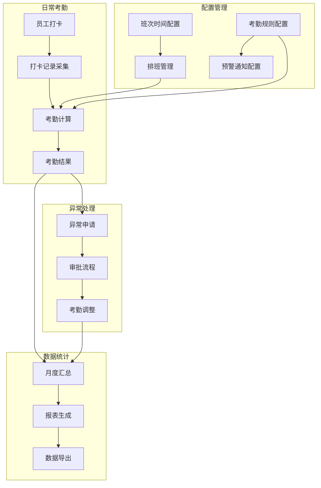

---

## 2. 班次时间管理流程

### 2.1 时间段创建流程

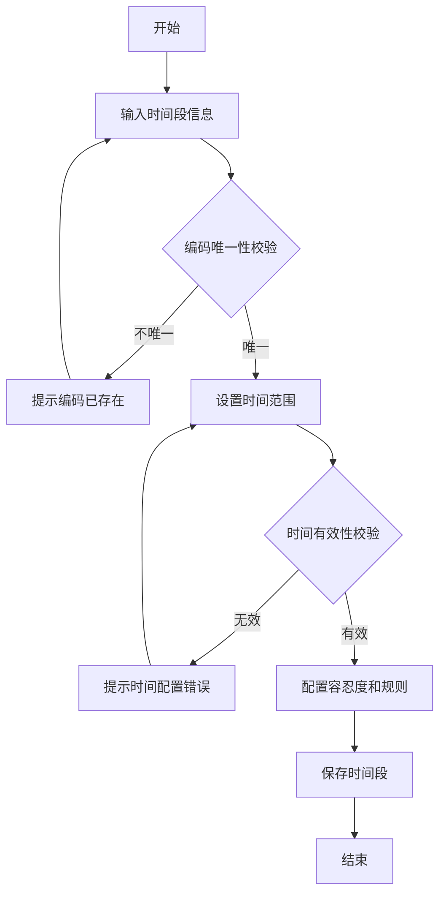

### 2.2 班次创建流程

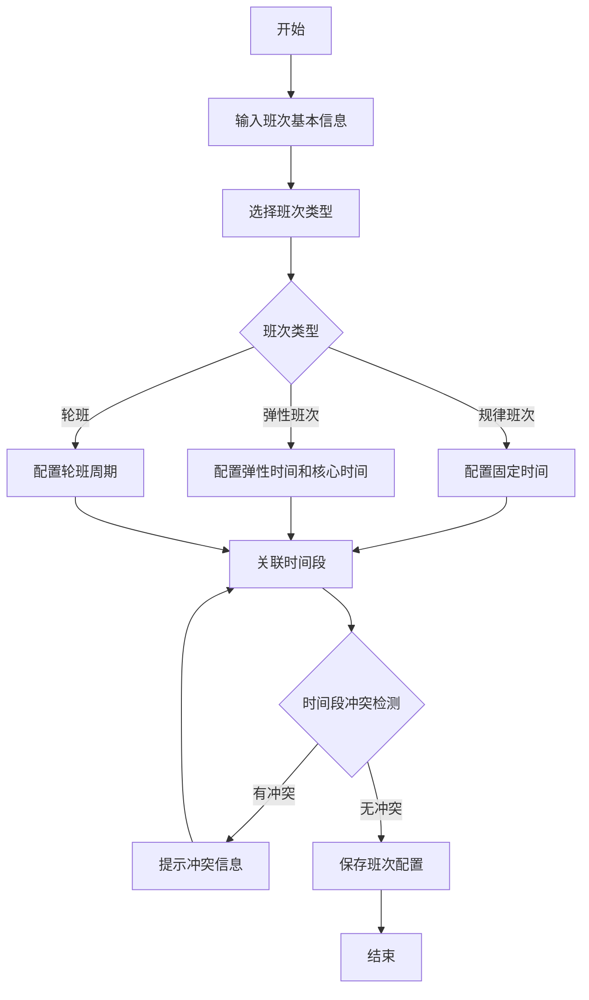

### 2.3 班次时间段关联流程

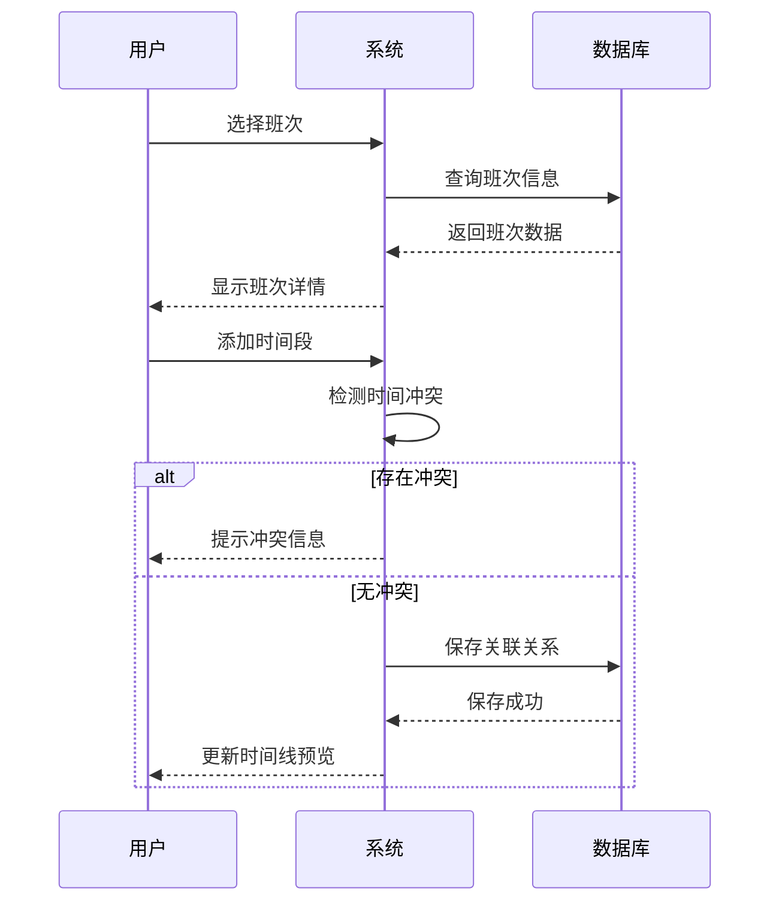

---

## 3. 排班管理流程

### 3.1 手动排班流程

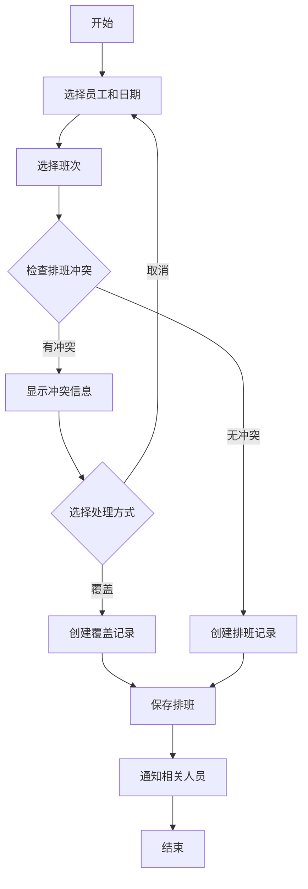

### 3.2 批量排班流程

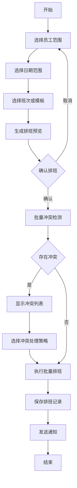

### 3.3 排班模板应用流程

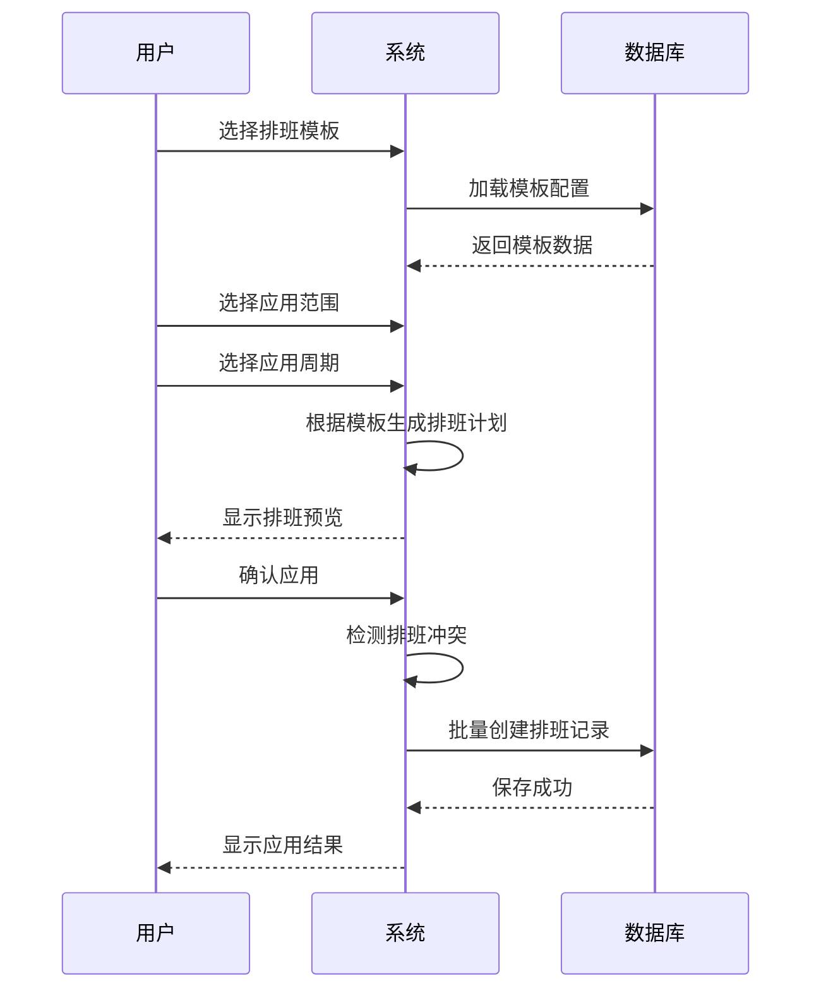

### 3.4 临时排班覆盖流程

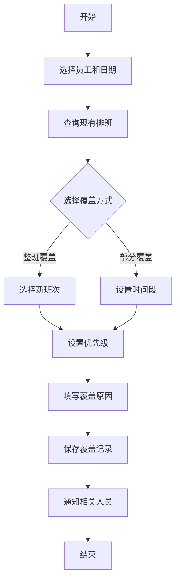

---

## 4. 考勤规则配置流程

### 4.1 考勤规则创建流程

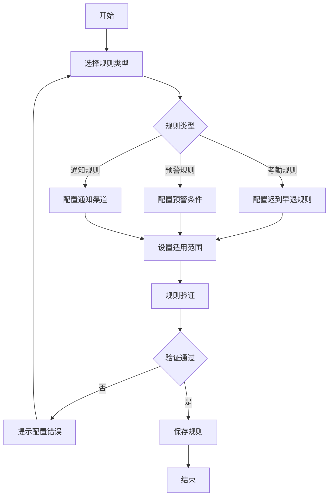

### 4.2 预警规则触发流程

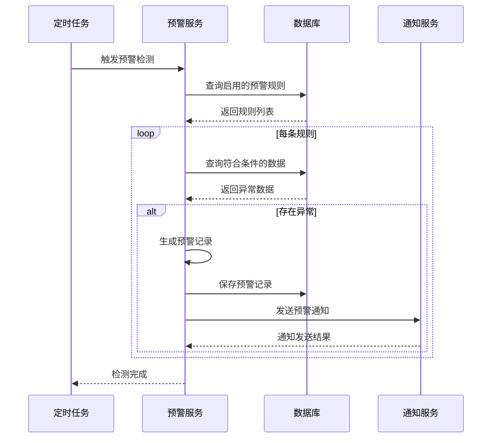

---

## 5. 异常管理流程

### 5.1 请假申请流程

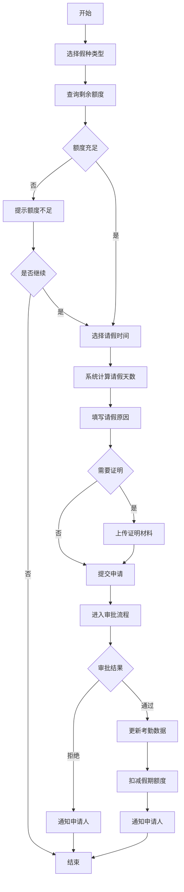

### 5.2 加班申请流程

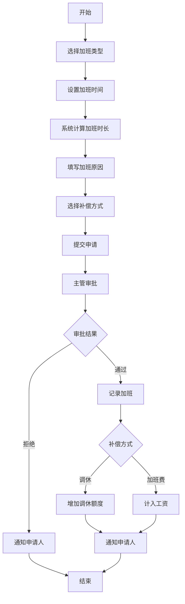

### 5.3 补签申请流程

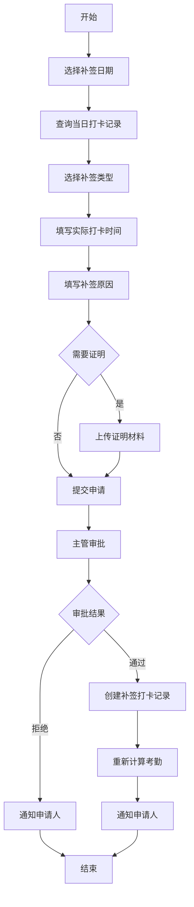

### 5.4 审批流程

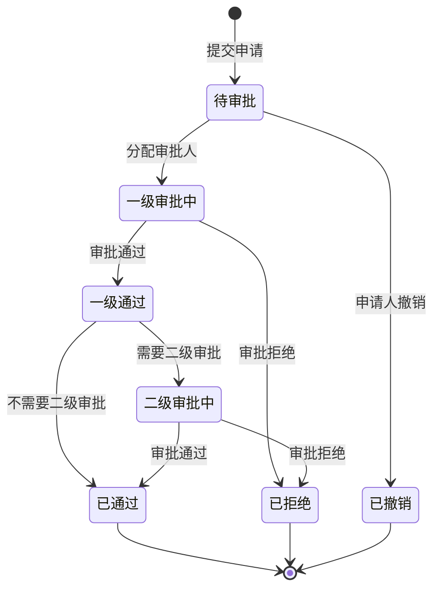

### 5.5 销假流程

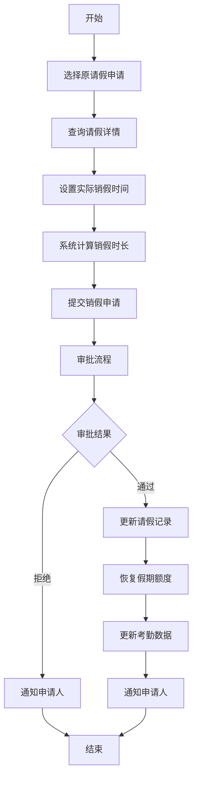

---

## 6. 考勤数据流程

### 6.1 打卡流程

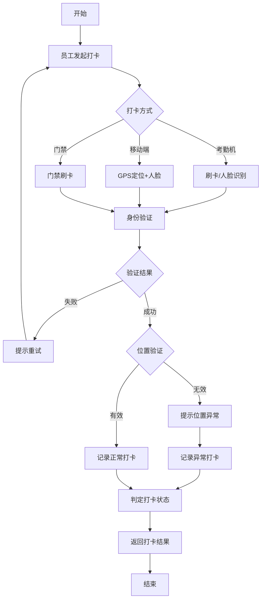

### 6.2 考勤计算流程

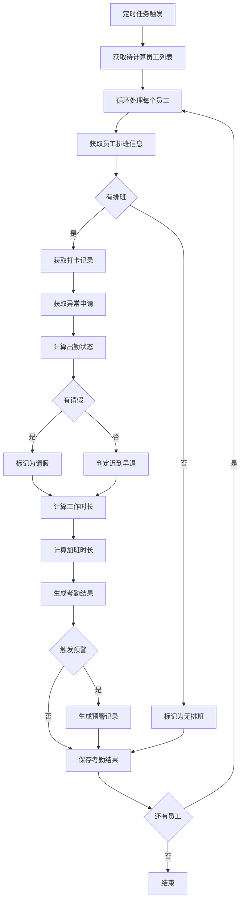

### 6.3 考勤计算时序图

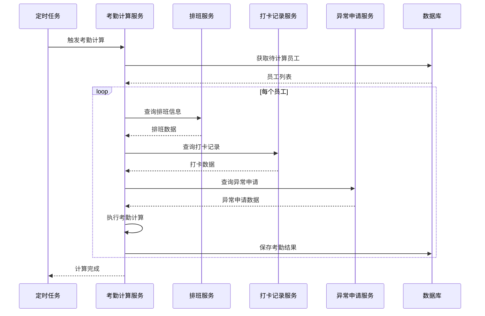

---

## 7. 汇总报表流程

### 7.1 月度汇总流程

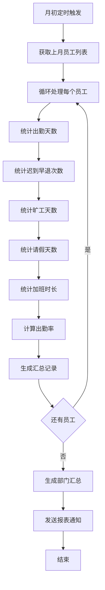

### 7.2 报表导出流程

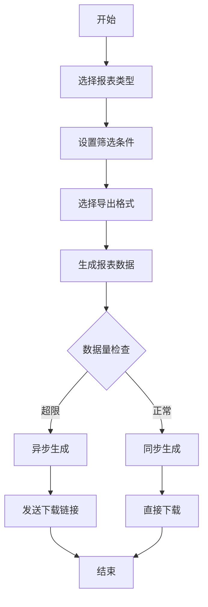

---

## 8. 系统集成流程

### 8.1 门禁联动流程

```mermaid
sequenceDiagram
    participant D as 门禁设备
    participant DS as 设备通讯服务
    participant AS as 考勤服务
    participant DB as 数据库
    
    D->>DS: 门禁刷卡事件
    DS->>DS: 解析设备数据
    DS->>AS: 推送打卡数据
    AS->>AS: 验证员工身份
    AS->>AS: 判断打卡类型
    AS->>DB: 保存打卡记录
    DB-->>AS: 保存成功
    AS-->>DS: 处理结果
    DS-->>D: 返回响应
```

### 8.2 审批流程集成

```mermaid
sequenceDiagram
    participant U as 用户
    participant AS as 考勤服务
    participant OA as OA服务
    participant DB as 数据库
    
    U->>AS: 提交异常申请
    AS->>DB: 保存申请记录
    AS->>OA: 发起审批流程
    OA-->>AS: 返回流程ID
    AS-->>U: 申请提交成功
    
    Note over OA: 审批人处理
    
    OA->>AS: 回调审批结果
    AS->>DB: 更新申请状态
    AS->>AS: 触发后续处理
    AS-->>U: 通知审批结果
```

---

*本文档持续更新中*

