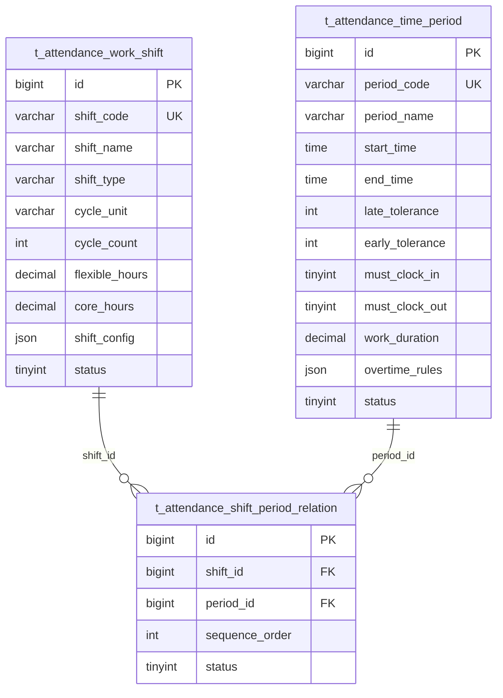
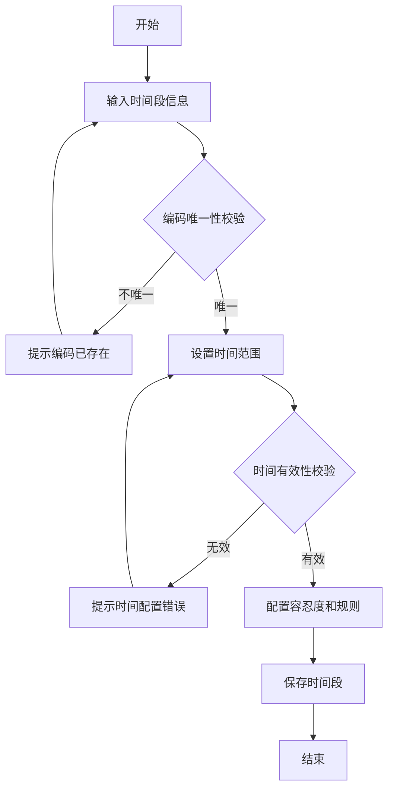
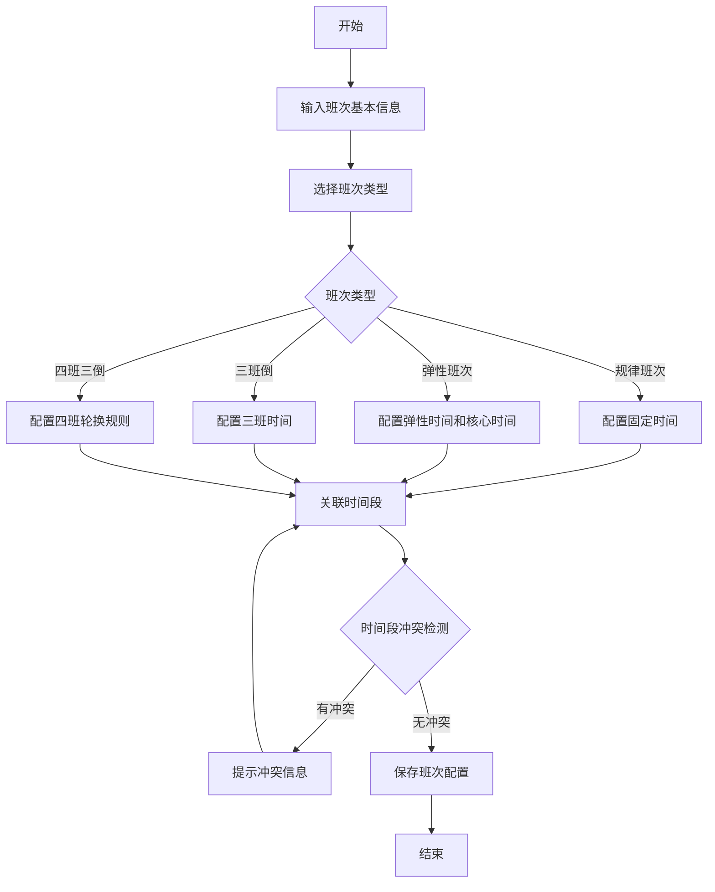

# 班次时间管理子模块

> **版本**: v2.0.0  
> **更新日期**: 2025-12-17  
> **所属模块**: 考勤管理模块

---

## 1. 模块概述

班次时间管理模块负责管理班次配置、时间段定义以及班次与时间段的关联关系，支持多种班次类型和灵活的时间配置，是排班管理和考勤计算的基础。

### 1.1 核心功能

- **时间段管理**: 定义工作时间段的基础配置
- **班次管理**: 管理各类班次配置
- **班次时间段关联**: 将时间段关联到班次
- **班次类型支持**: 规律班次、弹性班次、三班倒、四班三倒

---

## 2. 数据表设计

### 2.1 时间段表 (t_attendance_time_period)

```sql
CREATE TABLE t_attendance_time_period (
    id BIGINT NOT NULL AUTO_INCREMENT COMMENT '主键ID',
    period_code VARCHAR(50) NOT NULL COMMENT '时间段编码',
    period_name VARCHAR(100) NOT NULL COMMENT '时间段名称',
    start_time TIME NOT NULL COMMENT '开始时间',
    end_time TIME NOT NULL COMMENT '结束时间',
    late_tolerance INT NOT NULL DEFAULT 0 COMMENT '迟到容忍分钟数',
    early_tolerance INT NOT NULL DEFAULT 0 COMMENT '早退容忍分钟数',
    must_clock_in TINYINT NOT NULL DEFAULT 1 COMMENT '是否必须签到',
    must_clock_out TINYINT NOT NULL DEFAULT 1 COMMENT '是否必须签退',
    work_duration DECIMAL(5,2) COMMENT '工作时长(小时)',
    overtime_rules JSON COMMENT '加班规则配置JSON',
    status TINYINT NOT NULL DEFAULT 1 COMMENT '状态',
    deleted_flag TINYINT NOT NULL DEFAULT 0 COMMENT '删除标记',
    create_time DATETIME NOT NULL DEFAULT CURRENT_TIMESTAMP,
    update_time DATETIME NOT NULL DEFAULT CURRENT_TIMESTAMP ON UPDATE CURRENT_TIMESTAMP,
    PRIMARY KEY (id),
    UNIQUE KEY uk_period_code (period_code)
) ENGINE=InnoDB DEFAULT CHARSET=utf8mb4 COMMENT='考勤时间段表';
```

### 2.2 班次表 (t_attendance_work_shift)

```sql
CREATE TABLE t_attendance_work_shift (
    id BIGINT NOT NULL AUTO_INCREMENT COMMENT '主键ID',
    shift_code VARCHAR(50) NOT NULL COMMENT '班次编码',
    shift_name VARCHAR(100) NOT NULL COMMENT '班次名称',
    shift_type VARCHAR(50) NOT NULL COMMENT '班次类型',
    cycle_unit VARCHAR(20) COMMENT '周期单位',
    cycle_count INT COMMENT '周期数',
    flexible_hours DECIMAL(5,2) COMMENT '弹性工作时间',
    core_hours DECIMAL(5,2) COMMENT '核心工作时间',
    shift_config JSON COMMENT '班次配置JSON',
    status TINYINT NOT NULL DEFAULT 1 COMMENT '状态',
    deleted_flag TINYINT NOT NULL DEFAULT 0 COMMENT '删除标记',
    create_time DATETIME NOT NULL DEFAULT CURRENT_TIMESTAMP,
    update_time DATETIME NOT NULL DEFAULT CURRENT_TIMESTAMP ON UPDATE CURRENT_TIMESTAMP,
    PRIMARY KEY (id),
    UNIQUE KEY uk_shift_code (shift_code)
) ENGINE=InnoDB DEFAULT CHARSET=utf8mb4 COMMENT='考勤班次表';
```

### 2.3 班次时间段关联表 (t_attendance_shift_period_relation)

```sql
CREATE TABLE t_attendance_shift_period_relation (
    id BIGINT NOT NULL AUTO_INCREMENT COMMENT '主键ID',
    shift_id BIGINT NOT NULL COMMENT '班次ID',
    period_id BIGINT NOT NULL COMMENT '时间段ID',
    sequence_order INT NOT NULL DEFAULT 1 COMMENT '顺序号',
    status TINYINT NOT NULL DEFAULT 1 COMMENT '状态',
    deleted_flag TINYINT NOT NULL DEFAULT 0 COMMENT '删除标记',
    create_time DATETIME NOT NULL DEFAULT CURRENT_TIMESTAMP,
    update_time DATETIME NOT NULL DEFAULT CURRENT_TIMESTAMP ON UPDATE CURRENT_TIMESTAMP,
    PRIMARY KEY (id),
    UNIQUE KEY uk_shift_period (shift_id, period_id)
) ENGINE=InnoDB DEFAULT CHARSET=utf8mb4 COMMENT='班次时间段关联表';
```

---

## 3. ER图



---

## 4. 业务逻辑

### 4.1 时间段管理逻辑

- **基础时间配置**: 定义工作时间的开始和结束
- **容忍度设置**: 配置迟到和早退的容忍时间
- **打卡要求**: 控制是否必须签到和签退
- **加班规则**: 配置加班时间的计算规则
- **跨日支持**: 支持22:00-06:00跨日时间段

### 4.2 班次类型说明

| 班次类型 | 说明 | 示例 |
|----------|------|------|
| 规律班次 | 固定时间段的标准班次 | 9:00-18:00标准班 |
| 弹性班次 | 有弹性工作时间的班次 | 8:00-20:00弹性，核心10:00-16:00 |
| 三班倒 | 8小时一轮的三班制 | 早班6:00-14:00，中班14:00-22:00，晚班22:00-6:00 |
| 四班三倒 | 每天三班，四班轮换 | 三天工作一天休息 |

### 4.3 JSON配置结构

**overtime_rules (加班规则)**:
```json
{
  "overtime_calculation_method": "daily_standard",
  "daily_standard_hours": 8.0,
  "weekly_standard_hours": 40.0,
  "overtime_threshold": 15,
  "weekend_multiplier": 2.0,
  "holiday_multiplier": 3.0,
  "night_shift_start": "22:00",
  "night_shift_end": "06:00",
  "night_shift_multiplier": 1.5
}
```

**shift_config (班次配置)**:
```json
{
  "shift_pattern": "rotating",
  "rotation_sequence": [1, 2, 3],
  "rotation_cycle_days": 7,
  "flexible_start_time": "08:00",
  "flexible_end_time": "20:00",
  "core_start_time": "10:00",
  "core_end_time": "16:00",
  "break_duration": 60,
  "break_times": [{"start": "12:00", "end": "13:00"}],
  "cross_day_enabled": true,
  "max_continuous_days": 6,
  "min_rest_days": 1
}
```

---

## 5. 业务流程

### 5.1 时间段创建流程



### 5.2 班次创建流程



---

## 6. API接口

### 6.1 时间段管理接口

| 方法 | 路径 | 说明 |
|------|------|------|
| GET | /api/v1/attendance/time-periods | 查询时间段列表 |
| POST | /api/v1/attendance/time-periods | 创建时间段 |
| GET | /api/v1/attendance/time-periods/{id} | 获取时间段详情 |
| PUT | /api/v1/attendance/time-periods/{id} | 更新时间段 |
| DELETE | /api/v1/attendance/time-periods/{id} | 删除时间段 |

### 6.2 班次管理接口

| 方法 | 路径 | 说明 |
|------|------|------|
| GET | /api/v1/attendance/shifts | 查询班次列表 |
| POST | /api/v1/attendance/shifts | 创建班次 |
| GET | /api/v1/attendance/shifts/{id} | 获取班次详情 |
| PUT | /api/v1/attendance/shifts/{id} | 更新班次 |
| DELETE | /api/v1/attendance/shifts/{id} | 删除班次 |
| POST | /api/v1/attendance/shifts/{id}/copy | 复制班次 |
| GET | /api/v1/attendance/shifts/{id}/timeline | 获取班次时间线 |

### 6.3 班次时间段关联接口

| 方法 | 路径 | 说明 |
|------|------|------|
| GET | /api/v1/attendance/shifts/{shiftId}/periods | 获取班次的时间段 |
| POST | /api/v1/attendance/shift-period-relations | 添加时间段到班次 |
| PUT | /api/v1/attendance/shifts/{shiftId}/periods | 批量设置班次时间段 |
| DELETE | /api/v1/attendance/shift-period-relations/{id} | 删除时间段关联 |

---

## 7. 前端页面设计

### 7.1 时间段管理页面

- **时间段列表**: 表格展示时间段信息
- **时间段编辑器**: 可视化时间配置界面
- **加班规则配置**: 表单式加班规则设置

### 7.2 班次管理页面

- **班次类型选择**: 标签页切换不同班次类型
- **班次配置器**: 拖拽式班次配置界面
- **时间线预览**: 可视化展示班次时间安排

### 7.3 班次时间段关联页面

- **关联关系图**: 可视化展示班次与时间段的关联
- **时间段排序**: 拖拽式时间段顺序调整

---

## 8. 开发优先级

### P0 - 核心功能
- 基础时间段管理
- 标准班次配置
- 班次时间段关联
- 基础加班规则

### P1 - 增强功能
- 弹性班次支持
- 轮班配置
- 复杂时间段组合
- 加班规则完善

### P2 - 扩展功能
- 高级班次类型（三班倒、四班三倒）
- 可视化配置
- 班次模板
- 批量操作

---

## 9. 技术实现要点

### 9.1 时间计算
- 跨日时间处理
- 时间冲突检测
- 工作时长精确计算
- 加班时间算法

### 9.2 配置验证
- 班次配置合理性验证
- 时间段冲突检测
- 轮班规则验证
- 数据完整性检查

### 9.3 性能优化
- 班次配置缓存
- 时间计算优化
- 批量操作支持
- 配置预加载

---

*本文档持续更新中*

