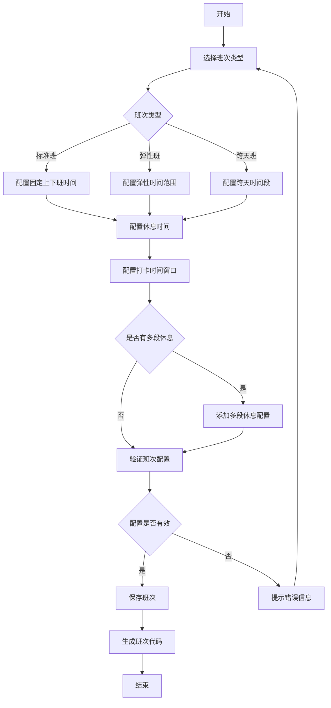
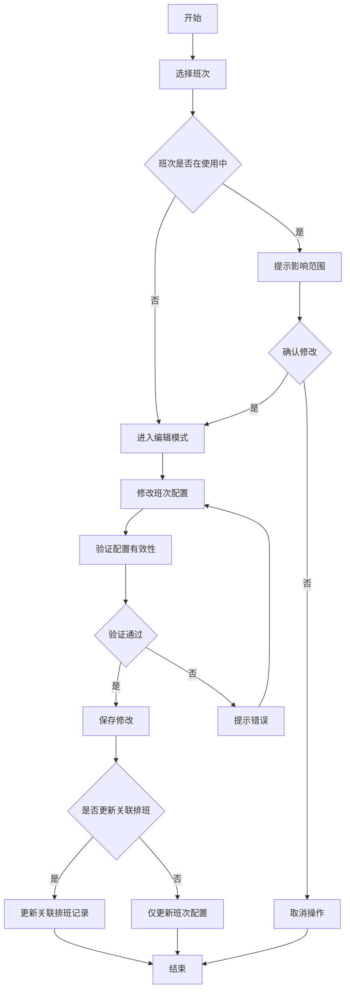
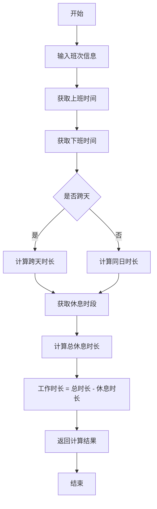
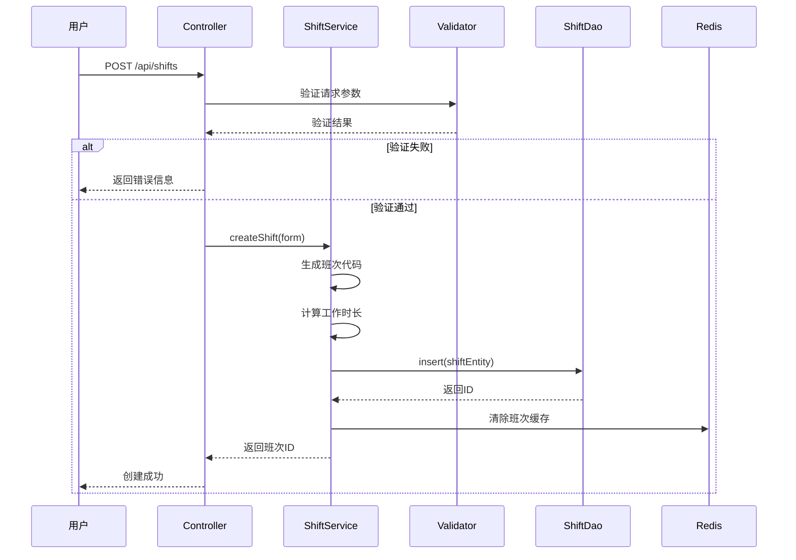
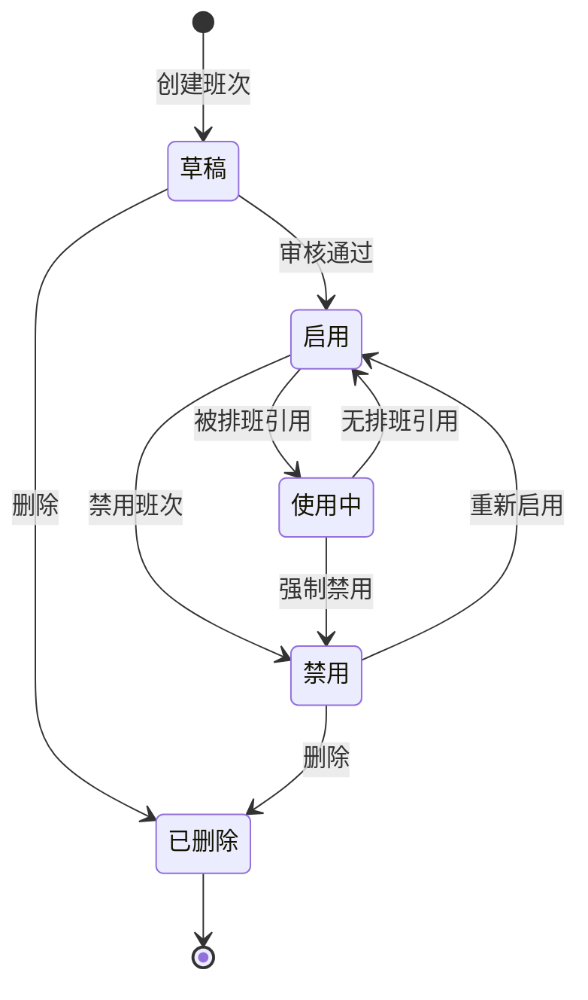

# 班次时间管理 - 业务流程图

> **版本**: v1.0.0  
> **微服务**: ioedream-attendance-service (8091)  
> **创建日期**: 2025-12-17

---

## 📋 核心业务流程

### 1. 班次创建流程

### 2. 班次修改流程

### 3. 班次时间计算流程

---

## 🔄 时序图

### 班次配置时序

---

## 📊 状态图

### 班次状态流转

---

## 🎯 关键控制点

| 控制点 | 说明 | 验证规则 |
|--------|------|----------|
| 时间有效性 | 上班时间必须早于下班时间（跨天除外） | work_end > work_start |
| 休息时间范围 | 休息时间必须在工作时间内 | break ∈ [work_start, work_end] |
| 打卡窗口 | 打卡窗口不能超过工作时间范围 | clock_window ≤ work_duration |
| 班次唯一性 | 班次代码必须唯一 | shift_code UNIQUE |
| 最小工时 | 弹性班必须配置最小工作时长 | flex -> min_hours NOT NULL |

---

**📝 文档维护**: IOE-DREAM架构团队 | 2025-12-17
