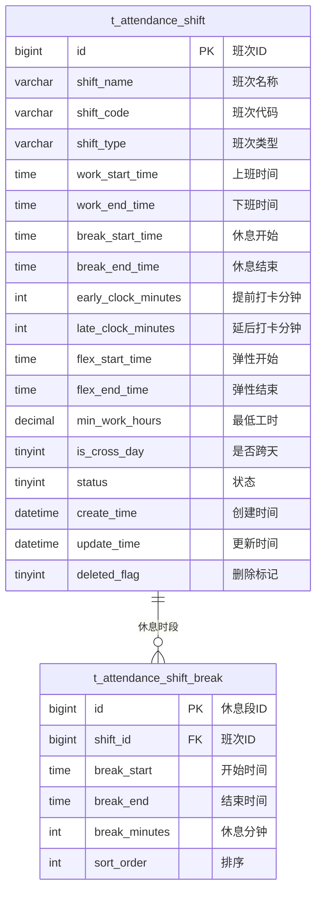

# 班次时间管理 - 数据结构设计

> **版本**: v1.0.0  
> **创建日期**: 2025-12-17

---

## 📊 ER图



---

## 📋 表结构详细设计

### t_attendance_shift (班次定义表)

```sql
CREATE TABLE t_attendance_shift (
    id BIGINT PRIMARY KEY AUTO_INCREMENT COMMENT '班次ID',
    shift_name VARCHAR(50) NOT NULL COMMENT '班次名称',
    shift_code VARCHAR(20) NOT NULL COMMENT '班次代码',
    shift_type VARCHAR(20) NOT NULL COMMENT '班次类型:STANDARD/EARLY/MIDDLE/NIGHT/FLEX/OVERNIGHT',
    work_start_time TIME NOT NULL COMMENT '上班时间',
    work_end_time TIME NOT NULL COMMENT '下班时间',
    break_start_time TIME COMMENT '休息开始时间',
    break_end_time TIME COMMENT '休息结束时间',
    early_clock_minutes INT DEFAULT 30 COMMENT '允许提前打卡分钟数',
    late_clock_minutes INT DEFAULT 30 COMMENT '允许延后打卡分钟数',
    flex_start_time TIME COMMENT '弹性开始时间',
    flex_end_time TIME COMMENT '弹性结束时间',
    min_work_hours DECIMAL(4,2) DEFAULT 8.00 COMMENT '最低工作时长(小时)',
    is_cross_day TINYINT DEFAULT 0 COMMENT '是否跨天班次:0否1是',
    status TINYINT DEFAULT 1 COMMENT '状态:0禁用1启用',
    remark VARCHAR(200) COMMENT '备注',
    create_time DATETIME NOT NULL DEFAULT CURRENT_TIMESTAMP COMMENT '创建时间',
    update_time DATETIME NOT NULL DEFAULT CURRENT_TIMESTAMP ON UPDATE CURRENT_TIMESTAMP COMMENT '更新时间',
    deleted_flag TINYINT DEFAULT 0 COMMENT '删除标记:0未删除1已删除',
    UNIQUE KEY uk_shift_code (shift_code),
    INDEX idx_shift_type (shift_type),
    INDEX idx_status (status)
) ENGINE=InnoDB DEFAULT CHARSET=utf8mb4 COMMENT='班次定义表';
```

### t_attendance_shift_break (班次休息时段表)

```sql
CREATE TABLE t_attendance_shift_break (
    id BIGINT PRIMARY KEY AUTO_INCREMENT COMMENT '休息段ID',
    shift_id BIGINT NOT NULL COMMENT '班次ID',
    break_start TIME NOT NULL COMMENT '休息开始时间',
    break_end TIME NOT NULL COMMENT '休息结束时间',
    break_minutes INT NOT NULL COMMENT '休息分钟数',
    sort_order INT DEFAULT 0 COMMENT '排序',
    create_time DATETIME NOT NULL DEFAULT CURRENT_TIMESTAMP COMMENT '创建时间',
    INDEX idx_shift_id (shift_id),
    FOREIGN KEY (shift_id) REFERENCES t_attendance_shift(id) ON DELETE CASCADE
) ENGINE=InnoDB DEFAULT CHARSET=utf8mb4 COMMENT='班次休息时段表';
```

---

## 🔧 字段说明

### 班次类型枚举

| 值 | 说明 |
|------|------|
| STANDARD | 标准班 |
| EARLY | 早班 |
| MIDDLE | 中班 |
| NIGHT | 晚班 |
| FLEX | 弹性班 |
| OVERNIGHT | 通宵班 |

---

**📝 文档维护**: IOE-DREAM架构团队 | 2025-12-17
