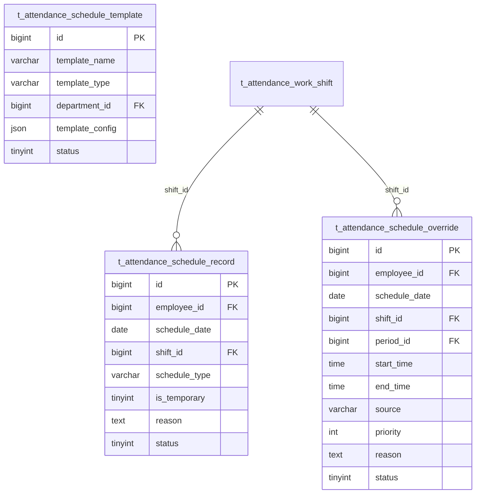
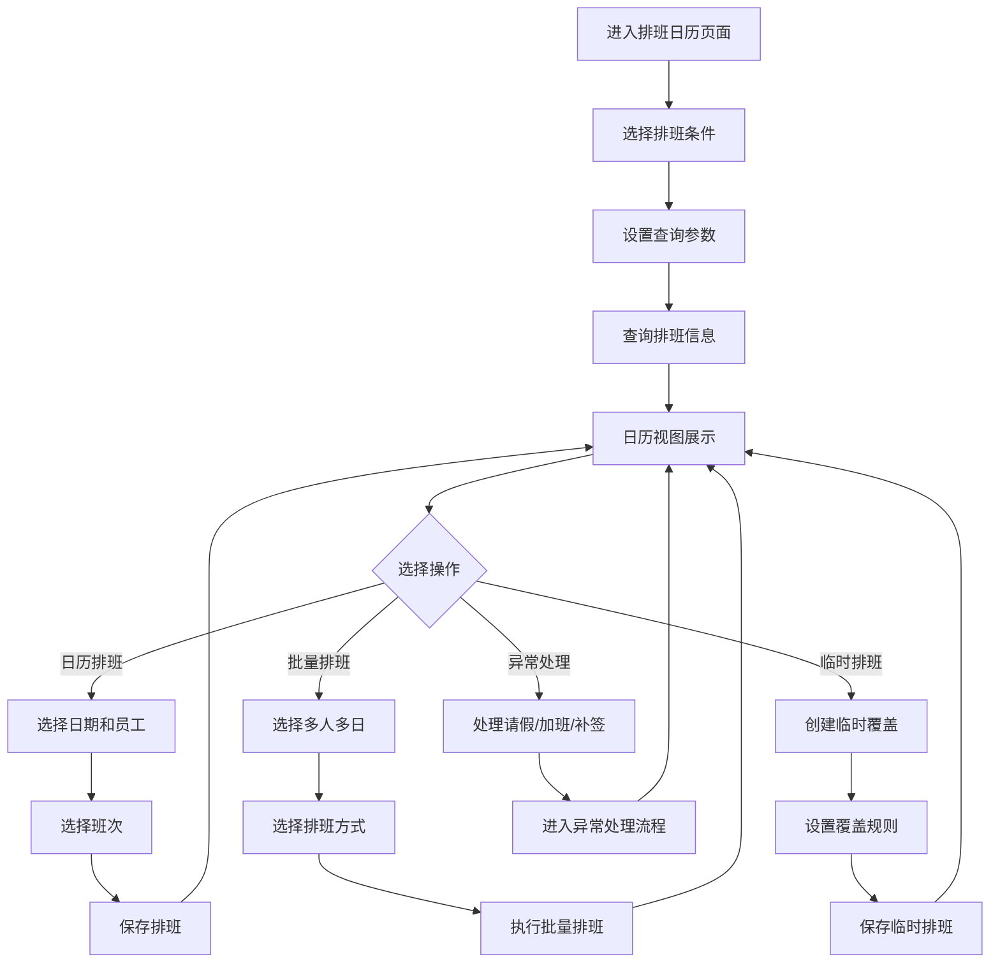
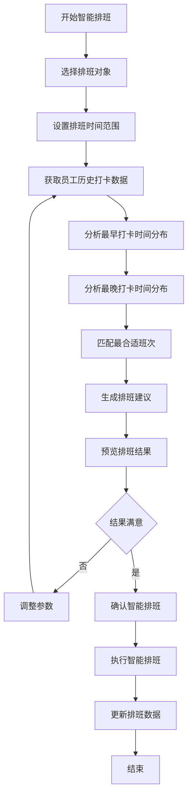
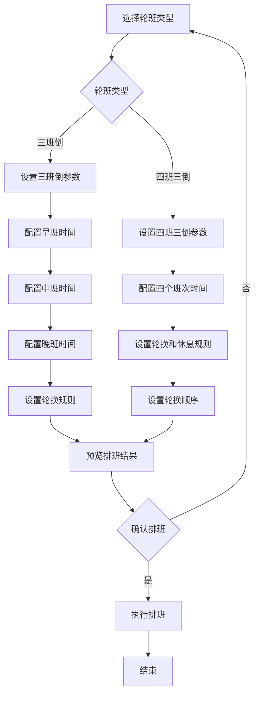

# 排班管理子模块

> **版本**: v2.0.0  
> **更新日期**: 2025-12-17  
> **所属模块**: 考勤管理模块

---

## 1. 模块概述

排班管理模块负责员工排班的创建、调整和管理，支持多种排班方式，包括手动排班、批量排班、模板排班、智能排班等，是考勤管理的核心功能之一。

### 1.1 核心功能

- **排班日历**: 以日历形式展示和管理排班
- **手动排班**: 为员工手动安排班次
- **批量排班**: 批量为多人多日排班
- **排班模板**: 创建和应用排班模板
- **临时排班**: 临时调整排班覆盖
- **智能排班**: 基于历史数据智能推荐排班

---

## 2. 数据表设计

### 2.1 排班记录表 (t_attendance_schedule_record)

```sql
CREATE TABLE t_attendance_schedule_record (
    id BIGINT NOT NULL AUTO_INCREMENT COMMENT '主键ID',
    employee_id BIGINT NOT NULL COMMENT '员工ID',
    schedule_date DATE NOT NULL COMMENT '排班日期',
    shift_id BIGINT NOT NULL COMMENT '班次ID',
    schedule_type VARCHAR(50) NOT NULL DEFAULT 'normal' COMMENT '排班类型',
    is_temporary TINYINT NOT NULL DEFAULT 0 COMMENT '是否临时排班',
    reason TEXT COMMENT '排班原因',
    status TINYINT NOT NULL DEFAULT 1 COMMENT '状态',
    deleted_flag TINYINT NOT NULL DEFAULT 0 COMMENT '删除标记',
    create_time DATETIME NOT NULL DEFAULT CURRENT_TIMESTAMP,
    update_time DATETIME NOT NULL DEFAULT CURRENT_TIMESTAMP ON UPDATE CURRENT_TIMESTAMP,
    PRIMARY KEY (id),
    UNIQUE KEY uk_employee_date (employee_id, schedule_date),
    KEY idx_schedule_date (schedule_date),
    KEY idx_shift_id (shift_id)
) ENGINE=InnoDB DEFAULT CHARSET=utf8mb4 COMMENT='排班记录表';
```

### 2.2 排班模板表 (t_attendance_schedule_template)

```sql
CREATE TABLE t_attendance_schedule_template (
    id BIGINT NOT NULL AUTO_INCREMENT COMMENT '主键ID',
    template_name VARCHAR(100) NOT NULL COMMENT '模板名称',
    template_type VARCHAR(50) NOT NULL COMMENT '模板类型',
    department_id BIGINT COMMENT '部门ID',
    template_config JSON NOT NULL COMMENT '模板配置JSON',
    status TINYINT NOT NULL DEFAULT 1 COMMENT '状态',
    deleted_flag TINYINT NOT NULL DEFAULT 0 COMMENT '删除标记',
    create_time DATETIME NOT NULL DEFAULT CURRENT_TIMESTAMP,
    update_time DATETIME NOT NULL DEFAULT CURRENT_TIMESTAMP ON UPDATE CURRENT_TIMESTAMP,
    PRIMARY KEY (id),
    KEY idx_template_type (template_type)
) ENGINE=InnoDB DEFAULT CHARSET=utf8mb4 COMMENT='排班模板表';
```

### 2.3 临时排班覆盖表 (t_attendance_schedule_override)

```sql
CREATE TABLE t_attendance_schedule_override (
    id BIGINT NOT NULL AUTO_INCREMENT COMMENT '主键ID',
    employee_id BIGINT NOT NULL COMMENT '员工ID',
    schedule_date DATE NOT NULL COMMENT '排班日期',
    shift_id BIGINT COMMENT '班次ID',
    period_id BIGINT COMMENT '时间段ID',
    start_time TIME COMMENT '开始时间',
    end_time TIME COMMENT '结束时间',
    source VARCHAR(20) NOT NULL DEFAULT 'manual' COMMENT '来源',
    priority INT NOT NULL DEFAULT 10 COMMENT '优先级',
    reason TEXT COMMENT '原因',
    status TINYINT NOT NULL DEFAULT 1 COMMENT '状态',
    deleted_flag TINYINT NOT NULL DEFAULT 0 COMMENT '删除标记',
    create_time DATETIME NOT NULL DEFAULT CURRENT_TIMESTAMP,
    update_time DATETIME NOT NULL DEFAULT CURRENT_TIMESTAMP ON UPDATE CURRENT_TIMESTAMP,
    PRIMARY KEY (id),
    KEY idx_employee_date (employee_id, schedule_date)
) ENGINE=InnoDB DEFAULT CHARSET=utf8mb4 COMMENT='临时排班覆盖表';
```

---

## 3. ER图



---

## 4. 业务逻辑

### 4.1 排班类型

| 类型 | 说明 |
|------|------|
| normal | 正常排班 |
| temporary | 临时排班 |
| overtime | 加班排班 |

### 4.2 模板类型

| 类型 | 说明 |
|------|------|
| department | 部门模板 |
| position | 岗位模板 |
| personal | 个人模板 |

### 4.3 模板配置JSON结构

```json
{
  "cycleType": "weekly",
  "cycleDays": 7,
  "schedulePattern": [
    {"dayOfWeek": 1, "shiftId": 1},
    {"dayOfWeek": 2, "shiftId": 1},
    {"dayOfWeek": 3, "shiftId": 1},
    {"dayOfWeek": 4, "shiftId": 1},
    {"dayOfWeek": 5, "shiftId": 1},
    {"dayOfWeek": 6, "shiftId": null},
    {"dayOfWeek": 7, "shiftId": null}
  ],
  "rotationRules": {
    "enabled": false,
    "rotationSequence": [1, 2, 3],
    "rotationCycleDays": 7
  }
}
```

---

## 5. 业务流程

### 5.1 排班日历流程



### 5.2 智能排班流程



### 5.3 三班倒/四班三倒排班流程



---

## 6. API接口

### 6.1 排班记录接口

| 方法 | 路径 | 说明 |
|------|------|------|
| GET | /api/v1/attendance/schedule-calendar | 获取排班日历 |
| POST | /api/v1/attendance/schedule-records | 创建排班记录 |
| POST | /api/v1/attendance/schedule-records/batch | 批量创建排班 |
| GET | /api/v1/attendance/schedule-records | 查询员工排班 |
| PUT | /api/v1/attendance/schedule-records/{id} | 更新排班记录 |
| DELETE | /api/v1/attendance/schedule-records/{id} | 删除排班记录 |

### 6.2 排班模板接口

| 方法 | 路径 | 说明 |
|------|------|------|
| GET | /api/v1/attendance/schedule-templates | 查询模板列表 |
| POST | /api/v1/attendance/schedule-templates | 创建排班模板 |
| PUT | /api/v1/attendance/schedule-templates/{id} | 更新排班模板 |
| DELETE | /api/v1/attendance/schedule-templates/{id} | 删除排班模板 |
| POST | /api/v1/attendance/schedule-templates/{id}/apply | 应用排班模板 |
| POST | /api/v1/attendance/schedule-templates/{id}/copy | 复制模板 |

### 6.3 临时排班接口

| 方法 | 路径 | 说明 |
|------|------|------|
| POST | /api/v1/attendance/schedule-overrides | 创建临时排班 |
| GET | /api/v1/attendance/schedule-overrides | 查询临时排班 |
| DELETE | /api/v1/attendance/schedule-overrides/{id} | 删除临时排班 |

### 6.4 智能排班接口

| 方法 | 路径 | 说明 |
|------|------|------|
| POST | /api/v1/attendance/smart-schedule/analyze | 分析打卡数据 |
| POST | /api/v1/attendance/smart-schedule/suggest | 获取排班建议 |
| POST | /api/v1/attendance/smart-schedule/apply | 应用智能排班 |

---

## 7. 前端页面设计

### 7.1 排班日历页面

- **月历/周历视图**: 切换不同视图
- **筛选功能**: 按部门/员工筛选
- **拖拽排班**: 支持拖拽调整
- **冲突提示**: 实时提示排班冲突

### 7.2 批量排班页面

- **人员选择**: 多选员工
- **日期范围**: 选择排班周期
- **班次/模板选择**: 选择排班方式
- **预览功能**: 预览批量排班结果

### 7.3 智能排班页面

- **数据分析**: 展示历史打卡分析
- **班次匹配**: 展示推荐班次
- **结果预览**: 预览智能排班结果
- **参数调整**: 支持调整参数重新计算

---

## 8. 开发优先级

### P0 - 核心功能
- 排班日历展示
- 手动排班
- 排班查询

### P1 - 增强功能
- 批量排班
- 排班模板
- 临时排班覆盖

### P2 - 扩展功能
- 智能排班
- 三班倒/四班三倒支持
- 排班冲突检测

---

*本文档持续更新中*

