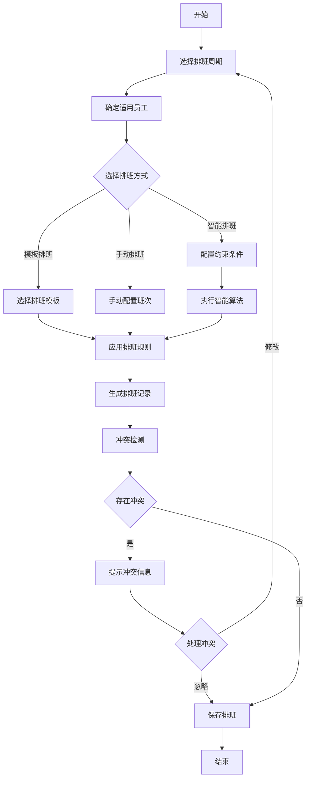
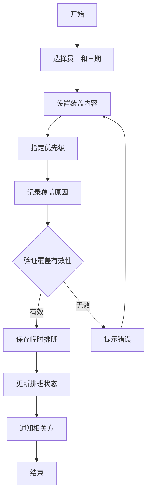
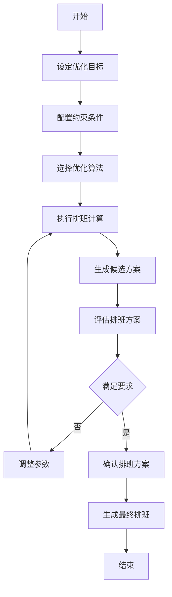
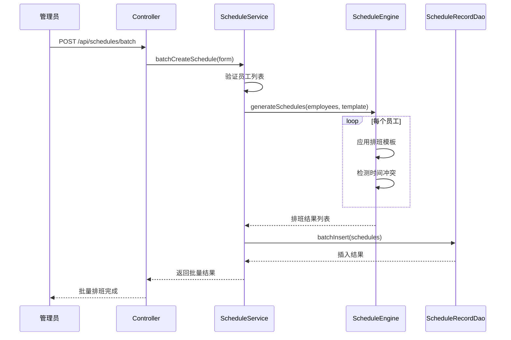
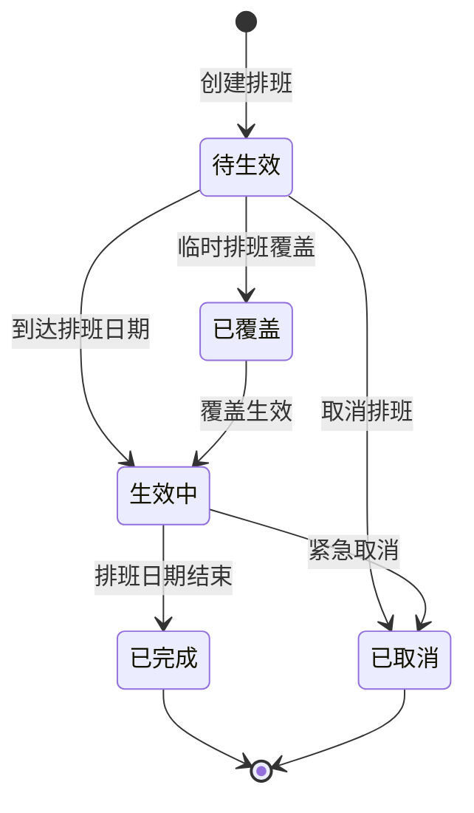

# 排班管理 - 业务流程图

> **版本**: v1.0.0  
> **微服务**: ioedream-attendance-service (8091)  
> **创建日期**: 2025-12-17

---

## 📋 核心业务流程

### 1. 排班生成流程

### 2. 临时排班流程

### 3. 智能排班流程

---

## 🔄 时序图

### 批量排班时序

---

## 📊 状态图

### 排班记录状态

---

**📝 文档维护**: IOE-DREAM架构团队 | 2025-12-17
