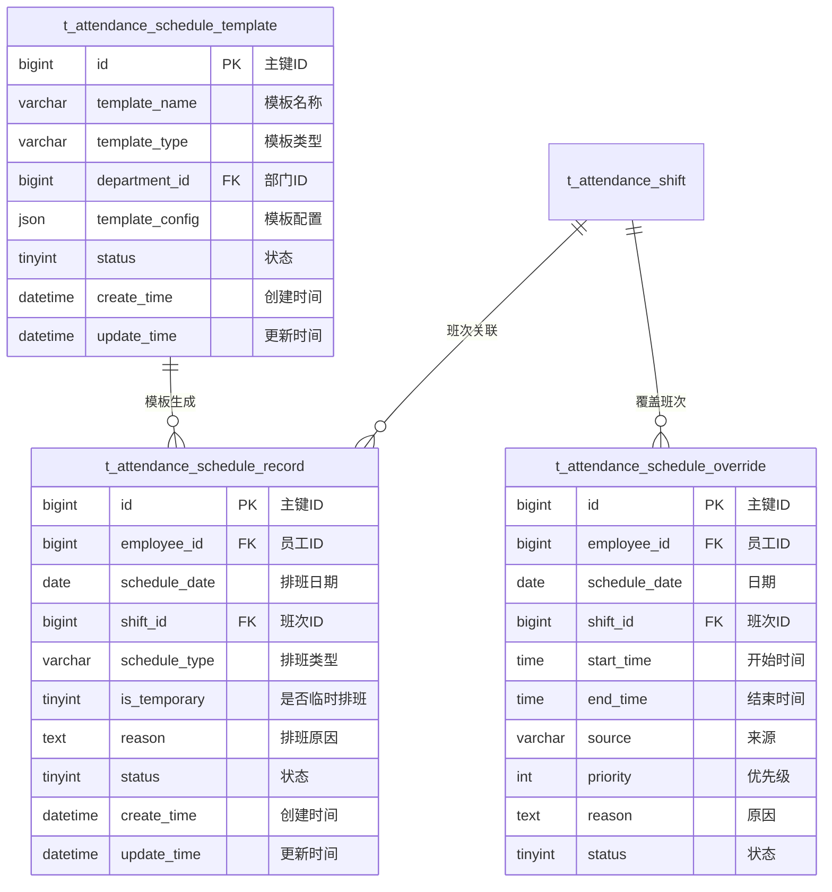

# 排班管理 - 数据结构设计

> **版本**: v1.0.0  
> **创建日期**: 2025-12-17

---

## 📊 ER图



---

## 📋 表结构详细设计

### t_attendance_schedule_record (排班记录表)

```sql
CREATE TABLE t_attendance_schedule_record (
    id BIGINT PRIMARY KEY AUTO_INCREMENT COMMENT '主键ID',
    employee_id BIGINT NOT NULL COMMENT '员工ID',
    schedule_date DATE NOT NULL COMMENT '排班日期',
    shift_id BIGINT NOT NULL COMMENT '班次ID',
    schedule_type VARCHAR(20) NOT NULL COMMENT '排班类型:NORMAL/TEMPORARY/OVERTIME/DUTY',
    is_temporary TINYINT DEFAULT 0 COMMENT '是否临时排班:0否1是',
    reason VARCHAR(200) COMMENT '排班原因',
    status TINYINT DEFAULT 1 COMMENT '状态:0取消1正常',
    create_time DATETIME NOT NULL DEFAULT CURRENT_TIMESTAMP COMMENT '创建时间',
    update_time DATETIME NOT NULL DEFAULT CURRENT_TIMESTAMP ON UPDATE CURRENT_TIMESTAMP COMMENT '更新时间',
    deleted_flag TINYINT DEFAULT 0 COMMENT '删除标记',
    UNIQUE KEY uk_employee_date (employee_id, schedule_date, deleted_flag),
    INDEX idx_schedule_date (schedule_date),
    INDEX idx_shift_id (shift_id)
) ENGINE=InnoDB DEFAULT CHARSET=utf8mb4 COMMENT='排班记录表';
```

### t_attendance_schedule_template (排班模板表)

```sql
CREATE TABLE t_attendance_schedule_template (
    id BIGINT PRIMARY KEY AUTO_INCREMENT COMMENT '主键ID',
    template_name VARCHAR(50) NOT NULL COMMENT '模板名称',
    template_type VARCHAR(20) NOT NULL COMMENT '模板类型:DEPARTMENT/POSITION/PERSONAL',
    department_id BIGINT COMMENT '部门ID',
    template_config JSON NOT NULL COMMENT '模板配置JSON',
    status TINYINT DEFAULT 1 COMMENT '状态:0禁用1启用',
    create_time DATETIME NOT NULL DEFAULT CURRENT_TIMESTAMP COMMENT '创建时间',
    update_time DATETIME NOT NULL DEFAULT CURRENT_TIMESTAMP ON UPDATE CURRENT_TIMESTAMP COMMENT '更新时间',
    deleted_flag TINYINT DEFAULT 0 COMMENT '删除标记',
    INDEX idx_template_type (template_type),
    INDEX idx_department_id (department_id)
) ENGINE=InnoDB DEFAULT CHARSET=utf8mb4 COMMENT='排班模板表';
```

### t_attendance_schedule_override (临时排班覆盖表)

```sql
CREATE TABLE t_attendance_schedule_override (
    id BIGINT PRIMARY KEY AUTO_INCREMENT COMMENT '主键ID',
    employee_id BIGINT NOT NULL COMMENT '员工ID',
    schedule_date DATE NOT NULL COMMENT '日期',
    shift_id BIGINT COMMENT '班次ID',
    start_time TIME COMMENT '自定义开始时间',
    end_time TIME COMMENT '自定义结束时间',
    source VARCHAR(20) DEFAULT 'manual' COMMENT '来源:manual/system/api',
    priority INT DEFAULT 0 COMMENT '优先级',
    reason VARCHAR(200) COMMENT '原因',
    status TINYINT DEFAULT 1 COMMENT '状态:0取消1生效',
    create_time DATETIME NOT NULL DEFAULT CURRENT_TIMESTAMP COMMENT '创建时间',
    update_time DATETIME NOT NULL DEFAULT CURRENT_TIMESTAMP ON UPDATE CURRENT_TIMESTAMP COMMENT '更新时间',
    INDEX idx_employee_date (employee_id, schedule_date),
    INDEX idx_priority (priority DESC)
) ENGINE=InnoDB DEFAULT CHARSET=utf8mb4 COMMENT='临时排班覆盖表';
```

---

## 🔧 模板配置JSON结构

```json
{
  "template_name": "技术部标准排班模板",
  "cycle_type": "weekly",
  "cycle_days": 7,
  "schedule_pattern": [
    {
      "day_of_week": 1,
      "shift_id": 101,
      "required_employees": 5
    }
  ],
  "rotation_rules": {
    "auto_rotation": true,
    "rotation_frequency": "weekly"
  },
  "constraints": {
    "max_consecutive_days": 6,
    "min_rest_hours": 12
  }
}
```

---

**📝 文档维护**: IOE-DREAM架构团队 | 2025-12-17
