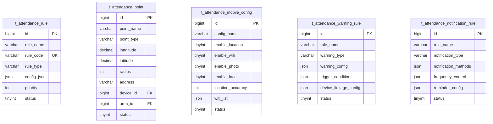
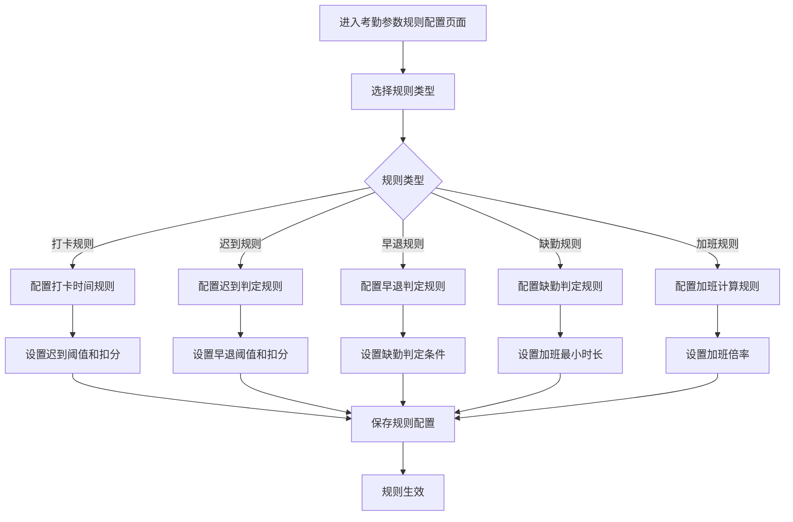
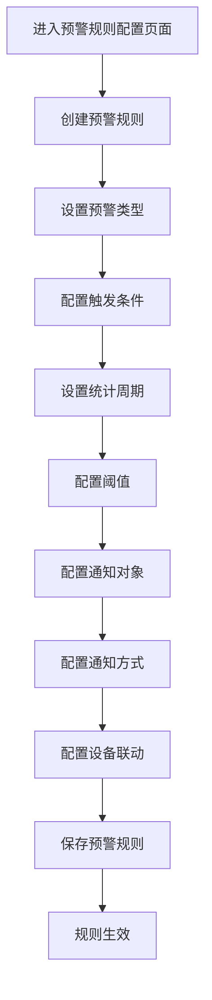

# 考勤规则配置子模块

> **版本**: v2.0.0  
> **更新日期**: 2025-12-17  
> **所属模块**: 考勤管理模块

---

## 1. 模块概述

考勤规则配置模块负责定义和管理考勤的各种规则，包括打卡规则、预警规则、通知规则、移动考勤配置等，是考勤系统灵活性的核心保障。

### 1.1 核心功能

- **考勤规则管理**: 定义打卡规则、迟到早退规则
- **考勤点管理**: 管理打卡地点和设备
- **移动考勤配置**: 配置移动打卡规则
- **预警规则配置**: 配置考勤异常预警
- **通知规则配置**: 配置考勤通知推送

---

## 2. 数据表设计

### 2.1 考勤规则表 (t_attendance_rule)

```sql
CREATE TABLE t_attendance_rule (
    id BIGINT NOT NULL AUTO_INCREMENT COMMENT '主键ID',
    rule_name VARCHAR(100) NOT NULL COMMENT '规则名称',
    rule_code VARCHAR(50) NOT NULL COMMENT '规则编码',
    rule_type VARCHAR(50) NOT NULL COMMENT '规则类型',
    config_json JSON NOT NULL COMMENT '规则配置JSON',
    priority INT NOT NULL DEFAULT 10 COMMENT '优先级',
    status TINYINT NOT NULL DEFAULT 1 COMMENT '状态',
    deleted_flag TINYINT NOT NULL DEFAULT 0 COMMENT '删除标记',
    create_time DATETIME NOT NULL DEFAULT CURRENT_TIMESTAMP,
    update_time DATETIME NOT NULL DEFAULT CURRENT_TIMESTAMP ON UPDATE CURRENT_TIMESTAMP,
    PRIMARY KEY (id),
    UNIQUE KEY uk_rule_code (rule_code),
    KEY idx_rule_type (rule_type)
) ENGINE=InnoDB DEFAULT CHARSET=utf8mb4 COMMENT='考勤规则表';
```

### 2.2 考勤点表 (t_attendance_point)

```sql
CREATE TABLE t_attendance_point (
    id BIGINT NOT NULL AUTO_INCREMENT COMMENT '主键ID',
    point_name VARCHAR(100) NOT NULL COMMENT '考勤点名称',
    point_type VARCHAR(50) NOT NULL COMMENT '考勤点类型',
    longitude DECIMAL(10,7) COMMENT '经度',
    latitude DECIMAL(10,7) COMMENT '纬度',
    radius INT COMMENT '有效半径(米)',
    address VARCHAR(255) COMMENT '地址',
    device_id BIGINT COMMENT '关联设备ID',
    area_id BIGINT COMMENT '关联区域ID',
    status TINYINT NOT NULL DEFAULT 1 COMMENT '状态',
    deleted_flag TINYINT NOT NULL DEFAULT 0 COMMENT '删除标记',
    create_time DATETIME NOT NULL DEFAULT CURRENT_TIMESTAMP,
    update_time DATETIME NOT NULL DEFAULT CURRENT_TIMESTAMP ON UPDATE CURRENT_TIMESTAMP,
    PRIMARY KEY (id),
    KEY idx_point_type (point_type)
) ENGINE=InnoDB DEFAULT CHARSET=utf8mb4 COMMENT='考勤点表';
```

### 2.3 移动考勤配置表 (t_attendance_mobile_config)

```sql
CREATE TABLE t_attendance_mobile_config (
    id BIGINT NOT NULL AUTO_INCREMENT COMMENT '主键ID',
    config_name VARCHAR(100) NOT NULL COMMENT '配置名称',
    enable_location TINYINT NOT NULL DEFAULT 1 COMMENT '是否启用定位',
    enable_wifi TINYINT NOT NULL DEFAULT 0 COMMENT '是否启用WiFi',
    enable_photo TINYINT NOT NULL DEFAULT 0 COMMENT '是否启用拍照',
    enable_face TINYINT NOT NULL DEFAULT 0 COMMENT '是否启用人脸',
    location_accuracy INT DEFAULT 100 COMMENT '定位精度(米)',
    wifi_list JSON COMMENT 'WiFi白名单',
    photo_required TINYINT DEFAULT 0 COMMENT '是否必须拍照',
    face_required TINYINT DEFAULT 0 COMMENT '是否必须人脸',
    status TINYINT NOT NULL DEFAULT 1 COMMENT '状态',
    deleted_flag TINYINT NOT NULL DEFAULT 0 COMMENT '删除标记',
    create_time DATETIME NOT NULL DEFAULT CURRENT_TIMESTAMP,
    update_time DATETIME NOT NULL DEFAULT CURRENT_TIMESTAMP ON UPDATE CURRENT_TIMESTAMP,
    PRIMARY KEY (id)
) ENGINE=InnoDB DEFAULT CHARSET=utf8mb4 COMMENT='移动考勤配置表';
```

### 2.4 预警规则表 (t_attendance_warning_rule)

```sql
CREATE TABLE t_attendance_warning_rule (
    id BIGINT NOT NULL AUTO_INCREMENT COMMENT '主键ID',
    rule_name VARCHAR(100) NOT NULL COMMENT '规则名称',
    warning_type VARCHAR(50) NOT NULL COMMENT '预警类型',
    warning_config JSON NOT NULL COMMENT '预警配置',
    trigger_conditions JSON NOT NULL COMMENT '触发条件',
    device_linkage_config JSON COMMENT '设备联动配置',
    status TINYINT NOT NULL DEFAULT 1 COMMENT '状态',
    deleted_flag TINYINT NOT NULL DEFAULT 0 COMMENT '删除标记',
    create_time DATETIME NOT NULL DEFAULT CURRENT_TIMESTAMP,
    update_time DATETIME NOT NULL DEFAULT CURRENT_TIMESTAMP ON UPDATE CURRENT_TIMESTAMP,
    PRIMARY KEY (id),
    KEY idx_warning_type (warning_type)
) ENGINE=InnoDB DEFAULT CHARSET=utf8mb4 COMMENT='预警规则表';
```

### 2.5 通知规则表 (t_attendance_notification_rule)

```sql
CREATE TABLE t_attendance_notification_rule (
    id BIGINT NOT NULL AUTO_INCREMENT COMMENT '主键ID',
    rule_name VARCHAR(100) NOT NULL COMMENT '规则名称',
    notification_type VARCHAR(50) NOT NULL COMMENT '通知类型',
    notification_methods JSON NOT NULL COMMENT '通知方式配置',
    frequency_control JSON COMMENT '频率控制',
    reminder_config JSON COMMENT '提醒配置',
    status TINYINT NOT NULL DEFAULT 1 COMMENT '状态',
    deleted_flag TINYINT NOT NULL DEFAULT 0 COMMENT '删除标记',
    create_time DATETIME NOT NULL DEFAULT CURRENT_TIMESTAMP,
    update_time DATETIME NOT NULL DEFAULT CURRENT_TIMESTAMP ON UPDATE CURRENT_TIMESTAMP,
    PRIMARY KEY (id),
    KEY idx_notification_type (notification_type)
) ENGINE=InnoDB DEFAULT CHARSET=utf8mb4 COMMENT='通知规则表';
```

---

## 3. ER图



---

## 4. JSON配置结构

### 4.1 考勤规则配置 (config_json)

```json
{
  "lateThreshold": 30,
  "earlyLeaveThreshold": 30,
  "absentThreshold": 120,
  "allowClockRange": 60,
  "requireClockIn": true,
  "requireClockOut": true,
  "overtimeRules": {
    "enabled": true,
    "minOvertimeMinutes": 30,
    "requireApproval": true,
    "maxDailyOvertime": 180,
    "weekendMultiplier": 1.5,
    "holidayMultiplier": 2.0
  }
}
```

### 4.2 预警配置 (warning_config)

```json
{
  "warningLevel": "high",
  "threshold": 3,
  "statisticPeriod": "month",
  "notifyManager": true,
  "notifyHR": true,
  "notifyEmployee": true,
  "actions": ["email", "sms", "app_push"]
}
```

### 4.3 触发条件 (trigger_conditions)

```json
{
  "type": "count",
  "operator": ">=",
  "value": 3,
  "period": "month",
  "eventTypes": ["late", "early_leave", "absent"]
}
```

### 4.4 设备联动配置 (device_linkage_config)

```json
{
  "enabled": true,
  "deviceTypes": ["access_control", "camera"],
  "actions": [
    {"deviceType": "access_control", "action": "deny"},
    {"deviceType": "camera", "action": "snapshot"}
  ]
}
```

### 4.5 通知方式配置 (notification_methods)

```json
{
  "email": {"enabled": true, "template": "attendance_warning"},
  "sms": {"enabled": true, "template": "attendance_sms"},
  "app_push": {"enabled": true, "template": "attendance_push"},
  "wechat": {"enabled": false}
}
```

### 4.6 频率控制 (frequency_control)

```json
{
  "maxDaily": 3,
  "maxWeekly": 10,
  "cooldownMinutes": 60,
  "mergeEnabled": true,
  "mergeWindowMinutes": 30
}
```

### 4.7 提醒配置 (reminder_config)

```json
{
  "clockInReminder": {
    "enabled": true,
    "advanceMinutes": 30,
    "channels": ["app_push"]
  },
  "clockOutReminder": {
    "enabled": true,
    "delayMinutes": 10,
    "channels": ["app_push"]
  },
  "overtimeReminder": {
    "enabled": true,
    "thresholdMinutes": 120,
    "channels": ["app_push", "sms"]
  }
}
```

---

## 5. 业务流程

### 5.1 考勤参数规则配置流程



### 5.2 预警规则配置流程



---

## 6. API接口

### 6.1 考勤规则接口

| 方法 | 路径 | 说明 |
|------|------|------|
| GET | /api/v1/attendance/rules | 查询规则列表 |
| POST | /api/v1/attendance/rules | 创建考勤规则 |
| GET | /api/v1/attendance/rules/{id} | 获取规则详情 |
| PUT | /api/v1/attendance/rules/{id} | 更新考勤规则 |
| DELETE | /api/v1/attendance/rules/{id} | 删除考勤规则 |

### 6.2 考勤点接口

| 方法 | 路径 | 说明 |
|------|------|------|
| GET | /api/v1/attendance/points | 查询考勤点列表 |
| POST | /api/v1/attendance/points | 创建考勤点 |
| PUT | /api/v1/attendance/points/{id} | 更新考勤点 |
| DELETE | /api/v1/attendance/points/{id} | 删除考勤点 |

### 6.3 移动考勤配置接口

| 方法 | 路径 | 说明 |
|------|------|------|
| GET | /api/v1/attendance/mobile-configs | 查询配置列表 |
| POST | /api/v1/attendance/mobile-configs | 创建移动配置 |
| PUT | /api/v1/attendance/mobile-configs/{id} | 更新移动配置 |

### 6.4 预警规则接口

| 方法 | 路径 | 说明 |
|------|------|------|
| GET | /api/v1/attendance/warning-rules | 查询预警规则 |
| POST | /api/v1/attendance/warning-rules | 创建预警规则 |
| PUT | /api/v1/attendance/warning-rules/{id} | 更新预警规则 |
| DELETE | /api/v1/attendance/warning-rules/{id} | 删除预警规则 |

### 6.5 通知规则接口

| 方法 | 路径 | 说明 |
|------|------|------|
| GET | /api/v1/attendance/notification-rules | 查询通知规则 |
| POST | /api/v1/attendance/notification-rules | 创建通知规则 |
| PUT | /api/v1/attendance/notification-rules/{id} | 更新通知规则 |
| DELETE | /api/v1/attendance/notification-rules/{id} | 删除通知规则 |

---

## 7. 开发优先级

### P0 - 核心功能
- 考勤规则CRUD
- 考勤点管理
- 基础打卡规则

### P1 - 增强功能
- 移动考勤配置
- 预警规则配置
- 通知规则配置

### P2 - 扩展功能
- 设备联动配置
- 高级预警规则
- 自定义通知模板

---

*本文档持续更新中*

