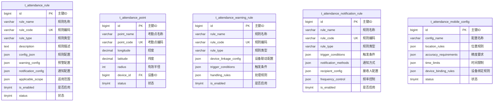

# 考勤规则配置 - 数据结构设计

> **版本**: v1.0.0  
> **创建日期**: 2025-12-17

---

## 📊 ER图



---

## 📋 表结构详细设计

### t_attendance_rule (考勤规则表)

```sql
CREATE TABLE t_attendance_rule (
    id BIGINT PRIMARY KEY AUTO_INCREMENT COMMENT '主键ID',
    rule_name VARCHAR(50) NOT NULL COMMENT '规则名称',
    rule_code VARCHAR(30) NOT NULL COMMENT '规则编码',
    rule_type VARCHAR(20) NOT NULL COMMENT '规则类型:ATTENDANCE/WARNING/NOTIFICATION',
    description TEXT COMMENT '规则描述',
    config_json JSON NOT NULL COMMENT '规则配置JSON',
    warning_config JSON COMMENT '预警配置JSON',
    notification_config JSON COMMENT '通知配置JSON',
    applicable_scope JSON COMMENT '适用范围JSON',
    is_enabled TINYINT DEFAULT 1 COMMENT '是否启用:0禁用1启用',
    status TINYINT DEFAULT 1 COMMENT '状态:0删除1正常',
    create_time DATETIME NOT NULL DEFAULT CURRENT_TIMESTAMP COMMENT '创建时间',
    update_time DATETIME NOT NULL DEFAULT CURRENT_TIMESTAMP ON UPDATE CURRENT_TIMESTAMP COMMENT '更新时间',
    UNIQUE KEY uk_rule_code (rule_code),
    INDEX idx_rule_type (rule_type),
    INDEX idx_is_enabled (is_enabled)
) ENGINE=InnoDB DEFAULT CHARSET=utf8mb4 COMMENT='考勤规则表';
```

### t_attendance_point (考勤点表)

```sql
CREATE TABLE t_attendance_point (
    id BIGINT PRIMARY KEY AUTO_INCREMENT COMMENT '主键ID',
    point_name VARCHAR(50) NOT NULL COMMENT '考勤点名称',
    point_code VARCHAR(30) NOT NULL COMMENT '考勤点编码',
    longitude DECIMAL(10,7) NOT NULL COMMENT '经度坐标',
    latitude DECIMAL(10,7) NOT NULL COMMENT '纬度坐标',
    radius INT DEFAULT 100 COMMENT '有效半径(米)',
    device_id BIGINT COMMENT '关联设备ID',
    address VARCHAR(200) COMMENT '详细地址',
    status TINYINT DEFAULT 1 COMMENT '状态:0禁用1启用',
    create_time DATETIME NOT NULL DEFAULT CURRENT_TIMESTAMP COMMENT '创建时间',
    update_time DATETIME NOT NULL DEFAULT CURRENT_TIMESTAMP ON UPDATE CURRENT_TIMESTAMP COMMENT '更新时间',
    UNIQUE KEY uk_point_code (point_code),
    INDEX idx_device_id (device_id)
) ENGINE=InnoDB DEFAULT CHARSET=utf8mb4 COMMENT='考勤点表';
```

---

## 🔧 JSON配置结构

### 考勤规则配置

```json
{
  "attendance_settings": {
    "late_tolerance_minutes": 10,
    "early_tolerance_minutes": 10,
    "absent_threshold_hours": 4,
    "min_work_hours": 8.0,
    "overtime_calculation_method": "daily",
    "weekend_overtime_multiplier": 2.0,
    "holiday_overtime_multiplier": 3.0
  },
  "work_time_rules": {
    "flexible_start_time": "08:00",
    "flexible_end_time": "20:00",
    "core_start_time": "10:00",
    "core_end_time": "16:00"
  }
}
```

### 预警配置

```json
{
  "warning_types": [
    {
      "type": "late_frequent",
      "threshold": 3,
      "time_range_days": 7,
      "level": "medium",
      "auto_actions": ["notify_employee", "notify_manager"]
    }
  ]
}
```

---

**📝 文档维护**: IOE-DREAM架构团队 | 2025-12-17
