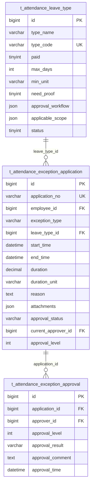
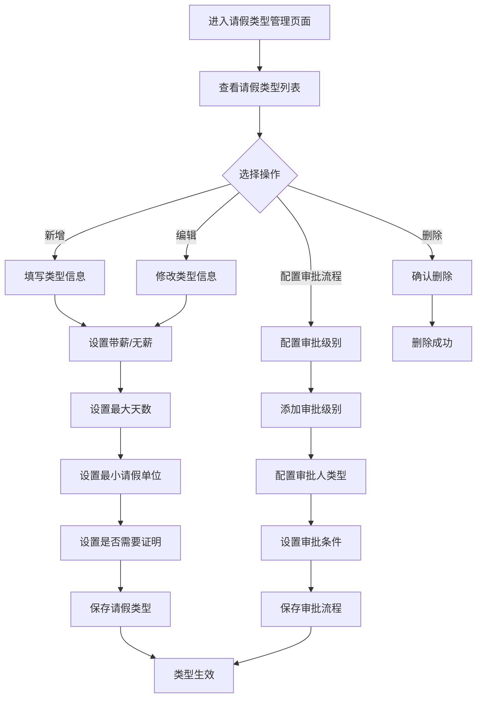
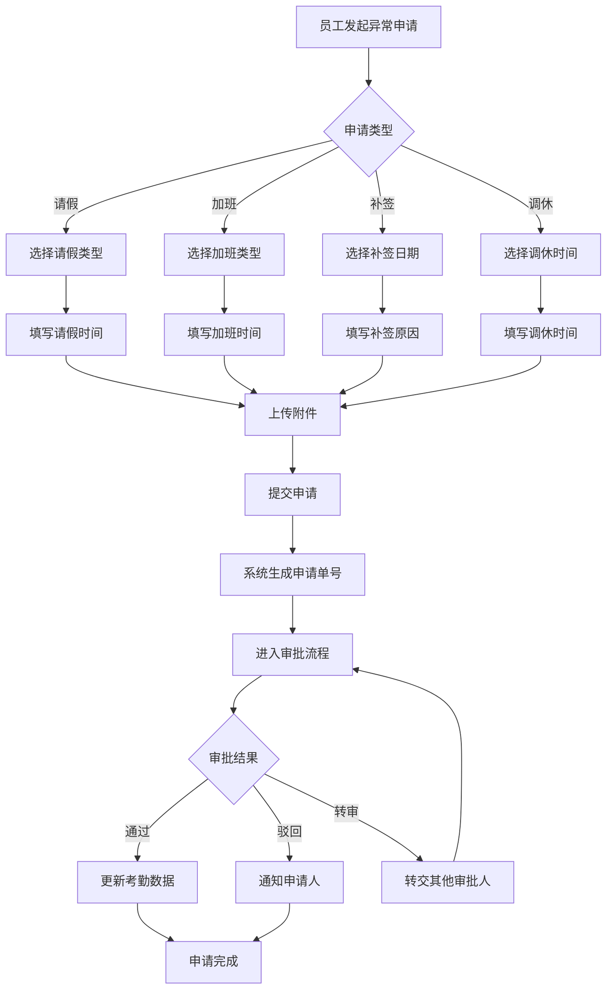
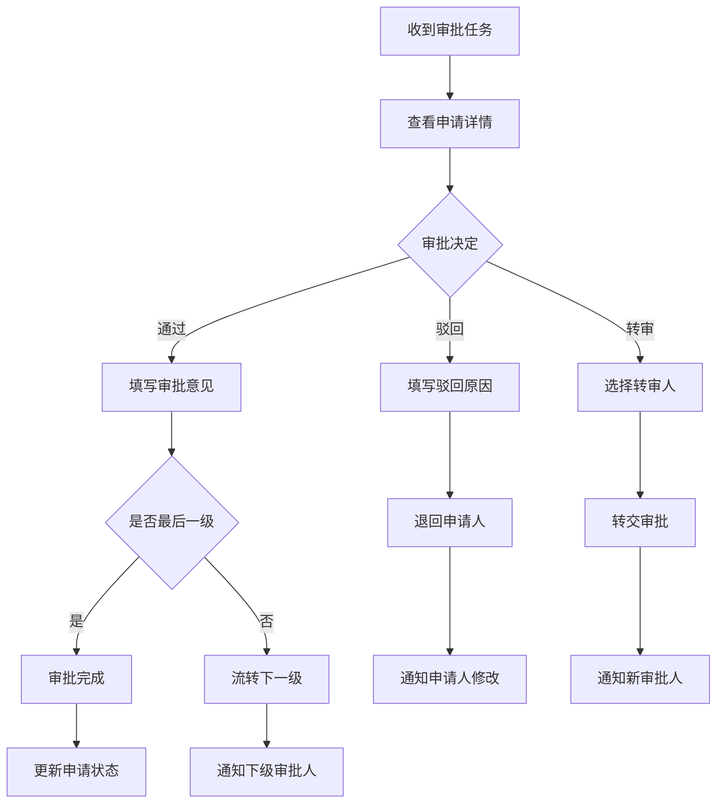

# 异常管理子模块

> **版本**: v2.0.0  
> **更新日期**: 2025-12-17  
> **所属模块**: 考勤管理模块

---

## 1. 模块概述

异常管理模块负责处理考勤过程中的各类异常情况，包括请假申请、加班申请、补签申请、调休申请等，支持完整的审批工作流。

### 1.1 核心功能

- **请假类型管理**: 定义和管理各类假期类型
- **请假申请**: 员工发起请假申请
- **加班申请**: 员工发起加班申请
- **补签申请**: 员工发起补签申请
- **调休申请**: 员工发起调休申请
- **审批管理**: 多级审批流程管理

---

## 2. 数据表设计

### 2.1 请假类型表 (t_attendance_leave_type)

```sql
CREATE TABLE t_attendance_leave_type (
    id BIGINT NOT NULL AUTO_INCREMENT COMMENT '主键ID',
    type_name VARCHAR(50) NOT NULL COMMENT '假期类型名称',
    type_code VARCHAR(50) NOT NULL COMMENT '假期类型编码',
    paid TINYINT NOT NULL DEFAULT 1 COMMENT '是否带薪',
    max_days INT COMMENT '年度最大天数',
    min_unit VARCHAR(20) NOT NULL DEFAULT 'day' COMMENT '最小请假单位',
    need_proof TINYINT NOT NULL DEFAULT 0 COMMENT '是否需要证明',
    approval_workflow JSON COMMENT '审批流程配置',
    applicable_scope JSON COMMENT '适用范围配置',
    status TINYINT NOT NULL DEFAULT 1 COMMENT '状态',
    deleted_flag TINYINT NOT NULL DEFAULT 0 COMMENT '删除标记',
    create_time DATETIME NOT NULL DEFAULT CURRENT_TIMESTAMP,
    update_time DATETIME NOT NULL DEFAULT CURRENT_TIMESTAMP ON UPDATE CURRENT_TIMESTAMP,
    PRIMARY KEY (id),
    UNIQUE KEY uk_type_code (type_code)
) ENGINE=InnoDB DEFAULT CHARSET=utf8mb4 COMMENT='请假类型表';
```

### 2.2 异常申请表 (t_attendance_exception_application)

```sql
CREATE TABLE t_attendance_exception_application (
    id BIGINT NOT NULL AUTO_INCREMENT COMMENT '主键ID',
    application_no VARCHAR(50) NOT NULL COMMENT '申请单号',
    employee_id BIGINT NOT NULL COMMENT '员工ID',
    exception_type VARCHAR(50) NOT NULL COMMENT '异常类型',
    leave_type_id BIGINT COMMENT '请假类型ID',
    start_time DATETIME NOT NULL COMMENT '开始时间',
    end_time DATETIME NOT NULL COMMENT '结束时间',
    duration DECIMAL(10,2) COMMENT '时长',
    duration_unit VARCHAR(20) DEFAULT 'hour' COMMENT '时长单位',
    reason TEXT NOT NULL COMMENT '申请原因',
    attachments JSON COMMENT '附件列表',
    approval_status VARCHAR(20) NOT NULL DEFAULT 'pending' COMMENT '审批状态',
    current_approver_id BIGINT COMMENT '当前审批人ID',
    approval_level INT DEFAULT 1 COMMENT '当前审批级别',
    deleted_flag TINYINT NOT NULL DEFAULT 0 COMMENT '删除标记',
    create_time DATETIME NOT NULL DEFAULT CURRENT_TIMESTAMP,
    update_time DATETIME NOT NULL DEFAULT CURRENT_TIMESTAMP ON UPDATE CURRENT_TIMESTAMP,
    PRIMARY KEY (id),
    UNIQUE KEY uk_application_no (application_no),
    KEY idx_employee_id (employee_id),
    KEY idx_exception_type (exception_type),
    KEY idx_approval_status (approval_status)
) ENGINE=InnoDB DEFAULT CHARSET=utf8mb4 COMMENT='异常申请表';
```

### 2.3 异常审批表 (t_attendance_exception_approval)

```sql
CREATE TABLE t_attendance_exception_approval (
    id BIGINT NOT NULL AUTO_INCREMENT COMMENT '主键ID',
    application_id BIGINT NOT NULL COMMENT '申请ID',
    approver_id BIGINT NOT NULL COMMENT '审批人ID',
    approval_level INT NOT NULL COMMENT '审批级别',
    approval_result VARCHAR(20) NOT NULL COMMENT '审批结果',
    approval_comment TEXT COMMENT '审批意见',
    approval_time DATETIME COMMENT '审批时间',
    deleted_flag TINYINT NOT NULL DEFAULT 0 COMMENT '删除标记',
    create_time DATETIME NOT NULL DEFAULT CURRENT_TIMESTAMP,
    update_time DATETIME NOT NULL DEFAULT CURRENT_TIMESTAMP ON UPDATE CURRENT_TIMESTAMP,
    PRIMARY KEY (id),
    KEY idx_application_id (application_id),
    KEY idx_approver_id (approver_id)
) ENGINE=InnoDB DEFAULT CHARSET=utf8mb4 COMMENT='异常审批表';
```

---

## 3. ER图



---

## 4. JSON配置结构

### 4.1 审批流程配置 (approval_workflow)

```json
{
  "levels": [
    {
      "level": 1,
      "name": "直属主管审批",
      "approverType": "direct_manager",
      "required": true
    },
    {
      "level": 2,
      "name": "部门经理审批",
      "approverType": "department_manager",
      "condition": "duration >= 3"
    },
    {
      "level": 3,
      "name": "HR审批",
      "approverType": "hr",
      "condition": "duration >= 7"
    }
  ],
  "autoApprove": {
    "enabled": false,
    "conditions": ["duration <= 0.5"]
  }
}
```

### 4.2 适用范围配置 (applicable_scope)

```json
{
  "type": "all",
  "departments": [],
  "positions": [],
  "employees": [],
  "excludeEmployees": [],
  "conditions": {
    "minWorkMonths": 0,
    "minWorkYears": 0
  }
}
```

---

## 5. 业务流程

### 5.1 请假类型管理流程



### 5.2 异常申请流程



### 5.3 审批流程



---

## 6. 异常类型说明

| 类型编码 | 类型名称 | 说明 |
|---------|---------|------|
| leave | 请假 | 各类假期申请 |
| overtime | 加班 | 加班时间申请 |
| makeup | 补签 | 漏打卡补签申请 |
| compensatory | 调休 | 调休时间申请 |
| business_trip | 出差 | 出差申请 |
| work_from_home | 居家办公 | 居家办公申请 |

## 7. 审批状态说明

| 状态编码 | 状态名称 | 说明 |
|---------|---------|------|
| pending | 待审批 | 等待审批人处理 |
| approved | 已通过 | 审批通过 |
| rejected | 已驳回 | 审批驳回 |
| cancelled | 已撤销 | 申请人撤销 |
| transferred | 已转审 | 转交其他人审批 |

---

## 8. API接口

### 8.1 请假类型接口

| 方法 | 路径 | 说明 |
|------|------|------|
| GET | /api/v1/attendance/leave-types | 查询请假类型列表 |
| POST | /api/v1/attendance/leave-types | 创建请假类型 |
| PUT | /api/v1/attendance/leave-types/{id} | 更新请假类型 |
| DELETE | /api/v1/attendance/leave-types/{id} | 删除请假类型 |

### 8.2 异常申请接口

| 方法 | 路径 | 说明 |
|------|------|------|
| GET | /api/v1/attendance/exception-applications | 查询申请列表 |
| POST | /api/v1/attendance/exception-applications | 创建异常申请 |
| GET | /api/v1/attendance/exception-applications/{id} | 获取申请详情 |
| PUT | /api/v1/attendance/exception-applications/{id} | 更新异常申请 |
| POST | /api/v1/attendance/exception-applications/{id}/cancel | 撤销申请 |

### 8.3 审批接口

| 方法 | 路径 | 说明 |
|------|------|------|
| GET | /api/v1/attendance/approvals/pending | 查询待审批列表 |
| POST | /api/v1/attendance/approvals/{id}/approve | 审批通过 |
| POST | /api/v1/attendance/approvals/{id}/reject | 审批驳回 |
| POST | /api/v1/attendance/approvals/{id}/transfer | 转审 |

---

## 9. 开发优先级

### P0 - 核心功能
- 请假类型CRUD
- 请假申请提交
- 基础审批流程

### P1 - 增强功能
- 加班申请
- 补签申请
- 多级审批

### P2 - 扩展功能
- 调休申请
- 出差申请
- 自定义审批流程

---

*本文档持续更新中*

