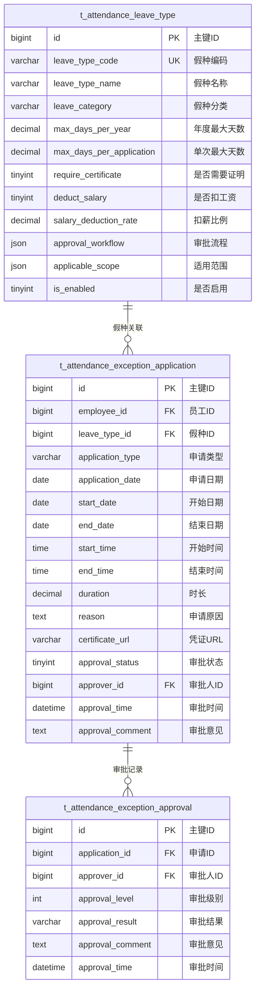

# 异常管理 - 数据结构设计

> **版本**: v1.0.0  
> **创建日期**: 2025-12-17

---

## 📊 ER图



---

## 📋 表结构详细设计

### t_attendance_leave_type (假种配置表)

```sql
CREATE TABLE t_attendance_leave_type (
    id BIGINT PRIMARY KEY AUTO_INCREMENT COMMENT '主键ID',
    leave_type_code VARCHAR(30) NOT NULL COMMENT '假种编码',
    leave_type_name VARCHAR(50) NOT NULL COMMENT '假种名称',
    leave_category VARCHAR(20) NOT NULL COMMENT '假种分类:LEGAL/WELFARE/SICK/PERSONAL',
    description TEXT COMMENT '假种描述',
    max_days_per_year DECIMAL(5,1) COMMENT '年度最大天数',
    max_days_per_application DECIMAL(5,1) COMMENT '单次申请最大天数',
    require_certificate TINYINT DEFAULT 0 COMMENT '是否需要证明:0否1是',
    certificate_types VARCHAR(200) COMMENT '证明类型',
    deduct_salary TINYINT DEFAULT 0 COMMENT '是否扣工资:0否1是',
    salary_deduction_rate DECIMAL(3,2) DEFAULT 0 COMMENT '扣薪比例',
    approval_workflow JSON COMMENT '审批流程配置',
    applicable_scope JSON COMMENT '适用范围',
    is_enabled TINYINT DEFAULT 1 COMMENT '是否启用',
    status TINYINT DEFAULT 1 COMMENT '状态',
    create_time DATETIME NOT NULL DEFAULT CURRENT_TIMESTAMP,
    update_time DATETIME NOT NULL DEFAULT CURRENT_TIMESTAMP ON UPDATE CURRENT_TIMESTAMP,
    UNIQUE KEY uk_leave_type_code (leave_type_code)
) ENGINE=InnoDB DEFAULT CHARSET=utf8mb4 COMMENT='假种配置表';
```

### t_attendance_exception_application (异常申请表)

```sql
CREATE TABLE t_attendance_exception_application (
    id BIGINT PRIMARY KEY AUTO_INCREMENT COMMENT '主键ID',
    employee_id BIGINT NOT NULL COMMENT '员工ID',
    leave_type_id BIGINT COMMENT '假种ID',
    application_type VARCHAR(20) NOT NULL COMMENT '申请类型:LEAVE/OVERTIME/SUPPLEMENT/TRANSFER/CANCEL',
    application_date DATE NOT NULL COMMENT '申请日期',
    start_date DATE NOT NULL COMMENT '开始日期',
    end_date DATE NOT NULL COMMENT '结束日期',
    start_time TIME COMMENT '开始时间',
    end_time TIME COMMENT '结束时间',
    duration DECIMAL(5,2) NOT NULL COMMENT '时长',
    reason TEXT NOT NULL COMMENT '申请原因',
    certificate_url VARCHAR(500) COMMENT '凭证文件URL',
    approval_status TINYINT DEFAULT 0 COMMENT '审批状态:0待审批1已通过2已拒绝3已撤销',
    approver_id BIGINT COMMENT '审批人ID',
    approval_time DATETIME COMMENT '审批时间',
    approval_comment TEXT COMMENT '审批意见',
    overtime_type VARCHAR(20) COMMENT '加班类型',
    original_application_id BIGINT COMMENT '原申请ID(销假用)',
    status TINYINT DEFAULT 1 COMMENT '状态',
    create_time DATETIME NOT NULL DEFAULT CURRENT_TIMESTAMP,
    update_time DATETIME NOT NULL DEFAULT CURRENT_TIMESTAMP ON UPDATE CURRENT_TIMESTAMP,
    INDEX idx_employee_id (employee_id),
    INDEX idx_application_type (application_type),
    INDEX idx_approval_status (approval_status),
    INDEX idx_start_date (start_date)
) ENGINE=InnoDB DEFAULT CHARSET=utf8mb4 COMMENT='异常申请表';
```

### t_attendance_exception_approval (异常审批表)

```sql
CREATE TABLE t_attendance_exception_approval (
    id BIGINT PRIMARY KEY AUTO_INCREMENT COMMENT '主键ID',
    application_id BIGINT NOT NULL COMMENT '申请ID',
    approver_id BIGINT NOT NULL COMMENT '审批人ID',
    approval_level INT NOT NULL COMMENT '审批级别',
    approval_result VARCHAR(20) NOT NULL COMMENT '审批结果:APPROVED/REJECTED',
    approval_comment TEXT COMMENT '审批意见',
    approval_time DATETIME NOT NULL DEFAULT CURRENT_TIMESTAMP COMMENT '审批时间',
    status TINYINT DEFAULT 1 COMMENT '状态',
    create_time DATETIME NOT NULL DEFAULT CURRENT_TIMESTAMP,
    INDEX idx_application_id (application_id),
    INDEX idx_approver_id (approver_id)
) ENGINE=InnoDB DEFAULT CHARSET=utf8mb4 COMMENT='异常审批表';
```

---

## 🔧 审批流程JSON配置

```json
{
  "workflow_name": "病假审批流程",
  "approval_levels": [
    {
      "level": 1,
      "approver_type": "direct_manager",
      "required": true,
      "time_limit_hours": 24,
      "conditions": {
        "max_duration_days": 3
      }
    },
    {
      "level": 2,
      "approver_type": "hr_manager",
      "required": false,
      "conditions": {
        "duration_days_gte": 3
      }
    }
  ]
}
```

---

**📝 文档维护**: IOE-DREAM架构团队 | 2025-12-17
