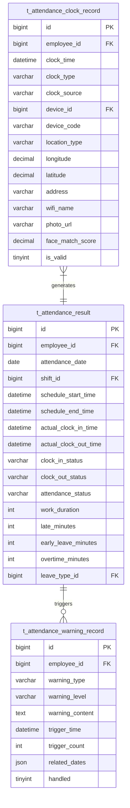
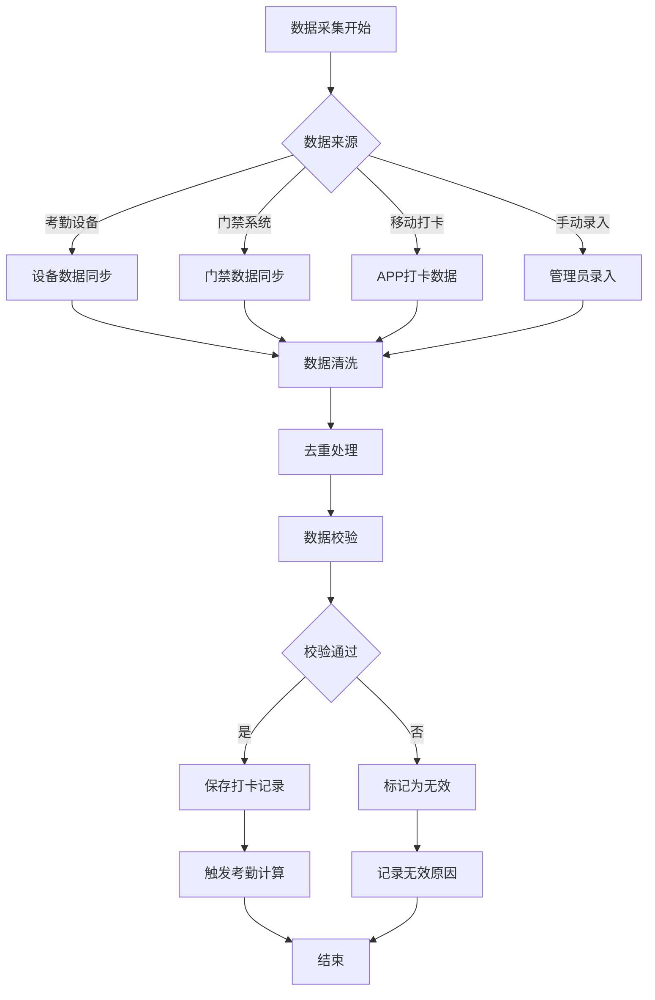
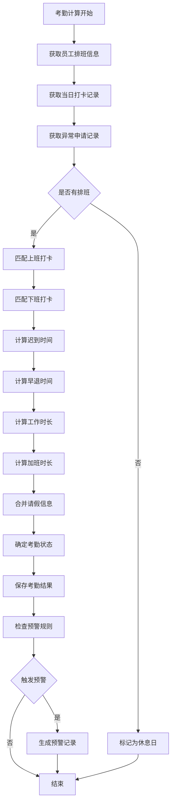
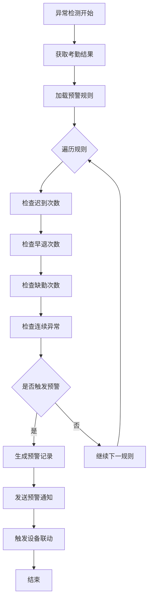

# 考勤数据采集与计算子模块

> **版本**: v2.0.0  
> **更新日期**: 2025-12-17  
> **所属模块**: 考勤管理模块

---

## 1. 模块概述

考勤数据采集与计算模块负责从各类考勤设备采集打卡数据，并根据考勤规则自动计算考勤结果，是考勤系统的核心数据处理模块。

### 1.1 核心功能

- **打卡数据采集**: 从门禁、考勤机等设备采集打卡记录
- **数据清洗**: 去重、校验、补全打卡数据
- **考勤计算**: 根据排班和规则计算考勤结果
- **异常检测**: 自动检测考勤异常并预警
- **数据分表**: 支持按月/年分表存储大数据量

---

## 2. 数据表设计

### 2.1 打卡记录表 (t_attendance_clock_record)

```sql
CREATE TABLE t_attendance_clock_record (
    id BIGINT NOT NULL AUTO_INCREMENT COMMENT '主键ID',
    employee_id BIGINT NOT NULL COMMENT '员工ID',
    clock_time DATETIME NOT NULL COMMENT '打卡时间',
    clock_type VARCHAR(20) NOT NULL COMMENT '打卡类型',
    clock_source VARCHAR(50) NOT NULL COMMENT '打卡来源',
    device_id BIGINT COMMENT '设备ID',
    device_code VARCHAR(50) COMMENT '设备编码',
    location_type VARCHAR(20) COMMENT '位置类型',
    longitude DECIMAL(10,7) COMMENT '经度',
    latitude DECIMAL(10,7) COMMENT '纬度',
    address VARCHAR(255) COMMENT '打卡地址',
    wifi_name VARCHAR(100) COMMENT 'WiFi名称',
    wifi_mac VARCHAR(50) COMMENT 'WiFi MAC地址',
    photo_url VARCHAR(500) COMMENT '打卡照片URL',
    face_match_score DECIMAL(5,2) COMMENT '人脸匹配分数',
    remark VARCHAR(500) COMMENT '备注',
    is_valid TINYINT NOT NULL DEFAULT 1 COMMENT '是否有效',
    invalid_reason VARCHAR(255) COMMENT '无效原因',
    deleted_flag TINYINT NOT NULL DEFAULT 0 COMMENT '删除标记',
    create_time DATETIME NOT NULL DEFAULT CURRENT_TIMESTAMP,
    update_time DATETIME NOT NULL DEFAULT CURRENT_TIMESTAMP ON UPDATE CURRENT_TIMESTAMP,
    PRIMARY KEY (id),
    KEY idx_employee_clock_time (employee_id, clock_time),
    KEY idx_clock_time (clock_time),
    KEY idx_device_id (device_id)
) ENGINE=InnoDB DEFAULT CHARSET=utf8mb4 COMMENT='打卡记录表';
```

### 2.2 考勤结果表 (t_attendance_result)

```sql
CREATE TABLE t_attendance_result (
    id BIGINT NOT NULL AUTO_INCREMENT COMMENT '主键ID',
    employee_id BIGINT NOT NULL COMMENT '员工ID',
    attendance_date DATE NOT NULL COMMENT '考勤日期',
    shift_id BIGINT COMMENT '班次ID',
    schedule_start_time DATETIME COMMENT '应上班时间',
    schedule_end_time DATETIME COMMENT '应下班时间',
    actual_clock_in_time DATETIME COMMENT '实际上班打卡时间',
    actual_clock_out_time DATETIME COMMENT '实际下班打卡时间',
    clock_in_status VARCHAR(20) COMMENT '上班打卡状态',
    clock_out_status VARCHAR(20) COMMENT '下班打卡状态',
    attendance_status VARCHAR(20) NOT NULL COMMENT '考勤状态',
    work_duration INT COMMENT '工作时长(分钟)',
    late_minutes INT DEFAULT 0 COMMENT '迟到分钟数',
    early_leave_minutes INT DEFAULT 0 COMMENT '早退分钟数',
    overtime_minutes INT DEFAULT 0 COMMENT '加班分钟数',
    leave_type_id BIGINT COMMENT '请假类型ID',
    leave_duration DECIMAL(10,2) COMMENT '请假时长',
    exception_type VARCHAR(50) COMMENT '异常类型',
    exception_handled TINYINT DEFAULT 0 COMMENT '异常是否已处理',
    remark VARCHAR(500) COMMENT '备注',
    deleted_flag TINYINT NOT NULL DEFAULT 0 COMMENT '删除标记',
    create_time DATETIME NOT NULL DEFAULT CURRENT_TIMESTAMP,
    update_time DATETIME NOT NULL DEFAULT CURRENT_TIMESTAMP ON UPDATE CURRENT_TIMESTAMP,
    PRIMARY KEY (id),
    UNIQUE KEY uk_employee_date (employee_id, attendance_date),
    KEY idx_attendance_date (attendance_date),
    KEY idx_attendance_status (attendance_status)
) ENGINE=InnoDB DEFAULT CHARSET=utf8mb4 COMMENT='考勤结果表';
```

### 2.3 考勤预警记录表 (t_attendance_warning_record)

```sql
CREATE TABLE t_attendance_warning_record (
    id BIGINT NOT NULL AUTO_INCREMENT COMMENT '主键ID',
    employee_id BIGINT NOT NULL COMMENT '员工ID',
    warning_type VARCHAR(50) NOT NULL COMMENT '预警类型',
    warning_level VARCHAR(20) NOT NULL COMMENT '预警级别',
    warning_content TEXT NOT NULL COMMENT '预警内容',
    trigger_time DATETIME NOT NULL COMMENT '触发时间',
    trigger_count INT DEFAULT 1 COMMENT '触发次数',
    statistic_period VARCHAR(20) COMMENT '统计周期',
    related_dates JSON COMMENT '相关日期列表',
    handled TINYINT NOT NULL DEFAULT 0 COMMENT '是否已处理',
    handle_time DATETIME COMMENT '处理时间',
    handle_result VARCHAR(500) COMMENT '处理结果',
    deleted_flag TINYINT NOT NULL DEFAULT 0 COMMENT '删除标记',
    create_time DATETIME NOT NULL DEFAULT CURRENT_TIMESTAMP,
    update_time DATETIME NOT NULL DEFAULT CURRENT_TIMESTAMP ON UPDATE CURRENT_TIMESTAMP,
    PRIMARY KEY (id),
    KEY idx_employee_id (employee_id),
    KEY idx_warning_type (warning_type),
    KEY idx_trigger_time (trigger_time)
) ENGINE=InnoDB DEFAULT CHARSET=utf8mb4 COMMENT='考勤预警记录表';
```

---

## 3. ER图



---

## 4. 打卡类型与状态说明

### 4.1 打卡类型 (clock_type)

| 类型编码 | 类型名称 | 说明 |
|---------|---------|------|
| clock_in | 上班打卡 | 上班签到 |
| clock_out | 下班打卡 | 下班签退 |
| break_start | 休息开始 | 午休开始 |
| break_end | 休息结束 | 午休结束 |
| overtime_start | 加班开始 | 加班签到 |
| overtime_end | 加班结束 | 加班签退 |

### 4.2 打卡来源 (clock_source)

| 来源编码 | 来源名称 | 说明 |
|---------|---------|------|
| device | 考勤设备 | 考勤机打卡 |
| access | 门禁设备 | 门禁刷卡 |
| mobile | 移动打卡 | APP打卡 |
| web | 网页打卡 | PC端打卡 |
| makeup | 补签 | 补签记录 |
| import | 导入 | 数据导入 |

### 4.3 考勤状态 (attendance_status)

| 状态编码 | 状态名称 | 说明 |
|---------|---------|------|
| normal | 正常 | 正常出勤 |
| late | 迟到 | 迟到 |
| early_leave | 早退 | 早退 |
| absent | 缺勤 | 未打卡 |
| leave | 请假 | 请假 |
| business_trip | 出差 | 出差 |
| rest | 休息 | 休息日 |
| holiday | 节假日 | 节假日 |
| overtime | 加班 | 加班 |

---

## 5. 业务流程

### 5.1 考勤数据采集流程



### 5.2 考勤计算流程



### 5.3 异常检测流程



---

## 6. 计算算法

### 6.1 迟到计算

```
迟到分钟数 = 实际上班打卡时间 - 应上班时间
如果 迟到分钟数 <= 0，则迟到分钟数 = 0
如果 迟到分钟数 > 缺勤阈值，则标记为缺勤
```

### 6.2 早退计算

```
早退分钟数 = 应下班时间 - 实际下班打卡时间
如果 早退分钟数 <= 0，则早退分钟数 = 0
如果 早退分钟数 > 缺勤阈值，则标记为缺勤
```

### 6.3 工作时长计算

```
工作时长 = 实际下班打卡时间 - 实际上班打卡时间 - 午休时长
如果 工作时长 < 0，则工作时长 = 0
```

### 6.4 加班时长计算

```
如果 实际下班打卡时间 > 应下班时间 + 加班起算阈值：
    加班时长 = 实际下班打卡时间 - 应下班时间
    如果 加班时长 > 最大日加班时长：
        加班时长 = 最大日加班时长
```

---

## 7. 数据分表策略

### 7.1 分表规则

| 表名 | 分表策略 | 分表键 | 说明 |
|------|---------|--------|------|
| t_attendance_clock_record | 按月分表 | clock_time | t_attendance_clock_record_202501 |
| t_attendance_result | 按月分表 | attendance_date | t_attendance_result_202501 |
| t_attendance_warning_record | 按年分表 | trigger_time | t_attendance_warning_record_2025 |

### 7.2 分表实现

```sql
-- 创建分表示例
CREATE TABLE t_attendance_clock_record_202501 LIKE t_attendance_clock_record;

-- 分表路由（应用层实现）
-- 根据 clock_time 的年月确定目标表
```

---

## 8. API接口

### 8.1 打卡记录接口

| 方法 | 路径 | 说明 |
|------|------|------|
| GET | /api/v1/attendance/clock-records | 查询打卡记录 |
| POST | /api/v1/attendance/clock-records | 新增打卡记录 |
| POST | /api/v1/attendance/clock-records/sync | 同步设备打卡数据 |
| GET | /api/v1/attendance/clock-records/employee/{employeeId} | 查询员工打卡记录 |

### 8.2 考勤结果接口

| 方法 | 路径 | 说明 |
|------|------|------|
| GET | /api/v1/attendance/results | 查询考勤结果 |
| GET | /api/v1/attendance/results/employee/{employeeId} | 查询员工考勤结果 |
| POST | /api/v1/attendance/results/calculate | 触发考勤计算 |
| POST | /api/v1/attendance/results/recalculate | 重新计算考勤 |

### 8.3 预警记录接口

| 方法 | 路径 | 说明 |
|------|------|------|
| GET | /api/v1/attendance/warnings | 查询预警记录 |
| PUT | /api/v1/attendance/warnings/{id}/handle | 处理预警 |
| GET | /api/v1/attendance/warnings/statistics | 预警统计 |

---

## 9. 开发优先级

### P0 - 核心功能
- 打卡数据采集
- 考勤结果计算
- 基础异常检测

### P1 - 增强功能
- 多设备数据同步
- 预警规则配置
- 考勤重算

### P2 - 扩展功能
- 数据分表
- 高级预警联动
- 批量数据处理

---

*本文档持续更新中*

