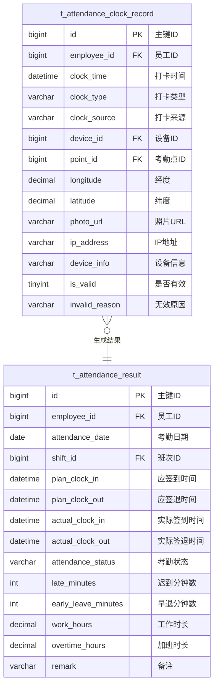

# 考勤数据采集与计算 - 数据结构设计

> **版本**: v1.0.0  
> **创建日期**: 2025-12-17

---

## 📊 ER图



---

## 📋 表结构详细设计

### t_attendance_clock_record (打卡记录表)

```sql
CREATE TABLE t_attendance_clock_record (
    id BIGINT PRIMARY KEY AUTO_INCREMENT COMMENT '主键ID',
    employee_id BIGINT NOT NULL COMMENT '员工ID',
    clock_time DATETIME NOT NULL COMMENT '打卡时间',
    clock_type VARCHAR(20) NOT NULL COMMENT '打卡类型:CLOCK_IN/CLOCK_OUT/GO_OUT/COME_BACK',
    clock_source VARCHAR(20) NOT NULL COMMENT '打卡来源:DEVICE/MOBILE/WEB/MANUAL',
    device_id BIGINT COMMENT '设备ID',
    point_id BIGINT COMMENT '考勤点ID',
    longitude DECIMAL(10,7) COMMENT '经度',
    latitude DECIMAL(10,7) COMMENT '纬度',
    location_accuracy INT COMMENT '定位精度(米)',
    photo_url VARCHAR(500) COMMENT '打卡照片URL',
    ip_address VARCHAR(50) COMMENT 'IP地址',
    device_info VARCHAR(200) COMMENT '设备信息',
    is_valid TINYINT DEFAULT 1 COMMENT '是否有效:0无效1有效',
    invalid_reason VARCHAR(100) COMMENT '无效原因',
    raw_data JSON COMMENT '原始数据',
    create_time DATETIME NOT NULL DEFAULT CURRENT_TIMESTAMP COMMENT '创建时间',
    INDEX idx_employee_time (employee_id, clock_time),
    INDEX idx_clock_time (clock_time),
    INDEX idx_device_id (device_id)
) ENGINE=InnoDB DEFAULT CHARSET=utf8mb4 COMMENT='打卡记录表';
```

### t_attendance_result (考勤结果表)

```sql
CREATE TABLE t_attendance_result (
    id BIGINT PRIMARY KEY AUTO_INCREMENT COMMENT '主键ID',
    employee_id BIGINT NOT NULL COMMENT '员工ID',
    attendance_date DATE NOT NULL COMMENT '考勤日期',
    shift_id BIGINT COMMENT '班次ID',
    schedule_id BIGINT COMMENT '排班ID',
    plan_clock_in DATETIME COMMENT '应签到时间',
    plan_clock_out DATETIME COMMENT '应签退时间',
    actual_clock_in DATETIME COMMENT '实际签到时间',
    actual_clock_out DATETIME COMMENT '实际签退时间',
    clock_in_record_id BIGINT COMMENT '签到记录ID',
    clock_out_record_id BIGINT COMMENT '签退记录ID',
    attendance_status VARCHAR(20) NOT NULL COMMENT '考勤状态:NORMAL/LATE/EARLY_LEAVE/ABSENT/LEAVE/OVERTIME',
    late_minutes INT DEFAULT 0 COMMENT '迟到分钟数',
    early_leave_minutes INT DEFAULT 0 COMMENT '早退分钟数',
    absent_hours DECIMAL(4,2) DEFAULT 0 COMMENT '缺勤小时数',
    work_hours DECIMAL(4,2) DEFAULT 0 COMMENT '工作时长',
    overtime_hours DECIMAL(4,2) DEFAULT 0 COMMENT '加班时长',
    leave_hours DECIMAL(4,2) DEFAULT 0 COMMENT '请假时长',
    exception_type VARCHAR(50) COMMENT '异常类型',
    exception_reason VARCHAR(200) COMMENT '异常原因',
    is_calculated TINYINT DEFAULT 0 COMMENT '是否已计算',
    calculate_time DATETIME COMMENT '计算时间',
    remark VARCHAR(200) COMMENT '备注',
    create_time DATETIME NOT NULL DEFAULT CURRENT_TIMESTAMP COMMENT '创建时间',
    update_time DATETIME NOT NULL DEFAULT CURRENT_TIMESTAMP ON UPDATE CURRENT_TIMESTAMP COMMENT '更新时间',
    UNIQUE KEY uk_employee_date (employee_id, attendance_date),
    INDEX idx_attendance_date (attendance_date),
    INDEX idx_attendance_status (attendance_status)
) ENGINE=InnoDB DEFAULT CHARSET=utf8mb4 COMMENT='考勤结果表';
```

---

## 🔧 考勤状态枚举

| 状态码 | 名称 | 说明 |
|--------|------|------|
| NORMAL | 正常 | 正常出勤 |
| LATE | 迟到 | 上班迟到 |
| EARLY_LEAVE | 早退 | 下班早退 |
| LATE_EARLY | 迟到早退 | 同时迟到和早退 |
| ABSENT | 旷工 | 无故缺勤 |
| LEAVE | 请假 | 已批准请假 |
| OVERTIME | 加班 | 加班出勤 |
| BUSINESS_TRIP | 出差 | 外出出差 |
| REST | 休息 | 休息日/节假日 |
| NO_SCHEDULE | 无排班 | 当日无排班 |

---

**📝 文档维护**: IOE-DREAM架构团队 | 2025-12-17
