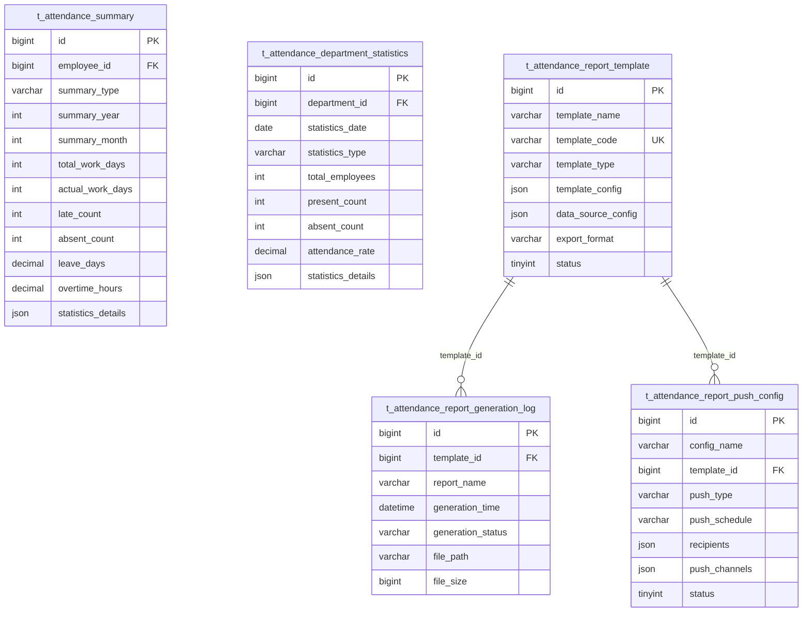
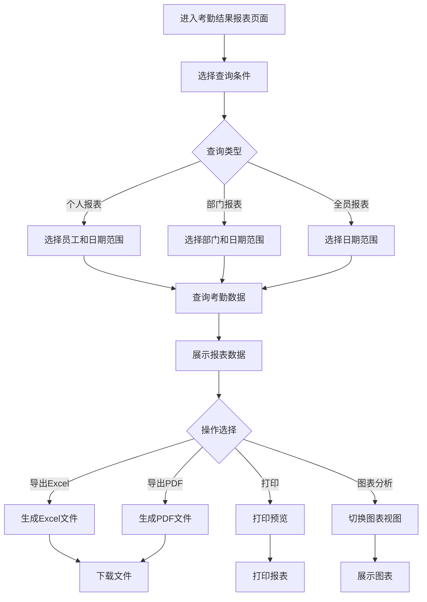
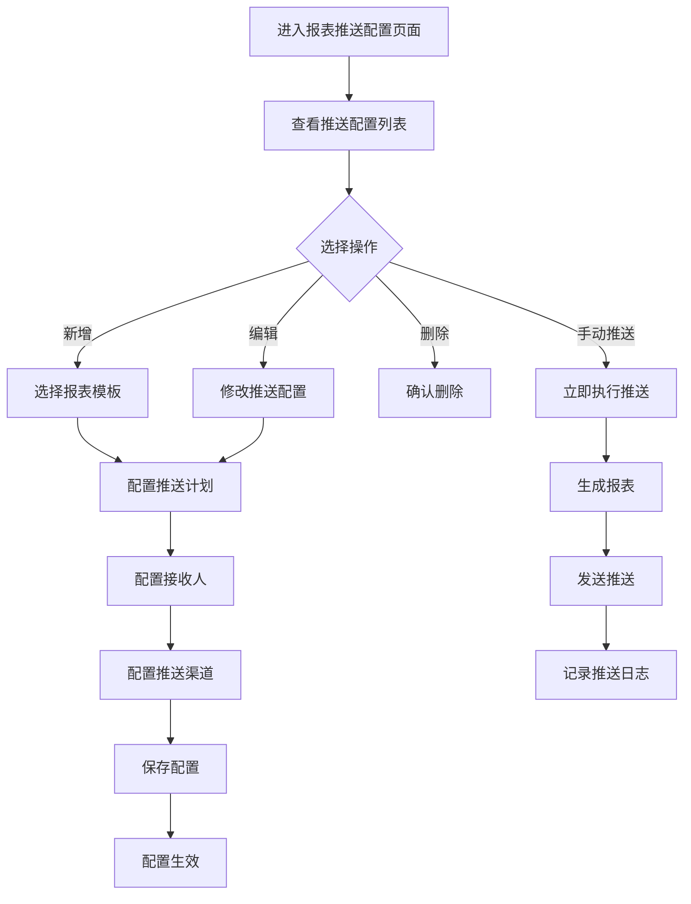

# 考勤汇总报表子模块

> **版本**: v2.0.0  
> **更新日期**: 2025-12-17  
> **所属模块**: 考勤管理模块

---

## 1. 模块概述

考勤汇总报表模块负责对考勤数据进行统计分析，生成各类报表，支持多维度数据展示和导出，为管理决策提供数据支持。

### 1.1 核心功能

- **个人考勤汇总**: 员工个人考勤统计
- **部门考勤汇总**: 部门级别考勤统计
- **考勤异常报表**: 异常情况统计分析
- **报表模板管理**: 自定义报表模板
- **报表推送配置**: 定时推送报表

---

## 2. 数据表设计

### 2.1 考勤汇总表 (t_attendance_summary)

```sql
CREATE TABLE t_attendance_summary (
    id BIGINT NOT NULL AUTO_INCREMENT COMMENT '主键ID',
    employee_id BIGINT NOT NULL COMMENT '员工ID',
    summary_type VARCHAR(20) NOT NULL COMMENT '汇总类型',
    summary_year INT NOT NULL COMMENT '汇总年份',
    summary_month INT COMMENT '汇总月份',
    summary_week INT COMMENT '汇总周次',
    total_work_days INT DEFAULT 0 COMMENT '应出勤天数',
    actual_work_days INT DEFAULT 0 COMMENT '实际出勤天数',
    late_count INT DEFAULT 0 COMMENT '迟到次数',
    late_minutes INT DEFAULT 0 COMMENT '迟到总分钟数',
    early_leave_count INT DEFAULT 0 COMMENT '早退次数',
    early_leave_minutes INT DEFAULT 0 COMMENT '早退总分钟数',
    absent_count INT DEFAULT 0 COMMENT '缺勤次数',
    leave_days DECIMAL(10,2) DEFAULT 0 COMMENT '请假天数',
    overtime_hours DECIMAL(10,2) DEFAULT 0 COMMENT '加班小时数',
    business_trip_days INT DEFAULT 0 COMMENT '出差天数',
    statistics_details JSON COMMENT '详细统计数据',
    deleted_flag TINYINT NOT NULL DEFAULT 0 COMMENT '删除标记',
    create_time DATETIME NOT NULL DEFAULT CURRENT_TIMESTAMP,
    update_time DATETIME NOT NULL DEFAULT CURRENT_TIMESTAMP ON UPDATE CURRENT_TIMESTAMP,
    PRIMARY KEY (id),
    UNIQUE KEY uk_employee_period (employee_id, summary_type, summary_year, summary_month),
    KEY idx_summary_year_month (summary_year, summary_month)
) ENGINE=InnoDB DEFAULT CHARSET=utf8mb4 COMMENT='考勤汇总表';
```

### 2.2 部门考勤统计表 (t_attendance_department_statistics)

```sql
CREATE TABLE t_attendance_department_statistics (
    id BIGINT NOT NULL AUTO_INCREMENT COMMENT '主键ID',
    department_id BIGINT NOT NULL COMMENT '部门ID',
    statistics_date DATE NOT NULL COMMENT '统计日期',
    statistics_type VARCHAR(20) NOT NULL COMMENT '统计类型',
    total_employees INT DEFAULT 0 COMMENT '部门总人数',
    present_count INT DEFAULT 0 COMMENT '出勤人数',
    absent_count INT DEFAULT 0 COMMENT '缺勤人数',
    late_count INT DEFAULT 0 COMMENT '迟到人数',
    early_leave_count INT DEFAULT 0 COMMENT '早退人数',
    leave_count INT DEFAULT 0 COMMENT '请假人数',
    overtime_count INT DEFAULT 0 COMMENT '加班人数',
    attendance_rate DECIMAL(5,2) DEFAULT 0 COMMENT '出勤率',
    statistics_details JSON COMMENT '详细统计数据',
    deleted_flag TINYINT NOT NULL DEFAULT 0 COMMENT '删除标记',
    create_time DATETIME NOT NULL DEFAULT CURRENT_TIMESTAMP,
    update_time DATETIME NOT NULL DEFAULT CURRENT_TIMESTAMP ON UPDATE CURRENT_TIMESTAMP,
    PRIMARY KEY (id),
    UNIQUE KEY uk_dept_date_type (department_id, statistics_date, statistics_type),
    KEY idx_statistics_date (statistics_date)
) ENGINE=InnoDB DEFAULT CHARSET=utf8mb4 COMMENT='部门考勤统计表';
```

### 2.3 报表模板表 (t_attendance_report_template)

```sql
CREATE TABLE t_attendance_report_template (
    id BIGINT NOT NULL AUTO_INCREMENT COMMENT '主键ID',
    template_name VARCHAR(100) NOT NULL COMMENT '模板名称',
    template_code VARCHAR(50) NOT NULL COMMENT '模板编码',
    template_type VARCHAR(50) NOT NULL COMMENT '模板类型',
    template_config JSON NOT NULL COMMENT '模板配置',
    data_source_config JSON COMMENT '数据源配置',
    export_format VARCHAR(20) DEFAULT 'xlsx' COMMENT '导出格式',
    status TINYINT NOT NULL DEFAULT 1 COMMENT '状态',
    deleted_flag TINYINT NOT NULL DEFAULT 0 COMMENT '删除标记',
    create_time DATETIME NOT NULL DEFAULT CURRENT_TIMESTAMP,
    update_time DATETIME NOT NULL DEFAULT CURRENT_TIMESTAMP ON UPDATE CURRENT_TIMESTAMP,
    PRIMARY KEY (id),
    UNIQUE KEY uk_template_code (template_code)
) ENGINE=InnoDB DEFAULT CHARSET=utf8mb4 COMMENT='报表模板表';
```

### 2.4 报表生成日志表 (t_attendance_report_generation_log)

```sql
CREATE TABLE t_attendance_report_generation_log (
    id BIGINT NOT NULL AUTO_INCREMENT COMMENT '主键ID',
    template_id BIGINT NOT NULL COMMENT '模板ID',
    report_name VARCHAR(200) NOT NULL COMMENT '报表名称',
    generation_time DATETIME NOT NULL COMMENT '生成时间',
    generation_status VARCHAR(20) NOT NULL COMMENT '生成状态',
    file_path VARCHAR(500) COMMENT '文件路径',
    file_size BIGINT COMMENT '文件大小(字节)',
    error_message TEXT COMMENT '错误信息',
    operator_id BIGINT COMMENT '操作人ID',
    deleted_flag TINYINT NOT NULL DEFAULT 0 COMMENT '删除标记',
    create_time DATETIME NOT NULL DEFAULT CURRENT_TIMESTAMP,
    update_time DATETIME NOT NULL DEFAULT CURRENT_TIMESTAMP ON UPDATE CURRENT_TIMESTAMP,
    PRIMARY KEY (id),
    KEY idx_template_id (template_id),
    KEY idx_generation_time (generation_time)
) ENGINE=InnoDB DEFAULT CHARSET=utf8mb4 COMMENT='报表生成日志表';
```

### 2.5 报表推送配置表 (t_attendance_report_push_config)

```sql
CREATE TABLE t_attendance_report_push_config (
    id BIGINT NOT NULL AUTO_INCREMENT COMMENT '主键ID',
    config_name VARCHAR(100) NOT NULL COMMENT '配置名称',
    template_id BIGINT NOT NULL COMMENT '报表模板ID',
    push_type VARCHAR(50) NOT NULL COMMENT '推送类型',
    push_schedule VARCHAR(100) NOT NULL COMMENT '推送计划(Cron表达式)',
    recipients JSON NOT NULL COMMENT '接收人配置',
    push_channels JSON NOT NULL COMMENT '推送渠道',
    last_push_time DATETIME COMMENT '最后推送时间',
    next_push_time DATETIME COMMENT '下次推送时间',
    status TINYINT NOT NULL DEFAULT 1 COMMENT '状态',
    deleted_flag TINYINT NOT NULL DEFAULT 0 COMMENT '删除标记',
    create_time DATETIME NOT NULL DEFAULT CURRENT_TIMESTAMP,
    update_time DATETIME NOT NULL DEFAULT CURRENT_TIMESTAMP ON UPDATE CURRENT_TIMESTAMP,
    PRIMARY KEY (id),
    KEY idx_template_id (template_id)
) ENGINE=InnoDB DEFAULT CHARSET=utf8mb4 COMMENT='报表推送配置表';
```

---

## 3. ER图



---

## 4. JSON配置结构

### 4.1 详细统计数据 (statistics_details)

```json
{
  "leaveDetails": {
    "annual": 2.0,
    "sick": 1.0,
    "personal": 0.5,
    "marriage": 0,
    "maternity": 0
  },
  "overtimeDetails": {
    "weekday": 10.5,
    "weekend": 8.0,
    "holiday": 0
  },
  "exceptionDetails": {
    "lateDetails": [
      {"date": "2025-01-05", "minutes": 15},
      {"date": "2025-01-12", "minutes": 30}
    ],
    "earlyLeaveDetails": []
  }
}
```

### 4.2 模板配置 (template_config)

```json
{
  "columns": [
    {"field": "employeeName", "title": "员工姓名", "width": 100},
    {"field": "department", "title": "部门", "width": 120},
    {"field": "totalWorkDays", "title": "应出勤天数", "width": 80},
    {"field": "actualWorkDays", "title": "实际出勤天数", "width": 80},
    {"field": "lateCount", "title": "迟到次数", "width": 60},
    {"field": "earlyLeaveCount", "title": "早退次数", "width": 60},
    {"field": "absentCount", "title": "缺勤次数", "width": 60},
    {"field": "leaveDays", "title": "请假天数", "width": 80},
    {"field": "overtimeHours", "title": "加班小时", "width": 80},
    {"field": "attendanceRate", "title": "出勤率", "width": 80}
  ],
  "filters": [
    {"field": "department", "type": "select", "label": "部门"},
    {"field": "dateRange", "type": "dateRange", "label": "日期范围"}
  ],
  "groupBy": ["department"],
  "orderBy": [{"field": "employeeName", "order": "asc"}]
}
```

### 4.3 数据源配置 (data_source_config)

```json
{
  "type": "attendance_summary",
  "table": "t_attendance_summary",
  "joins": [
    {"table": "t_common_employee", "on": "employee_id", "fields": ["name", "department_id"]}
  ],
  "conditions": {
    "summaryType": "monthly",
    "dateRange": "current_month"
  }
}
```

### 4.4 接收人配置 (recipients)

```json
{
  "type": "dynamic",
  "rules": [
    {"role": "department_manager", "scope": "own_department"},
    {"role": "hr", "scope": "all"},
    {"userId": [1001, 1002], "scope": "specific"}
  ]
}
```

### 4.5 推送渠道配置 (push_channels)

```json
{
  "email": {
    "enabled": true,
    "subject": "考勤月报 - ${month}",
    "template": "attendance_monthly_report"
  },
  "dingding": {
    "enabled": true,
    "webhookUrl": "https://oapi.dingtalk.com/robot/send?access_token=xxx"
  },
  "wechat": {
    "enabled": false
  }
}
```

---

## 5. 业务流程

### 5.1 考勤结果报表流程



### 5.2 报表推送配置流程



---

## 6. 报表类型说明

| 报表类型 | 说明 | 数据周期 |
|---------|------|---------|
| daily | 日报 | 每日 |
| weekly | 周报 | 每周 |
| monthly | 月报 | 每月 |
| quarterly | 季报 | 每季度 |
| yearly | 年报 | 每年 |

---

## 7. API接口

### 7.1 考勤汇总接口

| 方法 | 路径 | 说明 |
|------|------|------|
| GET | /api/v1/attendance/summaries | 查询考勤汇总 |
| GET | /api/v1/attendance/summaries/employee/{employeeId} | 查询员工汇总 |
| POST | /api/v1/attendance/summaries/generate | 生成考勤汇总 |
| GET | /api/v1/attendance/summaries/export | 导出考勤汇总 |

### 7.2 部门统计接口

| 方法 | 路径 | 说明 |
|------|------|------|
| GET | /api/v1/attendance/department-statistics | 查询部门统计 |
| GET | /api/v1/attendance/department-statistics/{departmentId} | 查询指定部门统计 |
| POST | /api/v1/attendance/department-statistics/generate | 生成部门统计 |

### 7.3 报表模板接口

| 方法 | 路径 | 说明 |
|------|------|------|
| GET | /api/v1/attendance/report-templates | 查询报表模板 |
| POST | /api/v1/attendance/report-templates | 创建报表模板 |
| PUT | /api/v1/attendance/report-templates/{id} | 更新报表模板 |
| DELETE | /api/v1/attendance/report-templates/{id} | 删除报表模板 |
| POST | /api/v1/attendance/report-templates/{id}/generate | 生成报表 |

### 7.4 报表推送接口

| 方法 | 路径 | 说明 |
|------|------|------|
| GET | /api/v1/attendance/report-push-configs | 查询推送配置 |
| POST | /api/v1/attendance/report-push-configs | 创建推送配置 |
| PUT | /api/v1/attendance/report-push-configs/{id} | 更新推送配置 |
| DELETE | /api/v1/attendance/report-push-configs/{id} | 删除推送配置 |
| POST | /api/v1/attendance/report-push-configs/{id}/push | 手动推送 |

---

## 8. 开发优先级

### P0 - 核心功能
- 个人考勤汇总
- 部门考勤统计
- 报表导出

### P1 - 增强功能
- 报表模板管理
- 多维度统计分析
- 图表展示

### P2 - 扩展功能
- 报表推送配置
- 自定义报表
- 高级数据分析

---

*本文档持续更新中*

