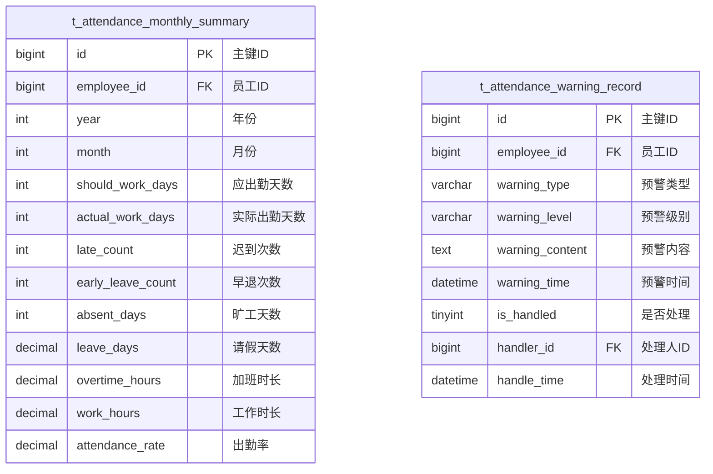

# 考勤汇总报表 - 数据结构设计

> **版本**: v1.0.0  
> **创建日期**: 2025-12-17

---

## 📊 ER图



---

## 📋 表结构详细设计

### t_attendance_monthly_summary (月度考勤汇总表)

```sql
CREATE TABLE t_attendance_monthly_summary (
    id BIGINT PRIMARY KEY AUTO_INCREMENT COMMENT '主键ID',
    employee_id BIGINT NOT NULL COMMENT '员工ID',
    department_id BIGINT COMMENT '部门ID',
    year INT NOT NULL COMMENT '年份',
    month INT NOT NULL COMMENT '月份',
    should_work_days INT DEFAULT 0 COMMENT '应出勤天数',
    actual_work_days INT DEFAULT 0 COMMENT '实际出勤天数',
    late_count INT DEFAULT 0 COMMENT '迟到次数',
    late_minutes INT DEFAULT 0 COMMENT '迟到总分钟数',
    early_leave_count INT DEFAULT 0 COMMENT '早退次数',
    early_leave_minutes INT DEFAULT 0 COMMENT '早退总分钟数',
    absent_days INT DEFAULT 0 COMMENT '旷工天数',
    leave_days DECIMAL(5,2) DEFAULT 0 COMMENT '请假天数',
    sick_leave_days DECIMAL(5,2) DEFAULT 0 COMMENT '病假天数',
    personal_leave_days DECIMAL(5,2) DEFAULT 0 COMMENT '事假天数',
    annual_leave_days DECIMAL(5,2) DEFAULT 0 COMMENT '年假天数',
    overtime_hours DECIMAL(6,2) DEFAULT 0 COMMENT '加班时长',
    weekend_overtime_hours DECIMAL(6,2) DEFAULT 0 COMMENT '周末加班时长',
    holiday_overtime_hours DECIMAL(6,2) DEFAULT 0 COMMENT '节假日加班时长',
    work_hours DECIMAL(6,2) DEFAULT 0 COMMENT '总工作时长',
    attendance_rate DECIMAL(5,2) DEFAULT 0 COMMENT '出勤率(%)',
    calculate_time DATETIME COMMENT '计算时间',
    create_time DATETIME NOT NULL DEFAULT CURRENT_TIMESTAMP COMMENT '创建时间',
    update_time DATETIME NOT NULL DEFAULT CURRENT_TIMESTAMP ON UPDATE CURRENT_TIMESTAMP COMMENT '更新时间',
    UNIQUE KEY uk_employee_month (employee_id, year, month),
    INDEX idx_department_month (department_id, year, month),
    INDEX idx_year_month (year, month)
) ENGINE=InnoDB DEFAULT CHARSET=utf8mb4 COMMENT='月度考勤汇总表';
```

### t_attendance_warning_record (考勤预警记录表)

```sql
CREATE TABLE t_attendance_warning_record (
    id BIGINT PRIMARY KEY AUTO_INCREMENT COMMENT '主键ID',
    employee_id BIGINT NOT NULL COMMENT '员工ID',
    department_id BIGINT COMMENT '部门ID',
    warning_type VARCHAR(30) NOT NULL COMMENT '预警类型:LATE_FREQUENT/ABSENT_CONTINUOUS/ABNORMAL',
    warning_level VARCHAR(10) NOT NULL COMMENT '预警级别:LOW/MEDIUM/HIGH',
    warning_content TEXT NOT NULL COMMENT '预警内容',
    warning_time DATETIME NOT NULL COMMENT '预警时间',
    trigger_rule_id BIGINT COMMENT '触发规则ID',
    related_data JSON COMMENT '相关数据',
    is_handled TINYINT DEFAULT 0 COMMENT '是否已处理:0未处理1已处理',
    handler_id BIGINT COMMENT '处理人ID',
    handle_time DATETIME COMMENT '处理时间',
    handle_comment TEXT COMMENT '处理意见',
    create_time DATETIME NOT NULL DEFAULT CURRENT_TIMESTAMP COMMENT '创建时间',
    INDEX idx_employee_id (employee_id),
    INDEX idx_warning_type (warning_type),
    INDEX idx_warning_level (warning_level),
    INDEX idx_is_handled (is_handled)
) ENGINE=InnoDB DEFAULT CHARSET=utf8mb4 COMMENT='考勤预警记录表';
```

---

## 🔧 预警类型枚举

| 类型码 | 名称 | 说明 |
|--------|------|------|
| LATE_FREQUENT | 频繁迟到 | 7天内迟到≥3次 |
| ABSENT_CONTINUOUS | 连续缺勤 | 连续缺勤≥2天 |
| NO_CLOCK | 未打卡 | 当日未打卡 |
| OVERTIME_EXCESS | 加班超限 | 月加班超36小时 |
| ABNORMAL_PATTERN | 异常模式 | 异常考勤模式 |

---

**📝 文档维护**: IOE-DREAM架构团队 | 2025-12-17
