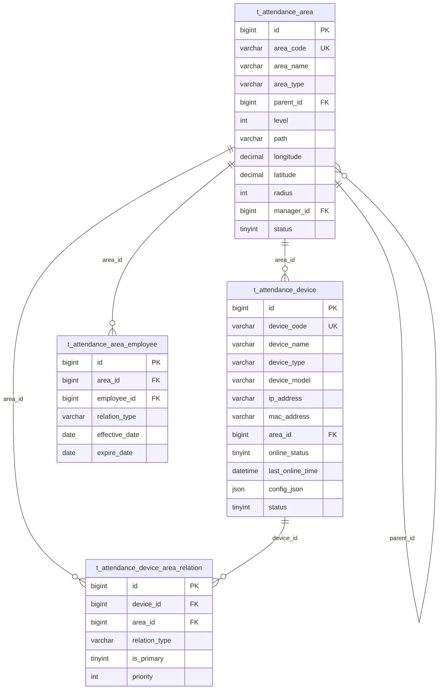
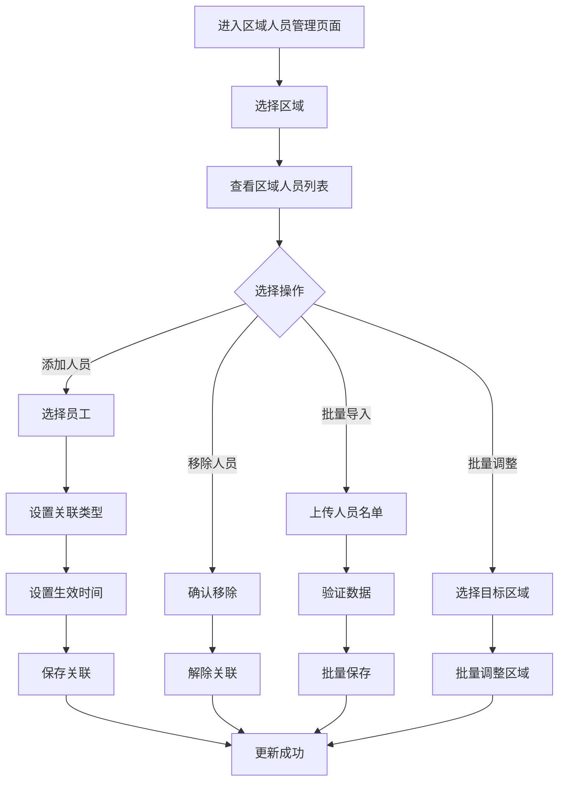
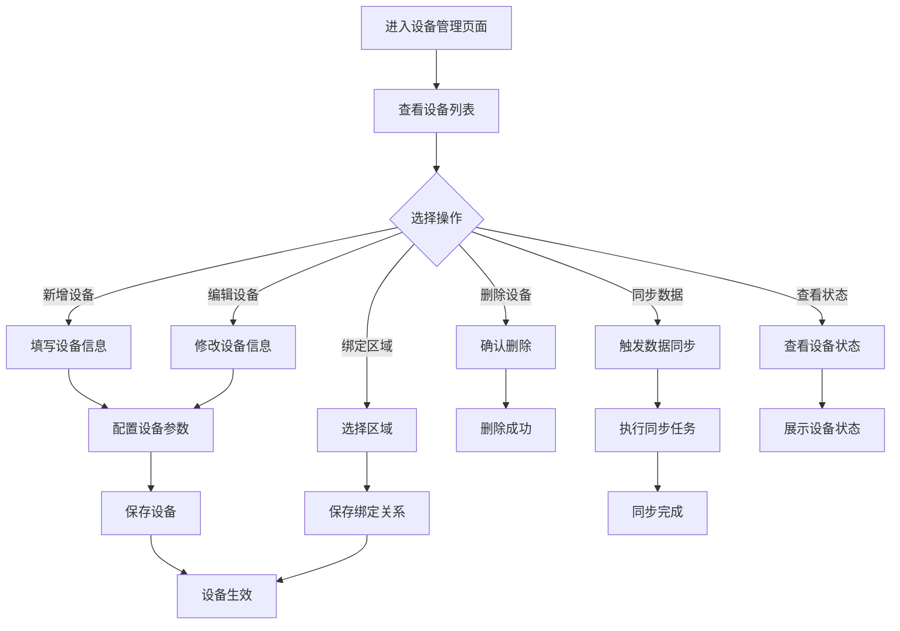

# 设备区域管理子模块

> **版本**: v2.0.0  
> **更新日期**: 2025-12-17  
> **所属模块**: 考勤管理模块

---

## 1. 模块概述

设备区域管理模块负责管理考勤相关的设备和区域，包括考勤机、门禁设备、考勤区域的配置和管理，以及设备与区域、员工的关联关系。

### 1.1 核心功能

- **设备管理**: 考勤设备的增删改查
- **区域管理**: 考勤区域的划分和管理
- **设备区域关联**: 设备与区域的绑定关系
- **区域人员管理**: 区域与员工的关联
- **设备状态监控**: 设备在线状态监控

---

## 2. 数据表设计

### 2.1 考勤设备表 (t_attendance_device)

```sql
CREATE TABLE t_attendance_device (
    id BIGINT NOT NULL AUTO_INCREMENT COMMENT '主键ID',
    device_code VARCHAR(50) NOT NULL COMMENT '设备编码',
    device_name VARCHAR(100) NOT NULL COMMENT '设备名称',
    device_type VARCHAR(50) NOT NULL COMMENT '设备类型',
    device_model VARCHAR(100) COMMENT '设备型号',
    manufacturer VARCHAR(100) COMMENT '制造商',
    ip_address VARCHAR(50) COMMENT 'IP地址',
    mac_address VARCHAR(50) COMMENT 'MAC地址',
    serial_number VARCHAR(100) COMMENT '序列号',
    firmware_version VARCHAR(50) COMMENT '固件版本',
    location VARCHAR(255) COMMENT '安装位置',
    area_id BIGINT COMMENT '所属区域ID',
    online_status TINYINT DEFAULT 0 COMMENT '在线状态',
    last_online_time DATETIME COMMENT '最后在线时间',
    last_sync_time DATETIME COMMENT '最后同步时间',
    config_json JSON COMMENT '设备配置',
    status TINYINT NOT NULL DEFAULT 1 COMMENT '状态',
    deleted_flag TINYINT NOT NULL DEFAULT 0 COMMENT '删除标记',
    create_time DATETIME NOT NULL DEFAULT CURRENT_TIMESTAMP,
    update_time DATETIME NOT NULL DEFAULT CURRENT_TIMESTAMP ON UPDATE CURRENT_TIMESTAMP,
    PRIMARY KEY (id),
    UNIQUE KEY uk_device_code (device_code),
    KEY idx_device_type (device_type),
    KEY idx_area_id (area_id),
    KEY idx_online_status (online_status)
) ENGINE=InnoDB DEFAULT CHARSET=utf8mb4 COMMENT='考勤设备表';
```

### 2.2 考勤区域表 (t_attendance_area)

```sql
CREATE TABLE t_attendance_area (
    id BIGINT NOT NULL AUTO_INCREMENT COMMENT '主键ID',
    area_code VARCHAR(50) NOT NULL COMMENT '区域编码',
    area_name VARCHAR(100) NOT NULL COMMENT '区域名称',
    area_type VARCHAR(50) NOT NULL COMMENT '区域类型',
    parent_id BIGINT DEFAULT 0 COMMENT '父区域ID',
    level INT DEFAULT 1 COMMENT '层级',
    path VARCHAR(500) COMMENT '层级路径',
    longitude DECIMAL(10,7) COMMENT '中心经度',
    latitude DECIMAL(10,7) COMMENT '中心纬度',
    radius INT COMMENT '有效半径(米)',
    address VARCHAR(255) COMMENT '地址',
    description TEXT COMMENT '描述',
    manager_id BIGINT COMMENT '区域负责人ID',
    status TINYINT NOT NULL DEFAULT 1 COMMENT '状态',
    deleted_flag TINYINT NOT NULL DEFAULT 0 COMMENT '删除标记',
    create_time DATETIME NOT NULL DEFAULT CURRENT_TIMESTAMP,
    update_time DATETIME NOT NULL DEFAULT CURRENT_TIMESTAMP ON UPDATE CURRENT_TIMESTAMP,
    PRIMARY KEY (id),
    UNIQUE KEY uk_area_code (area_code),
    KEY idx_parent_id (parent_id),
    KEY idx_area_type (area_type)
) ENGINE=InnoDB DEFAULT CHARSET=utf8mb4 COMMENT='考勤区域表';
```

### 2.3 设备区域关联表 (t_attendance_device_area_relation)

```sql
CREATE TABLE t_attendance_device_area_relation (
    id BIGINT NOT NULL AUTO_INCREMENT COMMENT '主键ID',
    device_id BIGINT NOT NULL COMMENT '设备ID',
    area_id BIGINT NOT NULL COMMENT '区域ID',
    relation_type VARCHAR(50) DEFAULT 'bindTo' COMMENT '关联类型',
    is_primary TINYINT DEFAULT 0 COMMENT '是否主设备',
    priority INT DEFAULT 10 COMMENT '优先级',
    deleted_flag TINYINT NOT NULL DEFAULT 0 COMMENT '删除标记',
    create_time DATETIME NOT NULL DEFAULT CURRENT_TIMESTAMP,
    update_time DATETIME NOT NULL DEFAULT CURRENT_TIMESTAMP ON UPDATE CURRENT_TIMESTAMP,
    PRIMARY KEY (id),
    UNIQUE KEY uk_device_area (device_id, area_id),
    KEY idx_area_id (area_id)
) ENGINE=InnoDB DEFAULT CHARSET=utf8mb4 COMMENT='设备区域关联表';
```

### 2.4 区域人员关联表 (t_attendance_area_employee)

```sql
CREATE TABLE t_attendance_area_employee (
    id BIGINT NOT NULL AUTO_INCREMENT COMMENT '主键ID',
    area_id BIGINT NOT NULL COMMENT '区域ID',
    employee_id BIGINT NOT NULL COMMENT '员工ID',
    relation_type VARCHAR(50) DEFAULT 'work' COMMENT '关联类型',
    effective_date DATE COMMENT '生效日期',
    expire_date DATE COMMENT '失效日期',
    deleted_flag TINYINT NOT NULL DEFAULT 0 COMMENT '删除标记',
    create_time DATETIME NOT NULL DEFAULT CURRENT_TIMESTAMP,
    update_time DATETIME NOT NULL DEFAULT CURRENT_TIMESTAMP ON UPDATE CURRENT_TIMESTAMP,
    PRIMARY KEY (id),
    UNIQUE KEY uk_area_employee (area_id, employee_id),
    KEY idx_employee_id (employee_id)
) ENGINE=InnoDB DEFAULT CHARSET=utf8mb4 COMMENT='区域人员关联表';
```

---

## 3. ER图



---

## 4. 设备类型与区域类型说明

### 4.1 设备类型 (device_type)

| 类型编码 | 类型名称 | 说明 |
|---------|---------|------|
| fingerprint | 指纹考勤机 | 指纹识别考勤设备 |
| face | 人脸考勤机 | 人脸识别考勤设备 |
| card | 刷卡考勤机 | IC/ID卡考勤设备 |
| mixed | 混合考勤机 | 多种识别方式 |
| access | 门禁设备 | 门禁控制器 |
| mobile | 移动设备 | 虚拟移动打卡点 |

### 4.2 区域类型 (area_type)

| 类型编码 | 类型名称 | 说明 |
|---------|---------|------|
| campus | 园区 | 园区级别 |
| building | 楼栋 | 楼栋级别 |
| floor | 楼层 | 楼层级别 |
| office | 办公区 | 办公区域 |
| workshop | 车间 | 生产车间 |
| outdoor | 户外 | 户外区域 |

---

## 5. 业务流程

### 5.1 区域人员管理流程



### 5.2 设备管理流程



---

## 6. API接口

### 6.1 设备管理接口

| 方法 | 路径 | 说明 |
|------|------|------|
| GET | /api/v1/attendance/devices | 查询设备列表 |
| POST | /api/v1/attendance/devices | 创建设备 |
| GET | /api/v1/attendance/devices/{id} | 获取设备详情 |
| PUT | /api/v1/attendance/devices/{id} | 更新设备 |
| DELETE | /api/v1/attendance/devices/{id} | 删除设备 |
| POST | /api/v1/attendance/devices/{id}/sync | 同步设备数据 |
| GET | /api/v1/attendance/devices/{id}/status | 获取设备状态 |

### 6.2 区域管理接口

| 方法 | 路径 | 说明 |
|------|------|------|
| GET | /api/v1/attendance/areas | 查询区域列表 |
| GET | /api/v1/attendance/areas/tree | 获取区域树 |
| POST | /api/v1/attendance/areas | 创建区域 |
| PUT | /api/v1/attendance/areas/{id} | 更新区域 |
| DELETE | /api/v1/attendance/areas/{id} | 删除区域 |

### 6.3 设备区域关联接口

| 方法 | 路径 | 说明 |
|------|------|------|
| GET | /api/v1/attendance/device-area-relations | 查询关联列表 |
| POST | /api/v1/attendance/device-area-relations | 创建关联 |
| DELETE | /api/v1/attendance/device-area-relations/{id} | 删除关联 |
| GET | /api/v1/attendance/areas/{areaId}/devices | 查询区域设备 |

### 6.4 区域人员关联接口

| 方法 | 路径 | 说明 |
|------|------|------|
| GET | /api/v1/attendance/area-employees | 查询关联列表 |
| POST | /api/v1/attendance/area-employees | 创建关联 |
| POST | /api/v1/attendance/area-employees/batch | 批量创建关联 |
| DELETE | /api/v1/attendance/area-employees/{id} | 删除关联 |
| GET | /api/v1/attendance/areas/{areaId}/employees | 查询区域人员 |

---

## 7. 开发优先级

### P0 - 核心功能
- 设备CRUD
- 区域CRUD
- 设备区域绑定

### P1 - 增强功能
- 区域人员管理
- 设备状态监控
- 批量操作

### P2 - 扩展功能
- 设备数据同步
- 区域地图展示
- 高级设备管理

---

*本文档持续更新中*

