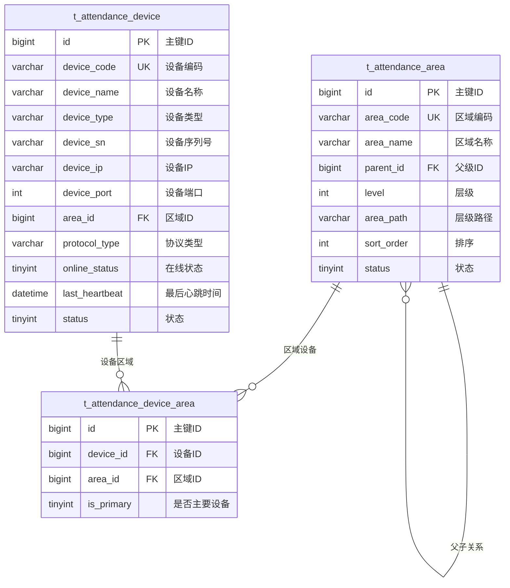

# 设备区域管理 - 数据结构设计

> **版本**: v1.0.0  
> **创建日期**: 2025-12-17

---

## 📊 ER图



---

## 📋 表结构详细设计

### t_attendance_device (考勤设备表)

```sql
CREATE TABLE t_attendance_device (
    id BIGINT PRIMARY KEY AUTO_INCREMENT COMMENT '主键ID',
    device_code VARCHAR(30) NOT NULL COMMENT '设备编码',
    device_name VARCHAR(50) NOT NULL COMMENT '设备名称',
    device_type VARCHAR(20) NOT NULL COMMENT '设备类型:ATTENDANCE/ACCESS/FACE/FINGERPRINT',
    device_sn VARCHAR(50) COMMENT '设备序列号',
    device_ip VARCHAR(50) COMMENT '设备IP地址',
    device_port INT COMMENT '设备端口',
    area_id BIGINT COMMENT '区域ID',
    protocol_type VARCHAR(20) COMMENT '协议类型:PUSH/SDK/HTTP',
    manufacturer VARCHAR(50) COMMENT '厂商',
    model VARCHAR(50) COMMENT '型号',
    online_status TINYINT DEFAULT 0 COMMENT '在线状态:0离线1在线',
    last_heartbeat DATETIME COMMENT '最后心跳时间',
    last_sync_time DATETIME COMMENT '最后同步时间',
    remark VARCHAR(200) COMMENT '备注',
    status TINYINT DEFAULT 1 COMMENT '状态:0禁用1启用',
    create_time DATETIME NOT NULL DEFAULT CURRENT_TIMESTAMP COMMENT '创建时间',
    update_time DATETIME NOT NULL DEFAULT CURRENT_TIMESTAMP ON UPDATE CURRENT_TIMESTAMP COMMENT '更新时间',
    deleted_flag TINYINT DEFAULT 0 COMMENT '删除标记',
    UNIQUE KEY uk_device_code (device_code),
    INDEX idx_area_id (area_id),
    INDEX idx_device_type (device_type),
    INDEX idx_online_status (online_status)
) ENGINE=InnoDB DEFAULT CHARSET=utf8mb4 COMMENT='考勤设备表';
```

### t_attendance_area (考勤区域表)

```sql
CREATE TABLE t_attendance_area (
    id BIGINT PRIMARY KEY AUTO_INCREMENT COMMENT '主键ID',
    area_code VARCHAR(30) NOT NULL COMMENT '区域编码',
    area_name VARCHAR(50) NOT NULL COMMENT '区域名称',
    parent_id BIGINT DEFAULT 0 COMMENT '父级ID,0表示顶级',
    level INT DEFAULT 1 COMMENT '层级',
    area_path VARCHAR(200) COMMENT '层级路径,如:1/2/3',
    sort_order INT DEFAULT 0 COMMENT '排序',
    description VARCHAR(200) COMMENT '描述',
    status TINYINT DEFAULT 1 COMMENT '状态:0禁用1启用',
    create_time DATETIME NOT NULL DEFAULT CURRENT_TIMESTAMP COMMENT '创建时间',
    update_time DATETIME NOT NULL DEFAULT CURRENT_TIMESTAMP ON UPDATE CURRENT_TIMESTAMP COMMENT '更新时间',
    deleted_flag TINYINT DEFAULT 0 COMMENT '删除标记',
    UNIQUE KEY uk_area_code (area_code),
    INDEX idx_parent_id (parent_id),
    INDEX idx_area_path (area_path)
) ENGINE=InnoDB DEFAULT CHARSET=utf8mb4 COMMENT='考勤区域表';
```

### t_attendance_device_area (设备区域关联表)

```sql
CREATE TABLE t_attendance_device_area (
    id BIGINT PRIMARY KEY AUTO_INCREMENT COMMENT '主键ID',
    device_id BIGINT NOT NULL COMMENT '设备ID',
    area_id BIGINT NOT NULL COMMENT '区域ID',
    is_primary TINYINT DEFAULT 0 COMMENT '是否主要设备:0否1是',
    create_time DATETIME NOT NULL DEFAULT CURRENT_TIMESTAMP COMMENT '创建时间',
    UNIQUE KEY uk_device_area (device_id, area_id),
    INDEX idx_area_id (area_id)
) ENGINE=InnoDB DEFAULT CHARSET=utf8mb4 COMMENT='设备区域关联表';
```

---

## 🔧 设备类型枚举

| 类型码 | 名称 | 说明 |
|--------|------|------|
| ATTENDANCE | 考勤机 | 专用考勤设备 |
| ACCESS | 门禁设备 | 门禁一体机 |
| FACE | 人脸终端 | 人脸识别终端 |
| FINGERPRINT | 指纹机 | 指纹识别设备 |
| CARD | 刷卡机 | IC/ID卡读卡器 |

---

**📝 文档维护**: IOE-DREAM架构团队 | 2025-12-17
