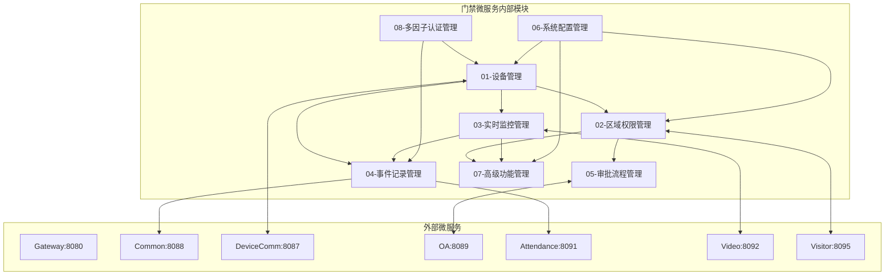
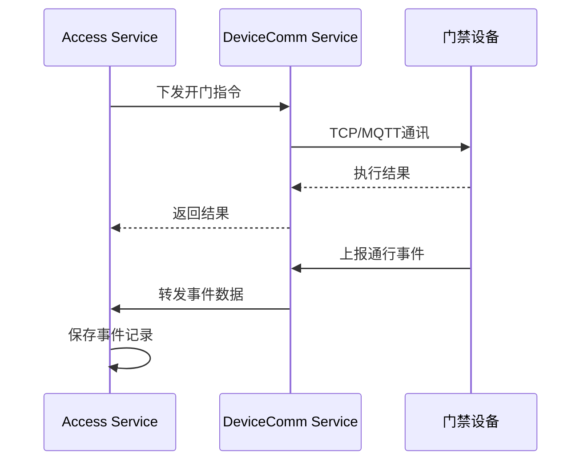
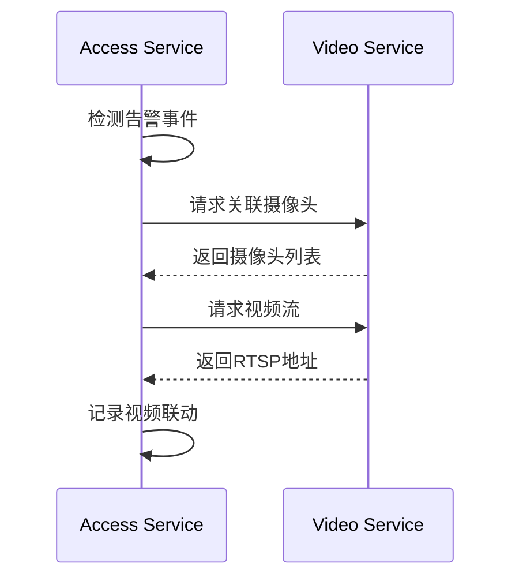
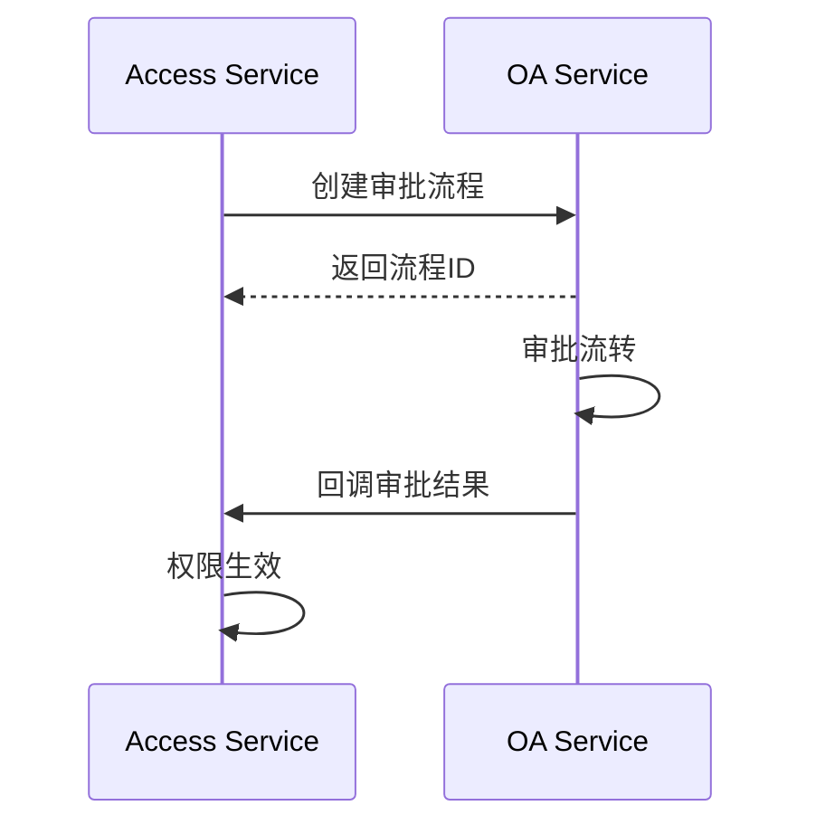
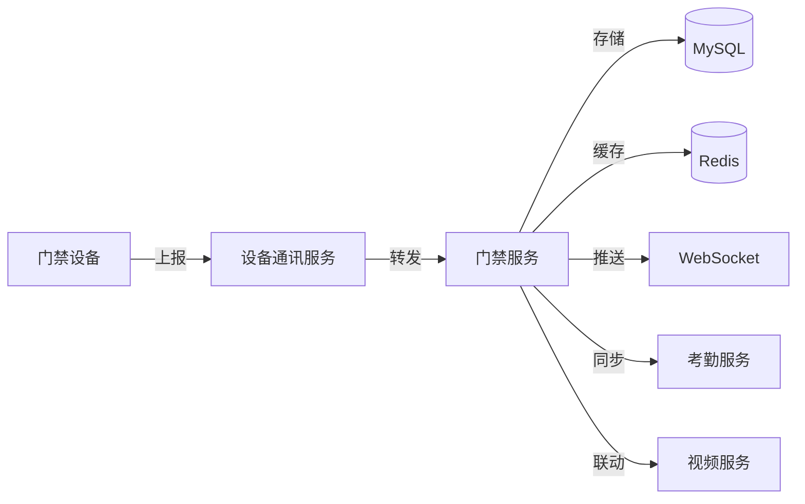
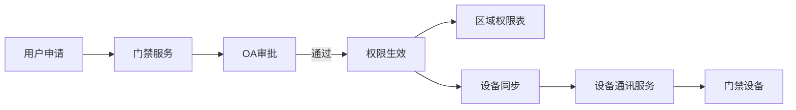

# 门禁管理模块 - 模块间关联设计文档

> **版本**: v1.0.0  
> **微服务**: ioedream-access-service (8090)  
> **创建日期**: 2025-12-17

---

## 📊 模块关联全景图



---

## 🔗 内部模块关联详细设计

### 1. 设备管理 ↔ 区域权限管理

| 关联点 | 说明 | 数据流向 |
|--------|------|----------|
| 设备分配 | 设备分配到区域 | DEV → AREA |
| 权限校验 | 通行时校验区域权限 | AREA → DEV |
| 状态同步 | 区域状态影响设备行为 | AREA → DEV |

**关键接口**:
```java
// AccessDeviceService.java
ResponseDTO<Void> assignDeviceToArea(Long deviceId, Long areaId);

// AreaPermissionService (in common)
Boolean checkAreaPermission(Long userId, Long areaId);
```

---

### 2. 设备管理 ↔ 实时监控管理

| 关联点 | 说明 | 数据流向 |
|--------|------|----------|
| 状态上报 | 设备状态实时上报 | DEV → MON |
| 告警生成 | 设备异常触发告警 | DEV → MON |
| 控制指令 | 监控下发设备控制 | MON → DEV |

**关键接口**:
```java
// DeviceHealthService.java
void reportDeviceStatus(Long deviceId, DeviceStatusDTO status);

// MonitorAlertService.java
void createAlert(Long deviceId, AlertType type, String message);
```

---

### 3. 实时监控管理 ↔ 事件记录管理

| 关联点 | 说明 | 数据流向 |
|--------|------|----------|
| 事件存储 | 监控事件持久化 | MON → EVT |
| 事件查询 | 监控查询历史事件 | EVT → MON |
| 统计分析 | 监控使用事件统计 | EVT → MON |

**关键接口**:
```java
// AccessEventService.java
void saveAccessEvent(AccessEventDTO event);
PageResult<AccessRecordVO> queryEvents(AccessRecordQueryForm form);
AccessRecordStatisticsVO getStatistics(StatisticsQueryForm form);
```

---

### 4. 区域权限管理 ↔ 审批流程管理

| 关联点 | 说明 | 数据流向 |
|--------|------|----------|
| 权限申请 | 申请区域访问权限 | APR → AREA |
| 权限生效 | 审批通过后权限生效 | APR → AREA |
| 权限查询 | 审批时查询现有权限 | AREA → APR |

**关键接口**:
```java
// AccessPermissionApplyService.java
ResponseDTO<Long> submitApply(PermissionApplyForm form);
void approveAndGrantPermission(Long applyId, Long approverId);

// AreaPermissionService
void grantAreaPermission(Long userId, Long areaId, PermissionDTO permission);
```

---

### 5. 多因子认证 ↔ 设备管理/事件记录

| 关联点 | 说明 | 数据流向 |
|--------|------|----------|
| 认证执行 | 设备触发多因子认证 | DEV → MFA |
| 模板同步 | 生物模板同步到设备 | MFA → DEV |
| 认证记录 | 认证结果记录到事件 | MFA → EVT |

**关键接口**:
```java
// BiometricAuthService.java
BiometricAuthResultVO verify(BiometricVerifyForm form);
void syncTemplateToDevice(Long userId, Long deviceId);

// AccessEventService.java
void saveBiometricAuthEvent(BiometricAuthRecordEntity record);
```

---

### 6. 高级功能 ↔ 区域/监控

| 关联点 | 说明 | 数据流向 |
|--------|------|----------|
| 反潜回检查 | 通行时检查反潜规则 | AREA → ADV |
| 人数统计 | 实时统计区域人数 | MON → ADV |
| 联动触发 | 事件触发联动动作 | MON → ADV |

**关键接口**:
```java
// AntiPassbackService.java
AntiPassbackCheckResult checkAntiPassback(Long userId, Long areaId, String direction);

// AdvancedAccessControlService.java
void updateAreaCapacity(Long areaId, int delta);
void triggerLinkage(LinkageEvent event);
```

---

## 🌐 外部微服务关联设计

### 1. 门禁服务 ↔ 设备通讯服务 (8087)



**关键API**:
```
POST /api/device-comm/v1/access/command    # 下发设备指令
POST /api/device-comm/v1/access/sync       # 同步设备配置
WS   /api/device-comm/v1/access/events     # 事件推送
```

---

### 2. 门禁服务 ↔ 视频服务 (8092)



**关键API**:
```
GET  /api/video/v1/cameras/bindDevice/{deviceId}  # 获取关联摄像头
POST /api/video/v1/stream/start                   # 启动视频流
POST /api/video/v1/recording/start                # 启动录像
```

---

### 3. 门禁服务 ↔ OA服务 (8089)



**关键API**:
```
POST /api/oa/v1/workflow/start           # 启动审批流程
GET  /api/oa/v1/workflow/{id}/status     # 查询流程状态
POST /api/oa/v1/workflow/callback        # 审批结果回调
```

---

### 4. 门禁服务 ↔ 访客服务 (8095)

| 关联场景 | 说明 |
|----------|------|
| 访客权限 | 访客预约通过后生成临时门禁权限 |
| 访客通行 | 访客通行记录同步 |
| 权限注销 | 访客离开后注销权限 |

**关键API**:
```
POST /api/visitor/v1/access/grant        # 授予访客门禁权限
DELETE /api/visitor/v1/access/{visitorId} # 注销访客权限
GET  /api/visitor/v1/access/check        # 校验访客权限
```

---

### 5. 门禁服务 ↔ 考勤服务 (8091)

| 关联场景 | 说明 |
|----------|------|
| 考勤打卡 | 门禁通行作为考勤打卡数据源 |
| 数据同步 | 通行记录同步到考勤系统 |

**关键API**:
```
POST /api/attendance/v1/clock/from-access  # 门禁数据作为打卡
```

---

## 📋 数据流转设计

### 通行事件数据流



### 权限数据流



---

## 🔧 接口契约规范

### 内部接口规范

| 调用方 | 被调用方 | 接口 | 超时 | 重试 |
|--------|----------|------|------|------|
| DEV | AREA | checkAreaPermission | 500ms | 2次 |
| MON | EVT | saveAccessEvent | 1s | 3次 |
| APR | AREA | grantAreaPermission | 1s | 2次 |
| MFA | DEV | syncTemplate | 5s | 3次 |
| ADV | MON | updateCapacity | 500ms | 2次 |

### 外部接口规范

| 调用方 | 被调用方 | 通信方式 | 超时 | 熔断阈值 |
|--------|----------|----------|------|----------|
| Access | DeviceComm | HTTP/MQ | 3s | 50% |
| Access | Video | HTTP | 2s | 30% |
| Access | OA | HTTP | 5s | 30% |
| Access | Visitor | HTTP | 2s | 30% |
| Access | Attendance | MQ | - | - |

---

## ⚠️ 关键注意事项

1. **事务边界**: 跨模块操作使用最终一致性，避免分布式事务
2. **缓存一致性**: 权限数据变更时需清除相关缓存
3. **幂等设计**: 所有写操作必须支持幂等
4. **降级策略**: 外部服务不可用时有降级方案
5. **日志追踪**: 跨服务调用携带TraceId

---

**📝 文档维护**: IOE-DREAM架构团队 | 2025-12-17
