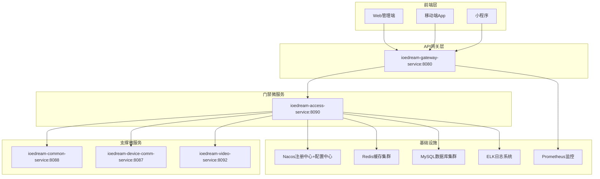
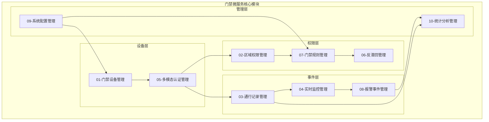
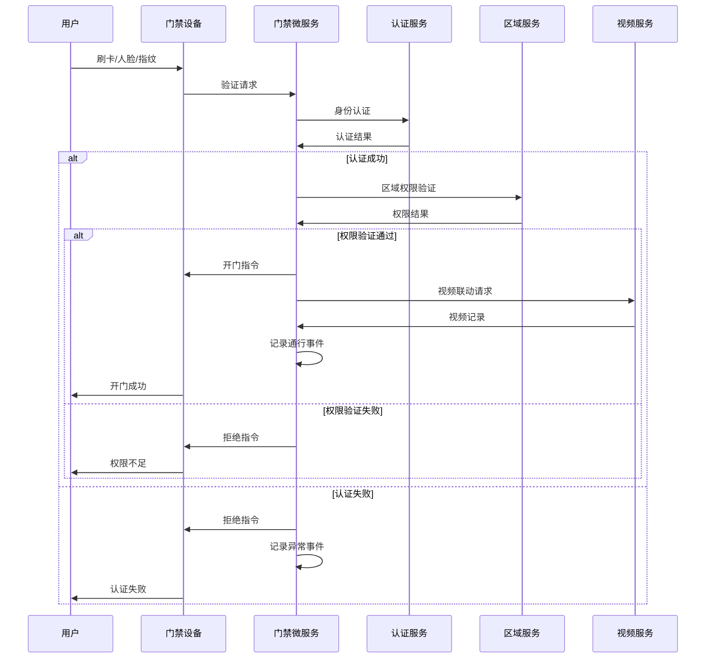
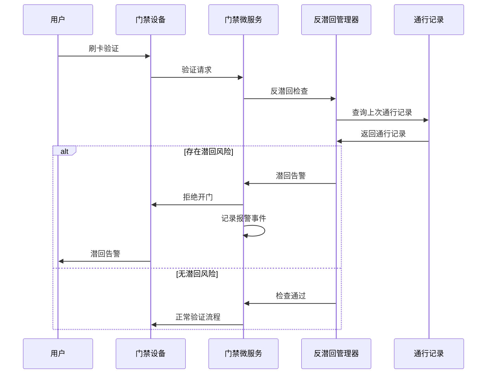
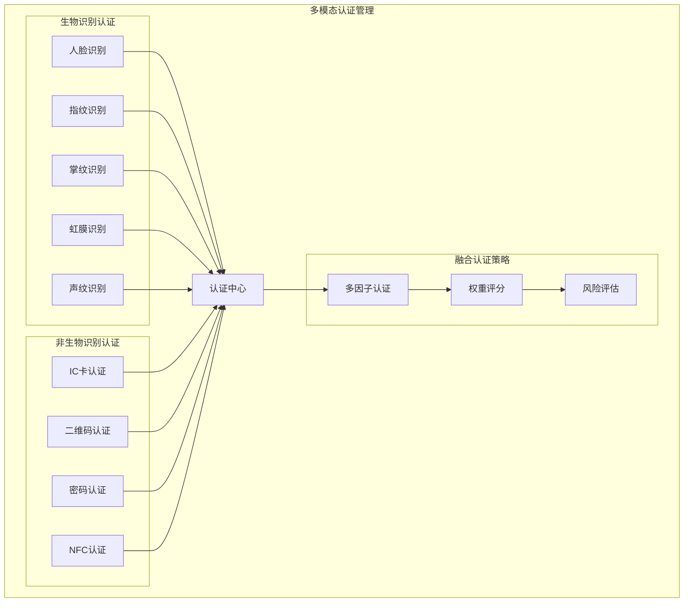
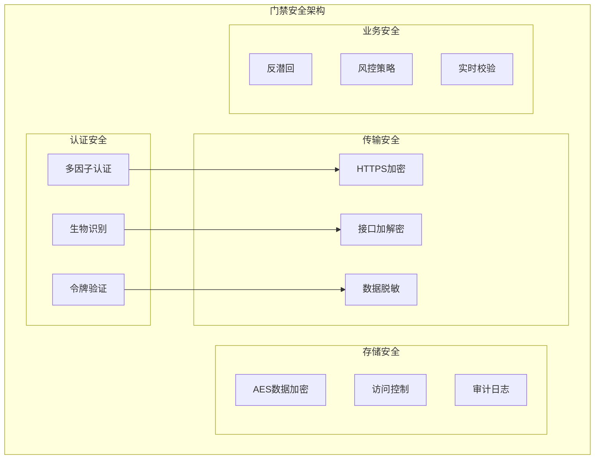
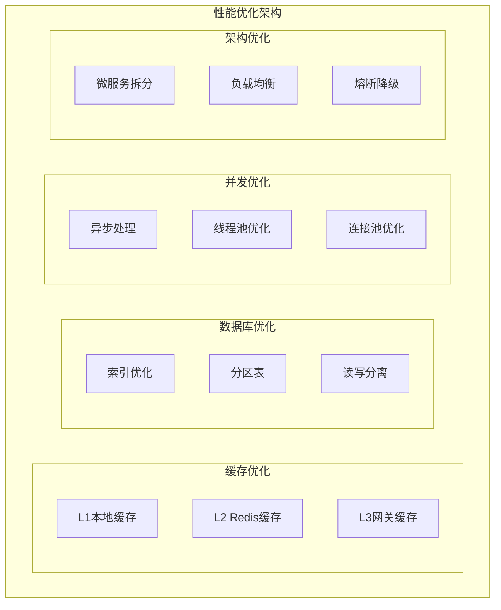
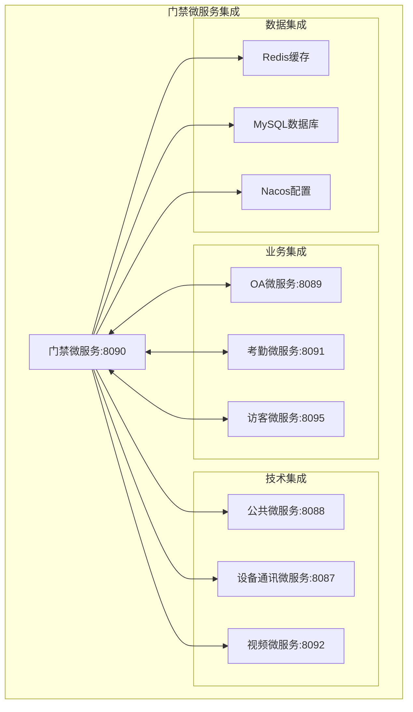
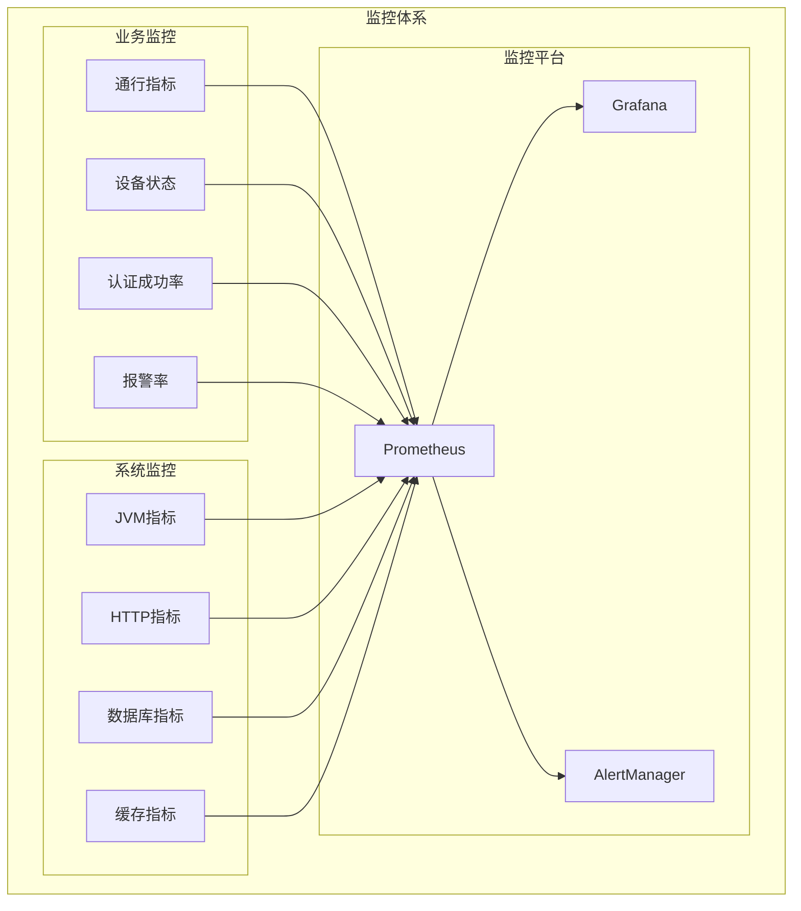

# IOE-DREAM 智慧门禁管理微服务 - 总体设计文档

> **版本**: v1.0.0
> **创建日期**: 2025-12-17
> **适用范围**: IOE-DREAM智慧园区一卡通管理平台
> **技术架构**: Spring Boot 3.5.8 + Spring Cloud 2025.0.0 + 微服务架构

---

## 📋 文档概述

本文档是IOE-DREAM智慧门禁管理微服务的总体设计文档，基于备份文档中的门禁相关业务需求分析和全局项目架构设计，确保门禁微服务下每个子模块的完整性、系统性和一致性。

### 🎯 设计目标

- **功能完整性**: 确保备份文档中所有门禁功能完整实现，一个不少
- **架构合规性**: 严格遵循IOE-DREAM全局架构规范和技术栈标准
- **系统一致性**: 与其他微服务保持统一的接口规范和数据模型
- **企业级特性**: 满足高可用、高性能、高安全性的企业级要求

---

## 🏗️ 系统整体架构

### 架构设计原则

基于IOE-DREAM全局架构规范，门禁微服务严格遵循以下设计原则：

1. **四层架构规范**: Controller → Service → Manager → DAO
2. **微服务边界**: 单一职责，高内聚低耦合
3. **统一技术栈**: Spring Boot 3.5.8 + Spring Cloud 2025.0.0
4. **统一依赖注入**: 使用@Resource注解，禁止@Autowired
5. **统一数据访问**: 使用@Mapper注解，禁止@Repository
6. **统一配置管理**: Nacos配置中心，加密敏感配置
7. **统一安全规范**: 三级等保合规，金融级安全防护

### 系统架构图



---

## 📦 功能模块架构

### 核心功能模块

基于备份文档分析，门禁微服务包含以下10个核心功能模块：

| 模块编号 | 模块名称 | 功能描述 | 优先级 |
|---------|---------|---------|--------|
| 01 | 门禁设备管理 | 门禁设备的注册、配置、监控、控制 | P0 |
| 02 | 区域权限管理 | 区域空间管理和人员通行权限分配 | P0 |
| 03 | 通行记录管理 | 门禁通行事件的记录、查询、统计 | P0 |
| 04 | 实时监控管理 | 门禁设备状态实时监控和事件告警 | P1 |
| 05 | 多模态认证管理 | 人脸、指纹、掌纹、虹膜、卡片等认证方式 | P0 |
| 06 | 反潜回管理 | 防止人员重复进入的安全机制 | P1 |
| 07 | 门禁规则管理 | 通行时间规则、区域规则、人员规则配置 | P0 |
| 08 | 报警事件管理 | 异常事件的检测、记录、处理、统计分析 | P1 |
| 09 | 系统配置管理 | 门禁系统参数配置、策略配置、模板管理 | P2 |
| 10 | 统计分析管理 | 门禁数据统计分析、报表生成、趋势预测 | P2 |

### 模块关系图



---

## 🎯 业务功能架构

### 核心业务流程

#### 1. 门禁通行验证流程



#### 2. 反潜回检查流程



### 多模态认证架构



---

## 🔗 接口设计规范

### RESTful API设计

基于全局架构规范，门禁微服务提供标准化的RESTful API：

```yaml
# API基础路径
base_url: /api/v1/access

# 标准HTTP方法映射
GET    /api/v1/access/devices           # 获取设备列表
GET    /api/v1/access/devices/{id}      # 获取设备详情
POST   /api/v1/access/devices           # 创建设备
PUT    /api/v1/access/devices/{id}      # 更新设备
DELETE /api/v1/access/devices/{id}      # 删除设备

# 通行验证接口
POST   /api/v1/access/verify            # 通行验证
POST   /api/v1/access/verify/multi      # 多模态验证

# 权限管理接口
GET    /api/v1/access/permissions       # 获取权限列表
POST   /api/v1/access/permissions       # 分配权限
DELETE /api/v1/access/permissions/{id}  # 撤销权限

# 事件记录接口
GET    /api/v1/access/events            # 获取通行事件
GET    /api/v1/access/events/alerts     # 获取报警事件
```

### 数据传输规范

```java
// 统一响应格式
{
  "code": 200,
  "message": "success",
  "data": {...},
  "timestamp": 1703123456789
}

// 分页响应格式
{
  "code": 200,
  "message": "success",
  "data": {
    "list": [...],
    "total": 1000,
    "pageNum": 1,
    "pageSize": 20,
    "pages": 50
  },
  "timestamp": 1703123456789
}
```

---

## 🗄️ 数据库设计

### 数据库架构

基于IOE-DREAM统一数据库架构，门禁微服务使用MySQL 8.0 + MyBatis-Plus + Druid：

```yaml
# 数据库配置
spring:
  datasource:
    type: com.alibaba.druid.pool.DruidDataSource
    druid:
      initial-size: 10
      min-idle: 10
      max-active: 50
      validation-query: SELECT 1
      test-while-idle: true

# MyBatis-Plus配置
mybatis-plus:
  mapper-locations: classpath*:/mapper/*.xml
  type-aliases-package: net.lab1024.sa.access.domain.entity
  configuration:
    map-underscore-to-camel-case: true
    cache-enabled: false
```

### 核心数据表

门禁微服务包含以下核心数据表：

| 表名 | 说明 | 关键字段 |
|------|------|---------|
| `t_access_device` | 门禁设备信息 | device_id, device_name, device_type, area_id |
| `t_access_permission` | 通行权限 | permission_id, user_id, area_id, time_rule |
| `t_access_record` | 通行记录 | record_id, user_id, device_id, verify_type, result |
| `t_access_area` | 门禁区域 | area_id, area_name, parent_id, area_type |
| `t_access_rule` | 通行规则 | rule_id, rule_name, time_range, area_list |
| `t_access_auth_template` | 认证模板 | template_id, auth_types, weight_config |
| `t_access_anti_passback` | 反潜回配置 | config_id, device_group, passback_level |
| `t_access_alert` | 报警事件 | alert_id, alert_type, device_id, user_id, status |

---

## 🛡️ 安全设计

### 安全架构

基于三级等保和金融级安全要求，门禁微服务实现以下安全机制：



### 安全策略

1. **认证策略**: 支持多因子认证，活体检测防欺骗
2. **权限策略**: 基于RBAC的细粒度权限控制
3. **传输策略**: HTTPS + 接口加解密，数据传输全程加密
4. **存储策略**: 敏感数据AES256加密存储
5. **审计策略**: 完整的操作日志和访问审计
6. **监控策略**: 实时异常检测和安全告警

---

## ⚡ 性能设计

### 性能指标

基于企业级性能要求，门禁微服务满足以下性能指标：

| 指标类型 | 目标值 | 说明 |
|---------|--------|------|
| 响应时间 | ≤200ms | 95%请求响应时间 |
| 并发用户 | ≥10000 | 同时在线用户数 |
| 吞吐量 | ≥5000 TPS | 每秒事务处理量 |
| 可用性 | ≥99.9% | 系统可用性指标 |
| 数据一致性 | 100% | 通行数据零丢失 |

### 性能优化策略



---

## 🔄 集成设计

### 微服务集成

基于IOE-DREAM微服务架构，门禁微服务与其他服务的集成关系：



### 第三方集成

1. **设备厂商集成**: 支持多厂家门禁设备协议适配
2. **生物识别集成**: 集成人脸、指纹、虹膜等识别引擎
3. **视频监控集成**: 与视频系统联动，实现事件录像
4. **报警系统集成**: 与安防报警系统联动处理异常事件

---

## 📊 监控与运维

### 监控体系

基于Micrometer + Prometheus + Grafana的完整监控体系：



### 运维规范

1. **日志规范**: 统一日志格式，支持链路追踪
2. **告警规范**: 关键指标实时告警，分级处理
3. **备份规范**: 数据定期备份，灾难恢复预案
4. **发布规范**: 蓝绿部署，零停机更新
5. **容量规划**: 基于数据预测的容量扩展

---

## 📋 部署架构

### 容器化部署

基于Docker + Kubernetes的容器化部署架构：

```yaml
# Docker部署配置
apiVersion: apps/v1
kind: Deployment
metadata:
  name: ioedream-access-service
spec:
  replicas: 3
  selector:
    matchLabels:
      app: ioedream-access-service
  template:
    metadata:
      labels:
        app: ioedream-access-service
    spec:
      containers:
      - name: access-service
        image: ioedream/access-service:1.0.0
        ports:
        - containerPort: 8090
        env:
        - name: SPRING_PROFILES_ACTIVE
          value: "production"
        - name: NACOS_SERVER_ADDR
          value: "nacos:8848"
        resources:
          requests:
            memory: "512Mi"
            cpu: "250m"
          limits:
            memory: "1Gi"
            cpu: "500m"
        livenessProbe:
          httpGet:
            path: /actuator/health
            port: 8090
          initialDelaySeconds: 60
          periodSeconds: 30
        readinessProbe:
          httpGet:
            path: /actuator/health
            port: 8090
          initialDelaySeconds: 30
          periodSeconds: 10
```

### 环境配置

| 环境类型 | 配置特点 | 部署策略 |
|---------|---------|---------|
| 开发环境 | 单实例，本地数据库 | Docker Compose |
| 测试环境 | 多实例，模拟数据 | Kubernetes |
| 预生产环境 | 生产同等配置 | Kubernetes |
| 生产环境 | 高可用集群 | Kubernetes + HPA |

---

## ✅ 验收标准

### 功能验收标准

1. **核心功能**: 所有门禁功能100%实现，与备份文档需求完全一致
2. **接口规范**: RESTful API设计符合全局架构规范
3. **数据一致性**: 门禁数据与考勤、访客等系统数据一致性
4. **用户体验**: 响应时间≤200ms，操作流畅无卡顿

### 性能验收标准

1. **并发性能**: 支持10000并发用户，5000 TPS
2. **可用性**: 99.9%系统可用性，故障恢复时间≤5分钟
3. **数据安全**: 敏感数据加密存储，传输全程加密
4. **扩展性**: 支持水平扩展，设备容量可线性增长

### 安全验收标准

1. **等保合规**: 通过国家三级等保测评
2. **渗透测试**: 通过第三方渗透测试
3. **代码审计**: 通过静态代码安全扫描
4. **数据保护**: 实现数据脱敏和访问控制

---

## 📚 相关文档

### 设计文档
- [01-门禁设备管理详细设计](./01-门禁设备管理/)
- [02-区域权限管理详细设计](./02-区域权限管理/)
- [03-通行记录管理详细设计](./03-通行记录管理/)
- [04-实时监控管理详细设计](./04-实时监控管理/)
- [05-多模态认证管理详细设计](./05-多模态认证管理/)
- [06-反潜回管理详细设计](./06-反潜回管理/)
- [07-门禁规则管理详细设计](./07-门禁规则管理/)
- [08-报警事件管理详细设计](./08-报警事件管理/)
- [09-系统配置管理详细设计](./09-系统配置管理/)
- [10-统计分析管理详细设计](./10-统计分析管理/)

### 技术文档
- [数据库设计文档](./database-design.md)
- [API接口文档](./api-contract.md)
- [部署运维文档](./deployment-guide.md)
- [安全设计文档](./security-design.md)

---

**📝 文档维护**
- **创建人**: IOE-DREAM架构委员会
- **维护人**: 门禁微服务开发团队
- **最后更新**: 2025-12-17
- **版本**: v1.0.0