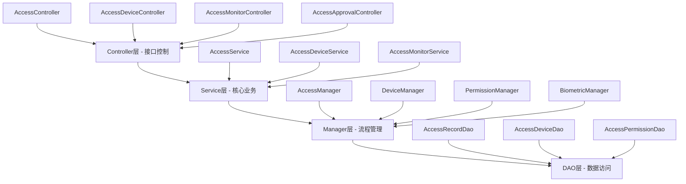

# IOE-DREAM门禁管理模块 - 总体设计文档

> **模块版本**: v2.0.0
> **创建时间**: 2025-12-16
> **最后更新**: 2025-12-16
> **模块负责人**: IOE-DREAM架构团队
> **服务端口**: 8090

## 📋 模块概述

### 模块定位

门禁管理模块是IOE-DREAM智慧园区安防综合管理平台的核心安全模块，提供多模态生物识别、智能权限控制、实时监控告警、区域空间管理等完整门禁解决方案。基于ZKBioSecurity-ACC门禁系统设计规范，结合Spring Boot 3.5.8微服务架构，实现从设备管理到权限控制、实时监控的完整业务闭环。

### 核心业务价值

- **多模态统一认证**: 集成人脸识别、指纹、IC卡、密码、虹膜、声纹等多种认证方式
- **智能权限管控**: 基于区域、时间、角色的动态权限管理和策略配置
- **实时监控预警**: 设备状态实时监控、异常行为检测、多级告警处理
- **远程设备控制**: 支持远程开门、设备配置、状态监控、故障诊断
- **完整审计追溯**: 通行记录全链路追踪、操作日志审计、数据统计分析

### 业务场景覆盖

1. **日常通行管理**: 员工正常上下班通行、访客预约访问、临时人员管理
2. **安全防护管理**: 高风险区域权限控制、异常行为检测、紧急事件处理
3. **设备运维管理**: 门禁设备监控、故障诊断、远程维护、配置管理
4. **数据分析管理**: 通行数据统计、设备使用分析、安全风险评估

---

## 🏗️ 系统架构设计

### 微服务架构

**服务信息**:
- **服务名称**: ioedream-access-service
- **服务端口**: 8090
- **技术栈**: Spring Boot 3.5.8 + Java 17 + MyBatis-Plus 3.5.15
- **注册中心**: Nacos
- **配置中心**: Nacos Config
- **数据库**: MySQL 8.0 + Druid连接池
- **缓存**: Redis + Caffeine多级缓存

### 四层架构规范

严格遵循IOE-DREAM四层架构标准：



**层级职责**:
- **Controller层**: HTTP请求处理、参数验证、权限控制、接口暴露
- **Service层**: 核心业务逻辑、事务管理、业务规则验证
- **Manager层**: 复杂流程编排、多数据组装、第三方服务集成
- **DAO层**: 数据库CRUD操作、SQL查询实现、数据访问边界

### 核心技术组件

#### 1. 生物识别引擎
- **人脸识别**: 支持商汤、旷视、虹软等多种AI算法
- **指纹识别**: 中控智慧指纹算法，支持1:1和1:N匹配
- **虹膜识别**: 高精度虹膜识别算法，误识率<0.001%
- **声纹识别**: 支持文本相关和文本无关声纹验证

#### 2. 设备通信协议
- **TCP/IP协议**: 标准TCP Socket通信，支持长连接和心跳机制
- **HTTP/HTTPS协议**: RESTful API接口，支持Webhook回调
- **WebSocket协议**: 实时双向通信，支持事件推送
- **SDK集成**: 中控智慧门禁SDK，支持多种设备型号

#### 3. 权限控制引擎
- **RBAC模型**: 基于角色的访问控制
- **ABAC模型**: 基于属性的访问控制
- **策略引擎**: 灵活的权限策略配置和规则引擎
- **时间窗口**: 支持复杂的时间权限配置

---

## 📊 数据库设计

### 核心数据表设计

#### 1. 门禁设备表 (access_device)

```sql
CREATE TABLE `access_device` (
    `device_id` BIGINT(20) NOT NULL AUTO_INCREMENT COMMENT '设备ID',
    `device_no` VARCHAR(50) NOT NULL COMMENT '设备编号',
    `device_name` VARCHAR(100) NOT NULL COMMENT '设备名称',
    `device_type` TINYINT(2) NOT NULL COMMENT '设备类型:1-门禁,2-闸机,3-转闸,4-道闸,5-电梯',
    `device_model` VARCHAR(50) COMMENT '设备型号',
    `manufacturer` VARCHAR(50) COMMENT '制造商',
    `serial_number` VARCHAR(100) COMMENT '序列号',
    `area_id` BIGINT(20) NOT NULL COMMENT '所属区域ID',
    `location_desc` VARCHAR(200) COMMENT '位置描述',
    `ip_address` VARCHAR(15) COMMENT 'IP地址',
    `port` INT COMMENT '端口号',
    `protocol_type` VARCHAR(20) NOT NULL DEFAULT 'TCP' COMMENT '协议类型',
    `device_status` TINYINT(2) NOT NULL DEFAULT 0 COMMENT '设备状态:0-离线,1-在线,2-故障,3-维护',
    `last_heartbeat` DATETIME COMMENT '最后心跳时间',
    `config_data` TEXT COMMENT '设备配置JSON',
    `security_level` TINYINT(2) DEFAULT 1 COMMENT '安全等级:1-低,2-中,3-高,4-极高',
    `anti_passback` TINYINT(1) DEFAULT 0 COMMENT '反潜回功能:0-关闭,1-开启',
    `biometric_support` VARCHAR(50) COMMENT '生物识别支持:face,fingerprint,iris,voice',
    `create_time` DATETIME NOT NULL DEFAULT CURRENT_TIMESTAMP COMMENT '创建时间',
    `update_time` DATETIME NOT NULL DEFAULT CURRENT_TIMESTAMP ON UPDATE CURRENT_TIMESTAMP COMMENT '更新时间',
    `create_user_id` BIGINT(20) COMMENT '创建人ID',
    `deleted_flag` TINYINT(1) NOT NULL DEFAULT 0 COMMENT '删除标志',
    PRIMARY KEY (`device_id`),
    UNIQUE KEY `uk_device_no` (`device_no`, `deleted_flag`),
    KEY `idx_device_type` (`device_type`),
    KEY `idx_area_id` (`area_id`),
    KEY `idx_device_status` (`device_status`)
) ENGINE=InnoDB DEFAULT CHARSET=utf8mb4 COMMENT='门禁设备表';
```

#### 2. 门禁权限表 (access_permission)

```sql
CREATE TABLE `access_permission` (
    `permission_id` BIGINT(20) NOT NULL AUTO_INCREMENT COMMENT '权限ID',
    `user_id` BIGINT(20) NOT NULL COMMENT '用户ID',
    `user_type` TINYINT(2) NOT NULL DEFAULT 1 COMMENT '用户类型:1-员工,2-访客,3-临时人员',
    `device_id` BIGINT(20) NOT NULL COMMENT '设备ID',
    `area_id` BIGINT(20) NOT NULL COMMENT '区域ID',
    `permission_type` TINYINT(2) NOT NULL DEFAULT 1 COMMENT '权限类型:1-永久,2-临时,3-单次',
    `access_method` VARCHAR(50) NOT NULL COMMENT '访问方式:card,face,fingerprint,password,multi',
    `valid_start_time` DATETIME NOT NULL COMMENT '有效开始时间',
    `valid_end_time` DATETIME NOT NULL COMMENT '有效结束时间',
    `time_restrictions` JSON COMMENT '时间限制配置',
    `permission_status` TINYINT(2) NOT NULL DEFAULT 1 COMMENT '权限状态:0-禁用,1-启用,2-过期',
    `access_count` INT DEFAULT 0 COMMENT '访问次数限制',
    `used_count` INT DEFAULT 0 COMMENT '已使用次数',
    `approval_status` TINYINT(2) DEFAULT 1 COMMENT '审批状态:0-待审批,1-已通过,2-已拒绝',
    `approver_id` BIGINT(20) COMMENT '审批人ID',
    `approval_time` DATETIME COMMENT '审批时间',
    `approval_comment` VARCHAR(500) COMMENT '审批意见',
    `create_time` DATETIME NOT NULL DEFAULT CURRENT_TIMESTAMP COMMENT '创建时间',
    `update_time` DATETIME NOT NULL DEFAULT CURRENT_TIMESTAMP ON UPDATE CURRENT_TIMESTAMP COMMENT '更新时间',
    `create_user_id` BIGINT(20) COMMENT '创建人ID',
    `deleted_flag` TINYINT(1) NOT NULL DEFAULT 0 COMMENT '删除标志',
    PRIMARY KEY (`permission_id`),
    UNIQUE KEY `uk_user_device` (`user_id`, `device_id`, `deleted_flag`),
    KEY `idx_user_id` (`user_id`),
    KEY `idx_device_id` (`device_id`),
    KEY `idx_permission_status` (`permission_status`)
) ENGINE=InnoDB DEFAULT CHARSET=utf8mb4 COMMENT='门禁权限表';
```

#### 3. 门禁记录表 (access_record)

```sql
CREATE TABLE `access_record` (
    `record_id` BIGINT(20) NOT NULL AUTO_INCREMENT COMMENT '记录ID',
    `access_sn` VARCHAR(50) NOT NULL COMMENT '访问流水号',
    `user_id` BIGINT(20) COMMENT '用户ID',
    `user_type` TINYINT(2) COMMENT '用户类型',
    `user_name` VARCHAR(100) COMMENT '用户姓名',
    `device_id` BIGINT(20) NOT NULL COMMENT '设备ID',
    `area_id` BIGINT(20) NOT NULL COMMENT '区域ID',
    `access_type` TINYINT(2) NOT NULL COMMENT '通行类型:1-进入,2-退出',
    `verify_method` VARCHAR(50) COMMENT '验证方式:card,face,fingerprint,password,multi',
    `access_result` TINYINT(2) NOT NULL COMMENT '通行结果:0-成功,1-失败,2-超时,3-取消',
    `failure_reason` VARCHAR(200) COMMENT '失败原因',
    `card_no` VARCHAR(50) COMMENT '卡号',
    `biometric_data` JSON COMMENT '生物识别数据',
    `verify_score` DECIMAL(5,4) COMMENT '验证分数',
    `access_time` DATETIME NOT NULL COMMENT '通行时间',
    `process_duration` INT COMMENT '处理时长(ms)',
    `photo_url` VARCHAR(500) COMMENT '抓拍照片URL',
    `video_url` VARCHAR(500) COMMENT '录像URL',
    `device_snapshot` JSON COMMENT '设备快照数据',
    `location_data` JSON COMMENT '位置数据',
    `risk_score` DECIMAL(3,2) COMMENT '风险评分',
    `alert_level` TINYINT(2) DEFAULT 0 COMMENT '告警级别:0-无,1-低,2-中,3-高,4-紧急',
    `create_time` DATETIME NOT NULL DEFAULT CURRENT_TIMESTAMP COMMENT '创建时间',
    PRIMARY KEY (`record_id`),
    UNIQUE KEY `uk_access_sn` (`access_sn`),
    KEY `idx_user_access_time` (`user_id`, `access_time`),
    KEY `idx_device_access_time` (`device_id`, `access_time`),
    KEY `idx_access_result` (`access_result`),
    KEY `idx_alert_level` (`alert_level`),
    KEY `idx_access_time` (`access_time`)
) ENGINE=InnoDB DEFAULT CHARSET=utf8mb4 COMMENT='门禁通行记录表';
```

#### 4. 审批流程表 (access_approval_process)

```sql
CREATE TABLE `access_approval_process` (
    `process_id` BIGINT(20) NOT NULL AUTO_INCREMENT COMMENT '流程ID',
    `process_no` VARCHAR(50) NOT NULL COMMENT '流程编号',
    `process_type` TINYINT(2) NOT NULL COMMENT '流程类型:1-临时权限,2-访客权限,3-区域权限',
    `applicant_id` BIGINT(20) NOT NULL COMMENT '申请人ID',
    `applicant_name` VARCHAR(100) NOT NULL COMMENT '申请人姓名',
    `applicant_dept` VARCHAR(100) COMMENT '申请部门',
    `apply_content` JSON NOT NULL COMMENT '申请内容',
    `current_step` INT DEFAULT 1 COMMENT '当前步骤',
    `total_steps` INT DEFAULT 1 COMMENT '总步骤数',
    `process_status` VARCHAR(20) NOT NULL DEFAULT 'PENDING' COMMENT '流程状态',
    `priority` TINYINT(2) DEFAULT 2 COMMENT '优先级:1-紧急,2-普通,3-低',
    `approval_config` JSON COMMENT '审批配置',
    `current_approver_id` BIGINT(20) COMMENT '当前审批人ID',
    `current_approver_name` VARCHAR(100) COMMENT '当前审批人姓名',
    `final_approver_id` BIGINT(20) COMMENT '最终审批人ID',
    `final_approver_name` VARCHAR(100) COMMENT '最终审批人姓名',
    `approval_comment` TEXT COMMENT '审批意见',
    `approval_time` DATETIME COMMENT '审批时间',
    `effective_time` DATETIME COMMENT '生效时间',
    `expire_time` DATETIME COMMENT '过期时间',
    `create_time` DATETIME NOT NULL DEFAULT CURRENT_TIMESTAMP COMMENT '创建时间',
    `update_time` DATETIME NOT NULL DEFAULT CURRENT_TIMESTAMP ON UPDATE CURRENT_TIMESTAMP COMMENT '更新时间',
    `create_user_id` BIGINT(20) COMMENT '创建人ID',
    `deleted_flag` TINYINT(1) NOT NULL DEFAULT 0 COMMENT '删除标志',
    PRIMARY KEY (`process_id`),
    UNIQUE KEY `uk_process_no` (`process_no`),
    KEY `idx_applicant_id` (`applicant_id`),
    KEY `idx_process_status` (`process_status`),
    KEY `idx_process_type` (`process_type`)
) ENGINE=InnoDB DEFAULT CHARSET=utf8mb4 COMMENT='门禁审批流程表';
```

### 数据库设计原则

#### 1. 命名规范
- **表名**: 模块前缀 `access_` + 业务含义，使用下划线分隔
- **字段名**: 小写字母+下划线，避免缩写，语义明确
- **索引名**: `idx_` + 字段名，唯一索引 `uk_` + 字段名

#### 2. 字段规范
- **主键**: 统一使用 `BIGINT AUTO_INCREMENT`
- **时间字段**: 使用 `DATETIME` 类型，包含创建时间和更新时间
- **状态字段**: 使用 `TINYINT` 类型，注释说明状态值含义
- **JSON字段**: 用于存储复杂配置和数据结构

#### 3. 索引策略
- **查询优化**: 为常用查询字段创建索引
- **复合索引**: 为多字段查询条件创建复合索引
- **唯一约束**: 为业务唯一性字段创建唯一索引

---

## 🔧 核心功能模块

### 1. 设备管理模块

#### 设备生命周期管理
- **设备注册**: 自动发现和手动添加门禁设备
- **设备配置**: 远程配置设备参数和功能设置
- **状态监控**: 实时监控设备在线状态和运行状况
- **故障诊断**: 自动检测设备故障并生成告警

#### 设备类型支持
- **门禁控制器**: 支持单门、双门、四门控制器
- **智能读卡器**: IC卡、CPU卡、身份证读卡器
- **生物识别设备**: 人脸识别终端、指纹识别设备
- **门锁设备**: 电控锁、电磁锁、智能门锁

### 2. 权限管理模块

#### 权限策略配置
- **用户权限**: 基于用户的个性化权限配置
- **角色权限**: 基于角色的批量权限分配
- **区域权限**: 基于区域的访问权限控制
- **时间权限**: 基于时间的访问时段控制

#### 动态权限控制
- **实时生效**: 权限变更实时生效，无需重启设备
- **临时权限**: 支持临时访问权限的快速申请和审批
- **紧急权限**: 紧急情况下的权限开放和回收
- **权限审计**: 完整的权限变更记录和审计跟踪

### 3. 实时监控模块

#### 设备状态监控
- **在线监控**: 实时监控设备在线状态
- **性能监控**: 设备响应时间、成功率等性能指标
- **异常检测**: 自动检测设备异常和故障情况
- **报表统计**: 设备使用率、故障率等统计报表

#### 安全事件监控
- **通行事件**: 实时监控人员通行事件
- **异常行为**: 多次失败、强行闯入等异常行为检测
- **风险评估**: 基于历史数据的风险评估和预警
- **视频联动**: 与视频监控系统的联动和事件关联

### 4. 生物识别模块

#### 多模态识别
- **人脸识别**: 1:N人脸识别和1:1身份验证
- **指纹识别**: 指纹采集、模板存储和匹配验证
- **虹膜识别**: 高精度虹膜识别和活体检测
- **声纹识别**: 声纹特征提取和说话人识别

#### 活体检测
- **人脸活体**: 防照片、视频、面具攻击检测
- **指纹活体**: 防假指纹、硅胶指纹检测
- **多因子融合**: 多种生物识别特征的融合验证

### 5. 审批流程模块

#### 流程类型
- **临时权限申请**: 临时访问权限的申请和审批
- **访客权限申请**: 访客访问权限的申请和审批
- **特殊区域权限**: 高安全级别区域的权限申请
- **紧急权限申请**: 紧急情况下的权限申请和快速审批

#### 审批配置
- **审批流程**: 可配置的多级审批流程
- **审批规则**: 基于条件自动路由的审批规则
- **审批权限**: 不同审批人的权限和职责配置
- **审批时效**: 审批时效控制和超时处理

---

## 🔐 安全设计

### 1. 数据安全

#### 敏感数据加密
- **生物识别数据**: 指纹、人脸、虹膜等生物特征数据加密存储
- **通行记录**: 通行记录敏感信息脱敏处理
- **权限信息**: 权限配置数据加密传输和存储
- **通信数据**: 设备通信数据端到端加密

#### 数据脱敏规则
- **身份证号**: 只显示前6位和后4位
- **手机号码**: 只显示前3位和后4位
- **卡号**: 只显示前4位和后4位
- **姓名**: 根据权限级别显示完整或部分姓名

### 2. 访问控制

#### 多级权限控制
- **功能权限**: 基于角色的功能操作权限
- **数据权限**: 基于区域和数据范围的数据访问权限
- **接口权限**: API接口的访问权限和调用频率限制
- **操作权限**: 特定操作的额外权限验证要求

#### 安全审计
- **操作日志**: 完整记录用户操作行为
- **访问日志**: 记录系统访问和接口调用日志
- **安全事件**: 记录安全相关事件和异常情况
- **审计报告**: 定期生成安全审计报告

### 3. 系统安全

#### 防护措施
- **SQL注入防护**: 参数化查询和输入验证
- **XSS攻击防护**: 输入输出编码和内容安全策略
- **CSRF攻击防护**: CSRF令牌和来源验证
- **暴力破解防护**: 登录失败次数限制和账户锁定

#### 安全监控
- **异常访问**: 异常IP访问和异常行为检测
- **权限滥用**: 权限滥用检测和预警
- **系统入侵**: 入侵检测和安全事件响应
- **漏洞扫描**: 定期安全漏洞扫描和修复

---

## 📈 性能优化

### 1. 缓存策略

#### 多级缓存架构
```java
// L1本地缓存 - Caffeine
@Cacheable(value = "access:permission", key = "#userId + ':' + #deviceId")
public AccessPermissionVO getPermission(Long userId, Long deviceId) {
    // 缓存用户权限信息，过期时间5分钟
}

// L2 Redis缓存 - 分布式缓存
@Cacheable(value = "access:device", key = "#deviceId")
public AccessDeviceVO getDeviceInfo(Long deviceId) {
    // 缓存设备信息，过期时间10分钟
}

// L3 数据库 - 持久化存储
public AccessPermissionEntity loadPermissionFromDB(Long userId, Long deviceId) {
    // 从数据库加载权限信息
}
```

#### 缓存配置
- **权限缓存**: 用户权限信息缓存，过期时间5分钟
- **设备缓存**: 设备配置信息缓存，过期时间10分钟
- **生物识别缓存**: 生物特征模板缓存，过期时间30分钟
- **配置缓存**: 系统配置信息缓存，过期时间1小时

### 2. 数据库优化

#### 索引优化
```sql
-- 通行记录查询优化
CREATE INDEX idx_record_user_time ON access_record(user_id, access_time DESC);
CREATE INDEX idx_record_device_time ON access_record(device_id, access_time DESC);
CREATE INDEX idx_record_result_alert ON access_record(access_result, alert_level);

-- 权限查询优化
CREATE INDEX idx_permission_user_device ON access_permission(user_id, device_id, permission_status);
CREATE INDEX idx_permission_area_time ON access_permission(area_id, valid_start_time, valid_end_time);

-- 设备查询优化
CREATE INDEX idx_device_area_status ON access_device(area_id, device_status);
```

#### 分区策略
```sql
-- 通行记录表按月分区
ALTER TABLE access_record PARTITION BY RANGE (TO_DAYS(access_time)) (
    PARTITION p202512 VALUES LESS THAN (TO_DAYS('2026-01-01')),
    PARTITION p202501 VALUES LESS THAN (TO_DAYS('2026-02-01')),
    PARTITION p202502 VALUES LESS THAN (TO_DAYS('2026-03-01'))
);
```

### 3. 并发控制

#### 线程池配置
```yaml
spring:
  task:
    execution:
      pool:
        core-size: 10
        max-size: 50
        queue-capacity: 1000
        keep-alive: 60s
```

#### 连接池优化
```yaml
spring:
  datasource:
    druid:
      initial-size: 10
      min-idle: 10
      max-active: 50
      max-wait: 60000
      validation-query: SELECT 1
      test-while-idle: true
      test-on-borrow: false
      test-on-return: false
```

---

## 🚀 部署架构

### 1. 微服务部署

#### Docker容器化
```dockerfile
FROM openjdk:17-jre-slim

# 应用配置
ENV JAVA_OPTS="-Xms2g -Xmx4g -XX:+UseG1GC"
ENV SPRING_PROFILES_ACTIVE=prod

# 应用部署
COPY target/ioedream-access-service-1.0.0.jar /app.jar

# 健康检查
HEALTHCHECK --interval=30s --timeout=10s --start-period=60s --retries=3 \
  CMD curl -f http://localhost:8090/actuator/health || exit 1

EXPOSE 8090
ENTRYPOINT ["sh", "-c", "java $JAVA_OPTS -jar /app.jar"]
```

#### Kubernetes部署
```yaml
apiVersion: apps/v1
kind: Deployment
metadata:
  name: ioedream-access-service
spec:
  replicas: 3
  selector:
    matchLabels:
      app: ioedream-access-service
  template:
    metadata:
      labels:
        app: ioedream-access-service
    spec:
      containers:
      - name: access-service
        image: ioedream/access-service:1.0.0
        ports:
        - containerPort: 8090
        env:
        - name: SPRING_PROFILES_ACTIVE
          value: "prod"
        - name: NACOS_SERVER_ADDR
          value: "nacos-server:8848"
        resources:
          requests:
            memory: "2Gi"
            cpu: "1"
          limits:
            memory: "4Gi"
            cpu: "2"
        livenessProbe:
          httpGet:
            path: /actuator/health
            port: 8090
          initialDelaySeconds: 60
          periodSeconds: 30
        readinessProbe:
          httpGet:
            path: /actuator/health/readiness
            port: 8090
          initialDelaySeconds: 30
          periodSeconds: 10
```

### 2. 数据库部署

#### MySQL主从复制
```yaml
# 主库配置
mysql-master:
  image: mysql:8.0
  environment:
    MYSQL_ROOT_PASSWORD: ${DB_PASSWORD}
    MYSQL_DATABASE: ioedream_access
  command: --server-id=1 --log-bin=mysql-bin --binlog-format=ROW

# 从库配置
mysql-slave:
  image: mysql:8.0
  environment:
    MYSQL_ROOT_PASSWORD: ${DB_PASSWORD}
  command: --server-id=2 --relay-log=mysql-relay --read-only=1
```

#### Redis集群
```yaml
redis-cluster:
  image: redis:7.0
  command: redis-server --cluster-enabled yes --cluster-config-file nodes.conf
  environment:
    REDIS_PASSWORD: ${REDIS_PASSWORD}
```

### 3. 监控部署

#### Prometheus监控
```yaml
prometheus:
  image: prom/prometheus:latest
  ports:
    - "9090:9090"
  volumes:
    - ./prometheus.yml:/etc/prometheus/prometheus.yml
    - prometheus-data:/prometheus
```

#### Grafana仪表板
```yaml
grafana:
  image: grafana/grafana:latest
  ports:
    - "3000:3000"
  environment:
    GF_SECURITY_ADMIN_PASSWORD: ${GRAFANA_PASSWORD}
  volumes:
    - grafana-data:/var/lib/grafana
```

---

## 📊 监控告警

### 1. 关键指标监控

#### 业务指标
- **通行成功率**: 成功通行次数 / 总通行次数
- **设备在线率**: 在线设备数 / 总设备数
- **权限验证响应时间**: 权限验证的平均响应时间
- **生物识别准确率**: 生物识别验证的成功率

#### 系统指标
- **API响应时间**: 接口响应时间监控
- **数据库连接池**: 连接池使用率监控
- **JVM内存使用**: 堆内存和非堆内存使用情况
- **CPU使用率**: 应用CPU使用率监控

#### 安全指标
- **异常访问次数**: 权限验证失败次数
- **可疑行为检测**: 异常行为模式检测次数
- **权限变更频率**: 权限配置变更频率
- **安全事件数量**: 安全相关事件数量

### 2. 告警规则

#### 业务告警
```yaml
groups:
- name: access-business-alerts
  rules:
  - alert: AccessSuccessRateLow
    expr: access_success_rate < 0.95
    for: 5m
    labels:
      severity: warning
    annotations:
      summary: "门禁通行成功率过低"
      description: "门禁通行成功率低于95%，当前值: {{ $value }}"

  - alert: DeviceOfflineHigh
    expr: device_offline_rate > 0.1
    for: 2m
    labels:
      severity: critical
    annotations:
      summary: "设备离线率过高"
      description: "设备离线率超过10%，当前值: {{ $value }}"
```

#### 系统告警
```yaml
- name: access-system-alerts
  rules:
  - alert: HighResponseTime
    expr: http_request_duration_seconds{quantile="0.95"} > 2
    for: 5m
    labels:
      severity: warning
    annotations:
      summary: "接口响应时间过高"
      description: "95%分位的接口响应时间超过2秒"

  - alert: HighCPUUsage
    expr: cpu_usage > 0.8
    for: 5m
    labels:
      severity: critical
    annotations:
      summary: "CPU使用率过高"
      description: "CPU使用率超过80%，当前值: {{ $value }}"
```

---

## 🔄 集成设计

### 1. 模块间集成

#### 与公共模块集成
- **用户认证**: 使用公共模块的统一用户认证体系
- **权限管理**: 集成公共模块的RBAC权限模型
- **通知服务**: 使用公共模块的通知推送服务
- **审计日志**: 集成公共模块的审计日志服务

#### 与其他业务模块集成
- **考勤模块**: 门禁通行记录作为考勤数据源
- **访客模块**: 访客权限审批和门禁通行控制
- **视频模块**: 门禁事件触发视频录制和联动
- **设备通讯**: 通过设备通讯模块管理硬件设备

### 2. 第三方系统集成

#### 门禁厂商集成
- **中控智慧**: ZKBioSecurity-ACC系统集成
- **海康威视**: 门禁产品和视频监控集成
- **大华股份**: 门禁设备和安防系统集成
- **亚略特**: 生物识别门禁产品集成

#### 生物识别算法集成
- **商汤科技**: SenseTime人脸识别算法
- **旷视科技**: Face++人脸识别算法
- **虹软科技**: ArcSoft人脸识别算法
- **中科院自动化所**: 生物识别算法集成

### 3. 标准接口

#### RESTful API接口
- **统一格式**: 统一的请求响应格式
- **版本控制**: API版本管理和兼容性
- **安全认证**: Token认证和权限验证
- **接口文档**: OpenAPI/Swagger接口文档

#### WebSocket接口
- **实时通信**: 实时事件推送和状态更新
- **连接管理**: 连接状态监控和自动重连
- **消息格式**: 统一的消息格式和协议
- **订阅机制**: 灵活的消息订阅和取消机制

---

## 🎯 质量保障

### 1. 测试策略

#### 单元测试
```java
@SpringBootTest
@TestMethodOrder(OrderAnnotation.class)
class AccessServiceTest {

    @Resource
    private AccessService accessService;

    @Test
    @Order(1)
    void testVerifyAccess_Success() {
        // 测试权限验证成功场景
        AccessVerifyRequest request = new AccessVerifyRequest();
        request.setUserId(1001L);
        request.setDeviceId(1001L);
        request.setVerifyMethod("face");

        AccessVerifyResponse response = accessService.verifyAccess(request);
        assertThat(response.getResult()).isEqualTo("SUCCESS");
        assertThat(response.getScore()).isGreaterThan(0.8);
    }

    @Test
    @Order(2)
    void testVerifyAccess_NoPermission() {
        // 测试无权限场景
        AccessVerifyRequest request = new AccessVerifyRequest();
        request.setUserId(9999L); // 无权限用户
        request.setDeviceId(1001L);
        request.setVerifyMethod("card");

        AccessVerifyResponse response = accessService.verifyAccess(request);
        assertThat(response.getResult()).isEqualTo("FAILED");
        assertThat(response.getReason()).isEqualTo("NO_PERMISSION");
    }
}
```

#### 集成测试
```java
@SpringBootTest(webEnvironment = SpringBootTest.WebEnvironment.RANDOM_PORT)
@TestPropertySource(locations = "classpath:application-test.properties")
class AccessControllerIntegrationTest {

    @Autowired
    private TestRestTemplate restTemplate;

    @Test
    void testAccessVerifyApi() {
        // 测试权限验证API
        String url = "/api/access/v1/verify";
        AccessVerifyRequest request = new AccessVerifyRequest();
        request.setUserId(1001L);
        request.setDeviceId(1001L);
        request.setVerifyMethod("face");

        ResponseEntity<ResponseDTO> response = restTemplate.postForEntity(url, request, ResponseDTO.class);
        assertThat(response.getStatusCode()).isEqualTo(HttpStatus.OK);
        assertThat(response.getBody().getCode()).isEqualTo(200);
    }
}
```

### 2. 性能测试

#### 压力测试
```java
@Test
void testConcurrentAccessVerify() {
    // 并发权限验证测试
    int threadCount = 100;
    int requestCount = 1000;

    ExecutorService executor = Executors.newFixedThreadPool(threadCount);
    CountDownLatch latch = new CountDownLatch(requestCount);

    for (int i = 0; i < requestCount; i++) {
        executor.submit(() -> {
            try {
                AccessVerifyRequest request = new AccessVerifyRequest();
                request.setUserId(ThreadLocalRandom.current().nextLong(1, 10000));
                request.setDeviceId(1001L);
                request.setVerifyMethod("card");

                AccessVerifyResponse response = accessService.verifyAccess(request);
                assertNotNull(response);
            } finally {
                latch.countDown();
            }
        });
    }

    try {
        latch.await(30, TimeUnit.SECONDS);
    } catch (InterruptedException e) {
        Thread.currentThread().interrupt();
    }
}
```

#### 性能指标
- **响应时间**: 95%的请求响应时间 < 500ms
- **吞吐量**: 支持 1000+ QPS 的并发请求
- **并发用户**: 支持 1000+ 并发用户同时访问
- **系统资源**: CPU使用率 < 80%，内存使用率 < 85%

### 3. 安全测试

#### 渗透测试
- **SQL注入测试**: 验证SQL注入防护措施
- **XSS攻击测试**: 验证XSS攻击防护措施
- **CSRF攻击测试**: 验证CSRF攻击防护措施
- **权限绕过测试**: 验证权限控制措施

#### 安全扫描
- **代码安全扫描**: 使用SonarQube进行代码安全扫描
- **依赖漏洞扫描**: 使用OWASP Dependency Check扫描依赖漏洞
- **配置安全检查**: 检查系统配置的安全性
- **网络安全测试**: 网络层面的安全测试

---

## 📚 相关文档

### 设计文档
- [02-门禁模块业务流程设计.md](./02-门禁模块业务流程设计.md)
- [03-门禁模块数据库设计文档.md](./03-门禁模块数据库设计文档.md)
- [04-门禁模块前端界面设计文档.md](./04-门禁模块前端界面设计文档.md)
- [05-门禁模块API接口设计文档.md](./05-门禁模块API接口设计文档.md)

### 技术文档
- [06-门禁模块移动端设计文档.md](./06-门禁模块移动端设计文档.md)
- [07-门禁模块安全设计文档.md](./07-门禁模块安全设计文档.md)
- [08-门禁模块性能优化文档.md](./08-门禁模块性能优化文档.md)
- [09-门禁模块部署运维文档.md](./09-门禁模块部署运维文档.md)

### 规范文档
- [10-门禁模块开发规范.md](./10-门禁模块开发规范.md)
- [11-门禁模块测试规范.md](./11-门禁模块测试规范.md)
- [12-门禁模块运维手册.md](./12-门禁模块运维手册.md)

---

## 🚀 版本规划

### v2.0.0 (当前版本)
- ✅ 完成微服务架构重构
- ✅ 实现多模态生物识别
- ✅ 支持实时监控告警
- ✅ 完善权限管理体系
- ✅ 优化性能和稳定性

### v2.1.0 (计划中)
- 🎯 AI智能分析能力增强
- 🎯 移动端功能完善
- 🎯 第三方系统集成扩展
- 🎯 高级安全功能开发
- 🎯 用户体验优化

### v2.2.0 (规划中)
- 🎯 边缘计算支持
- 🎯 5G网络适配
- 🎯 云原生架构升级
- 🎯 国际化支持
- 🎯 插件化架构

---

**📞 技术支持**: 如有技术问题，请联系IOE-DREAM架构团队或查阅相关技术文档。

---

*本文档遵循IOE-DREAM项目规范，确保架构设计的一致性和可维护性。*