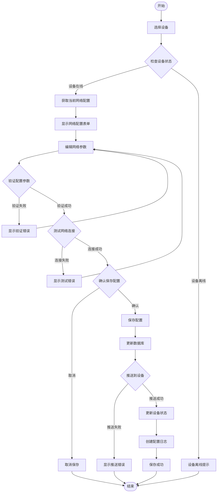

# 01-门禁设备管理 - 业务流程图

> **模块编号**: 01
> **模块名称**: 门禁设备管理
> **文档类型**: 业务流程图
> **创建日期**: 2025-12-17

---

## 📋 流程概述

本文档包含门禁设备管理模块的完整业务流程图，基于备份文档中的业务需求和IOE-DREAM全局架构规范，确保流程设计的完整性和一致性。

---

## 🔄 核心业务流程

### 1. 设备注册流程

#### 1.1 自动设备发现流程

#### 1.2 手动设备添加流程

#### 1.3 批量设备导入流程

### 2. 设备配置管理流程

#### 2.1 网络配置流程

#### 2.2 功能配置流程

### 3. 设备监控管理流程

#### 3.1 实时状态监控流程

#### 3.2 健康检查流程

### 4. 设备控制管理流程

#### 4.1 远程门控流程

#### 4.2 固件升级流程

### 5. 设备维护管理流程

#### 5.1 预防性维护流程

---

## 🎯 流程关键控制点

### 1. 设备注册控制点

1. **设备类型验证**: 确保只有支持的设备类型才能注册
2. **网络连接测试**: 注册前必须验证网络连接正常
3. **配置数据验证**: 所有配置数据必须符合规范要求
4. **权限检查**: 只有授权用户才能执行设备注册

### 2. 设备配置控制点

1. **配置参数验证**: 所有配置参数必须通过有效性验证
2. **设备状态检查**: 配置前检查设备在线状态
3. **配置同步确认**: 配置必须成功同步到设备
4. **操作日志记录**: 所有配置操作必须记录审计日志

### 3. 设备监控控制点

1. **心跳检测**: 定期检测设备心跳状态
2. **性能指标采集**: 实时采集设备性能指标
3. **异常状态识别**: 及时识别设备异常状态
4. **告警通知**: 关键异常必须及时通知相关人员

### 4. 设备控制控制点

1. **权限验证**: 严格控制设备操作权限
2. **操作确认**: 重要操作需要二次确认
3. **状态同步**: 控制操作后必须同步设备状态
4. **审计记录**: 所有控制操作必须记录完整日志

---

## 📊 流程性能指标

### 响应时间指标

| 流程类型 | 目标响应时间 | 测量方法 |
|---------|-------------|---------|
| 设备注册 | ≤30秒 | 从开始到注册完成 |
| 配置更新 | ≤10秒 | 从保存到设备生效 |
| 状态监控 | ≤5秒 | 状态变更到系统显示 |
| 远程控制 | ≤500ms | 从发送到设备响应 |

### 成功率指标

| 流程类型 | 目标成功率 | 计算方法 |
|---------|------------|---------|
| 设备注册 | ≥99% | 成功注册/总注册数 |
| 配置同步 | ≥99.5% | 成功同步/总配置数 |
| 设备发现 | ≥95% | 发现设备/总设备数 |
| 固件升级 | ≥98% | 成功升级/总升级数 |

---

## 📚 相关文档

- [功能说明](./功能说明.md)
- [用户故事](./用户故事.md)
- [数据结构设计](./数据结构设计.md)
- [API接口设计](./API接口设计.md)
- [验收测试用例](./验收测试用例.md)

---

**📝 文档信息**
- **创建人**: 门禁设备管理模块组
- **审核人**: 业务流程设计师
- **最后更新**: 2025-12-17
- **版本**: v1.0.0