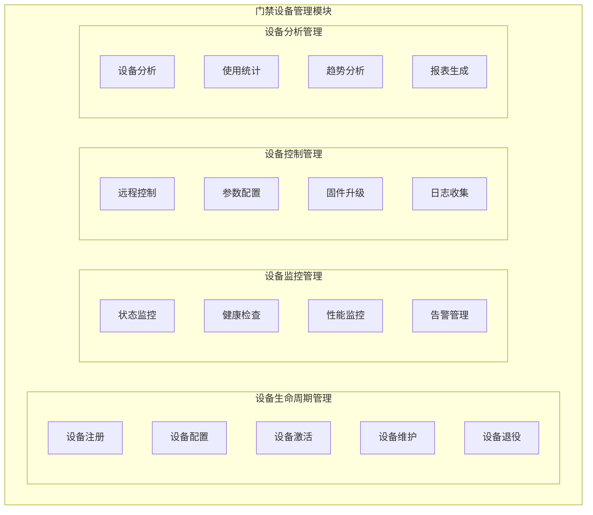
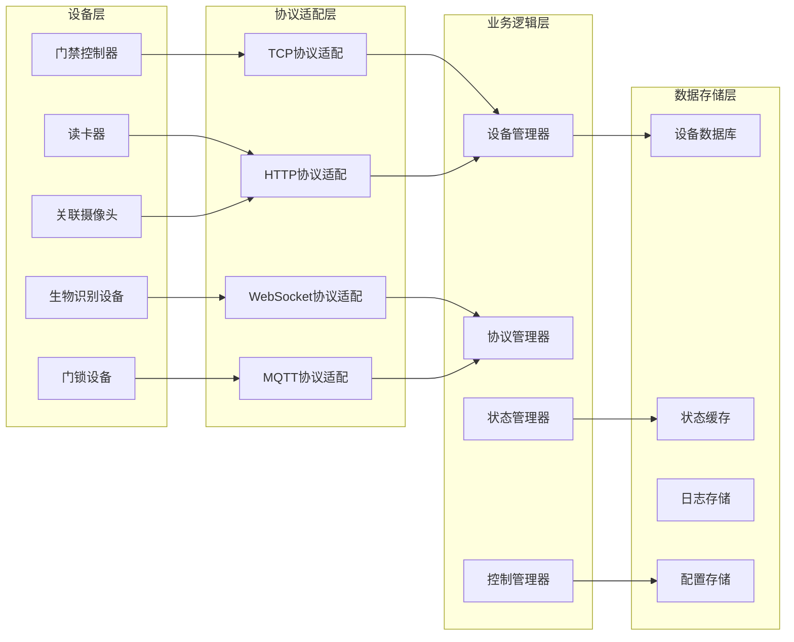

# 01-门禁设备管理 - 功能说明

> **模块编号**: 01
> **模块名称**: 门禁设备管理
> **优先级**: P0
> **创建日期**: 2025-12-17
> **适用范围**: IOE-DREAM智慧门禁管理微服务

---

## 📋 模块概述

门禁设备管理模块是门禁微服务的核心基础模块，负责对园区内所有门禁设备的全生命周期管理，包括设备注册、配置、监控、控制和维护等功能。

### 🎯 核心价值

- **设备统一管理**: 建立园区门禁设备的统一管理体系
- **状态实时监控**: 实时掌握设备运行状态和健康状况
- **远程控制能力**: 支持远程设备控制和参数调整
- **维护保障机制**: 确保设备故障及时发现和处理

---

## 🏗️ 系统架构

### 功能架构图



### 数据流架构



---

## 🎯 功能需求

### 1. 设备注册管理

#### 1.1 自动设备发现
**用户故事**: 作为系统管理员，我希望系统能够自动发现网络中的门禁设备，以便快速完成设备部署。

**前置条件**:
- 设备已连接到园区网络
- 设备支持标准发现协议
- 管理员具有设备管理权限

**操作步骤**:
1. 启动设备发现功能
2. 系统扫描指定网段或设备类型
3. 自动识别发现的门禁设备
4. 列出可注册的设备列表
5. 选择设备进行注册配置

**后置结果**:
- 设备信息录入系统数据库
- 设备获得唯一设备ID
- 设备状态标记为"待激活"

#### 1.2 手动设备注册
**用户故事**: 作为系统管理员，我希望能够手动添加门禁设备信息，以便支持不支持自动发现的设备。

**前置条件**:
- 管理员了解设备基本信息
- 设备网络连接正常
- 具有设备管理权限

**操作步骤**:
1. 进入设备注册页面
2. 填写设备基本信息（名称、型号、厂商等）
3. 配置设备网络参数
4. 设置设备访问凭证
5. 测试设备连接
6. 完成设备注册

**后置结果**:
- 设备信息保存到系统
- 设备连接状态确认
- 设备可以接受远程管理

#### 1.3 批量设备导入
**用户故事**: 作为系统管理员，我希望能够批量导入大量设备信息，以便快速完成园区设备部署。

**前置条件**:
- 有完整的设备信息清单
- 设备信息格式符合模板要求
- 具有批量操作权限

**操作步骤**:
1. 下载设备导入模板
2. 按照模板填写设备信息
3. 上传设备信息文件
4. 系统验证数据格式
5. 批量导入设备信息
6. 显示导入结果和错误报告

**后置结果**:
- 批量设备信息录入系统
- 错误设备单独标识
- 生成导入结果报告

### 2. 设备配置管理

#### 2.1 基本信息配置
**用户故事**: 作为系统管理员，我希望能够配置设备的基本信息，以便正确标识和管理设备。

**功能描述**:
- 设备名称和描述管理
- 设备位置和区域分配
- 设备类型和分类管理
- 设备厂商和型号信息
- 设备购买和维保信息

**配置字段**:
```yaml
device_basic_config:
  device_name: 设备名称
  device_code: 设备编码
  device_type: 设备类型
  manufacturer: 生产厂商
  model: 设备型号
  serial_number: 序列号
  install_date: 安装日期
  location: 安装位置
  area_id: 所属区域ID
  responsible_person: 负责人
  warranty_period: 保修期
  purchase_date: 购买日期
```

#### 2.2 网络配置
**用户故事**: 作为系统管理员，我希望能够配置设备的网络参数，以便确保设备与系统正常通信。

**功能描述**:
- IP地址和端口配置
- 网络协议和端口号设置
- 网络认证信息管理
- 连接超时和重试策略
- 网络状态检测配置

**配置参数**:
```yaml
network_config:
  ip_address: 192.168.1.100
  port: 8080
  protocol: TCP
  username: admin
  password: encrypted_password
  timeout: 30秒
  retry_count: 3
  heartbeat_interval: 60秒
  ssl_enabled: true
  certificate_path: /path/to/cert
```

#### 2.3 功能配置
**用户故事**: 作为系统管理员，我希望能够配置设备的各项功能参数，以便根据业务需求定制设备行为。

**功能配置项**:
- 门控时间设置（开门保持时间、关门时间）
- 认证方式配置（卡片、密码、生物识别）
- 通行方向设置（进入、退出、双向）
- 反潜回功能开关
- 异常处理策略（多次失败锁定）
- 报警触发条件配置

**功能配置示例**:
```yaml
function_config:
  door_control:
    open_time: 3秒
    close_time: 2秒
    auto_lock: true
    force_open: false

  authentication:
    card_enabled: true
    password_enabled: true
    face_enabled: true
    fingerprint_enabled: false
    multi_factor_required: false

  direction:
    entry_allowed: true
    exit_allowed: true
    dual_direction: false

  security:
    anti_passback: true
    password_retry_limit: 3
    lock_time: 300秒
    alarm_enabled: true
```

### 3. 设备监控管理

#### 3.1 实时状态监控
**用户故事**: 作为运维人员，我希望能够实时查看设备运行状态，以便及时发现和解决问题。

**监控指标**:
- 设备在线/离线状态
- CPU和内存使用率
- 网络连接质量
- 设备响应时间
- 错误率和故障率

**状态展示**:
```yaml
device_status:
  online_status: 在线/离线
  last_heartbeat: 2025-12-17 10:30:00
  cpu_usage: 15%
  memory_usage: 45%
  network_quality: 良好
  response_time: 50ms
  error_count: 0
  device_temperature: 35°C
  power_status: 正常
```

#### 3.2 健康检查
**用户故事**: 作为运维人员，我希望系统能够定期检查设备健康状况，以便预防设备故障。

**检查项目**:
- 网络连通性检查
- 设备响应性能测试
- 功能模块状态检查
- 存储空间检查
- 电池电量检查（如果适用）

**健康评估**:
```yaml
health_check_result:
  overall_health: 健康/警告/故障
  network_status: 正常
  response_performance: 正常
  functional_modules: 正常
  storage_space: 正常
  battery_level: 85%
  last_check: 2025-12-17 10:00:00
  recommended_actions: []
```

#### 3.3 性能监控
**用户故事**: 作为系统分析师，我希望能够监控设备性能数据，以便优化系统配置和资源分配。

**性能指标**:
- 认证响应时间统计
- 设备处理能力监控
- 并发访问量统计
- 错误率趋势分析
- 设备使用率统计

### 4. 设备控制管理

#### 4.1 远程门控
**用户故事**: 作为安保人员，我希望能够远程控制门禁设备，以便处理紧急情况和特殊通行需求。

**控制功能**:
- 远程开门
- 远程关门
- 门锁状态锁定/解锁
- 紧急开门模式
- 维护模式切换

**控制接口**:
```java
POST /api/v1/access/devices/{deviceId}/control
{
  "action": "open", // open/close/lock/unlock
  "duration": 5,    // 开门持续时间（秒）
  "reason": "访客通行",
  "operatorId": 12345,
  "timestamp": 1703123456789
}
```

#### 4.2 参数远程配置
**用户故事**: 作为系统管理员，我希望能够远程修改设备配置参数，以便快速调整设备行为。

**配置功能**:
- 实时参数更新
- 配置模板应用
- 批量参数设置
- 配置回滚功能
- 配置变更记录

#### 4.3 固件升级管理
**用户故事**: 作为运维人员，我希望能够远程升级设备固件，以便修复漏洞和添加新功能。

**升级流程**:
1. 固件文件上传
2. 升级计划制定
3. 设备备份当前固件
4. 执行固件升级
5. 升级结果验证
6. 失败回滚处理

### 5. 设备维护管理

#### 5.1 维护计划管理
**用户故事**: 作为设备管理员，我希望能够制定设备维护计划，以便确保设备长期稳定运行。

**维护类型**:
- 定期巡检维护
- 预防性维护
- 故障维修处理
- 设备清洁保养
- 部件更换计划

#### 5.2 故障处理流程
**用户故事**: 作为运维人员，我希望有完整的设备故障处理流程，以便快速恢复设备正常运行。

**处理流程**:
1. 故障自动检测和报告
2. 故障级别评估
3. 维修工单自动生成
4. 维修人员分派
5. 维修进度跟踪
6. 维修结果验证
7. 故障分析和改进

### 6. 设备分析管理

#### 6.1 使用统计分析
**用户故事**: 作为管理层，我希望能够查看设备使用统计，以便了解设备使用情况和优化资源配置。

**统计维度**:
- 设备使用频率统计
- 通行人次统计
- 设备故障率分析
- 维护成本统计
- 设备寿命周期分析

#### 6.2 趋势分析
**用户故事**: 作为规划人员，我希望能够分析设备使用趋势，以便制定设备更新和扩容计划。

**分析内容**:
- 设备性能变化趋势
- 故障发生规律分析
- 使用量增长预测
- 设备更新建议
- 投资回报分析

---

## 📊 非功能需求

### 性能需求

| 性能指标 | 要求值 | 测量方法 |
|---------|-------|---------|
| 设备状态查询响应时间 | ≤100ms | 95%请求 |
| 设备控制响应时间 | ≤500ms | 99%请求 |
| 并发设备监控数量 | ≥5000台 | 同时在线 |
| 设备发现扫描时间 | ≤30秒 | 单次扫描 |
| 配置更新生效时间 | ≤10秒 | 实时生效 |

### 可靠性需求

| 可靠性指标 | 要求值 | 说明 |
|-----------|-------|------|
| 系统可用性 | ≥99.9% | 年度目标 |
| 数据一致性 | 100% | 设备状态同步 |
| 故障恢复时间 | ≤5分钟 | 自动恢复 |
| 数据备份频率 | 每日一次 | 增量备份 |
| 灾难恢复时间 | ≤2小时 | RTO指标 |

### 安全性需求

| 安全要求 | 具体措施 |
|---------|---------|
| 访问控制 | 基于角色的权限管理 |
| 数据传输 | HTTPS + TLS 1.3 |
| 数据存储 | AES-256加密存储 |
| 操作审计 | 完整的操作日志记录 |
| 身份认证 | 多因子认证机制 |

### 可扩展性需求

| 扩展性指标 | 要求值 |
|-----------|-------|
| 设备容量 | 支持10万+设备 |
| 用户并发 | 支持1万+并发用户 |
| 数据存储 | 支持PB级数据 |
| 地域扩展 | 支持多地域部署 |
| 协议扩展 | 支持新协议插件化 |

### 易用性需求

| 易用性要求 | 具体标准 |
|-----------|---------|
| 界面友好 | 符合用户体验设计规范 |
| 操作简便 | 关键操作≤3步完成 |
| 学习成本 | 新用户30分钟上手 |
| 错误提示 | 清晰的错误信息和解决建议 |
| 多语言 | 支持中英文界面 |

---

## ✅ 验收标准

### 功能验收标准

#### 设备注册管理
- [ ] 自动设备发现功能正常，扫描覆盖率100%
- [ ] 手动设备注册支持所有设备类型
- [ ] 批量导入支持Excel/CSV格式，错误率<1%
- [ ] 设备信息完整性验证，关键字段非空率100%

#### 设备配置管理
- [ ] 基本信息配置支持所有必要字段
- [ ] 网络配置支持主流协议，配置成功率100%
- [ ] 功能配置参数实时生效，生效时间≤10秒
- [ ] 配置模板功能正常，模板应用成功率100%

#### 设备监控管理
- [ ] 实时状态监控延迟≤5秒
- [ ] 健康检查覆盖率100%，误报率<0.1%
- [ ] 性能监控数据准确性≥99.9%
- [ ] 状态告警响应时间≤1分钟

#### 设备控制管理
- [ ] 远程门控成功率99.9%，响应时间≤500ms
- [ ] 参数远程配置成功率100%，生效时间≤10秒
- [ ] 固件升级成功率99%，失败回滚率100%
- [ ] 控制操作日志完整性100%

#### 设备维护管理
- [ ] 维护计划自动提醒准确率100%
- [ ] 故障处理流程完整，处理跟踪率100%
- [ ] 维修记录完整，数据准确性100%
- [ ] 设备生命周期管理完整，覆盖100%设备

#### 设备分析管理
- [ ] 统计报表数据准确性100%
- [ ] 趋势分析预测准确率≥90%
- [ ] 分析报表生成时间≤30秒
- [ ] 数据可视化展示，图表准确率100%

### 性能验收标准

- [ ] 设备状态查询响应时间≤100ms（95%请求）
- [ ] 设备控制响应时间≤500ms（99%请求）
- [ ] 支持5000台设备同时在线监控
- [ ] 设备发现扫描时间≤30秒
- [ ] 系统可用性≥99.9%

### 安全验收标准

- [ ] 通过国家三级等保安全测评
- [ ] 通过第三方渗透测试
- [ ] 数据传输全程加密，无明文传输
- [ ] 操作审计日志完整，覆盖100%操作
- [ ] 权限控制严格执行，无越权访问

### 兼容性验收标准

- [ ] 支持主流操作系统浏览器
- [ ] 支持主流门禁设备厂商协议
- [ ] 支持移动端设备访问
- [ ] 支持多语言界面
- [ ] 支持API接口标准化

---

## 🚀 实施计划

### 第一阶段：基础功能（1-2周）
- 设备注册管理
- 基本配置管理
- 简单监控功能

### 第二阶段：核心功能（2-3周）
- 实时状态监控
- 远程控制管理
- 健康检查功能

### 第三阶段：高级功能（2-3周）
- 设备分析管理
- 维护管理
- 性能优化

### 第四阶段：完善优化（1-2周）
- 性能调优
- 安全加固
- 测试验收

---

## 📚 相关文档

- [用户故事详细说明](./用户故事.md)
- [数据结构设计](./数据结构设计.md)
- [业务流程图](./业务流程图.md)
- [API接口设计](./API接口设计.md)
- [验收测试用例](./验收测试用例.md)

---

**📝 文档信息**
- **创建人**: 门禁设备管理模块组
- **审核人**: 架构委员会
- **最后更新**: 2025-12-17
- **版本**: v1.0.0