# 01-门禁设备管理 - 数据结构设计

> **模块编号**: 01
> **模块名称**: 门禁设备管理
> **文档类型**: 数据结构设计ER
> **创建日期**: 2025-12-17
> **技术规范**: IOE-DREAM全局架构规范

---

## 📋 数据库设计概述

本文档基于IOE-DREAM全局数据库架构规范，设计门禁设备管理模块的数据结构。遵循以下设计原则：

### 设计原则

1. **统一规范**: 遵循IOE-DREAM统一数据库命名规范
2. **四层架构**: 支持Controller → Service → Manager → DAO分层
3. **性能优化**: 合理设计索引，支持高并发访问
4. **扩展性**: 支持水平扩展和数据分区
5. **数据安全**: 敏感数据加密存储，审计日志完整

### 技术栈

- **数据库**: MySQL 8.0
- **ORM框架**: MyBatis-Plus 3.5.15
- **连接池**: Druid
- **缓存**: Redis多级缓存
- **数据迁移**: Flyway

---

## 🗄️ 数据库表结构设计

### 1. 设备基础信息表 (t_access_device)

门禁设备的基础信息表，存储设备的核心属性。

```sql
CREATE TABLE t_access_device (
    -- 主键字段
    device_id BIGINT PRIMARY KEY AUTO_INCREMENT COMMENT '设备ID',

    -- 设备基本信息
    device_code VARCHAR(64) NOT NULL UNIQUE COMMENT '设备编码',
    device_name VARCHAR(100) NOT NULL COMMENT '设备名称',
    device_type TINYINT NOT NULL COMMENT '设备类型: 1-门禁控制器 2-读卡器 3-生物识别设备 4-门锁 5-摄像头',
    device_subtype TINYINT DEFAULT NULL COMMENT '设备子类型',
    manufacturer VARCHAR(50) DEFAULT NULL COMMENT '生产厂商',
    model VARCHAR(50) DEFAULT NULL COMMENT '设备型号',
    serial_number VARCHAR(100) DEFAULT NULL COMMENT '序列号',

    -- 位置信息
    area_id BIGINT NOT NULL COMMENT '所属区域ID',
    location_detail VARCHAR(200) DEFAULT NULL COMMENT '详细位置',
    install_position VARCHAR(100) DEFAULT NULL COMMENT '安装位置',
    floor_number INT DEFAULT NULL COMMENT '楼层号',
    room_number VARCHAR(50) DEFAULT NULL COMMENT '房间号',

    -- 网络配置
    ip_address VARCHAR(45) DEFAULT NULL COMMENT 'IP地址',
    port INT DEFAULT 8080 COMMENT '端口号',
    protocol_type TINYINT DEFAULT 1 COMMENT '协议类型: 1-TCP 2-HTTP 3-WebSocket 4-MQTT',
    network_status TINYINT DEFAULT 0 COMMENT '网络状态: 0-未知 1-正常 2-异常',

    -- 状态信息
    device_status TINYINT DEFAULT 1 COMMENT '设备状态: 0-停用 1-正常 2-故障 3-维护 4-离线',
    online_status TINYINT DEFAULT 0 COMMENT '在线状态: 0-离线 1-在线',
    last_online_time DATETIME DEFAULT NULL COMMENT '最后在线时间',

    -- 管理信息
    responsible_user_id BIGINT DEFAULT NULL COMMENT '负责人ID',
    responsible_dept_id BIGINT DEFAULT NULL COMMENT '负责部门ID',
    install_date DATE DEFAULT NULL COMMENT '安装日期',
    warranty_expire_date DATE DEFAULT NULL COMMENT '保修到期日',

    -- 技术参数
    max_users INT DEFAULT 0 COMMENT '最大用户数',
    max_records INT DEFAULT 0 COMMENT '最大记录数',
    power_supply TINYINT DEFAULT 1 COMMENT '供电方式: 1-市电 2-电池 3-双供电',
    working_temperature_min INT DEFAULT NULL COMMENT '最低工作温度',
    working_temperature_max INT DEFAULT NULL COMMENT '最高工作温度',
    working_humidity_min INT DEFAULT NULL COMMENT '最低工作湿度',
    working_humidity_max INT DEFAULT NULL COMMENT '最高工作湿度',

    -- 功能特性
    support_card TINYINT DEFAULT 1 COMMENT '支持卡片: 0-否 1-是',
    support_password TINYINT DEFAULT 0 COMMENT '支持密码: 0-否 1-是',
    support_face TINYINT DEFAULT 0 COMMENT '支持人脸: 0-否 1-是',
    support_fingerprint TINYINT DEFAULT 0 COMMENT '支持指纹: 0-否 1-是',
    support_palm TINYINT DEFAULT 0 COMMENT '支持掌纹: 0-否 1-是',
    support_iris TINYINT DEFAULT 0 COMMENT '支持虹膜: 0-否 1-是',
    support_voice TINYINT DEFAULT 0 COMMENT '支持声纹: 0-否 1-是',

    -- 安全配置
    encryption_enabled TINYINT DEFAULT 1 COMMENT '启用加密: 0-否 1-是',
    anti_passback_enabled TINYINT DEFAULT 0 COMMENT '启用反潜回: 0-否 1-是',
    duress_alarm_enabled TINYINT DEFAULT 0 COMMENT '启用胁迫报警: 0-否 1-是',
    tamper_alarm_enabled TINYINT DEFAULT 1 COMMENT '启用防拆报警: 0-否 1-是',

    -- 审计字段
    create_time DATETIME NOT NULL DEFAULT CURRENT_TIMESTAMP COMMENT '创建时间',
    create_user_id BIGINT DEFAULT NULL COMMENT '创建人ID',
    update_time DATETIME NOT NULL DEFAULT CURRENT_TIMESTAMP ON UPDATE CURRENT_TIMESTAMP COMMENT '更新时间',
    update_user_id BIGINT DEFAULT NULL COMMENT '更新人ID',
    deleted_flag TINYINT DEFAULT 0 COMMENT '删除标志: 0-正常 1-删除',
    version INT DEFAULT 0 COMMENT '乐观锁版本号',

    -- 索引
    INDEX idx_device_code (device_code),
    INDEX idx_device_type (device_type),
    INDEX idx_area_id (area_id),
    INDEX idx_device_status (device_status),
    INDEX idx_online_status (online_status),
    INDEX idx_responsible_user (responsible_user_id),
    INDEX idx_last_online_time (last_online_time),
    INDEX idx_create_time (create_time),

    -- 外键约束
    FOREIGN KEY (area_id) REFERENCES t_area(area_id),
    FOREIGN KEY (responsible_user_id) REFERENCES t_user(user_id),
    FOREIGN KEY (responsible_dept_id) REFERENCES t_department(department_id)
) ENGINE=InnoDB DEFAULT CHARSET=utf8mb4 COMMENT='门禁设备基础信息表';
```

### 2. 设备网络配置表 (t_access_device_network)

存储设备的网络配置和连接参数。

```sql
CREATE TABLE t_access_device_network (
    -- 主键字段
    config_id BIGINT PRIMARY KEY AUTO_INCREMENT COMMENT '配置ID',
    device_id BIGINT NOT NULL COMMENT '设备ID',

    -- 网络基础配置
    ip_address VARCHAR(45) NOT NULL COMMENT 'IP地址',
    subnet_mask VARCHAR(45) DEFAULT NULL COMMENT '子网掩码',
    gateway VARCHAR(45) DEFAULT NULL COMMENT '网关',
    dns_server VARCHAR(45) DEFAULT NULL COMMENT 'DNS服务器',
    port INT DEFAULT 8080 COMMENT '端口号',

    -- 协议配置
    protocol_type TINYINT DEFAULT 1 COMMENT '协议类型: 1-TCP 2-HTTP 3-WebSocket 4-MQTT',
    connection_timeout INT DEFAULT 30 COMMENT '连接超时(秒)',
    read_timeout INT DEFAULT 60 COMMENT '读取超时(秒)',
    heartbeat_interval INT DEFAULT 60 COMMENT '心跳间隔(秒)',
    retry_count INT DEFAULT 3 COMMENT '重试次数',

    -- 认证配置
    auth_type TINYINT DEFAULT 0 COMMENT '认证类型: 0-无认证 1-用户名密码 2-证书',
    auth_username VARCHAR(100) DEFAULT NULL COMMENT '认证用户名',
    auth_password_encrypted VARCHAR(500) DEFAULT NULL COMMENT '加密的认证密码',
    certificate_path VARCHAR(500) DEFAULT NULL COMMENT '证书路径',
    private_key_path VARCHAR(500) DEFAULT NULL COMMENT '私钥路径',

    -- SSL/TLS配置
    ssl_enabled TINYINT DEFAULT 0 COMMENT '启用SSL: 0-否 1-是',
    ssl_version VARCHAR(20) DEFAULT NULL COMMENT 'SSL版本',
    trust_store_path VARCHAR(500) DEFAULT NULL COMMENT '信任库路径',
    verify_hostname TINYINT DEFAULT 1 COMMENT '验证主机名: 0-否 1-是',

    -- 高级配置
    connection_pool_size INT DEFAULT 5 COMMENT '连接池大小',
    max_message_size INT DEFAULT 10240 COMMENT '最大消息大小(KB)',
    compression_enabled TINYINT DEFAULT 0 COMMENT '启用压缩: 0-否 1-是',

    -- 审计字段
    create_time DATETIME NOT NULL DEFAULT CURRENT_TIMESTAMP COMMENT '创建时间',
    create_user_id BIGINT DEFAULT NULL COMMENT '创建人ID',
    update_time DATETIME NOT NULL DEFAULT CURRENT_TIMESTAMP ON UPDATE CURRENT_TIMESTAMP COMMENT '更新时间',
    update_user_id BIGINT DEFAULT NULL COMMENT '更新人ID',
    deleted_flag TINYINT DEFAULT 0 COMMENT '删除标志: 0-正常 1-删除',
    version INT DEFAULT 0 COMMENT '乐观锁版本号',

    -- 索引
    UNIQUE INDEX uk_device_network (device_id, deleted_flag),
    INDEX idx_ip_address (ip_address),
    INDEX idx_protocol_type (protocol_type),

    -- 外键约束
    FOREIGN KEY (device_id) REFERENCES t_access_device(device_id),
    FOREIGN KEY (create_user_id) REFERENCES t_user(user_id),
    FOREIGN KEY (update_user_id) REFERENCES t_user(user_id)
) ENGINE=InnoDB DEFAULT CHARSET=utf8mb4 COMMENT='门禁设备网络配置表';
```

### 3. 设备功能配置表 (t_access_device_function)

存储设备的功能参数配置。

```sql
CREATE TABLE t_access_device_function (
    -- 主键字段
    config_id BIGINT PRIMARY KEY AUTO_INCREMENT COMMENT '配置ID',
    device_id BIGINT NOT NULL COMMENT '设备ID',

    -- 门控配置
    door_open_time INT DEFAULT 3 COMMENT '开门时间(秒)',
    door_close_time INT DEFAULT 2 COMMENT '关门时间(秒)',
    auto_lock_enabled TINYINT DEFAULT 1 COMMENT '自动上锁: 0-否 1-是',
    force_open_enabled TINYINT DEFAULT 0 COMMENT '强制开门: 0-否 1-是',

    -- 认证配置
    card_enabled TINYINT DEFAULT 1 COMMENT '卡片认证: 0-否 1-是',
    password_enabled TINYINT DEFAULT 0 COMMENT '密码认证: 0-否 1-是',
    face_enabled TINYINT DEFAULT 0 COMMENT '人脸认证: 0-否 1-是',
    fingerprint_enabled TINYINT DEFAULT 0 COMMENT '指纹认证: 0-否 1是',
    multi_factor_required TINYINT DEFAULT 0 COMMENT '多因子认证: 0-否 1-是',
    min_auth_factors INT DEFAULT 1 COMMENT '最少认证因子数',

    -- 方向配置
    entry_allowed TINYINT DEFAULT 1 COMMENT '允许进入: 0-否 1-是',
    exit_allowed TINYINT DEFAULT 1 COMMENT '允许退出: 0-否 1-是',
    dual_direction_enabled TINYINT DEFAULT 0 COMMENT '双向通行: 0-否 1-是',

    -- 安全配置
    password_retry_limit INT DEFAULT 3 COMMENT '密码重试限制',
    lock_time INT DEFAULT 300 COMMENT '锁定时间(秒)',
    anti_passback_enabled TINYINT DEFAULT 0 COMMENT '反潜回: 0-否 1-是',
    duress_code VARCHAR(20) DEFAULT NULL COMMENT '胁迫码',
    tamper_alarm_enabled TINYINT DEFAULT 1 COMMENT '防拆报警: 0-否 1-是',

    -- 时间配置
    work_start_time TIME DEFAULT '08:00:00' COMMENT '工作开始时间',
    work_end_time TIME DEFAULT '18:00:00' COMMENT '工作结束时间',
    holiday_enabled TINYINT DEFAULT 1 COMMENT '节假日控制: 0-否 1-是',
    weekend_enabled TINYINT DEFAULT 1 COMMENT '周末控制: 0-否 1-是',

    -- 报警配置
    alarm_enabled TINYINT DEFAULT 1 COMMENT '启用报警: 0-否 1-是',
    alarm_types VARCHAR(100) DEFAULT NULL COMMENT '报警类型(逗号分隔)',
    alarm_notification_enabled TINYINT DEFAULT 1 COMMENT '报警通知: 0-否 1-是',

    -- 扩展配置(JSON格式)
    extended_config JSON DEFAULT NULL COMMENT '扩展配置',

    -- 审计字段
    create_time DATETIME NOT NULL DEFAULT CURRENT_TIMESTAMP COMMENT '创建时间',
    create_user_id BIGINT DEFAULT NULL COMMENT '创建人ID',
    update_time DATETIME NOT NULL DEFAULT CURRENT_TIMESTAMP ON UPDATE CURRENT_TIMESTAMP COMMENT '更新时间',
    update_user_id BIGINT DEFAULT NULL COMMENT '更新人ID',
    deleted_flag TINYINT DEFAULT 0 COMMENT '删除标志: 0-正常 1-删除',
    version INT DEFAULT 0 COMMENT '乐观锁版本号',

    -- 索引
    UNIQUE INDEX uk_device_function (device_id, deleted_flag),
    INDEX idx_card_enabled (card_enabled),
    INDEX idx_anti_passback (anti_passback_enabled),
    INDEX idx_alarm_enabled (alarm_enabled),

    -- 外键约束
    FOREIGN KEY (device_id) REFERENCES t_access_device(device_id),
    FOREIGN KEY (create_user_id) REFERENCES t_user(user_id),
    FOREIGN KEY (update_user_id) REFERENCES t_user(user_id)
) ENGINE=InnoDB DEFAULT CHARSET=utf8mb4 COMMENT='门禁设备功能配置表';
```

### 4. 设备状态监控表 (t_access_device_monitor)

存储设备的实时监控数据。

```sql
CREATE TABLE t_access_device_monitor (
    -- 主键字段
    monitor_id BIGINT PRIMARY KEY AUTO_INCREMENT COMMENT '监控记录ID',
    device_id BIGINT NOT NULL COMMENT '设备ID',

    -- 状态信息
    online_status TINYINT NOT NULL COMMENT '在线状态: 0-离线 1-在线',
    device_status TINYINT NOT NULL COMMENT '设备状态: 0-停用 1-正常 2-故障 3-维护 4-离线',
    network_status TINYINT NOT NULL COMMENT '网络状态: 0-未知 1-正常 2-异常',

    -- 性能指标
    cpu_usage DECIMAL(5,2) DEFAULT 0.00 COMMENT 'CPU使用率(%)',
    memory_usage DECIMAL(5,2) DEFAULT 0.00 COMMENT '内存使用率(%)',
    disk_usage DECIMAL(5,2) DEFAULT 0.00 COMMENT '磁盘使用率(%)',
    temperature DECIMAL(5,2) DEFAULT 0.00 COMMENT '设备温度(°C)',
    power_voltage DECIMAL(6,2) DEFAULT 0.00 COMMENT '电源电压(V)',

    -- 网络指标
    response_time INT DEFAULT 0 COMMENT '响应时间(毫秒)',
    network_quality TINYINT DEFAULT 0 COMMENT '网络质量: 0-差 1-一般 2-良好 3-优秀',
    packet_loss_rate DECIMAL(5,2) DEFAULT 0.00 COMMENT '丢包率(%)',
    bandwidth_usage DECIMAL(8,2) DEFAULT 0.00 COMMENT '带宽使用(KB/s)',

    -- 业务指标
    today_access_count INT DEFAULT 0 COMMENT '今日通行次数',
    today_error_count INT DEFAULT 0 COMMENT '今日错误次数',
    total_access_count BIGINT DEFAULT 0 COMMENT '总通行次数',
    total_error_count BIGINT DEFAULT 0 COMMENT '总错误次数',
    last_access_time DATETIME DEFAULT NULL COMMENT '最后通行时间',
    last_error_time DATETIME DEFAULT NULL COMMENT '最后错误时间',

    -- 健康评分
    health_score TINYINT DEFAULT 100 COMMENT '健康评分(0-100)',
    health_level TINYINT DEFAULT 1 COMMENT '健康等级: 1-优秀 2-良好 3-一般 4-警告 5-故障',

    -- 时间戳
    monitor_time DATETIME NOT NULL DEFAULT CURRENT_TIMESTAMP COMMENT '监控时间',
    heartbeat_time DATETIME DEFAULT NULL COMMENT '心跳时间',

    -- 索引
    INDEX idx_device_id (device_id),
    INDEX idx_monitor_time (monitor_time),
    INDEX idx_online_status (online_status),
    INDEX idx_device_status (device_status),
    INDEX idx_health_level (health_level),
    INDEX idx_heartbeat_time (heartbeat_time),

    -- 外键约束
    FOREIGN KEY (device_id) REFERENCES t_access_device(device_id)
) ENGINE=InnoDB DEFAULT CHARSET=utf8mb4 COMMENT='门禁设备状态监控表';
```

### 5. 设备事件记录表 (t_access_device_event)

存储设备的事件日志和报警信息。

```sql
CREATE TABLE t_access_device_event (
    -- 主键字段
    event_id BIGINT PRIMARY KEY AUTO_INCREMENT COMMENT '事件ID',
    device_id BIGINT NOT NULL COMMENT '设备ID',

    -- 事件基本信息
    event_type TINYINT NOT NULL COMMENT '事件类型: 1-通行事件 2-报警事件 3-故障事件 4-维护事件 5-配置事件',
    event_category TINYINT NOT NULL COMMENT '事件分类',
    event_level TINYINT DEFAULT 1 COMMENT '事件级别: 1-信息 2-警告 3-错误 4-严重',
    event_code VARCHAR(20) DEFAULT NULL COMMENT '事件代码',
    event_title VARCHAR(200) NOT NULL COMMENT '事件标题',
    event_description TEXT DEFAULT NULL COMMENT '事件描述',

    -- 关联信息
    user_id BIGINT DEFAULT NULL COMMENT '关联用户ID',
    user_name VARCHAR(100) DEFAULT NULL COMMENT '用户姓名',
    card_number VARCHAR(50) DEFAULT NULL COMMENT '卡号',
    verify_type TINYINT DEFAULT NULL COMMENT '验证类型: 1-卡片 2-密码 3-人脸 4-指纹 5-掌纹 6-虹膜 7-声纹',

    -- 处理信息
    process_status TINYINT DEFAULT 0 COMMENT '处理状态: 0-未处理 1-处理中 2-已处理 3-已忽略',
    process_user_id BIGINT DEFAULT NULL COMMENT '处理人ID',
    process_time DATETIME DEFAULT NULL COMMENT '处理时间',
    process_remark TEXT DEFAULT NULL COMMENT '处理备注',

    -- 时间信息
    event_time DATETIME NOT NULL DEFAULT CURRENT_TIMESTAMP COMMENT '事件时间',
    create_time DATETIME NOT NULL DEFAULT CURRENT_TIMESTAMP COMMENT '创建时间',
    update_time DATETIME NOT NULL DEFAULT CURRENT_TIMESTAMP ON UPDATE CURRENT_TIMESTAMP COMMENT '更新时间',

    -- 扩展字段
    extended_data JSON DEFAULT NULL COMMENT '扩展数据',

    -- 索引
    INDEX idx_device_id (device_id),
    INDEX idx_event_type (event_type),
    INDEX idx_event_level (event_level),
    INDEX idx_process_status (process_status),
    INDEX idx_event_time (event_time),
    INDEX idx_user_id (user_id),
    INDEX idx_verify_type (verify_type),

    -- 外键约束
    FOREIGN KEY (device_id) REFERENCES t_access_device(device_id),
    FOREIGN KEY (user_id) REFERENCES t_user(user_id),
    FOREIGN KEY (process_user_id) REFERENCES t_user(user_id)
) ENGINE=InnoDB DEFAULT CHARSET=utf8mb4 COMMENT='门禁设备事件记录表';
```

### 6. 设备维护记录表 (t_access_device_maintenance)

存储设备的维护保养记录。

```sql
CREATE TABLE t_access_device_maintenance (
    -- 主键字段
    maintenance_id BIGINT PRIMARY KEY AUTO_INCREMENT COMMENT '维护记录ID',
    device_id BIGINT NOT NULL COMMENT '设备ID',

    -- 维护基本信息
    maintenance_type TINYINT NOT NULL COMMENT '维护类型: 1-定期检查 2-预防性维护 3-故障维修 4-清洁保养 5-部件更换',
    maintenance_reason VARCHAR(500) DEFAULT NULL COMMENT '维护原因',
    maintenance_description TEXT DEFAULT NULL COMMENT '维护描述',

    -- 计划信息
    planned_time DATETIME DEFAULT NULL COMMENT '计划时间',
    planned_duration INT DEFAULT NULL COMMENT '计划时长(分钟)',
    maintenance_priority TINYINT DEFAULT 2 COMMENT '维护优先级: 1-紧急 2-一般 3-低',

    -- 执行信息
    actual_start_time DATETIME DEFAULT NULL COMMENT '实际开始时间',
    actual_end_time DATETIME DEFAULT NULL COMMENT '实际结束时间',
    actual_duration INT DEFAULT NULL COMMENT '实际时长(分钟)',
    maintenance_user_id BIGINT DEFAULT NULL COMMENT '维护人员ID',
    maintenance_user_name VARCHAR(100) DEFAULT NULL COMMENT '维护人员姓名',

    -- 结果信息
    maintenance_result TINYINT DEFAULT 0 COMMENT '维护结果: 0-未完成 1-成功 2-部分成功 3-失败',
    maintenance_cost DECIMAL(10,2) DEFAULT 0.00 COMMENT '维护费用',
    replaced_parts TEXT DEFAULT NULL COMMENT '更换部件',
    next_maintenance_time DATETIME DEFAULT NULL COMMENT '下次维护时间',

    -- 验收信息
    acceptance_user_id BIGINT DEFAULT NULL COMMENT '验收人ID',
    acceptance_time DATETIME DEFAULT NULL COMMENT '验收时间',
    acceptance_result TINYINT DEFAULT 0 COMMENT '验收结果: 0-未验收 1-通过 2-不通过',
    acceptance_remark TEXT DEFAULT NULL COMMENT '验收备注',

    -- 审计字段
    create_time DATETIME NOT NULL DEFAULT CURRENT_TIMESTAMP COMMENT '创建时间',
    create_user_id BIGINT DEFAULT NULL COMMENT '创建人ID',
    update_time DATETIME NOT NULL DEFAULT CURRENT_TIMESTAMP ON UPDATE CURRENT_TIMESTAMP COMMENT '更新时间',
    update_user_id BIGINT DEFAULT NULL COMMENT '更新人ID',
    deleted_flag TINYINT DEFAULT 0 COMMENT '删除标志: 0-正常 1-删除',
    version INT DEFAULT 0 COMMENT '乐观锁版本号',

    -- 索引
    INDEX idx_device_id (device_id),
    INDEX idx_maintenance_type (maintenance_type),
    INDEX idx_planned_time (planned_time),
    INDEX idx_maintenance_result (maintenance_result),
    INDEX idx_maintenance_user (maintenance_user_id),
    INDEX idx_acceptance_result (acceptance_result),

    -- 外键约束
    FOREIGN KEY (device_id) REFERENCES t_access_device(device_id),
    FOREIGN KEY (maintenance_user_id) REFERENCES t_user(user_id),
    FOREIGN KEY (acceptance_user_id) REFERENCES t_user(user_id),
    FOREIGN KEY (create_user_id) REFERENCES t_user(user_id),
    FOREIGN KEY (update_user_id) REFERENCES t_user(user_id)
) ENGINE=InnoDB DEFAULT CHARSET=utf8mb4 COMMENT='门禁设备维护记录表';
```

### 7. 设备固件管理表 (t_access_device_firmware)

存储设备固件版本和升级记录。

```sql
CREATE TABLE t_access_device_firmware (
    -- 主键字段
    firmware_id BIGINT PRIMARY KEY AUTO_INCREMENT COMMENT '固件ID',
    device_id BIGINT NOT NULL COMMENT '设备ID',

    -- 固件信息
    firmware_version VARCHAR(50) NOT NULL COMMENT '固件版本',
    firmware_type TINYINT DEFAULT 1 COMMENT '固件类型: 1-主固件 2-辅助固件 3-配置固件',
    firmware_size BIGINT DEFAULT 0 COMMENT '固件大小(字节)',
    firmware_checksum VARCHAR(64) DEFAULT NULL COMMENT '固件校验和',
    firmware_path VARCHAR(500) DEFAULT NULL COMMENT '固件文件路径',

    -- 版本信息
    release_version VARCHAR(50) DEFAULT NULL COMMENT '发布版本',
    release_date DATE DEFAULT NULL COMMENT '发布日期',
    release_notes TEXT DEFAULT NULL COMMENT '发布说明',

    -- 升级信息
    upgrade_type TINYINT DEFAULT 1 COMMENT '升级类型: 1-手动升级 2-自动升级 3-强制升级',
    upgrade_status TINYINT DEFAULT 0 COMMENT '升级状态: 0-未升级 1-升级中 2-升级成功 3-升级失败',
    upgrade_progress INT DEFAULT 0 COMMENT '升级进度(0-100)',
    upgrade_start_time DATETIME DEFAULT NULL COMMENT '升级开始时间',
    upgrade_end_time DATETIME DEFAULT NULL COMMENT '升级结束时间',

    -- 操作信息
    operator_id BIGINT DEFAULT NULL COMMENT '操作人ID',
    operator_name VARCHAR(100) DEFAULT NULL COMMENT '操作人姓名',
    backup_before_upgrade TINYINT DEFAULT 1 COMMENT '升级前备份: 0-否 1-是',
    backup_path VARCHAR(500) DEFAULT NULL COMMENT '备份文件路径',

    -- 结果信息
    upgrade_result TINYINT DEFAULT 0 COMMENT '升级结果: 0-未知 1-成功 2-失败 3-部分成功',
    error_code VARCHAR(50) DEFAULT NULL COMMENT '错误代码',
    error_message TEXT DEFAULT NULL COMMENT '错误信息',
    rollback_version VARCHAR(50) DEFAULT NULL COMMENT '回滚版本',

    -- 审计字段
    create_time DATETIME NOT NULL DEFAULT CURRENT_TIMESTAMP COMMENT '创建时间',
    update_time DATETIME NOT NULL DEFAULT CURRENT_TIMESTAMP ON UPDATE CURRENT_TIMESTAMP COMMENT '更新时间',
    deleted_flag TINYINT DEFAULT 0 COMMENT '删除标志: 0-正常 1-删除',
    version INT DEFAULT 0 COMMENT '乐观锁版本号',

    -- 索引
    INDEX idx_device_id (device_id),
    INDEX idx_firmware_version (firmware_version),
    INDEX idx_upgrade_status (upgrade_status),
    INDEX idx_operator_id (operator_id),
    INDEX idx_create_time (create_time),

    -- 外键约束
    FOREIGN KEY (device_id) REFERENCES t_access_device(device_id),
    FOREIGN KEY (operator_id) REFERENCES t_user(user_id)
) ENGINE=InnoDB DEFAULT CHARSET=utf8mb4 COMMENT='门禁设备固件管理表';
```

### 8. 设备配置模板表 (t_access_device_template)

存储设备配置模板，支持批量配置。

```sql
CREATE TABLE t_access_device_template (
    -- 主键字段
    template_id BIGINT PRIMARY KEY AUTO_INCREMENT COMMENT '模板ID',

    -- 模板基本信息
    template_name VARCHAR(100) NOT NULL COMMENT '模板名称',
    template_code VARCHAR(64) NOT NULL UNIQUE COMMENT '模板编码',
    template_type TINYINT NOT NULL COMMENT '模板类型: 1-设备模板 2-网络模板 3-功能模板',
    device_type TINYINT DEFAULT NULL COMMENT '适用设备类型',
    template_description TEXT DEFAULT NULL COMMENT '模板描述',

    -- 模板配置(JSON格式)
    network_config JSON DEFAULT NULL COMMENT '网络配置',
    function_config JSON DEFAULT NULL COMMENT '功能配置',
    security_config JSON DEFAULT NULL COMMENT '安全配置',
    extended_config JSON DEFAULT NULL COMMENT '扩展配置',

    -- 使用统计
    usage_count INT DEFAULT 0 COMMENT '使用次数',
    last_used_time DATETIME DEFAULT NULL COMMENT '最后使用时间',

    -- 状态信息
    template_status TINYINT DEFAULT 1 COMMENT '模板状态: 0-停用 1-启用',
    is_default TINYINT DEFAULT 0 COMMENT '是否默认模板: 0-否 1-是',

    -- 审计字段
    create_time DATETIME NOT NULL DEFAULT CURRENT_TIMESTAMP COMMENT '创建时间',
    create_user_id BIGINT DEFAULT NULL COMMENT '创建人ID',
    update_time DATETIME NOT NULL DEFAULT CURRENT_TIMESTAMP ON UPDATE CURRENT_TIMESTAMP COMMENT '更新时间',
    update_user_id BIGINT DEFAULT NULL COMMENT '更新人ID',
    deleted_flag TINYINT DEFAULT 0 COMMENT '删除标志: 0-正常 1-删除',
    version INT DEFAULT 0 COMMENT '乐观锁版本号',

    -- 索引
    INDEX idx_template_code (template_code),
    INDEX idx_template_type (template_type),
    INDEX idx_device_type (device_type),
    INDEX idx_template_status (template_status),
    INDEX idx_is_default (is_default),

    -- 外键约束
    FOREIGN KEY (create_user_id) REFERENCES t_user(user_id),
    FOREIGN KEY (update_user_id) REFERENCES t_user(user_id)
) ENGINE=InnoDB DEFAULT CHARSET=utf8mb4 COMMENT='门禁设备配置模板表';
```

### 9. 设备统计数据表 (t_access_device_statistics)

存储设备使用统计和分析数据。

```sql
CREATE TABLE t_access_device_statistics (
    -- 主键字段
    statistics_id BIGINT PRIMARY KEY AUTO_INCREMENT COMMENT '统计ID',
    device_id BIGINT NOT NULL COMMENT '设备ID',

    -- 统计维度
    statistics_date DATE NOT NULL COMMENT '统计日期',
    statistics_type TINYINT NOT NULL COMMENT '统计类型: 1-日统计 2-周统计 3-月统计 4-年统计',
    statistics_period VARCHAR(20) NOT NULL COMMENT '统计周期',

    -- 通行统计
    total_access_count INT DEFAULT 0 COMMENT '总通行次数',
    successful_access_count INT DEFAULT 0 COMMENT '成功通行次数',
    failed_access_count INT DEFAULT 0 COMMENT '失败通行次数',
    access_success_rate DECIMAL(5,2) DEFAULT 0.00 COMMENT '通行成功率(%)',

    -- 时间段统计
    peak_hour_access_count INT DEFAULT 0 COMMENT '高峰时段通行次数',
    off_peak_hour_access_count INT DEFAULT 0 COMMENT '非高峰时段通行次数',
    night_access_count INT DEFAULT 0 COMMENT '夜间通行次数',

    -- 用户类型统计
    staff_access_count INT DEFAULT 0 COMMENT '员工通行次数',
    visitor_access_count INT DEFAULT 0 COMMENT '访客通行次数',
    contractor_access_count INT DEFAULT 0 COMMENT '承包商通行次数',

    -- 认证方式统计
    card_access_count INT DEFAULT 0 COMMENT '卡片认证次数',
    face_access_count INT DEFAULT 0 COMMENT '人脸认证次数',
    fingerprint_access_count INT DEFAULT 0 COMMENT '指纹认证次数',
    password_access_count INT DEFAULT 0 COMMENT '密码认证次数',

    -- 异常统计
    alarm_count INT DEFAULT 0 COMMENT '报警次数',
    error_count INT DEFAULT 0 COMMENT '错误次数',
    offline_duration INT DEFAULT 0 COMMENT '离线时长(分钟)',
    maintenance_duration INT DEFAULT 0 COMMENT '维护时长(分钟)',

    -- 性能统计
    avg_response_time INT DEFAULT 0 COMMENT '平均响应时间(毫秒)',
    max_response_time INT DEFAULT 0 COMMENT '最大响应时间(毫秒)',
    avg_cpu_usage DECIMAL(5,2) DEFAULT 0.00 COMMENT '平均CPU使用率(%)',
    avg_memory_usage DECIMAL(5,2) DEFAULT 0.00 COMMENT '平均内存使用率(%)',

    -- 创建时间
    create_time DATETIME NOT NULL DEFAULT CURRENT_TIMESTAMP COMMENT '创建时间',
    update_time DATETIME NOT NULL DEFAULT CURRENT_TIMESTAMP ON UPDATE CURRENT_TIMESTAMP COMMENT '更新时间',

    -- 唯一索引
    UNIQUE INDEX uk_device_statistics (device_id, statistics_date, statistics_type),

    -- 普通索引
    INDEX idx_statistics_date (statistics_date),
    INDEX idx_statistics_type (statistics_type),
    INDEX idx_total_access_count (total_access_count),

    -- 外键约束
    FOREIGN KEY (device_id) REFERENCES t_access_device(device_id)
) ENGINE=InnoDB DEFAULT CHARSET=utf8mb4 COMMENT='门禁设备统计数据表';
```

---

## 🔗 数据库关系图 (ER图)

### 实体关系图

```mermaid
erDiagram
    t_access_device ||--o{ t_access_device_network : "配置"
    t_access_device ||--o{ t_access_device_function : "配置"
    t_access_device ||--o{ t_access_device_monitor : "监控"
    t_access_device ||--o{ t_access_device_event : "事件"
    t_access_device ||--o{ t_access_device_maintenance : "维护"
    t_access_device ||--o{ t_access_device_firmware : "固件"
    t_access_device ||--o{ t_access_device_statistics : "统计"

    t_access_device }o--|| t_area : "所属区域"
    t_access_device }o--|| t_user : "负责人"
    t_access_device }o--|| t_department : "负责部门"

    t_access_device_event }o--|| t_user : "关联用户"
    t_access_device_event }o--|| t_user : "处理人"

    t_access_device_maintenance }o--|| t_user : "维护人员"
    t_access_device_maintenance }o--|| t_user : "验收人"

    t_access_device_firmware }o--|| t_user : "操作人"

    t_access_device_template ||--o{ t_user : "创建人"
    t_access_device_template ||--o{ t_user : "更新人"

    t_access_device {
        bigint device_id PK
        varchar device_code UK
        varchar device_name
        tinyint device_type
        bigint area_id FK
        tinyint device_status
        tinyint online_status
        varchar ip_address
        int port
        tinyint protocol_type
        bigint responsible_user_id FK
        datetime create_time
        datetime update_time
        tinyint deleted_flag
        int version
    }

    t_access_device_network {
        bigint config_id PK
        bigint device_id FK
        varchar ip_address
        int port
        tinyint protocol_type
        varchar auth_username
        varchar auth_password_encrypted
        tinyint ssl_enabled
        datetime create_time
        tinyint deleted_flag
    }

    t_access_device_function {
        bigint config_id PK
        bigint device_id FK
        int door_open_time
        int door_close_time
        tinyint card_enabled
        tinyint face_enabled
        tinyint anti_passback_enabled
        int password_retry_limit
        json extended_config
        datetime create_time
        tinyint deleted_flag
    }

    t_access_device_monitor {
        bigint monitor_id PK
        bigint device_id FK
        tinyint online_status
        tinyint device_status
        decimal cpu_usage
        decimal memory_usage
        decimal temperature
        int response_time
        int today_access_count
        tinyint health_score
        datetime monitor_time
    }

    t_access_device_event {
        bigint event_id PK
        bigint device_id FK
        tinyint event_type
        tinyint event_level
        varchar event_title
        bigint user_id FK
        tinyint verify_type
        tinyint process_status
        datetime event_time
    }

    t_access_device_maintenance {
        bigint maintenance_id PK
        bigint device_id FK
        tinyint maintenance_type
        datetime planned_time
        datetime actual_start_time
        bigint maintenance_user_id FK
        tinyint maintenance_result
        decimal maintenance_cost
        datetime acceptance_time
        datetime create_time
        tinyint deleted_flag
    }

    t_access_device_firmware {
        bigint firmware_id PK
        bigint device_id FK
        varchar firmware_version
        bigint firmware_size
        tinyint upgrade_status
        datetime upgrade_start_time
        bigint operator_id FK
        tinyint upgrade_result
        datetime create_time
    }

    t_access_device_template {
        bigint template_id PK
        varchar template_name
        varchar template_code UK
        tinyint template_type
        json network_config
        json function_config
        int usage_count
        tinyint template_status
        datetime create_time
        tinyint deleted_flag
    }

    t_access_device_statistics {
        bigint statistics_id PK
        bigint device_id FK
        date statistics_date
        tinyint statistics_type
        int total_access_count
        int successful_access_count
        int failed_access_count
        decimal access_success_rate
        int peak_hour_access_count
        int alarm_count
        int error_count
        datetime create_time
    }
```



---

## 📊 数据库设计规范

### 命名规范

| 对象类型 | 命名规范 | 示例 |
|---------|---------|------|
| 表名 | t_access_模块_功能 | t_access_device |
| 主键 | id_功能 | device_id |
| 外键 | 引用表名_id | user_id |
| 索引 | idx_字段名 | idx_device_type |
| 唯一索引 | uk_字段名 | uk_device_code |

### 字段规范

| 字段类型 | 命名规范 | 说明 |
|---------|---------|------|
| 主键字段 | id_功能 | 自增BIGINT |
| 状态字段 | status/level | 使用TINYINT存储枚举 |
| 时间字段 | time/date | 使用DATETIME/DATE |
| 金额字段 | amount/price | 使用DECIMAL |
| JSON字段 | config/data | 使用JSON类型 |
| 加密字段 | encrypted | 标识加密存储 |

### 索引设计原则

1. **主键索引**: 所有表必须包含自增主键
2. **外键索引**: 所有外键字段必须创建索引
3. **查询索引**: 根据查询频率创建复合索引
4. **唯一索引**: 保证业务数据唯一性
5. **分区索引**: 大表按时间分区

---

## ⚡ 性能优化设计

### 索引优化

```sql
-- 复合索引设计示例
CREATE INDEX idx_device_status_area ON t_access_device(device_status, area_id);
CREATE INDEX idx_event_device_time ON t_access_device_event(device_id, event_time);
CREATE INDEX idx_monitor_device_time ON t_access_device_monitor(device_id, monitor_time);
```

### 分区设计

```sql
-- 事件表按月分区
ALTER TABLE t_access_device_event
PARTITION BY RANGE (MONTH(event_time)) (
    PARTITION p202501 VALUES LESS THAN ('2025-02-01'),
    PARTITION p202502 VALUES LESS THAN ('2025-03-01'),
    PARTITION p202503 VALUES LESS THAN ('2025-04-01'),
    -- ...
    PARTITION pmax VALUES LESS THAN MAXVALUE
);
```

### 缓存策略

```java
// 设备信息缓存
@Cacheable(value = "device:info", key = "#deviceId", unless = "#result == null")
public AccessDeviceEntity getDeviceInfo(Long deviceId) {
    return deviceDao.selectById(deviceId);
}

// 设备状态缓存
@Cacheable(value = "device:status", key = "#deviceId", unless = "#result == null")
public DeviceStatusVO getDeviceStatus(Long deviceId) {
    return deviceStatusMapper.selectByDeviceId(deviceId);
}
```

---

## 🔒 数据安全设计

### 敏感数据加密

```sql
-- 密码字段加密存储
auth_password_encrypted VARCHAR(500) COMMENT 'AES-256加密的认证密码',

-- 配置敏感信息加密
extended_config JSON COMMENT '敏感配置数据加密存储'
```

### 访问控制

```sql
-- 行级安全策略
CREATE POLICY device_access_policy ON t_access_device
FOR ALL TO access_app_user
USING (area_id IN (
    SELECT area_id FROM t_user_area_permission WHERE user_id = current_user_id()
));
```

### 审计日志

```sql
-- 审计字段设计
create_time DATETIME NOT NULL DEFAULT CURRENT_TIMESTAMP COMMENT '创建时间',
create_user_id BIGINT DEFAULT NULL COMMENT '创建人ID',
update_time DATETIME NOT NULL DEFAULT CURRENT_TIMESTAMP ON UPDATE CURRENT_TIMESTAMP COMMENT '更新时间',
update_user_id BIGINT DEFAULT NULL COMMENT '更新人ID',
```

---

## 📚 相关文档

- [功能说明](./功能说明.md)
- [用户故事](./用户故事.md)
- [业务流程图](./业务流程图.md)
- [API接口设计](./API接口设计.md)
- [验收测试用例](./验收测试用例.md)

---

**📝 文档信息**
- **创建人**: 门禁设备管理模块组
- **审核人**: 数据库架构师
- **最后更新**: 2025-12-17
- **版本**: v1.0.0