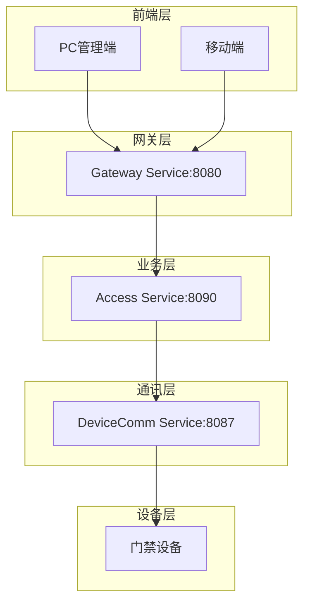
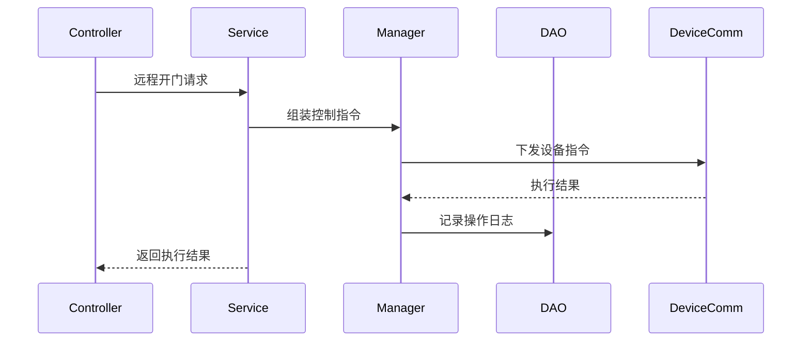
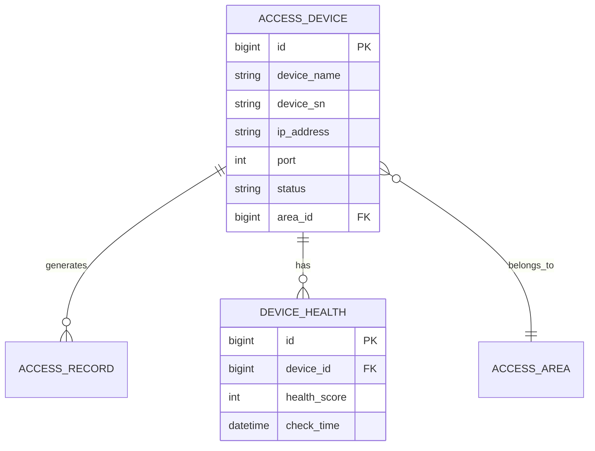

# 门禁设备管理 - 概要设计说明书

> **版本**: v1.0.0  
> **微服务**: ioedream-access-service (8090)  
> **创建日期**: 2025-12-17

---

## 🏗️ 系统架构

### 架构风格
- **微服务架构**: 独立部署的门禁服务
- **四层架构**: Controller → Service → Manager → DAO

### 架构图

---

## 📦 模块设计

### 核心模块

| 模块 | 职责 | 关键类 |
|------|------|--------|
| 设备管理 | 设备CRUD、配置管理 | AccessDeviceService |
| 远程控制 | 设备指令下发 | AccessDeviceController |
| 状态监控 | 设备健康监控 | DeviceHealthService |
| AI分析 | 设备状态预测 | AIAnalysisService |

### 模块交互

---

## 📊 数据库概念模型

---

## 🔧 技术选型

| 技术 | 选型 | 理由 |
|------|------|------|
| 框架 | Spring Boot 3.5.8 | 企业级微服务标准 |
| 数据库 | MySQL 8.0 | 关系型数据存储 |
| 缓存 | Redis + Caffeine | 多级缓存提升性能 |
| 通讯 | MQTT/TCP | 设备协议适配 |

---

**📝 文档维护**: IOE-DREAM架构团队 | 2025-12-17
