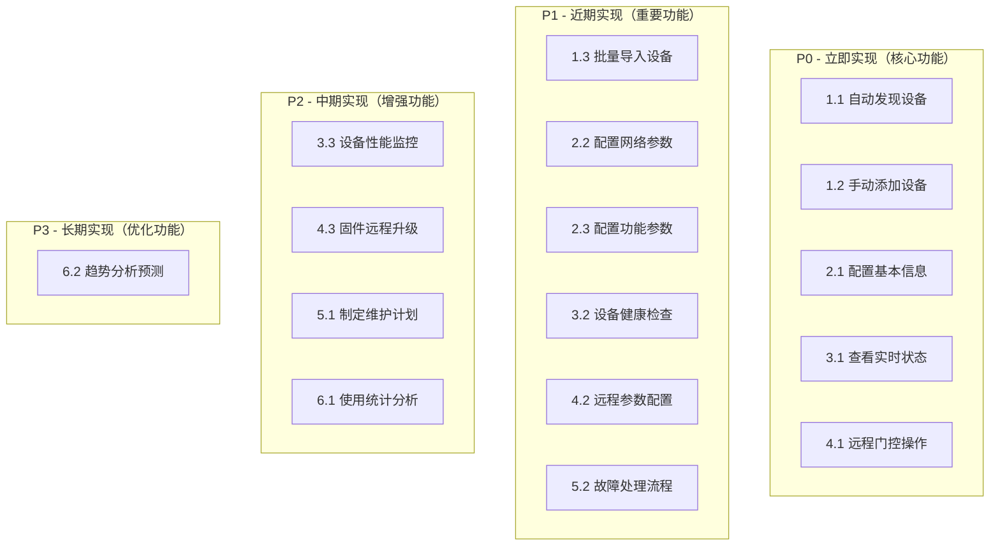

# 01-门禁设备管理 - 用户故事

> **模块编号**: 01
> **模块名称**: 门禁设备管理
> **文档类型**: 用户故事
> **创建日期**: 2025-12-17

---

## 📋 用户故事总览

门禁设备管理模块的用户故事基于备份文档中的功能需求分析，确保所有原始需求完整转化为用户可理解的使用场景。

---

## 👥 角色定义

### 主要用户角色

| 角色名称 | 角色描述 | 核心诉求 |
|---------|---------|---------|
| **系统管理员** | 负责门禁系统的整体管理和配置 | 系统稳定、配置灵活、管理便捷 |
| **设备管理员** | 专门负责门禁设备的安装、配置和维护 | 设备管理高效、故障处理及时 |
| **运维工程师** | 负责系统监控、故障排除和性能优化 | 监控全面、故障定位快速 |
| **安保人员** | 负责日常安防管理和异常处理 | 控制便捷、响应及时 |
| **审计人员** | 负责安全审计和合规检查 | 操作可追溯、数据准确 |

### 次要用户角色

| 角色名称 | 角色描述 | 使用场景 |
|---------|---------|---------|
| **访客管理员** | 管理访客通行权限 | 临时权限配置 |
| **园区经理** | 查看设备使用统计 | 决策支持数据 |
| **设备供应商** | 提供设备技术支持 | 远程维护协助 |

---

## 🎯 核心用户故事

### 1. 设备注册管理

#### 1.1 自动发现设备
**用户故事**:
> **作为** 系统管理员
> **我希望** 系统能够自动发现园区网络中的门禁设备
> **以便** 快速完成新设备的部署和注册，提高部署效率

**场景描述**:
> 系统管理员正在为新建的办公楼部署门禁系统，有50台门禁设备需要注册。如果手动逐台配置，需要2-3天时间。通过自动发现功能，管理员希望系统能够扫描网络，自动识别所有门禁设备，并批量完成注册。

**前置条件**:
- 门禁设备已安装并连接到园区网络
- 设备支持标准的发现协议（如UPnP、Bonjour等）
- 管理员具有设备管理权限

**验收标准**:
- 扫描指定网段的时间不超过30秒
- 设备发现率达到100%
- 自动识别设备类型和厂商信息
- 支持批量选择和注册
- 注册成功率100%

#### 1.2 手动添加设备
**用户故事**:
> **作为** 设备管理员
> **我希望** 能够手动添加不支持自动发现的设备
> **以便** 管理老旧设备或特殊协议的设备，确保所有设备都在系统管理范围内

**场景描述**:
> 设备管理员需要添加一台10年前安装的门禁控制器，该设备不支持现代的自动发现协议。管理员需要手动输入设备的IP地址、设备型号、厂商信息等，并测试连接是否正常。

**前置条件**:
- 管理员了解设备的基本信息
- 设备网络连接正常
- 具有设备管理权限

**验收标准**:
- 支持手动输入设备信息
- 提供设备类型模板选择
- 网络连接测试成功率100%
- 设备注册后可正常管理
- 支持设备信息编辑和更新

#### 1.3 批量导入设备
**用户故事**:
> **作为** 系统管理员
> **我希望** 能够通过Excel模板批量导入设备信息
> **以便** 快速完成大规模设备部署，减少重复操作

**场景描述**:
> 园区新建了3栋办公楼，总共需要部署200台门禁设备。设备信息已经整理在Excel表格中，管理员希望通过批量导入功能一次性完成所有设备的注册，而不是逐台手动添加。

**前置条件**:
- 设备信息已整理成标准格式
- 设备已安装并连接到网络
- 具有批量操作权限

**验收标准**:
- 提供标准Excel模板下载
- 支持批量导入200+设备
- 数据格式验证，错误提示清晰
- 导入成功率≥99%
- 生成导入结果报告

### 2. 设备配置管理

#### 2.1 配置设备基本信息
**用户故事**:
> **作为** 设备管理员
> **我希望** 能够配置设备的基本信息
> **以便** 准确标识设备位置、责任人和维保信息，便于设备管理

**场景描述**:
> 设备管理员需要为每台门禁设备设置名称、位置、负责人等信息。例如，将设备命名为"办公楼A栋-1层-东门"，位置为"办公楼A栋1层东侧"，负责人为安保部张三。

**前置条件**:
- 设备已注册到系统
- 管理员了解设备部署情况
- 具有设备配置权限

**验收标准**:
- 支持设备名称自定义命名
- 支持位置信息分层管理
- 支持责任人分配
- 支持维保信息管理
- 配置信息实时保存

#### 2.2 配置网络参数
**用户故事**:
> **作为** 设备管理员
> **我希望** 能够配置设备的网络参数
> **以便** 确保设备与系统的稳定通信，支持不同网络环境

**场景描述**:
> 某些区域的门禁设备需要使用固定IP地址，管理员需要为这些设备配置IP地址、子网掩码、网关等网络参数，同时设置设备访问的用户名和密码。

**前置条件**:
- 设备支持网络配置
- 管理员了解网络规划
- 具有网络配置权限

**验收标准**:
- 支持静态IP和DHCP配置
- 支持网络协议选择（TCP/HTTP/WebSocket）
- 支持认证信息配置
- 配置后能正常通信
- 支持连接测试

#### 2.3 配置功能参数
**用户故事**:
> **作为** 设备管理员
> **我希望** 能够配置设备的功能参数
> **以便** 根据不同区域的安全要求，定制设备的通行策略

**场景描述**:
> 财务室的门禁要求更严格的安全策略，管理员需要配置：
- 开门时间限制为3秒
- 需要卡片+指纹双重认证
- 启用反潜回功能
- 连续3次认证失败后锁定5分钟
- 触发异常时立即报警

**前置条件**:
- 设备支持相应功能
- 了解区域安全要求
- 具有功能配置权限

**验收标准**:
- 支持门控时间配置
- 支持多因子认证配置
- 支持反潜回开关
- 支持异常处理策略
- 配置实时生效

### 3. 设备监控管理

#### 3.1 查看设备实时状态
**用户故事**:
> **作为** 运维工程师
> **我希望** 能够实时查看所有门禁设备的运行状态
> **以便** 及时发现设备故障，确保门禁系统正常运行

**场景描述**:
> 运维工程师需要监控园区100台门禁设备的运行状态。通过监控面板，工程师希望看到：
- 设备在线/离线状态
- CPU和内存使用情况
- 网络连接质量
- 设备响应时间
- 最近24小时错误统计

**前置条件**:
- 设备已配置监控
- 网络连接正常
- 具有监控查看权限

**验收标准**:
- 实时状态更新延迟≤5秒
- 支持设备状态筛选和搜索
- 提供详细状态指标
- 支持状态历史查询
- 异常状态明显标识

#### 3.2 设备健康检查
**用户故事**:
> **作为** 运维工程师
> **我希望** 系统能够定期检查设备健康状况
> **以便** 预防设备故障，减少意外停机

**场景描述**:
> 运维工程师希望系统能够自动检查设备健康状况，包括：
- 网络连通性测试
- 设备响应性能
- 功能模块状态
- 存储空间使用
- 电池电量（如果适用）

**前置条件**:
- 设备支持健康检查
- 监控服务正常运行
- 具有健康查看权限

**验收标准**:
- 自动健康检查，周期可配置
- 健康状态评分准确
- 预警信息及时发送
- 检查报告可查看
- 支持手动触发检查

#### 3.3 设备性能监控
**用户故事**:
> **作为** 运维工程师
> **我希望** 能够监控设备性能数据
> **以便** 分析系统性能瓶颈，优化资源配置

**场景描述**:
> 运维工程师需要分析高峰时段门禁设备的性能表现：
- 认证处理速度
- 并发处理能力
- 响应时间分布
- 错误率统计
- 设备使用率

**前置条件**:
- 设备已运行一段时间
- 性能数据已收集
- 具有性能分析权限

**验收标准**:
- 性能数据实时采集
- 支持多维度性能分析
- 提供性能趋势图表
- 支持性能告警设置
- 性能报告自动生成

### 4. 设备控制管理

#### 4.1 远程门控操作
**用户故事**:
> **作为** 安保人员
> **我希望** 能够远程控制门禁设备
> **以便** 处理紧急情况和特殊通行需求

**场景描述**:
> 安保人员接到电话，有访客需要临时进入办公楼，但访客没有门禁卡。安保人员需要：
- 远程为访客开门
- 设置开门持续时间为10秒
- 记录开门原因和操作人
- 确保操作安全可追溯

**前置条件**:
- 设备支持远程控制
- 网络连接正常
- 具有远程控制权限

**验收标准**:
- 远程开门响应时间≤500ms
- 支持开门时长设置
- 操作必须记录日志
- 支持紧急开门模式
- 权限严格控制

#### 4.2 远程参数配置
**用户故事**:
> **作为** 设备管理员
> **我希望** 能够远程修改设备配置参数
> **以便** 快速调整设备行为，无需现场操作

**场景描述**:
> 因为安保要求提升，需要将财务室门禁的认证方式从单因子改为双因子认证。设备管理员希望能够远程批量修改相关设备的配置，而不是逐台到现场调整。

**前置条件**:
- 设备支持远程配置
- 配置参数已定义
- 具有远程配置权限

**验收标准**:
- 支持批量配置修改
- 配置修改实时生效
- 支持配置模板应用
- 配置变更可回滚
- 配置操作可审计

#### 4.3 固件远程升级
**用户故事**:
> **作为** 运维工程师
> **我希望** 能够远程升级设备固件
> **以便** 修复安全漏洞和添加新功能，减少现场维护成本

**场景描述**:
> 设备厂商发布了新的固件版本，修复了一个安全漏洞。运维工程师需要为园区内50台同型号设备升级固件，希望能够在夜间自动进行，减少对白天业务的影响。

**前置条件**:
- 固件文件已准备
- 设备支持远程升级
- 具有固件升级权限

**验收标准**:
- 支持批量固件升级
- 升级过程可监控
- 升级失败自动回滚
- 升级结果可验证
- 支持升级计划调度

### 5. 设备维护管理

#### 5.1 制定维护计划
**用户故事**:
> **作为** 设备管理员
> **我希望** 能够制定设备维护计划
> **以便** 确保设备定期保养，延长设备使用寿命

**场景描述**:
> 设备管理员需要为园区门禁设备制定年度维护计划：
- 每月清洁读卡器
- 每季度检查门锁机械部分
- 每半年更换备用电池
- 每年进行全面检测

**前置条件**:
- 了解设备维护需求
- 具有维护计划权限
- 维护资源已分配

**验收标准**:
- 支持多种维护类型
- 维护周期可配置
- 自动生成维护提醒
- 维护记录完整保存
- 维护成本可统计

#### 5.2 故障处理流程
**用户故事**:
> **作为** 运维工程师
> **我希望** 有完整的设备故障处理流程
> **以便** 快速恢复设备运行，减少停机时间

**场景描述**:
> 凌晨3点，系统检测到某台门禁设备离线。运维工程师希望：
- 立即收到故障告警
- 查看设备历史故障记录
- 获取故障处理建议
- 创建维修工单
- 跟踪维修进度

**前置条件**:
- 故障检测已启用
- 告警通知已配置
- 维护团队已就绪

**验收标准**:
- 故障自动检测率100%
- 告警响应时间≤1分钟
- 故障诊断准确率≥90%
- 维修工单自动生成
- 故障处理全程可跟踪

### 6. 设备分析管理

#### 6.1 使用统计分析
**用户故事**:
> **作为** 园区经理
> **我希望** 能够查看设备使用统计
> **以便** 了解园区通行情况，优化资源配置

**场景描述**:
> 园区经理需要了解门禁设备的使用情况：
- 各门禁点的通行人次统计
- 高峰时段通行分析
- 设备使用率对比
- 故障率趋势分析
- 维护成本统计

**前置条件**:
- 设备运行时间充足
- 统计数据已收集
- 具有报表查看权限

**验收标准**:
- 统计数据准确率100%
- 支持多维度统计
- 报表生成时间≤30秒
- 支持数据导出
- 图表展示直观

#### 6.2 趋势分析预测
**用户故事**:
> **作为** 规划人员
> **我希望** 能够分析设备使用趋势
> **以便** 制定设备更新和扩容计划，避免资源浪费

**场景描述**:
> 规划人员需要分析未来3年的门禁设备需求：
- 设备故障率趋势
- 使用量增长预测
- 技术更新换代建议
- 投资回报分析
- 容量规划建议

**前置条件**:
- 历史数据充足
- 分析模型已建立
- 具有趋势分析权限

**验收标准**:
- 预测准确率≥90%
- 支持多种预测模型
- 提供分析报告
- 支持假设场景分析
- 建议可操作性强

---

## 📊 用户故事优先级矩阵

### 优先级评估标准

| 优先级 | 重要性 | 紧急性 | 用户价值 | 实现难度 |
|-------|-------|-------|---------|---------|
| P0 | 关键功能 | 立即需要 | 核心价值 | 可实现 |
| P1 | 重要功能 | 近期需要 | 高价值 | 中等难度 |
| P2 | 一般功能 | 计划需要 | 中等价值 | 可实现 |
| P3 | 优化功能 | 长期需要 | 辅助价值 | 较高难度 |

### 优先级矩阵图

---

## 🎯 用户故事验收标准

### 通用验收标准

所有用户故事必须满足以下通用验收标准：

1. **功能完整性**: 功能按需求完整实现，无遗漏
2. **用户体验**: 操作流程简单直观，学习成本低
3. **性能指标**: 满足性能需求中定义的指标
4. **安全要求**: 符合安全规范要求
5. **兼容性**: 支持主流浏览器和设备
6. **可维护性**: 代码结构清晰，易于维护

### 具体验收标准

每个用户故事在对应的功能说明文档中都有详细的验收标准，包括：
- 功能验收标准
- 性能验收标准
- 安全验收标准
- 兼容性验收标准

---

## 📚 相关文档

- [功能说明](./功能说明.md)
- [数据结构设计](./数据结构设计.md)
- [业务流程图](./业务流程图.md)
- [API接口设计](./API接口设计.md)
- [验收测试用例](./验收测试用例.md)

---

**📝 文档信息**
- **创建人**: 门禁设备管理模块组
- **审核人**: 产品经理
- **最后更新**: 2025-12-17
- **版本**: v1.0.0