# 区域权限管理模块 - 业务流程图

## 📋 模块概述

**模块名称**: 02-区域权限管理
**模块编码**: ACCESS-PERMISSION-MGMT
**版本**: v1.0.0
**创建日期**: 2025-12-17

## 🏗️ 核心业务流程

### 1. 区域结构管理流程

#### 1.1 区域创建流程

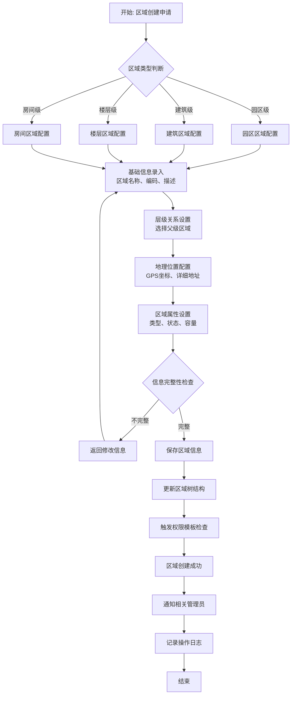

#### 1.2 区域层级调整流程

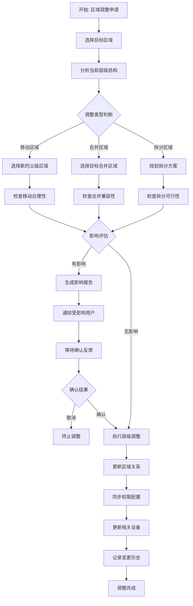

### 2. 权限配置管理流程

#### 2.1 用户权限分配流程

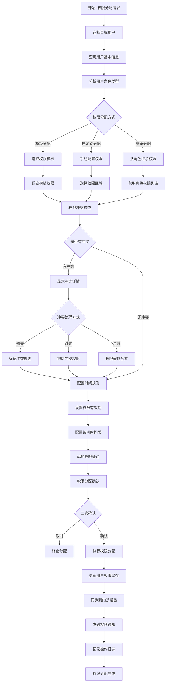

#### 2.2 权限模板应用流程

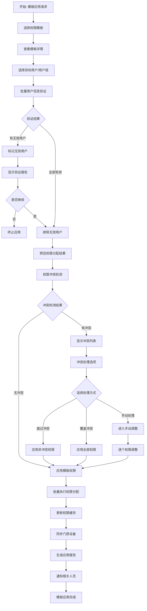

### 3. 时间权限管理流程

#### 3.1 时间规则配置流程

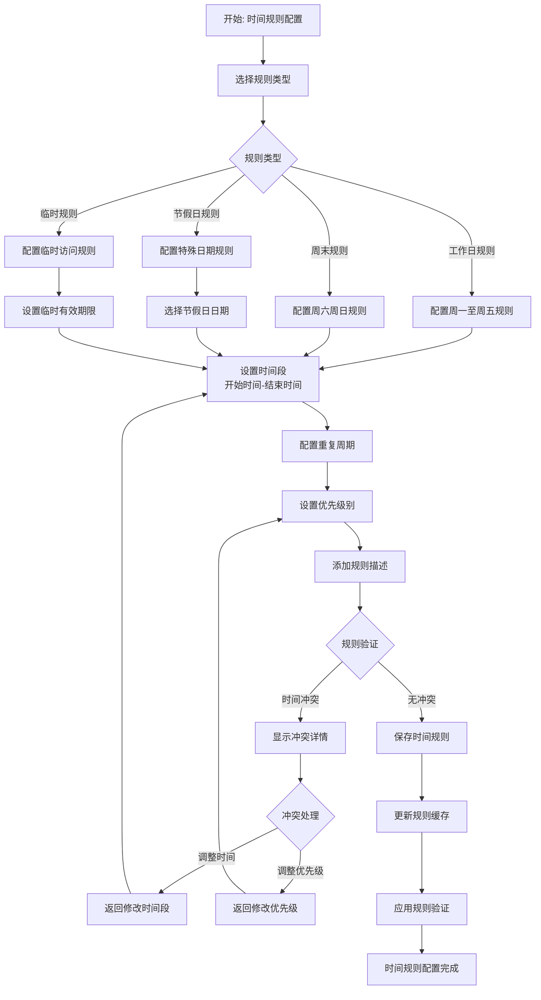

#### 3.2 权限有效期管理流程

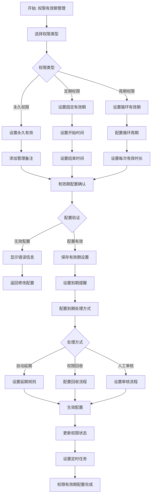

### 4. 权限监控与审计流程

#### 4.1 权限状态监控流程

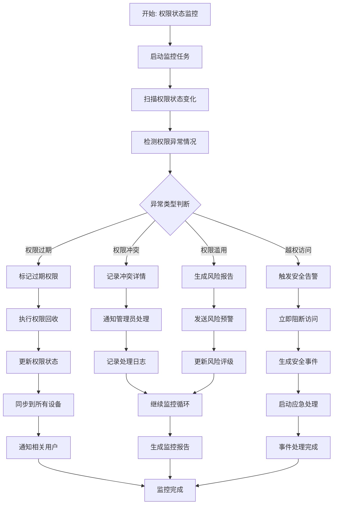

#### 4.2 权限审计流程

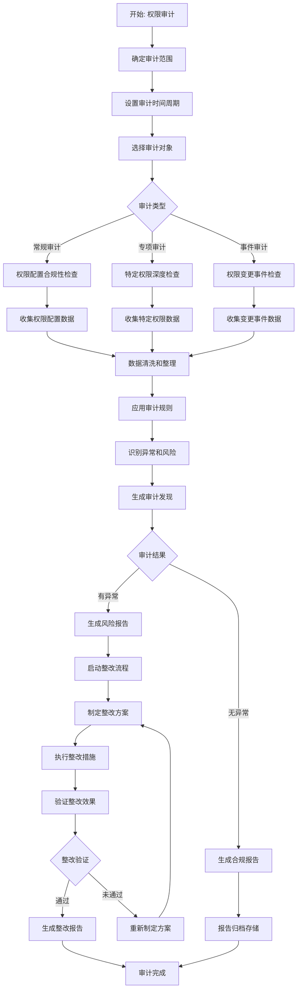

### 5. 跨部门协作流程

#### 5.1 权限申请审批流程

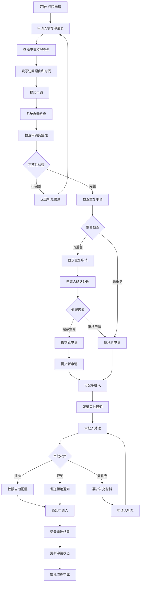

#### 5.2 权限变更协调流程

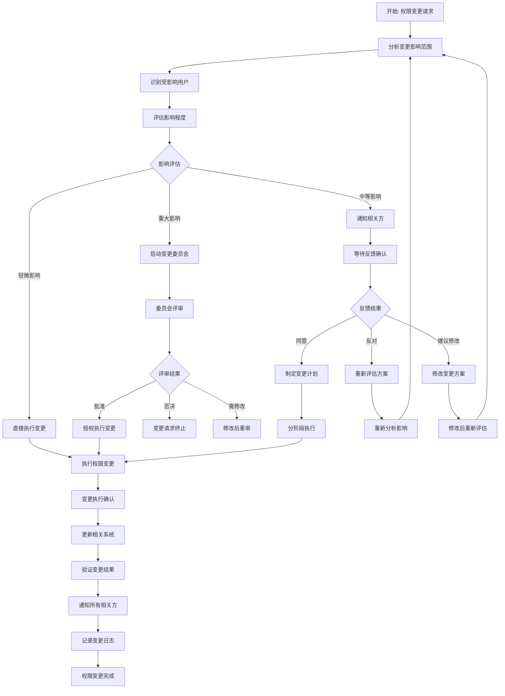

### 6. 应急处理流程

#### 6.1 权限异常应急处理流程

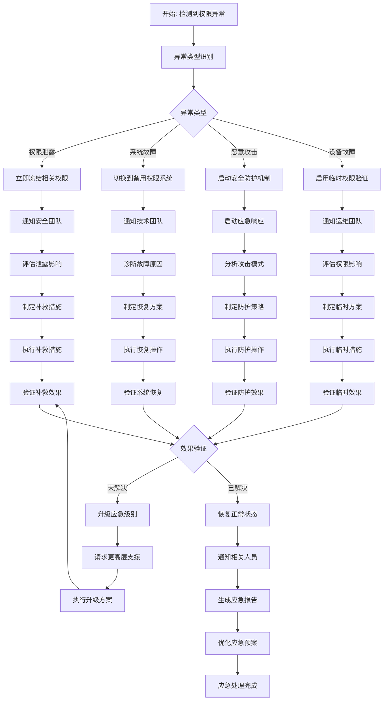

#### 6.2 权限批量调整流程

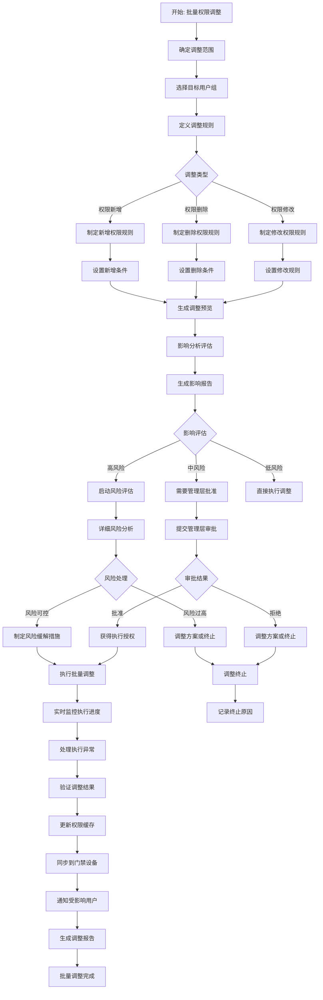

---

## 📊 流程性能指标

### 关键流程性能要求

| 流程名称 | 平均处理时间 | 峰值处理能力 | 成功率 | 用户满意度 |
|---------|-------------|-------------|--------|-----------|
| 权限分配流程 | ≤ 5分钟 | 100/小时 | ≥ 99.5% | ≥ 4.5/5.0 |
| 权限审批流程 | ≤ 24小时 | 200/天 | ≥ 99% | ≥ 4.3/5.0 |
| 权限监控流程 | 实时(≤1秒) | 持续监控 | 100% | ≥ 4.6/5.0 |
| 应急处理流程 | ≤ 10分钟 | 10/小时 | 100% | ≥ 4.8/5.0 |
| 批量调整流程 | ≤ 30分钟 | 5/小时 | ≥ 98% | ≥ 4.2/5.0 |

### 流程优化目标

- **自动化程度**: 权限分配流程自动化率≥80%
- **审批效率**: 标准审批流程完成时间≤24小时
- **异常响应**: 权限异常响应时间≤5分钟
- **用户体验**: 流程操作步骤减少30%
- **系统可靠性**: 核心流程可用性≥99.9%

---

**文档版本**: v1.0.0
**创建日期**: 2025-12-17
**创建人**: AI助手
**审核人**: 待定
**批准人**: 待定

**备注**: 本业务流程图文档涵盖了区域权限管理模块的所有核心业务流程，为系统开发和流程优化提供了详细的指导。