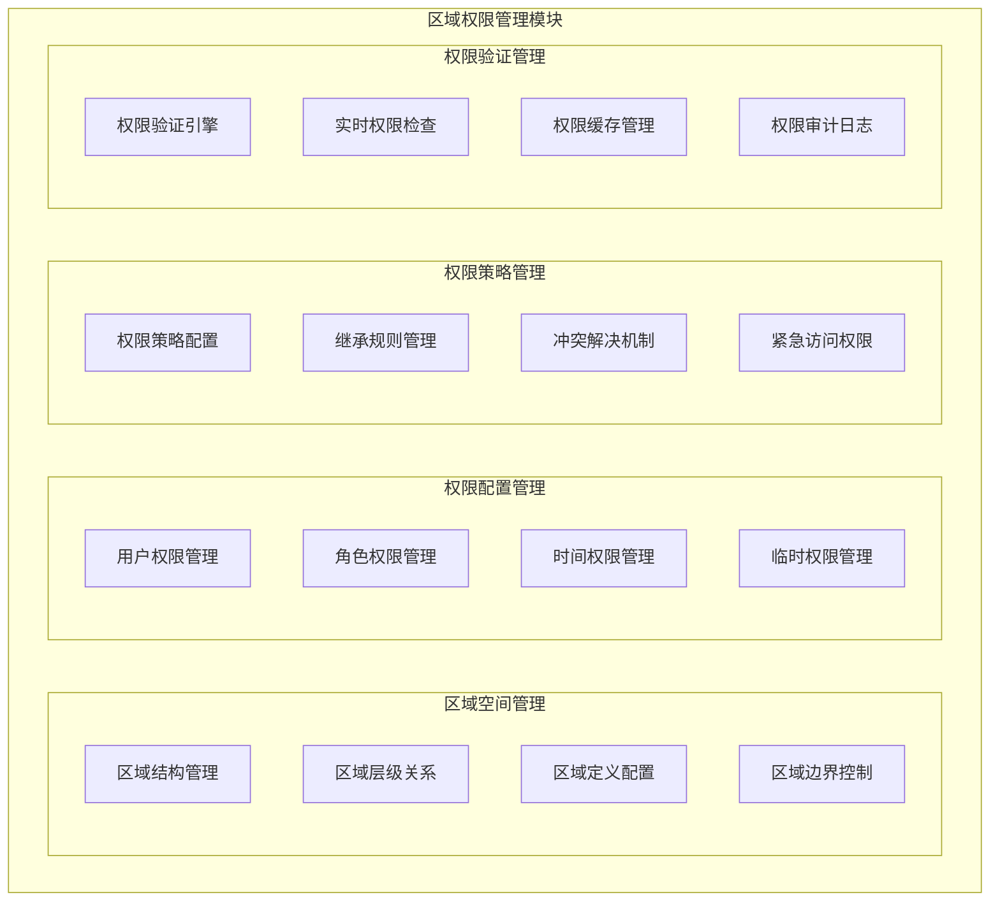
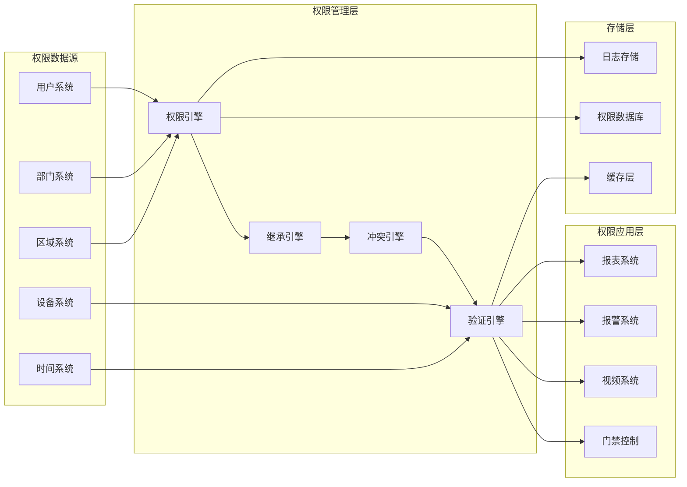

# 02-区域权限管理 - 功能说明

> **模块编号**: 02
> **模块名称**: 区域权限管理
> **优先级**: P0
> **创建日期**: 2025-12-17
> **适用范围**: IOE-DREAM智慧门禁管理微服务

---

## 📋 模块概述

区域权限管理模块是门禁微服务的核心权限控制模块，负责园区内区域空间的层级管理和用户通行权限的精细化配置，确保人员和设备只能在授权范围内活动，保障园区安全管理。

### 🎯 核心价值

- **区域统一管理**: 建立园区区域的层级化管理体系
- **权限精细化控制**: 实现用户通行权限的精细化配置
- **权限继承机制**: 通过区域层级实现权限自动继承
- **安全边界控制**: 严格遵循区域权限边界，防止越权访问

---

## 🏗️ 系统架构

### 功能架构图



### 数据流架构



---

## 🎯 功能需求

### 1. 区域空间管理

#### 1.1 区域结构管理
**用户故事**: 作为园区管理员，我希望能够建立园区区域的层级结构，以便实现区域化管理和权限控制。

**功能描述**:
- 支持无限层级的区域树形结构
- 区域类型：园区、楼宇、楼层、区域、房间、门禁点
- 区域编码体系：支持自定义编码规则
- 区域状态管理：正常、停用、装修、封锁

**区域层级示例**:
```yaml
area_hierarchy:
  - 园区ID: 1, 名称: "智慧园区", 类型: 园区
  - 园区ID: 100, 父级: 1, 名称: "办公楼A栋", 类型: 楼宇
    - 园区ID: 1000, 父级: 100, 名称: "1层", 类型: 楼层
      - 园区ID: 10001, 父级: 1000, 名称: "办公区", 类型: 区域
      - 园区ID: 10002, 父级: 1000, 名称: "会议室", 类型: 区域
      - 园区ID: 10003, 父级: 1000, 名称: "服务器室", 类型: 区域
  - 园区ID: 200, 父级: 1, 名称: "办公楼B栋", 类型: 楼宇
```

#### 1.2 区域定义配置
**用户故事**: 作为系统管理员，我希望能够配置区域的基本属性和访问规则，以便精确控制区域访问权限。

**配置字段**:
```yaml
area_config:
  basic_info:
    area_name: 区域名称
    area_code: 区域编码
    area_type: 区域类型
    parent_area_id: 父级区域ID
    level: 层级深度
    sort_order: 排序号

  location_info:
    building_name: 楼栋名称
    floor_number: 楼层号
    room_number: 房间号
    address: 详细地址
    coordinates: 经纬度坐标
    description: 区域描述

  access_control:
    access_level: 访问级别 1-10
    security_level: 安全级别 1-5
    capacity_limit: 容量限制
    time_restrictions: 时间限制
    emergency_access: 紧急访问权限
```

#### 1.3 区域边界控制
**用户故事**: 作为安全管理员，我希望能够定义区域的物理边界和访问边界，以便实现精确的权限控制。

**边界类型**:
- **地理边界**: 基于GPS坐标的地理围栏
- **网络边界**: 基于网络段或设备的网络边界
- **时间边界**: 基于时间的时间窗口边界
- **功能边界**: 基于功能权限的功能边界

### 2. 权限配置管理

#### 2.1 用户权限管理
**用户故事**: 作为系统管理员，我希望能够为单个用户配置通行权限，以便实现个性化的权限控制。

**权限配置**:
```yaml
user_permission:
  user_id: 12345
  user_name: "张三"

  area_permissions:
    - area_id: 10001  # 办公区
      access_level: 5
      time_rules: ["工作日 08:00-18:00"]
      auth_types: ["卡片", "指纹"]
      expire_time: "2025-12-31 23:59:59"
      status: "active"

    - area_id: 10002  # 会议室
      access_level: 3
      time_rules: ["预约时间"]
      auth_types: ["卡片", "人脸"]
      require_approval: true
      status: "active"

  global_permissions:
    max_access_level: 6
    emergency_access: true
    temp_grant_enabled: true
```

#### 2.2 角色权限管理
**用户故事**: 作为部门管理员，我希望能够配置角色权限模板，以便快速为部门人员分配权限。

**角色权限模板**:
```yaml
role_permissions:
  role_name: "普通员工"
  role_code: "STAFF"
  description: "基础员工权限"

  default_areas:
    - area_pattern: "办公区*"
      access_level: 3
      time_rules: ["工作日 09:00-17:30"]
      auth_types: ["卡片"]

    - area_pattern: "餐厅*"
      access_level: 2
      time_rules: ["工作日 07:30-20:00"]
      auth_types: ["卡片", "人脸"]

  denied_areas:
    - "服务器室"
    - "财务室"
    - "档案室"
```

#### 2.3 时间权限管理
**用户故事**: 作为系统管理员，我希望能够配置时间权限规则，以便实现基于时间的访问控制。

**时间规则类型**:
- **固定时间**: 具体的时间段（如：08:00-18:00）
- **周期时间**: 基于周期的时间段（如：工作日、周末）
- **节假日时间**: 特定节假日的时间段
- **临时时间**: 临时授权的时间段

**时间规则配置**:
```yaml
time_rules:
  workday_rule:
    name: "工作日规则"
    pattern: "MON-FRI"
    time_ranges:
      - start: "08:00"
        end: "18:00"
      - start: "19:00"
        end: "21:00"

  weekend_rule:
    name: "周末规则"
    pattern: "SAT-SUN"
    time_ranges:
      - start: "09:00"
        end: "17:00"

  holiday_rule:
    name: "节假日规则"
    pattern: "HOLIDAY"
    custom_dates:
      - "2025-01-01"  # 元旦
      - "2025-02-10"  # 春节
      - "2025-10-01"  # 国庆
    time_ranges:
      - start: "09:00"
        end: "17:00"
```

#### 2.4 临时权限管理
**用户故事**: 作为访客管理员，我希望能够为访客配置临时通行权限，以便解决临时访问需求。

**临时权限特性**:
- **有效期控制**: 精确到分钟级的有效期控制
- **访问范围限制**: 限制可访问的区域
- **时间窗口限制**: 限制可访问的时间段
- **审批流程**: 重要临时权限需要审批
- **自动回收**: 权限到期自动回收

**临时权限示例**:
```yaml
temporary_permission:
  request_id: "TEMP_20251217_001"
  applicant: "李四"  # 申请人
  visitor: "王五"  # 访客
  purpose: "业务洽谈"

  permission_details:
    start_time: "2025-12-17 09:00:00"
    end_time: "2025-12-17 18:00:00"
    allowed_areas: [10001, 10002]  # 办公区、会议室
    access_level: 3
    auth_types: ["临时卡", "人脸"]
    escort_required: true  # 需要陪同

  approval:
    status: "approved"
    approver: "张三"
    approve_time: "2025-12-16 15:30:00"
```

### 3. 权限策略管理

#### 3.1 权限策略配置
**用户故事**: 作为安全策略管理员，我希望能够配置权限策略规则，以便实现统一的权限控制标准。

**策略类型**:
- **默认权限策略**: 新用户默认权限配置
- **权限升级策略**: 权限升级的条件和流程
- **权限降级策略**: 权限降级的条件和流程
- **权限继承策略**: 权限继承的规则
- **权限冲突策略**: 权限冲突的处理策略

#### 3.2 继承规则管理
**用户故事**: 作为系统管理员，我希望能够配置权限继承规则，以便实现区域权限的自动继承。

**继承规则**:
- **向下继承**: 高级区域权限包含低级区域权限
- **同级继承**: 同级别区域权限可以相互继承
- **权限覆盖**: 高级权限可以覆盖低级权限
- **权限排除**: 可以排除特定的权限继承

**继承示例**:
```yaml
inheritance_rules:
  - area_level: 1  # 楼栋级
    inheritance_mode: "downward"
    included_areas: "所有下级区域"
    excluded_areas: ["特殊区域"]

  - area_level: 2  # 楼层级
    inheritance_mode: "selective"
    inherit_from_parent: true
    inherit_to_children: true
```

#### 3.3 冲突解决机制
**用户故事**: 作为系统管理员，我希望有清晰的权限冲突解决机制，以便处理权限配置冲突。

**冲突类型**:
- **权限冲突**: 授予权限和拒绝权限的冲突
- **时间冲突**: 时间段重叠的冲突
- **区域冲突**: 区域权限范围重叠的冲突
- **级别冲突**: 不同权限级别的冲突

**冲突解决策略**:
- **权限优先**: 授予权限优先于拒绝权限
- **时间优先**: 新配置优先于旧配置
- **高级优先**: 高级别权限优先于低级别权限
- **最新优先**: 最新配置优先于历史配置

#### 3.4 紧急访问权限
**用户故事**: 作为应急管理人员，我希望能够配置紧急访问权限，以便处理紧急情况。

**紧急权限特性**:
- **覆盖常规权限**: 紧急权限可以覆盖所有常规权限
- **临时授权**: 紧急权限有明确的时间限制
- **审计要求**: 紧急权限使用必须严格审计
- **自动恢复**: 紧急权限到期自动恢复常规权限

### 4. 权限验证管理

#### 4.1 权限验证引擎
**用户故事**: 作为系统核心组件，我希望有高效的权限验证引擎，以便实时验证用户权限。

**验证流程**:
1. 接收权限验证请求
2. 识别用户和设备信息
3. 查询用户权限配置
4. 应用权限继承规则
5. 解决权限冲突
6. 验证时间权限
7. 返回验证结果

**验证算法**:
```python
def verify_permission(user_id, device_id, access_time):
    # 1. 获取用户信息
    user = get_user(user_id)
    device = get_device(device_id)

    # 2. 获取设备所在区域
    device_areas = get_device_areas(device_id)

    # 3. 验证每个区域的权限
    for area in device_areas:
        permission = get_user_permission(user_id, area.id)

        # 4. 应用继承规则
        permission = apply_inheritance(permission, area)

        # 5. 解决冲突
        permission = resolve_conflicts(permission)

        # 6. 验证时间权限
        if not verify_time_permission(permission, access_time):
            return False

    return True
```

#### 4.2 实时权限检查
**用户故事**: 作为门禁设备，我希望能够实时检查用户权限，以便及时响应通行请求。

**实时检查要求**:
- **响应时间**: 权限检查响应时间≤100ms
- **准确性**: 权限检查准确率100%
- **一致性**: 权限检查结果与数据库一致
- **缓存支持**: 支持权限缓存，提高检查效率

#### 4.3 权限缓存管理
**用户故事**: 作为系统架构师，我希望有高效的权限缓存机制，以便提高权限验证性能。

**缓存策略**:
- **多级缓存**: 内存缓存 + Redis缓存 + 数据库
- **缓存键设计**: 基于用户ID、区域ID、时间戳的复合键
- **缓存更新**: 权限变更时更新缓存
- **缓存过期**: 设置合理的缓存过期时间

**缓存设计**:
```java
// 权限缓存键设计
String cacheKey = "permission:" + userId + ":" + areaId + ":" + LocalDate.now();

// 缓存结构
@Cacheable(value = "permission", key = "#cacheKey")
public PermissionResult getPermission(String userId, String areaId, Date accessTime) {
    // 从数据库查询权限
    return permissionService.queryPermission(userId, areaId, accessTime);
}

// 缓存更新
@CacheEvict(value = "permission", key = "#userId + ':' + #areaId + ':*'")
public void clearPermissionCache(String userId, String areaId) {
    // 清除相关缓存
}
```

#### 4.4 权限审计日志
**用户故事**: 作为审计人员，我希望有完整的权限审计日志，以便追踪权限使用情况。

**审计内容**:
- **权限验证日志**: 记录所有权限验证操作
- **权限变更日志**: 记录权限配置变更
- **异常权限日志**: 记录权限异常情况
- **权限使用统计**: 统计权限使用频率

**审计日志格式**:
```json
{
  "audit_id": "AUD_20251217_001",
  "user_id": 12345,
  "user_name": "张三",
  "device_id": "DEV_001",
  "device_name": "办公楼A栋-1层-东门",
  "area_id": 10001,
  "area_name": "办公区",
  "permission_type": "access",
  "action": "verify",
  "result": "success",
  "reason": "权限验证通过",
  "timestamp": "2025-12-17 10:30:00",
  "request_id": "REQ_20251217_001"
}
```

---

## 📊 非功能需求

### 性能需求

| 性能指标 | 要求值 | 测量方法 |
|---------|-------|---------|
| 权限验证响应时间 | ≤100ms | 99%请求 |
| 权限配置生效时间 | ≤10秒 | 实时生效 |
| 权限检查并发数 | ≥10000/秒 | 同时在线 |
| 缓存命中率 | ≥95% | 实时监控 |
| 权限数据一致性 | 100% | 强一致性 |

### 可靠性需求

| 可靠性指标 | 要求值 | 说明 |
|-----------|-------|------|
| 权限验证可用性 | ≥99.99% | 年度目标 |
| 权限数据一致性 | 100% | 无数据丢失 |
| 故障恢复时间 | ≤1分钟 | 自动恢复 |
| 审计日志完整性 | 100% | 完整记录 |
| 系统切换时间 | ≤30秒 | 无缝切换 |

### 安全性需求

| 安全要求 | 具体措施 |
|---------|---------|
| 权限数据安全 | AES-256加密存储 |
| 权限传输安全 | HTTPS + TLS 1.3 |
| 权限操作安全 | 双因子认证 |
| 权限审计安全 | 完整审计链 |
| 权限分离安全 | 最小权限原则 |

### 可扩展性需求

| 扩展性指标 | 要求值 |
|-----------|-------|
| 区域层级深度 | ≥10层 |
| 区域容量 | 支持100万+区域 |
| 用户容量 | 支持1000万+用户 |
| 权限规则容量 | 支持1000万+规则 |
| 权限验证QPS | 支持10万+QPS |

---

## ✅ 验收标准

### 功能验收标准

#### 区域空间管理
- [ ] 支持无限层级的区域树形结构
- [ ] 区域编码规则灵活配置，支持自定义
- [ ] 区域状态管理完整，支持多状态切换
- [ ] 区域边界控制精确，支持多维度边界
- [ ] 区域信息完整，包含必要的元数据

#### 权限配置管理
- [ ] 用户权限配置灵活，支持个性化定制
- [ ] 角色权限模板丰富，覆盖常用场景
- [ ] 时间权限规则精确，支持复杂时间模式
- [ ] 临时权限管理完善，支持全生命周期管理
- [ ] 权限配置实时生效，生效时间≤10秒

#### 权限策略管理
- [ ] 权限策略配置全面，覆盖各种策略类型
- [ ] 继承规则合理，支持灵活的继承机制
- [ ] 冲突解决机制清晰，规则优先级明确
- [ ] 紧急权限管理安全，支持严格控制
- [ ] 策略应用准确，符合预期效果

#### 权限验证管理
- [ ] 权限验证引擎高效，响应时间≤100ms
- [ ] 实时权限检查准确，准确率100%
- [ ] 权限缓存机制优化，缓存命中率≥95%
- [ ] 权限审计日志完整，覆盖所有操作
- [ ] 权限验证一致性，与数据库100%一致

### 性能验收标准

- [ ] 权限验证响应时间≤100ms（99%请求）
- [ ] 权限配置生效时间≤10秒
- [ ] 支持10000/秒并发权限验证
- [ ] 权限缓存命中率≥95%
- [ ] 系统可用性≥99.99%

### 安全验收标准

- [ ] 权限数据AES-256加密存储
- [ ] 权限传输HTTPS全程加密
- [ ] 通过安全渗透测试
- [ ] 审计日志完整可追溯
- [ ] 权限分离严格执行

### 兼容性验收标准

- [ ] 支持主流浏览器访问
- [ ] 支持移动端设备操作
- [ ] 支持多语言界面
- [ ] 支持API接口标准化
- [ ] 支持第三方系统集成

---

## 🚀 实施计划

### 第一阶段：基础功能（2-3周）
- 区域空间管理
- 基础用户权限管理
- 简单时间权限管理

### 第二阶段：核心功能（3-4周）
- 角色权限管理
- 权限策略配置
- 权限继承机制

### 第三阶段：高级功能（2-3周）
- 临时权限管理
- 权限验证引擎
- 权限缓存机制

### 第四阶段：完善优化（1-2周）
- 权限审计日志
- 性能优化
- 安全加固
- 测试验收

---

## 📚 相关文档

- [用户故事详细说明](./用户故事.md)
- [数据结构设计](./数据结构设计.md)
- [业务流程图](./业务流程图.md)
- [API接口设计](./API接口设计.md)
- [验收测试用例](./验收测试用例.md)

---

**📝 文档信息**
- **创建人**: 区域权限管理模块组
- **审核人**: 架构委员会
- **最后更新**: 2025-12-17
- **版本**: v1.0.0