# 02-区域权限管理 - 数据结构设计

> **模块编号**: 02
> **模块名称**: 区域权限管理
> **文档类型**: 数据结构设计ER
> **创建日期**: 2025-12-17
> **技术规范**: IOE-DREAM全局架构规范

---

## 📋 数据库设计概述

本文档基于IOE-DREAM全局数据库架构规范，设计区域权限管理模块的数据结构。遵循以下设计原则：

### 设计原则

1. **层级化设计**: 支持无限层级的区域树形结构
2. **权限分离**: 权限数据与区域数据分离存储
3. **继承优化**: 优化权限继承关系的存储和查询
4. **审计完整**: 完整记录权限操作和验证日志
5. **性能优先**: 优化权限查询和验证性能

### 技术栈

- **数据库**: MySQL 8.0
- **ORM框架**: MyBatis-Plus 3.5.15
- **连接池**: Druid
- **缓存**: Redis多级缓存
- **数据迁移**: Flyway

---

## 🗄️ 数据库表结构设计

### 1. 区域信息表 (t_access_area)

存储区域的层级结构和基础信息。

```sql
CREATE TABLE t_access_area (
    -- 主键字段
    area_id BIGINT PRIMARY KEY AUTO_INCREMENT COMMENT '区域ID',

    -- 基础信息
    area_code VARCHAR(64) NOT NULL UNIQUE COMMENT '区域编码',
    area_name VARCHAR(200) NOT NULL COMMENT '区域名称',
    area_type TINYINT NOT NULL COMMENT '区域类型: 1-园区 2-楼宇 3-楼层 4-区域 5-房间 6-门禁点',
    parent_area_id BIGINT DEFAULT 0 COMMENT '父级区域ID',
    area_level INT NOT NULL DEFAULT 1 COMMENT '层级深度',
    sort_order INT DEFAULT 0 COMMENT '排序号',
    area_path VARCHAR(1000) DEFAULT NULL COMMENT '区域路径(逗号分隔ID序列)',

    -- 位置信息
    building_name VARCHAR(100) DEFAULT NULL COMMENT '楼栋名称',
    floor_number INT DEFAULT NULL COMMENT '楼层号',
    room_number VARCHAR(50) DEFAULT NULL COMMENT '房间号',
    address VARCHAR(500) DEFAULT NULL COMMENT '详细地址',
    longitude DECIMAL(10,6) DEFAULT NULL COMMENT '经度',
    latitude DECIMAL(10,6) DEFAULT NULL COMMENT '纬度',

    -- 区域属性
    security_level TINYINT DEFAULT 1 COMMENT '安全等级: 1-低 2-中 3-高 4-很高 5-极高',
    access_level TINYINT DEFAULT 1 COMMENT '访问级别: 1-10',
    capacity_limit INT DEFAULT 0 COMMENT '容量限制',
    area_size DECIMAL(10,2) DEFAULT 0.00 COMMENT '区域面积(平方米)',
    door_count INT DEFAULT 0 COMMENT '门禁点数量',

    -- 边界定义
    boundary_type TINYINT DEFAULT 0 COMMENT '边界类型: 0-无 1-地理围栏 2-网络边界 3-时间边界',
    boundary_data JSON DEFAULT NULL COMMENT '边界数据(GeoJSON格式)',
    access_boundary JSON DEFAULT NULL COMMENT '访问边界定义',

    -- 状态信息
    area_status TINYINT DEFAULT 1 COMMENT '区域状态: 0-停用 1-正常 2-装修 3-封锁',
    is_emergency_area TINYINT DEFAULT 0 COMMENT '是否紧急区域: 0-否 1-是',
    is_public_area TINYINT DEFAULT 0 COMMENT '是否公共区域: 0-否 1-是',
    is_sensitive_area TINYINT DEFAULT 0 COMMENT '是否敏感区域: 0-否 1-是',

    -- 管理信息
    responsible_user_id BIGINT DEFAULT NULL COMMENT '负责人ID',
    responsible_dept_id BIGINT DEFAULT NULL COMMENT '负责部门ID',
    security_user_id BIGINT DEFAULT NULL COMMENT '安全管理员ID',
    create_user_id BIGINT DEFAULT NULL COMMENT '创建人ID',

    -- 时间信息
    create_time DATETIME NOT NULL DEFAULT CURRENT_TIMESTAMP COMMENT '创建时间',
    update_time DATETIME NOT NULL DEFAULT CURRENT_TIMESTAMP ON UPDATE CURRENT_TIMESTAMP COMMENT '更新时间',
    deleted_flag TINYINT DEFAULT 0 COMMENT '删除标志: 0-正常 1-删除',
    version INT DEFAULT 0 COMMENT '乐观锁版本号',

    -- 索引
    INDEX idx_area_code (area_code),
    INDEX idx_parent_area_id (parent_area_id),
    INDEX idx_area_type (area_type),
    INDEX idx_area_level (area_level),
    INDEX idx_area_status (area_status),
    INDEX idx_responsible_user (responsible_user_id),
    INDEX idx_security_level (security_level),
    INDEX idx_access_level (access_level),
    INDEX idx_sort_order (sort_order),
    INDEX idx_create_time (create_time),

    -- 外键约束
    FOREIGN KEY (parent_area_id) REFERENCES t_area(area_id),
    FOREIGN KEY (responsible_user_id) REFERENCES t_user(user_id),
    FOREIGN KEY (responsible_dept_id) REFERENCES t_department(department_id),
    FOREIGN KEY (security_user_id) REFERENCES t_user(user_id),
    FOREIGN KEY (create_user_id) REFERENCES t_user(user_id)
) ENGINE=InnoDB DEFAULT CHARSET=utf8mb4 COMMENT='区域信息表';
```

### 2. 用户权限表 (t_access_user_permission)

存储用户的区域权限配置。

```sql
CREATE TABLE t_access_user_permission (
    -- 主键字段
    permission_id BIGINT PRIMARY KEY AUTO_INCREMENT COMMENT '权限ID',

    -- 用户和区域关联
    user_id BIGINT NOT NULL COMMENT '用户ID',
    area_id BIGINT NOT NULL COMMENT '区域ID',

    -- 权限基础信息
    permission_type TINYINT NOT NULL COMMENT '权限类型: 1-访问权限 2-管理权限 3-监控权限 4-紧急权限',
    access_level TINYINT DEFAULT 1 COMMENT '访问级别: 1-10',
    permission_level TINYINT DEFAULT 1 COMMENT '权限级别: 1-读写 2-只读 3-无权限',

    -- 权限状态
    permission_status TINYINT DEFAULT 1 COMMENT '权限状态: 0-停用 1-启用 2-待激活 3-已过期',
    is_temporary TINYINT DEFAULT 0 COMMENT '是否临时权限: 0-否 1-是',
    is_emergency TINYINT DEFAULT 0 COMMENT '是否紧急权限: 0-否 1-是',

    -- 时间限制
    start_time DATETIME DEFAULT NULL COMMENT '生效开始时间',
    end_time DATETIME DEFAULT NULL COMMENT '生效结束时间',
    time_rule_id BIGINT DEFAULT NULL COMMENT '时间规则ID',

    -- 认证要求
    require_card TINYINT DEFAULT 1 COMMENT '要求卡片: 0-否 1-是',
    require_password TINYINT DEFAULT 0 COMMENT '要求密码: 0-否 1-是',
    require_face TINYINT DEFAULT 0 COMMENT '要求人脸: 0-否 1-是',
    require_fingerprint TINYINT DEFAULT 0 COMMENT '要求指纹: 0-否 1-是',
    require_multi_factor TINYINT DEFAULT 0 COMMENT '要求多因子: 0-否 1-是',
    min_auth_factors INT DEFAULT 1 COMMENT '最少认证因子数',

    -- 访问控制
    max_daily_visits INT DEFAULT 0 COMMENT '每日最大访问次数',
    max_concurrent_visits INT DEFAULT 1 COMMENT '最大并发访问次数',
    visit_interval INT DEFAULT 0 COMMENT '访问间隔限制(秒)',
    blacklist_check TINYINT DEFAULT 1 COMMENT '黑名单检查: 0-否 1-是',

    -- 继承设置
    inherit_to_children TINYINT DEFAULT 0 COMMENT '继承到子区域: 0-否 1-是',
    inherit_from_parent TINYINT DEFAULT 1 COMMENT '从父级继承: 0-否 1-是',
    inherit_priority INT DEFAULT 0 COMMENT '继承优先级',

    -- 审计字段
    grant_user_id BIGINT DEFAULT NULL COMMENT '授权人ID',
    grant_reason VARCHAR(500) DEFAULT NULL COMMENT '授权原因',
    create_time DATETIME NOT NULL DEFAULT CURRENT_TIMESTAMP COMMENT '创建时间',
    update_time DATETIME NOT NULL DEFAULT CURRENT_TIMESTAMP ON UPDATE CURRENT_TIMESTAMP COMMENT '更新时间',
    last_access_time DATETIME DEFAULT NULL COMMENT '最后访问时间',
    deleted_flag TINYINT DEFAULT 0 COMMENT '删除标志: 0-正常 1-删除',
    version INT DEFAULT 0 COMMENT '乐观锁版本号',

    -- 索引
    UNIQUE INDEX uk_user_area_permission (user_id, area_id, deleted_flag),
    INDEX idx_user_id (user_id),
    INDEX idx_area_id (area_id),
    INDEX idx_permission_type (permission_type),
    INDEX idx_permission_status (permission_status),
    INDEX idx_is_temporary (is_temporary),
    INDEX idx_is_emergency (is_emergency),
    INDEX idx_start_time (start_time),
    INDEX idx_end_time (end_time),
    INDEX idx_grant_user (grant_user_id),
    INDEX idx_last_access_time (last_access_time),

    -- 外键约束
    FOREIGN KEY (user_id) REFERENCES t_user(user_id),
    FOREIGN KEY (area_id) REFERENCES t_access_area(area_id),
    FOREIGN KEY (time_rule_id) REFERENCES t_access_time_rule(time_rule_id),
    FOREIGN KEY (grant_user_id) REFERENCES t_user(user_id)
) ENGINE=InnoDB DEFAULT CHARSET=utf8mb4 COMMENT='用户权限表';
```

### 3. 角色权限表 (t_access_role_permission)

存储角色的权限配置模板。

```sql
CREATE TABLE t_access_role_permission (
    -- 主键字段
    role_permission_id BIGINT PRIMARY KEY AUTO_INCREMENT COMMENT '角色权限ID',

    -- 角色信息
    role_id BIGINT NOT NULL COMMENT '角色ID',
    role_type TINYINT NOT NULL COMMENT '角色类型: 1-系统角色 2-部门角色 3-项目角色 4-临时角色',

    -- 权限配置模式
    config_mode TINYINT DEFAULT 1 COMMENT '配置模式: 1-白名单 2-黑名单 3-混合模式',

    -- 区域权限配置
    area_permission_config JSON NOT NULL COMMENT '区域权限配置',
    area_pattern_rules JSON DEFAULT NULL COMMENT '区域模式规则',

    -- 权限基础配置
    default_access_level TINYINT DEFAULT 1 COMMENT '默认访问级别',
    max_access_level TINYINT DEFAULT 5 COMMENT '最大访问级别',
    default_time_rule_id BIGINT DEFAULT NULL COMMENT '默认时间规则ID',
    default_auth_types VARCHAR(100) DEFAULT 'card' COMMENT '默认认证类型',

    -- 禁止区域配置
    denied_areas JSON DEFAULT NULL COMMENT '禁止区域列表',
    denied_area_patterns JSON DEFAULT NULL COMMENT '禁止区域模式',

    -- 时间权限配置
    time_permission_config JSON DEFAULT NULL COMMENT '时间权限配置',
    custom_time_rules JSON DEFAULT NULL COMMENT '自定义时间规则',

    -- 认证要求配置
    auth_requirements JSON DEFAULT NULL COMMENT '认证要求配置',
    multi_factor_requirement JSON DEFAULT NULL COMMENT '多因子要求',

    -- 访问控制配置
    access_control_config JSON DEFAULT NULL COMMENT '访问控制配置',
    security_policies JSON DEFAULT NULL COMMENT '安全策略',

    -- 继承和覆盖规则
    inheritance_rules JSON DEFAULT NULL COMMENT '继承规则',
    override_rules JSON DEFAULT NULL COMMENT '覆盖规则',

    -- 状态信息
    role_status TINYINT DEFAULT 1 COMMENT '角色状态: 0-停用 1-启用 2-待审核',
    priority_level INT DEFAULT 0 COMMENT '优先级',
    is_default_role TINYINT DEFAULT 0 COMMENT '是否默认角色: 0-否 1-是',

    -- 使用统计
    usage_count INT DEFAULT 0 COMMENT '使用次数',
    last_used_time DATETIME DEFAULT NULL COMMENT '最后使用时间',

    -- 审计字段
    create_user_id BIGINT DEFAULT NULL COMMENT '创建人ID',
    create_time DATETIME NOT NULL DEFAULT CURRENT_TIMESTAMP COMMENT '创建时间',
    update_time DATETIME NOT NULL DEFAULT CURRENT_TIMESTAMP ON UPDATE CURRENT_TIMESTAMP COMMENT '更新时间',
    update_user_id BIGINT DEFAULT NULL COMMENT '更新人ID',
    deleted_flag TINYINT DEFAULT 0 COMMENT '删除标志: 0-正常 1-删除',
    version INT DEFAULT 0 COMMENT '乐观锁版本号',

    -- 索引
    INDEX idx_role_id (role_id),
    INDEX idx_role_type (role_type),
    INDEX idx_config_mode (config_mode),
    INDEX idx_role_status (role_status),
    INDEX idx_priority_level (priority_level),
    INDEX idx_is_default_role (is_default_role),
    INDEX idx_usage_count (usage_count),
    INDEX idx_last_used_time (last_used_time),

    -- 外键约束
    FOREIGN KEY (role_id) REFERENCES t_role(role_id),
    FOREIGN KEY (default_time_rule_id) REFERENCES t_access_time_rule(time_rule_id),
    FOREIGN KEY (create_user_id) REFERENCES t_user(user_id),
    FOREIGN KEY (update_user_id) REFERENCES t_user(user_id)
) ENGINE=InnoDB DEFAULT CHARSET=utf8mb4 COMMENT='角色权限表';
```

### 4. 时间规则表 (t_access_time_rule)

存储时间权限规则。

```sql
CREATE TABLE t_access_time_rule (
    -- 主键字段
    rule_id BIGINT PRIMARY KEY AUTO_INCREMENT COMMENT '规则ID',

    -- 规则基本信息
    rule_name VARCHAR(100) NOT NULL COMMENT '规则名称',
    rule_code VARCHAR(64) NOT NULL UNIQUE COMMENT '规则编码',
    rule_type TINYINT NOT NULL COMMENT '规则类型: 1-固定时间 2-周期时间 3-节假日时间 4-自定义时间',
    rule_description TEXT DEFAULT NULL COMMENT '规则描述',
    rule_priority INT DEFAULT 0 COMMENT '规则优先级',

    -- 时间范围配置
    time_ranges JSON NOT NULL COMMENT '时间范围配置',
    date_ranges JSON DEFAULT NULL COMMENT '日期范围配置',
    week_days VARCHAR(20) DEFAULT 'MON,TUE,WED,THU,FRI' COMMENT '工作日',
    exceptions JSON DEFAULT NULL COMMENT '异常日期',

    -- 规则参数
    is_active TINYINT DEFAULT 1 COMMENT '是否启用: 0-否 1-是',
    is_default TINYINT DEFAULT 0 COMMENT '是否默认: 0-否 1-是',
    is_holiday TINYINT DEFAULT 0 COMMENT '是否节假日: 0-否 1-是',
    is_weekend TINYINT DEFAULT 0 COMMENT '是否周末: 0-否 1-是',

    -- 生效时间
    effective_date DATE DEFAULT NULL COMMENT '生效日期',
    expire_date DATE DEFAULT NULL COMMENT '过期日期',

    -- 重复配置
    repeat_type TINYINT DEFAULT 1 COMMENT '重复类型: 1-不重复 2-每日 3-每周 4-每月 5-每年',
    repeat_interval INT DEFAULT 0 COMMENT '重复间隔',
    repeat_end_date DATE DEFAULT NULL COMMENT '重复结束日期',

    -- 使用统计
    usage_count INT DEFAULT 0 COMMENT '使用次数',
    last_used_time DATETIME DEFAULT NULL COMMENT '最后使用时间',

    -- 审计字段
    create_time DATETIME NOT NULL DEFAULT CURRENT_TIMESTAMP COMMENT '创建时间',
    create_user_id BIGINT DEFAULT NULL COMMENT '创建人ID',
    update_time DATETIME NOT NULL DEFAULT CURRENT_TIMESTAMP ON UPDATE CURRENT_TIMESTAMP COMMENT '更新时间',
    update_user_id BIGINT DEFAULT NULL COMMENT '更新人ID',
    deleted_flag TINYINT DEFAULT 0 COMMENT '删除标志: 0-正常 1-删除',
    version INT DEFAULT 0 COMMENT '乐观锁版本号',

    -- 索引
    INDEX idx_rule_code (rule_code),
    INDEX idx_rule_type (rule_type),
    INDEX idx_rule_priority (rule_priority),
    INDEX idx_is_active (is_active),
    INDEX idx_is_default (is_default),
    INDEX idx_effective_date (effective_date),
    INDEX idx_expire_date (expire_date),
    INDEX idx_repeat_type (repeat_type),
    INDEX idx_usage_count (usage_count),

    -- 外键约束
    FOREIGN KEY (create_user_id) REFERENCES t_user(user_id),
    FOREIGN KEY (update_user_id) REFERENCES t_user(user_id)
) ENGINE=InnoDB DEFAULT CHARSET=utf8mb4 COMMENT='时间规则表';
```

### 5. 权限验证日志表 (t_access_permission_log)

存储权限验证操作的审计日志。

```sql
CREATE TABLE t_access_permission_log (
    -- 主键字段
    log_id BIGINT PRIMARY KEY AUTO_INCREMENT COMMENT '日志ID',

    -- 请求信息
    request_id VARCHAR(64) DEFAULT NULL COMMENT '请求ID',
    request_time DATETIME NOT NULL DEFAULT CURRENT_TIMESTAMP COMMENT '请求时间',
    response_time BIGINT DEFAULT NULL COMMENT '响应时间(毫秒)',

    -- 用户信息
    user_id BIGINT DEFAULT NULL COMMENT '用户ID',
    user_name VARCHAR(100) DEFAULT NULL COMMENT '用户姓名',
    user_card_number VARCHAR(50) DEFAULT NULL COMMENT '用户卡号',
    user_role_ids VARCHAR(500) DEFAULT NULL COMMENT '用户角色IDs',

    -- 设备信息
    device_id BIGINT DEFAULT NULL COMMENT '设备ID',
    device_name VARCHAR(200) DEFAULT NULL COMMENT '设备名称',
    device_code VARCHAR(100) DEFAULT NULL COMMENT '设备编码',
    device_location VARCHAR(500) DEFAULT NULL COMMENT '设备位置',

    -- 区域信息
    area_id BIGINT DEFAULT NULL COMMENT '区域ID',
    area_name VARCHAR(200) DEFAULT NULL COMMENT '区域名称',
    area_path VARCHAR(1000) DEFAULT NULL COMMENT '区域路径',

    -- 权限信息
    permission_type TINYINT DEFAULT NULL COMMENT '权限类型',
    access_level TINYINT DEFAULT NULL COMMENT '访问级别',
    permission_sources VARCHAR(500) DEFAULT NULL COMMENT '权限来源',
    permission_details JSON DEFAULT NULL COMMENT '权限详情',

    -- 验证信息
    auth_types VARCHAR(100) DEFAULT NULL COMMENT '认证类型',
    auth_result TINYINT DEFAULT 0 COMMENT '认证结果: 0-失败 1-成功',
    auth_details JSON DEFAULT NULL COMMENT '认证详情',

    -- 验证结果
    verify_result TINYINT DEFAULT 0 COMMENT '验证结果: 0-拒绝 1-通过 2-部分通过',
    verify_reason VARCHAR(500) DEFAULT NULL COMMENT '验证原因',
    granted_permissions JSON DEFAULT NULL COMMENT '授予权限',
    denied_permissions JSON DEFAULT NULL COMMENT '拒绝权限',

    -- 决策信息
    policy_applied VARCHAR(500) DEFAULT NULL COMMENT '应用策略',
    rule_matched VARCHAR(500) DEFAULT NULL COMMENT '匹配规则',
    conflict_resolution VARCHAR(500) DEFAULT NULL COMMENT '冲突解决',

    -- 性能信息
    cache_hit TINYINT DEFAULT 0 COMMENT '缓存命中: 0-否 1-是',
    cache_keys VARCHAR(1000) DEFAULT NULL COMMENT '缓存键',
    query_time BIGINT DEFAULT NULL COMMENT '查询耗时(毫秒)',

    -- 异常信息
    error_code VARCHAR(50) DEFAULT NULL COMMENT '错误代码',
    error_message TEXT DEFAULT NULL COMMENT '错误信息',
    stack_trace TEXT DEFAULT NULL COMMENT '堆栈跟踪',

    -- 扩展字段
    extended_data JSON DEFAULT NULL COMMENT '扩展数据',

    -- 索引
    INDEX idx_request_id (request_id),
    INDEX idx_request_time (request_time),
    INDEX idx_user_id (user_id),
    INDEX idx_device_id (device_id),
    INDEX idx_area_id (area_id),
    INDEX idx_verify_result (verify_result),
    INDEX_idx_auth_result (auth_result),
    INDEX idx_cache_hit (cache_hit),
    INDEX idx_error_code (error_code),
    INDEX idx_create_time (create_time),

    -- 外键约束
    FOREIGN KEY (user_id) REFERENCES t_user(user_id),
    FOREIGN KEY (device_id) REFERENCES t_access_device(device_id),
    FOREIGN KEY (area_id) REFERENCES t_access_area(area_id)
) ENGINE=InnoDB DEFAULT CHARSET=utf8mb4 COMMENT='权限验证日志表';
```

### 6. 权限变更记录表 (t_access_permission_change)

存储权限配置变更的审计记录。

```sql
CREATE TABLE t_access_permission_change (
    -- 主键字段
    change_id BIGINT PRIMARY KEY AUTO_INCREMENT COMMENT '变更ID',

    -- 变更基本信息
    change_type TINYINT NOT NULL COMMENT '变更类型: 1-权限创建 2-权限修改 3-权限删除 4-权限升级 5-权限降级 6-权限过期',
    change_scope TINYINT NOT NULL COMMENT '变更范围: 1-单个权限 2-批量权限 3-角色权限 4-策略权限',
    change_level TINYINT DEFAULT 1 COMMENT '变更级别: 1-普通 2-重要 3-紧急',

    -- 变更对象信息
    target_type TINYINT NOT NULL COMMENT '目标类型: 1-用户 2-角色 3-区域 4-策略',
    target_id BIGINT NOT NULL COMMENT '目标ID',
    target_name VARCHAR(200) DEFAULT NULL COMMENT '目标名称',

    -- 变更前后对比
    before_data JSON DEFAULT NULL COMMENT '变更前数据',
    after_data JSON DEFAULT NULL COMMENT '变更后数据',
    changed_fields JSON DEFAULT NULL COMMENT '变更字段列表',

    -- 变更原因
    change_reason VARCHAR(500) DEFAULT NULL COMMENT '变更原因',
    change_description TEXT DEFAULT NULL COMMENT '变更描述',
    business_context TEXT DEFAULT NULL COMMENT '业务背景',

    -- 审批信息
    approval_required TINYINT DEFAULT 0 COMMENT '是否需要审批: 0-否 1-是',
    approval_status TINYINT DEFAULT 0 COMMENT '审批状态: 0-待审批 1-已通过 2-已拒绝 3-已取消',
    approval_user_id BIGINT DEFAULT NULL COMMENT '审批人ID',
    approval_time DATETIME DEFAULT NULL COMMENT '审批时间',
    approval_remark TEXT DEFAULT NULL COMMENT '审批备注',

    -- 操作信息
    operator_id BIGINT NOT NULL COMMENT '操作人ID',
    operator_name VARCHAR(100) NOT NULL COMMENT '操作人姓名',
    operator_ip VARCHAR(45) DEFAULT NULL COMMENT '操作人IP',
    operator_user_agent VARCHAR(500) DEFAULT NULL COMMENT '操作人用户代理',

    -- 时间信息
    change_time DATETIME NOT NULL DEFAULT CURRENT_TIMESTAMP COMMENT '变更时间',
    effective_time DATETIME DEFAULT NULL COMMENT '生效时间',
    expire_time DATETIME DEFAULT NULL COMMENT '过期时间',
    rollback_time DATETIME DEFAULT NULL COMMENT '回滚时间',

    -- 影响范围
    affected_users INT DEFAULT 0 COMMENT '影响用户数',
    affected_areas INT DEFAULT 0 COMMENT '影响区域数',
    affected_devices INT DEFAULT 0 COMMENT '影响设备数',

    -- 状态信息
    change_status TINYINT DEFAULT 0 COMMENT '变更状态: 0-待处理 1-处理中 2-已完成 3-已回滚 4-已取消',
    final_result TINYINT DEFAULT 0 COMMENT '最终结果: 0-未知 1-成功 2-失败 3-部分成功',

    -- 审计字段
    create_time DATETIME NOT NULL DEFAULT CURRENT_TIMESTAMP COMMENT '创建时间',
    update_time DATETIME NOT NULL DEFAULT CURRENT_TIMESTAMP ON UPDATE CURRENT_TIMESTAMP COMMENT '更新时间',
    deleted_flag TINYINT DEFAULT 0 COMMENT '删除标志: 0-正常 1-删除',

    -- 索引
    INDEX idx_change_type (change_type),
    INDEX idx_change_scope (change_scope),
    INDEX idx_change_level (change_level),
    INDEX idx_target_type (target_type),
    INDEX idx_target_id (target_id),
    INDEX idx_change_status (change_status),
    INDEX idx_approval_status (approval_status),
    INDEX idx_operator_id (operator_id),
    INDEX idx_change_time (change_time),
    INDEX idx_effective_time (effective_time),
    INDEX idx_final_result (final_result),

    -- 外键约束
    FOREIGN KEY (target_type) REFERENCES t_data_dictionary(dict_id),
    FOREIGN KEY (operator_id) REFERENCES t_user(user_id),
    FOREIGN KEY (approval_user_id) REFERENCES t_user(user_id)
) ENGINE=InnoDB DEFAULT CHARSET=utf8mb4 COMMENT='权限变更记录表';
```

### 7. 权限策略表 (t_access_permission_strategy)

存储权限控制策略配置。

```sql
CREATE TABLE t_access_permission_strategy (
    -- 主键字段
    strategy_id BIGINT PRIMARY KEY AUTO_INCREMENT COMMENT '策略ID',

    -- 策略基本信息
    strategy_name VARCHAR(100) NOT NULL COMMENT '策略名称',
    strategy_code VARCHAR(64) NOT NULL UNIQUE COMMENT '策略编码',
    strategy_type TINYINT NOT NULL COMMENT '策略类型: 1-默认权限 2-权限升级 3-权限降级 4-继承规则 5-冲突解决 6-紧急权限',
    strategy_description TEXT DEFAULT NULL COMMENT '策略描述',
    strategy_priority INT DEFAULT 0 COMMENT '策略优先级',

    -- 策略条件
    condition_rules JSON NOT NULL COMMENT '策略条件规则',
    target_rules JSON DEFAULT NULL COMMENT '目标对象规则',
    scope_rules JSON DEFAULT NULL COMMENT '作用范围规则',

    -- 策略动作
    action_rules JSON NOT NULL COMMENT '策略动作规则',
    effect_rules JSON DEFAULT NULL COMMENT '生效规则',
    exception_rules JSON DEFAULT NULL COMMENT '异常处理规则',

    -- 继承规则配置
    inheritance_enabled TINYINT DEFAULT 1 COMMENT '启用继承: 0-否 1-是',
    inheritance_direction TINYINT DEFAULT 1 COMMENT '继承方向: 1-向下 2-向上 3-双向',
    inheritance_depth INT DEFAULT 0 COMMENT '继承深度限制',
    inheritance_filter JSON DEFAULT NULL COMMENT '继承过滤器',

    -- 冲突解决配置
    conflict_resolution TINYINT DEFAULT 1 COMMENT '冲突解决方式: 1-权限优先 2-时间优先 3-级别优先 4-最新优先',
    conflict_priority JSON DEFAULT NULL COMMENT '冲突优先级定义',
    conflict_exceptions JSON DEFAULT NULL COMMENT '冲突处理异常',

    -- 紧急权限配置
    emergency_enabled TINYINT DEFAULT 0 COMMENT '启用紧急权限: 0-否 1-是',
    emergency_conditions JSON DEFAULT NULL COMMENT '紧急触发条件',
    emergency_permissions JSON DEFAULT NULL COMMENT '紧急权限配置',
    emergency_duration INT DEFAULT 0 COMMENT '紧急权限持续时间(分钟)',
    emergency_auto_recovery TINYINT DEFAULT 1 COMMENT '紧急权限自动恢复: 0-否 1-是',

    -- 策略执行配置
    execution_mode TINYINT DEFAULT 1 COMMENT '执行模式: 1-立即 2-延迟 3-条件触发 4-手动触发',
    execution_delay INT DEFAULT 0 COMMENT '执行延迟(秒)',
    execution_timeout INT DEFAULT 300 COMMENT '执行超时(秒)',
    retry_count INT DEFAULT 3 COMMENT '重试次数',

    -- 状态信息
    strategy_status TINYINT DEFAULT 1 COMMENT '策略状态: 0-停用 1-启用 2-测试 3-已过期',
    effective_date DATETIME DEFAULT NULL COMMENT '生效时间',
    expire_date DATETIME DEFAULT NULL COMMENT '过期时间',
    is_global TINYINT DEFAULT 0 COMMENT '是否全局策略: 0-否 1-是',

    -- 使用统计
    execution_count INT DEFAULT 0 COMMENT '执行次数',
    success_count INT DEFAULT 0 COMMENT '成功次数',
    failure_count INT DEFAULT 0 COMMENT '失败次数',
    last_execution_time DATETIME DEFAULT NULL COMMENT '最后执行时间',
    last_success_time DATETIME DEFAULT NULL COMMENT '最后成功时间',

    -- 审计字段
    create_time DATETIME NOT NULL DEFAULT CURRENT_TIMESTAMP COMMENT '创建时间',
    create_user_id BIGINT DEFAULT NULL COMMENT '创建人ID',
    update_time DATETIME NOT NULL DEFAULT CURRENT_TIMESTAMP ON UPDATE CURRENT_TIMESTAMP COMMENT '更新时间',
    update_user_id BIGINT DEFAULT NULL COMMENT '更新人ID',
    deleted_flag TINYINT DEFAULT 0 COMMENT '删除标志: 0-正常 1-删除',
    version INT DEFAULT 0 COMMENT '乐观锁版本号',

    -- 索引
    INDEX idx_strategy_code (strategy_code),
    INDEX idx_strategy_type (strategy_type),
    INDEX idx_strategy_priority (strategy_priority),
    INDEX idx_strategy_status (strategy_status),
    INDEX idx_is_global (is_global),
    INDEX idx_effective_date (effective_date),
    INDEX idx_expire_date (expire_date),
    INDEX idx_execution_count (execution_count),
    INDEX idx_last_execution_time (last_execution_time),

    -- 外键约束
    FOREIGN KEY (create_user_id) REFERENCES t_user(user_id),
    FOREIGN KEY (update_user_id) REFERENCES t_user(user_id)
) ENGINE=InnoDB DEFAULT CHARSET=utf8mb4 COMMENT='权限策略表';
```

### 8. 权限模板表 (t_access_permission_template)

存储权限配置模板。

```sql
CREATE TABLE t_access_permission_template (
    -- 主键字段
    template_id BIGINT PRIMARY KEY AUTO_INCREMENT COMMENT '模板ID',

    -- 模板基本信息
    template_name VARCHAR(100) NOT NULL COMMENT '模板名称',
    template_code VARCHAR(64) NOT NULL UNIQUE COMMENT '模板编码',
    template_type TINYINT NOT NULL COMMENT '模板类型: 1-区域权限 2-角色权限 3-时间权限 4-认证权限 5-访问控制',
    template_category VARCHAR(50) DEFAULT NULL COMMENT '模板分类',
    template_description TEXT DEFAULT NULL COMMENT '模板描述',

    -- 模板内容
    template_content JSON NOT NULL COMMENT '模板内容',
    default_values JSON DEFAULT NULL COMMENT '默认值',
    configurable_fields JSON DEFAULT NULL COMMENT '可配置字段',
    validation_rules JSON DEFAULT NULL COMMENT '验证规则',

    -- 应用场景
    applicable_scenarios JSON DEFAULT NULL COMMENT '适用场景',
    target_object_types JSON DEFAULT NULL COMMENT '适用对象类型',
    restriction_rules JSON DEFAULT NULL COMMENT '限制规则',

    -- 模板状态
    template_status TINYINT DEFAULT 1 COMMENT '模板状态: 0-草稿 1-发布 2-停用 3-已废弃',
    is_system_template TINYINT DEFAULT 0 COMMENT '是否系统模板: 0-否 1-是',
    is_public_template TINYINT DEFAULT 0 COMMENT '是否公开模板: 0-否 1-是',
    is_default_template TINYINT DEFAULT 0 COMMENT '是否默认模板: 0-否 1-是',

    -- 版本信息
    template_version VARCHAR(20) DEFAULT '1.0' COMMENT '模板版本',
    base_template_id BIGINT DEFAULT NULL COMMENT '基础模板ID',
    version_history JSON DEFAULT NULL COMMENT '版本历史',

    -- 使用统计
    usage_count INT DEFAULT 0 COMMENT '使用次数',
    copy_count INT DEFAULT 0 COMMENT '复制次数',
    last_used_time DATETIME DEFAULT NULL COMMENT '最后使用时间',
    user_ratings JSON DEFAULT NULL COMMENT '用户评分',

    -- 推荐信息
    is_recommended TINYINT DEFAULT 0 COMMENT '是否推荐: 0-否 1-是',
    recommendation_reason VARCHAR(500) DEFAULT NULL COMMENT '推荐原因',
    usage_tips TEXT DEFAULT NULL COMMENT '使用技巧',

    -- 审计字段
    create_time DATETIME NOT NULL DEFAULT CURRENT_TIMESTAMP COMMENT '创建时间',
    create_user_id BIGINT DEFAULT NULL COMMENT '创建人ID',
    update_time DATETIME NOT NULL DEFAULT CURRENT_TIMESTAMP ON UPDATE CURRENT_TIMESTAMP COMMENT '更新时间',
    update_user_id BIGINT DEFAULT NULL COMMENT '更新人ID',
    deleted_flag TINYINT DEFAULT 0 COMMENT '删除标志: 0-正常 1-删除',
    version INT DEFAULT 0 COMMENT '乐观锁版本号',

    -- 索引
    INDEX idx_template_code (template_code),
    INDEX idx_template_type (template_type),
    INDEX idx_template_category (template_category),
    INDEX idx_template_status (template_status),
    INDEX idx_is_system_template (is_system_template),
    INDEX idx_is_public_template (is_public_template),
    INDEX idx_is_default_template (is_default_template),
    INDEX idx_usage_count (usage_count),
    INDEX idx_last_used_time (last_used_time),
    INDEX idx_is_recommended (is_recommended),

    -- 外键约束
    FOREIGN KEY (base_template_id) REFERENCES t_access_permission_template(template_id),
    FOREIGN KEY (create_user_id) REFERENCES t_user(user_id),
    FOREIGN KEY (update_user_id) REFERENCES t_user(user_id)
) ENGINE=InnoDB DEFAULT CHARSET=utf8mb4 COMMENT='权限模板表';
```

---

## 🔗 数据库关系图 (ER图)

### 实体关系图

```mermaid
erDiagram
    t_access_area ||--o{ t_access_user_permission : "区域权限"
    t_access_area ||--o{ t_area_device_relation : "区域设备关联"
    t_access_user ||--o{ t_access_user_permission : "用户权限"
    t_role ||--o{ t_access_role_permission : "角色权限"
    t_user ||--o{ t_access_user_permission : "用户权限"
    t_role ||--o{ t_access_role_permission : "角色权限"

    t_access_user_permission ||--o{ t_access_time_rule : "时间规则"
    t_access_role_permission ||--o{ t_access_time_rule : "时间规则"

    t_access_area ||--o{ t_access_permission_log : "权限验证日志"
    t_access_device ||--o{ t_access_permission_log : "权限验证日志"
    t_user ||--o{ t_access_permission_log : "权限验证日志"

    t_access_user_permission ||--o{ t_access_permission_change : "权限变更"
    t_access_role_permission ||--o{ t_access_permission_change : "权限变更"

    t_access_permission_strategy ||--o{ t_access_permission_change : "策略变更"
    t_access_permission_strategy ||--o{ t_access_permission_log : "策略验证"

    t_access_permission_template ||--o{ t_access_permission_change : "模板应用"
    t_access_permission_template ||--o{ t_access_user_permission : "模板应用"
    t_access_permission_template ||--o{ t_access_role_permission : "模板应用"

    t_area ||--|| t_access_area : "区域基础信息"
    t_user ||--|| t_access_user : "用户基础信息"
    t_role ||--|| t_access_role : "角色基础信息"

    t_access_area {
        bigint area_id PK
        varchar area_code UK
        varchar area_name
        tinyint area_type
        bigint parent_area_id FK
        int area_level
        varchar area_path
        varchar building_name
        int floor_number
        varchar room_number
        decimal longitude
        decimal latitude
        tinyint security_level
        tinyint access_level
        int capacity_limit
        decimal area_size
        int door_count
        tinyint area_status
        bigint responsible_user_id FK
        datetime create_time
        datetime update_time
        tinyint deleted_flag
        int version
    }

    t_access_user_permission {
        bigint permission_id PK
        bigint user_id FK
        bigint area_id FK
        tinyint permission_type
        tinyint access_level
        tinyint permission_level
        tinyint permission_status
        tinyint is_temporary
        tinyint is_emergency
        datetime start_time
        datetime end_time
        bigint time_rule_id FK
        tinyint require_card
        tinyint require_password
        tinyint require_face
        tinyint require_fingerprint
        tinyint require_multi_factor
        int min_auth_factors
        tinyint inherit_to_children
        tinyint inherit_from_parent
        int inherit_priority
        bigint grant_user_id FK
        varchar grant_reason
        datetime create_time
        datetime update_time
        datetime last_access_time
        tinyint deleted_flag
        int version
    }

    t_access_role_permission {
        bigint role_permission_id PK
        bigint role_id FK
        tinyint role_type
        tinyint config_mode
        json area_permission_config
        json area_pattern_rules
        tinyint default_access_level
        tinyint max_access_level
        bigint default_time_rule_id FK
        varchar default_auth_types
        json denied_areas
        json denied_area_patterns
        json time_permission_config
        json custom_time_rules
        json auth_requirements
        json multi_factor_requirement
        json access_control_config
        json security_policies
        json inheritance_rules
        json override_rules
        tinyint role_status
        int priority_level
        tinyint is_default_role
        int usage_count
        datetime last_used_time
        bigint create_user_id FK
        datetime create_time
        datetime update_time
        bigint update_user_id FK
        tinyint deleted_flag
        int version
    }

    t_access_time_rule {
        bigint rule_id PK
        varchar rule_name
        varchar rule_code UK
        tinyint rule_type
        text rule_description
        int rule_priority
        json time_ranges
        json date_ranges
        varchar week_days
        json exceptions
        tinyint is_active
        tinyint is_default
        tinyint is_holiday
        tinyint is_weekend
        date effective_date
        date expire_date
        tinyint repeat_type
        int repeat_interval
        date repeat_end_date
        int usage_count
        datetime last_used_time
        datetime create_time
        bigint create_user_id FK
        datetime update_time
        bigint update_user_id FK
        tinyint deleted_flag
        int version
    }

    t_access_permission_log {
        bigint log_id PK
        varchar request_id
        datetime request_time
        bigint response_time
        bigint user_id FK
        varchar user_name
        varchar user_card_number
        varchar user_role_ids
        bigint device_id FK
        varchar device_name
        varchar device_code
        varchar device_location
        bigint area_id FK
        varchar area_name
        varchar area_path
        tinyint permission_type
        tinyint access_level
        varchar permission_sources
        json permission_details
        varchar auth_types
        tinyint auth_result
        json auth_details
        tinyint verify_result
        varchar verify_reason
        json granted_permissions
        json denied_permissions
        varchar policy_applied
        varchar rule_matched
        varchar conflict_resolution
        tinyint cache_hit
        varchar cache_keys
        bigint query_time
        varchar error_code
        text error_message
        text stack_trace
        json extended_data
        datetime create_time
    }

    t_access_permission_change {
        bigint change_id PK
        tinyint change_type
        tinyint change_scope
        tinyint change_level
        tinyint target_type
        bigint target_id
        varchar target_name
        json before_data
        json after_data
        json changed_fields
        varchar change_reason
        text change_description
        text business_context
        tinyint approval_required
        tinyint approval_status
        bigint approval_user_id FK
        datetime approval_time
        text approval_remark
        bigint operator_id FK
        varchar operator_name
        varchar operator_ip
        varchar operator_user_agent
        datetime change_time
        datetime effective_time
        datetime expire_time
        datetime rollback_time
        int affected_users
        int affected_areas
        int affected_devices
        tinyint change_status
        tinyint final_result
        datetime create_time
        datetime update_time
        tinyint deleted_flag
    }

    t_access_permission_strategy {
        bigint strategy_id PK
        varchar strategy_name
        varchar strategy_code UK
        tinyint strategy_type
        int strategy_priority
        text strategy_description
        json condition_rules
        json target_rules
        json scope_rules
        json action_rules
        json effect_rules
        json exception_rules
        tinyint inheritance_enabled
        tinyint inheritance_direction
        int inheritance_depth
        json inheritance_filter
        tinyint conflict_resolution
        json conflict_priority
        json conflict_exceptions
        tinyint emergency_enabled
        json emergency_conditions
        json emergency_permissions
        int emergency_duration
        tinyint emergency_auto_recovery
        tinyint execution_mode
        int execution_delay
        int execution_timeout
        int retry_count
        tinyint strategy_status
        datetime effective_date
        datetime expire_date
        tinyint is_global
        int execution_count
        int success_count
        int failure_count
        datetime last_execution_time
        datetime last_success_time
        datetime create_time
        bigint create_user_id FK
        datetime update_time
        bigint update_user_id FK
        tinyint deleted_flag
        int version
    }

    t_access_permission_template {
        bigint template_id PK
        varchar template_name
        varchar template_code UK
        tinyint template_type
        varchar template_category
        text template_description
        json template_content
        json default_values
        json configurable_fields
        json validation_rules
        json applicable_scenarios
        json target_object_types
        json restriction_rules
        tinyint template_status
        tinyint is_system_template
        tinyint is_public_template
        tinyint is_default_template
        varchar template_version
        bigint base_template_id FK
        json version_history
        int usage_count
        int copy_count
        datetime last_used_time
        json user_ratings
        tinyint is_recommended
        varchar recommendation_reason
        text usage_tips
        datetime create_time
        bigint create_user_id FK
        datetime update_time
        bigint update_user_id FK
        tinyint deleted_flag
        int version
    }

    t_area {
        bigint area_id PK
        varchar area_name
        varchar area_code UK
        tinyint area_type
        bigint parent_area_id FK
        tinyint area_status
        datetime create_time
        tinyint deleted_flag
    }

    t_user {
        bigint user_id PK
        varchar user_name
        varchar login_name
        varchar phone
        tinyint user_status
        datetime create_time
        tinyint deleted_flag
    }

    t_role {
        bigint role_id PK
        varchar role_name
        varchar role_code
        tinyint role_type
        tinyint role_status
        datetime create_time
        tinyint deleted_flag
    }

    t_area_device_relation {
        bigint relation_id PK
        bigint area_id FK
        bigint device_id FK
        tinyint relation_status
        datetime create_time
    }

    t_access_device {
        bigint device_id PK
        varchar device_name
        varchar device_code
        tinyint device_status
        bigint area_id FK
        datetime create_time
    }
```



---

## 📊 数据库设计规范

### 命名规范

| 对象类型 | 命名规范 | 示例 |
|---------|---------|------|
| 表名 | t_access_功能_实体 | t_access_area, t_access_user_permission |
| 主键 | id_功能 | area_id, permission_id |
| 外键 | 引用表名_id | area_id, user_id, role_id |
| 索引 | idx_字段名 | idx_area_type, idx_permission_type |
| 唯一索引 | uk_字段名 | uk_area_code, uk_template_code |

### 字段规范

| 字段类型 | 命名规范 | 说明 |
|---------|---------|------|
| 时间字段 | time/date | create_time, update_time, expire_time |
| 状态字段 | status/level | area_status, permission_status, verify_result |
| 数量字段 | count/number | usage_count, capacity_limit |
| 标识字段 | is_enabled/required | is_active, is_temporary, require_multi_factor |
| JSON字段 | config/data/rules | extended_data, permission_details, template_content |
| 枚举字段 | tinyint | 权限类型、区域类型、策略类型 |

### 索引设计原则

1. **主键索引**: 所有表必须包含自增主键
2. **外键索引**: 所有外键字段必须创建索引
3. **唯一索引**: 保证业务数据唯一性
4. **复合索引**: 根据查询模式创建复合索引
5. **分区索引**: 大表按时间分区

---

## ⚡ 性能优化设计

### 索引优化

```sql
-- 区域层级查询优化
CREATE INDEX idx_area_hierarchy ON t_access_area(area_level, parent_area_id);

-- 权限查询优化
CREATE INDEX idx_user_area_permission ON t_access_user_permission(user_id, area_id, permission_status);
CREATE INDEX idx_permission_time_range ON t_access_user_permission(user_id, start_time, end_time);

-- 日志查询优化
CREATE INDEX idx_log_time_user ON t_access_permission_log(request_time, user_id);
CREATE INDEX idx_log_device_area ON t_access_permission_log(device_id, area_id, verify_result);
```

### 分区设计

```sql
-- 权限日志表按月分区
ALTER TABLE t_access_permission_log
PARTITION BY RANGE (MONTH(request_time)) (
    PARTITION p202501 VALUES LESS THAN ('2025-02-01'),
    PARTITION p202502 VALUES LESS THAN ('2025-03-01'),
    PARTITION p202503 VALUES LESS THAN ('2025-04-01'),
    -- ...
    PARTITION pmax VALUES LESS THAN MAXVALUE
);
```

### 缓存策略

```java
// 权限缓存键设计
@Cacheable(value = "permission:user:area", key = "#userId + ':' + #areaId + ':' + #currentTime")
public PermissionResult checkUserPermission(Long userId, Long areaId, Date currentTime) {
    return permissionService.checkPermission(userId, areaId, currentTime);
}

// 区域层级缓存
@Cacheable(value = "area:hierarchy", key = "#areaId")
public List<Long> getAreaHierarchy(Long areaId) {
    return areaService.getAreaHierarchy(areaId);
}
```

---

## 🔒 数据安全设计

### 敏感数据加密

```sql
-- 认证信息加密存储
auth_details JSON COMMENT '认证详情(敏感信息加密)'

-- 权限配置加密
security_policies JSON COMMENT '安全策略(敏感配置加密)'
```

### 访问控制

```sql
-- 行级安全策略
CREATE POLICY permission_access_policy ON t_access_user_permission
FOR ALL TO access_app_user
USING (user_id = current_user_id());

-- 权限级别检查
CREATE POLICY permission_level_policy ON t_access_user_permission
FOR ALL TO access_app_user
USING (access_level <= user_access_level);
```

### 审计日志

```sql
-- 审计字段设计
operator_id BIGINT DEFAULT NULL COMMENT '操作人ID',
operator_name VARCHAR(100) NOT NULL COMMENT '操作人姓名',
operator_ip VARCHAR(45) DEFAULT NULL COMMENT '操作人IP',
operator_user_agent VARCHAR(500) DEFAULT NULL COMMENT '操作人用户代理',
```

---

## 📚 相关文档

- [功能说明](./功能说明.md)
- [用户故事](./用户故事.md)
- [业务流程图](./业务流程图.md)
- [API接口设计](./API接口设计.md)
- [验收测试用例](./验收测试用例.md)

---

**📝 文档信息**
- **创建人**: 区域权限管理模块组
- **审核人**: 数据库架构师
- **最后更新**: 2025-12-17
- **版本**: v1.0.0