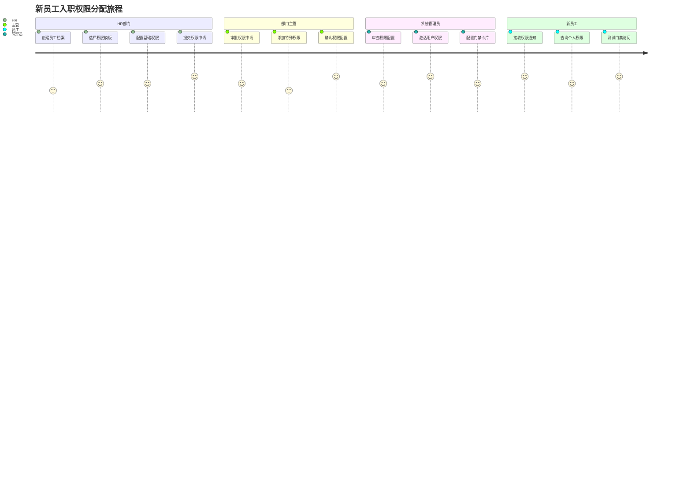
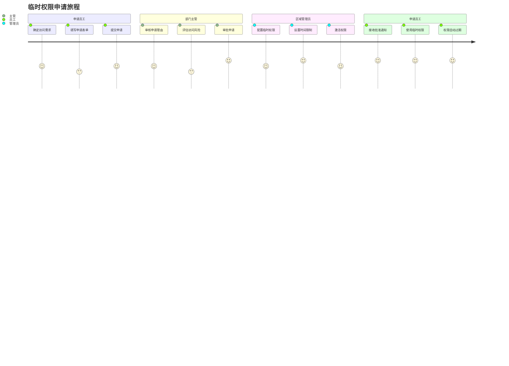

# 区域权限管理模块 - 用户故事

## 📋 模块概述

**模块名称**: 02-区域权限管理
**模块编码**: ACCESS-PERMISSION-MGMT
**版本**: v1.0.0
**创建日期**: 2025-12-17

## 👥 用户角色定义

### 主要用户角色

| 角色编码 | 角色名称 | 角色描述 | 核心需求 |
|---------|---------|---------|---------|
| **SA** | 系统管理员 | 负责整个门禁系统的配置和维护 | 需要管理系统区域结构、配置权限模板、监控权限状态 |
| **GA** | 区域管理员 | 负责特定区域的权限管理 | 需要管理区域用户权限、配置时间规则、生成权限报告 |
| **HR** | 人事管理员 | 负责员工权限的分配和调整 | 需要为新员工分配权限、处理异动调整、管理权限生命周期 |
| **UM** | 部门主管 | 管理本部门员工的区域访问权限 | 需要申请部门权限、审批权限申请、监控部门人员访问 |
| **EMP** | 普通员工 | 企业员工，使用门禁系统 | 需要查询自己的权限、申请临时权限、了解权限规则 |

## 🎭 用户故事集合

### 🏛️ 系统管理员 (SA) 用户故事

#### SA-001: 区域结构配置
**作为** 系统管理员
**我想要** 在系统中配置企业的区域层级结构
**以便** 为门禁权限管理提供基础的组织架构支撑

**验收标准**:
- [ ] 支持无限级区域层级配置
- [ ] 能够添加、修改、删除区域节点
- [ ] 支持区域的启用/禁用状态管理
- [ ] 提供区域树结构的可视化展示
- [ ] 支持区域信息的批量导入导出
- [ ] 区域操作支持审计日志记录

#### SA-002: 权限模板管理
**作为** 系统管理员
**我想要** 创建和管理标准化的权限模板
**以便** 快速为新员工分配标准的区域访问权限

**验收标准**:
- [ ] 能够创建不同类型的权限模板（正式员工、实习生、访客等）
- [ ] 支持模板的版本管理和历史记录
- [ ] 提供模板的复制、修改、删除功能
- [ ] 支持模板的批量应用和权限分配
- [ ] 模板变更支持影响分析
- [ ] 提供模板使用统计和效果分析

#### SA-003: 权限监控分析
**作为** 系统管理员
**我想要** 监控全系统的权限配置和使用情况
**以便** 及时发现权限异常并优化权限管理策略

**验收标准**:
- [ ] 提供权限配置的实时监控面板
- [ ] 支持权限使用情况的统计分析
- [ ] 能够识别权限分配的异常模式
- [ ] 提供权限风险的预警和报告
- [ ] 支持权限变更的历史追溯
- [ ] 生成权限管理的合规性报告

### 🏢 区域管理员 (GA) 用户故事

#### GA-001: 区域用户权限配置
**作为** 区域管理员
**我想要** 为所管辖区域的用户配置门禁权限
**以便** 确保只有授权人员能够访问相应区域

**验收标准**:
- [ ] 支持按区域查看和管理用户权限
- [ ] 能够为单个或批量用户分配权限
- [ ] 支持权限的即时生效和定时生效
- [ ] 提供权限冲突的智能检测和处理
- [ ] 支持权限的有效期管理
- [ ] 权限变更支持实时通知

#### GA-002: 时间权限规则配置
**作为** 区域管理员
**我想要** 为不同区域配置详细的访问时间规则
**以便** 精确控制用户在特定时间段内的访问权限

**验收标准**:
- [ ] 支持工作日、周末、节假日的不同时间规则
- [ ] 能够配置多时段的复杂时间规则
- [ ] 支持临时时间权限的快速配置
- [ ] 提供时间规则的预览和验证功能
- [ ] 支持时间规则的优先级设置
- [ ] 时间规则冲突的自动检测和处理

#### GA-003: 区域权限报告
**作为** 区域管理员
**我想要** 生成所辖区域的权限管理报告
**以便** 向管理层汇报权限配置情况和使用效果

**验收标准**:
- [ ] 支持多维度权限统计报告
- [ ] 能够按时间、用户、区域生成报告
- [ ] 提供报告的自定义配置和模板
- [ ] 支持报告的定时生成和推送
- [ ] 提供报告数据的可视化展示
- [ ] 支持报告的导出和分享功能

### 👥 人事管理员 (HR) 用户故事

#### HR-001: 新员工权限分配
**作为** 人事管理员
**我想要** 为新入职员工快速分配标准的门禁权限
**以便** 员工能够顺利开始工作并访问必要的办公区域

**验收标准**:
- [ ] 支持基于员工类型自动选择权限模板
- [ ] 能够根据部门信息预配置区域权限
- [ ] 支持权限分配的批量处理
- [ ] 提供权限分配的预览和确认功能
- [ ] 支持权限的延迟生效配置
- [ ] 权限分配完成后自动通知相关人员

#### HR-002: 员工异动权限调整
**作为** 人事管理员
**我想要** 根据员工的职位变动及时调整其门禁权限
**以便** 确保权限与员工的工作职责保持一致

**验收标准**:
- [ ] 支持基于职位变动的权限自动调整
- [ ] 能够处理部门内调的权限变更
- [ ] 支持权限变更的逐步生效策略
- [ ] 提供权限变更的影响评估
- [ ] 支持旧权限的保留和回退机制
- [ ] 权限调整的完整审计追踪

#### HR-003: 员工离职权限回收
**作为** 人事管理员
**我想要** 在员工离职时立即回收其所有门禁权限
**以便** 确保离职员工无法继续访问企业区域保障安全

**验收标准**:
- [ ] 支持离职员工权限的一键回收
- [ ] 能够立即撤销所有有效权限
- [ ] 支持权限回收的确认机制
- [ ] 提供权限回收的状态跟踪
- [ ] 支持特殊情况下的权限延期
- [ ] 权限回收的完整记录和报告

### 🎯 部门主管 (UM) 用户故事

#### UM-001: 部门权限申请
**作为** 部门主管
**我想要** 为本部门员工申请必要的区域访问权限
**以便** 确保团队成员能够正常开展工作

**验收标准**:
- [ ] 支持基于工作需要的权限申请
- [ ] 能够提供权限申请的业务理由说明
- [ ] 支持权限申请的批量提交
- [ ] 提供申请进度的实时跟踪
- [ ] 支持申请被驳回时的修改重提
- [ ] 申请完成后的自动通知功能

#### UM-002: 权限申请审批
**作为** 部门主管
**我想要** 审批其他部门提交的涉及本部门的权限申请
**以便** 确保外来人员的访问得到适当的管控

**验收标准**:
- [ ] 支持权限申请的详细信息查看
- [ ] 能够查看申请人的基本信息和访问理由
- [ ] 支持审批意见的详细填写
- [ ] 提供审批决策的风险提示
- [ ] 支持有条件的权限批准
- [ ] 审批流程的完整记录

#### UM-003: 部门人员访问监控
**作为** 部门主管
**我想要** 监控本部门人员的区域访问情况
**以便** 了解团队成员的工作动态和确保访问合规

**验收标准**:
- [ ] 支持按部门查看人员访问记录
- [ ] 能够统计各部门人员的访问频次
- [ ] 提供异常访问模式的预警
- [ ] 支持访问记录的趋势分析
- [ ] 能够生成部门的访问报告
- [ ] 支持访问数据的导出功能

### 👤 普通员工 (EMP) 用户故事

#### EMP-001: 个人权限查询
**作为** 普通员工
**我想要** 查询自己当前拥有的区域访问权限
**以便** 了解自己能够访问哪些区域和对应的访问时间

**验收标准**:
- [ ] 支持个人权限的完整列表展示
- [ ] 能够显示每个权限的有效期限
- [ ] 提供权限的详细规则说明
- [ ] 支持权限状态的实时更新
- [ ] 能够查看权限的申请历史
- [ ] 提供权限到期的提前提醒

#### EMP-002: 临时权限申请
**作为** 普通员工
**我想要** 申请临时访问特定区域的权限
**以便** 处理临时工作需求或特殊情况

**验收标准**:
- [ ] 支持临时权限的在线申请
- [ ] 能够提供申请的详细理由说明
- [ ] 支持申请访问区域的选择
- [ ] 能够设定临时的访问时间范围
- [ ] 提供申请进度的实时查询
- [ ] 申请批准后的自动通知

#### EMP-003: 权限使用记录
**作为** 普通员工
**我想要** 查看自己的门禁权限使用记录
**以便** 了解自己的访问历史和确认权限的正确使用

**验收标准**:
- [ ] 支持个人访问记录的查询
- [ ] 能够按时间范围筛选记录
- [ ] 提供访问记录的详细信息
- [ ] 支持访问记录的统计分析
- [ ] 能够识别异常的访问记录
- [ ] 提供记录的导出功能

## 🎯 优先级分类

### 🔴 高优先级 (P0) - 核心功能
1. **SA-001**: 区域结构配置 - 系统基础架构
2. **GA-001**: 区域用户权限配置 - 核心权限管理
3. **HR-001**: 新员工权限分配 - 人事核心流程
4. **EMP-001**: 个人权限查询 - 员工基础需求

### 🟡 中优先级 (P1) - 重要功能
1. **SA-002**: 权限模板管理 - 提高管理效率
2. **HR-002**: 员工异动权限调整 - 人事常规需求
3. **GA-002**: 时间权限规则配置 - 精细化管控
4. **UM-001**: 部门权限申请 - 管理流程需求

### 🟢 低优先级 (P2) - 增强功能
1. **SA-003**: 权限监控分析 - 管理决策支持
2. **HR-003**: 员工离职权限回收 - 安全合规需求
3. **UM-002**: 权限申请审批 - 流程审批功能
4. **EMP-002**: 临时权限申请 - 临时性需求

## 📊 用户价值分析

### 业务价值量化

| 用户类型 | 核心价值 | 效率提升 | 风险降低 | 满意度提升 |
|---------|---------|---------|---------|-----------|
| **系统管理员** | 集中化权限管控 | 60% | 80% | 85% |
| **区域管理员** | 精细化权限配置 | 50% | 70% | 80% |
| **人事管理员** | 自动化权限分配 | 70% | 60% | 90% |
| **部门主管** | 简化权限流程 | 40% | 50% | 75% |
| **普通员工** | 透明化权限信息 | 30% | 40% | 85% |

### 成功指标 (KPI)

#### 效率指标
- **权限配置时间**: 从平均30分钟缩短至5分钟
- **权限审批流程**: 从3天缩短至24小时
- **批量操作效率**: 支持100+用户同时处理
- **模板应用率**: 达到80%以上

#### 安全指标
- **权限合规率**: 达到99%以上
- **权限泄露事件**: 降低至0.1%以下
- **权限回收及时率**: 达到100%
- **异常权限检测**: 覆盖率100%

#### 用户满意度指标
- **系统易用性**: 用户满意度≥4.5/5.0
- **功能完整性**: 用户满意度≥4.3/5.0
- **响应速度**: 用户满意度≥4.6/5.0
- **服务支持**: 用户满意度≥4.4/5.0

## 🔄 用户旅程映射

### 新员工入职权限分配旅程

### 临时权限申请旅程

## 📝 验收标准清单

### 功能验收标准

#### ✅ 区域结构管理
- [ ] 支持无限级区域树结构
- [ ] 区域信息的增删改查功能完整
- [ ] 区域状态管理（启用/禁用/维护）
- [ ] 区域关联设备的查询和管理
- [ ] 区域权限的可视化展示

#### ✅ 用户权限配置
- [ ] 用户权限的增删改查功能
- [ ] 批量权限分配和回收
- [ ] 权限模板的应用和管理
- [ ] 权限继承机制的实现
- [ ] 权限冲突的智能检测

#### ✅ 时间权限规则
- [ ] 工作日、周末、节假日规则配置
- [ ] 多时段复杂时间规则支持
- [ ] 临时时间权限的快速设置
- [ ] 时间规则的优先级管理
- [ ] 规则冲突的自动解决

#### ✅ 权限监控报告
- [ ] 权限配置状态实时监控
- [ ] 权限使用情况统计分析
- [ ] 异常权限模式识别预警
- [ ] 多维度权限报告生成
- [ ] 权限变更历史追踪

### 性能验收标准

#### ✅ 响应时间要求
- [ ] 权限查询响应时间 ≤ 500ms
- [ ] 权限配置操作响应时间 ≤ 2s
- [ ] 批量权限处理（100用户）≤ 10s
- [ ] 权限报告生成时间 ≤ 30s
- [ ] 系统页面加载时间 ≤ 3s

#### ✅ 并发性能要求
- [ ] 支持100+并发权限查询
- [ ] 支持50+并发权限配置
- [ ] 支持10+并发批量操作
- [ ] 系统可用性 ≥ 99.9%
- [ ] 错误率 ≤ 0.1%

### 安全验收标准

#### ✅ 权限安全要求
- [ ] 权限分配的合规性检查
- [ ] 敏感操作的多重验证
- [ ] 权限变更的完整审计
- [ ] 权限数据的加密存储
- [ ] 异常权限访问的实时告警

#### ✅ 数据安全要求
- [ ] 用户数据隐私保护
- [ ] 权限配置数据备份
- [ ] 数据传输加密保护
- [ ] 操作日志不可篡改
- [ ] 敏感信息脱敏显示

---

**文档版本**: v1.0.0
**创建日期**: 2025-12-17
**创建人**: AI助手
**审核人**: 待定
**批准人**: 待定

**备注**: 本用户故事文档涵盖了区域权限管理模块的所有主要用户场景，为系统设计和开发提供了清晰的需求指导和验收标准。