# IOE-DREAM门禁管理模块 - 业务流程设计

> **模块版本**: v2.0.0
> **创建时间**: 2025-12-16
> **最后更新**: 2025-12-16
> **文档类型**: 业务流程设计

## 📋 流程概述

门禁管理模块业务流程涵盖从设备管理、权限配置、通行验证、实时监控到应急处理的完整业务闭环。通过智能化的流程设计和自动化的处理机制，确保门禁系统的高效、安全和可靠运行。

### 核心业务流程

1. **设备管理流程**: 设备注册、配置、监控、维护的全生命周期管理
2. **权限管理流程**: 权限申请、审批、下发、生效的完整流程
3. **通行验证流程**: 多模态认证、权限检查、事件记录的实时处理
4. **监控告警流程**: 实时监控、异常检测、告警处置的闭环管理
5. **应急处理流程**: 紧急情况下的权限开放、区域封锁、人员疏散
6. **数据统计流程**: 通行数据收集、分析、报表生成和决策支持

---

## 🔧 设备管理流程

### 1. 设备注册流程

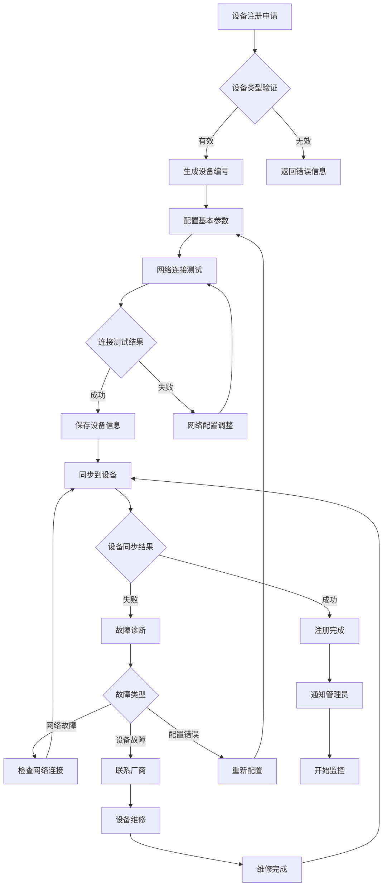
```mermaid
flowchart TD
    A[设备注册申请] --> B{设备类型验证}
    B -->|有效| C[生成设备编号]
    B -->|无效| D[返回错误信息]

    C --> E[配置基本参数]
    E --> F[网络连接测试]
    F --> G{连接测试结果}

    G -->|成功| H[保存设备信息]
    G -->|失败| I[网络配置调整]
    I --> F

    H --> J[同步到设备]
    J --> K{设备同步结果}
    K -->|成功| L[注册完成]
    K -->|失败| M[故障诊断]

    M --> N{故障类型}
    N -->|网络故障| O[检查网络连接]
    N -->|设备故障| P[联系厂商]
    N -->|配置错误| Q[重新配置]

    O --> J
    P --> R[设备维修]
    Q --> E
    R --> S[维修完成]
    S --> J

    L --> T[通知管理员]
    T --> U[开始监控]
```

**流程说明**:
- **自动发现**: 支持设备自动发现和手动添加
- **配置验证**: 验证设备配置的正确性和完整性
- **连接测试**: 确保设备能够正常连接和通信
- **同步验证**: 验证设备配置是否成功同步
- **故障处理**: 自动诊断和故障恢复机制

### 2. 设备配置流程

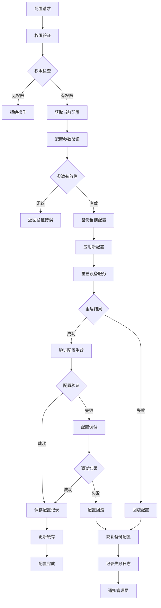
```mermaid
flowchart TD
    A[配置请求] --> B[权限验证]
    B --> C{权限检查}
    C -->|无权限| D[拒绝操作]
    C -->|有权限| E[获取当前配置]

    E --> F[配置参数验证]
    F --> G{参数有效性}
    G -->|无效| H[返回验证错误]
    G -->|有效| I[备份当前配置]

    I --> J[应用新配置]
    J --> K[重启设备服务]
    K --> L{重启结果}
    L -->|成功| M[验证配置生效]
    L -->|失败| N[回滚配置]

    N --> O[恢复备份配置]
    O --> P[记录失败日志]
    P --> Q[通知管理员]

    M --> R{配置验证}
    R -->|成功| S[保存配置记录]
    R -->|失败| T[配置调试]

    T --> U{调试结果}
    U -->|成功| S
    U -->|失败| V[配置回滚]
    V --> O

    S --> W[更新缓存]
    W --> X[配置完成]
```

**配置参数类型**:
- **基础配置**: 设备名称、位置、网络参数
- **安全配置**: 认证方式、反潜回、胁迫码
- **功能配置**: 远程开锁、报警输出、联动设置
- **高级配置**: 识别阈值、处理逻辑、性能参数

### 3. 设备监控流程

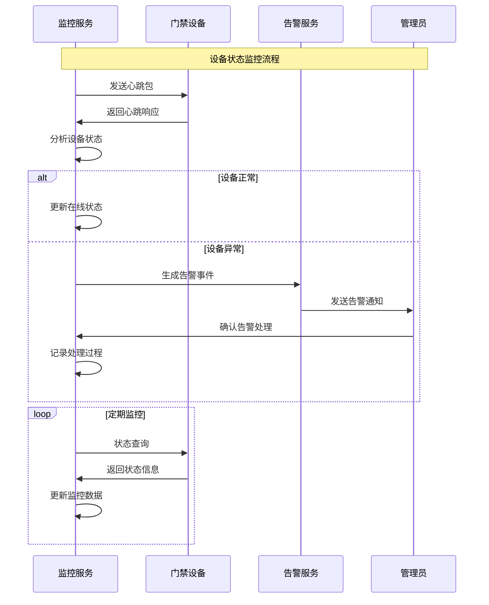
```mermaid
sequenceDiagram
    participant Monitor as 监控服务
    participant Device as 门禁设备
    participant Alert as 告警服务
    participant Manager as 管理员

    Note over Monitor,Manager: 设备状态监控流程

    Monitor->>Device: 发送心跳包
    Device->>Monitor: 返回心跳响应

    Monitor->>Monitor: 分析设备状态
    alt 设备正常
        Monitor->>Monitor: 更新在线状态
    else 设备异常
        Monitor->>Alert: 生成告警事件
        Alert->>Manager: 发送告警通知
        Manager->>Monitor: 确认告警处理
        Monitor->>Monitor: 记录处理过程
    end

    loop 定期监控
        Monitor->>Device: 状态查询
        Device->>Monitor: 返回状态信息
        Monitor->>Monitor: 更新监控数据
    end
```

---

## 🔐 权限管理流程

### 1. 权限申请流程

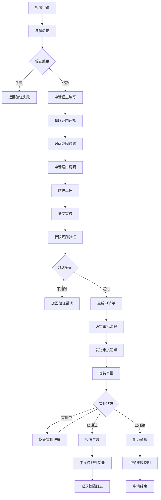
```mermaid
flowchart TD
    A[权限申请] --> B[身份验证]
    B --> C{验证结果}
    C -->|失败| D[返回验证失败]
    C -->|成功| E[申请信息填写]

    E --> F[权限范围选择]
    F --> G[时间范围设置]
    G --> H[申请理由说明]
    H --> I[附件上传]

    I --> J[提交审核]
    J --> K[权限规则验证]
    K --> L{规则验证}
    L -->|不通过| M[返回验证错误]
    L -->|通过| N[生成申请单]

    N --> O[确定审批流程]
    O --> P[发送审批通知]
    P --> Q[等待审批]

    Q --> R{审批状态}
    R -->|审批中| S[跟踪审批进度]
    R -->|已通过| T[权限生效]
    R -->|已拒绝| U[拒绝通知]

    S --> R
    T --> V[下发权限到设备]
    V --> W[记录权限日志]

    U --> X[拒绝原因说明]
    X --> Y[申请结束]
```

**权限类型**:
- **永久权限**: 长期有效的访问权限
- **临时权限**: 指定时间段内的访问权限
- **单次权限**: 仅限单次使用的访问权限
- **特殊权限**: 高安全级别区域的访问权限

### 2. 权限审批流程

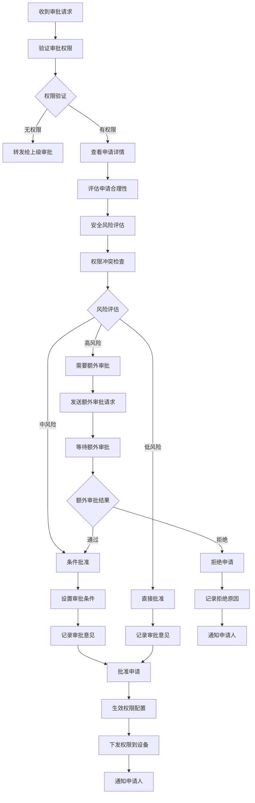
```mermaid
flowchart TD
    A[收到审批请求] --> B[验证审批权限]
    B --> C{权限验证}
    C -->|无权限| D[转发给上级审批]
    C -->|有权限| E[查看申请详情]

    E --> F[评估申请合理性]
    F --> G[安全风险评估]
    G --> H[权限冲突检查]
    H --> I{风险评估}

    I -->|高风险| J[需要额外审批]
    I -->|中风险| K[条件批准]
    I -->|低风险| L[直接批准]

    J --> M[发送额外审批请求]
    M --> N[等待额外审批]
    N --> O{额外审批结果}
    O -->|通过| K
    O -->|拒绝| P[拒绝申请]

    K --> Q[设置审批条件]
    Q --> R[记录审批意见]
    R --> S[批准申请]

    L --> T[记录审批意见]
    T --> S

    S --> U[生效权限配置]
    U --> V[下发权限到设备]
    V --> W[通知申请人]

    P --> X[记录拒绝原因]
    X --> Y[通知申请人]
```

**审批规则**:
- **分级审批**: 根据权限级别确定审批层级
- **条件审批**: 基于条件的批准和限制
- **自动审批**: 低风险权限自动审批
- **加急审批**: 紧急申请的快速审批通道

### 3. 权限验证流程

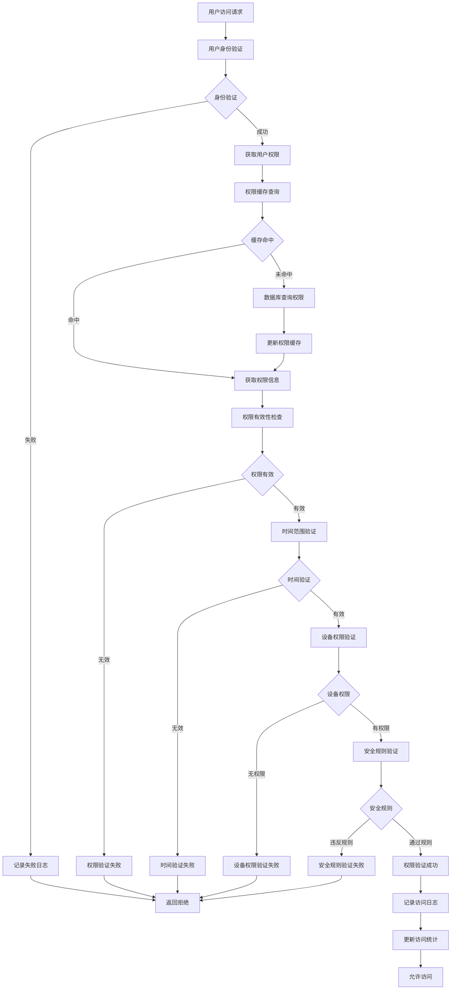
```mermaid
flowchart TD
    A[用户访问请求] --> B[用户身份验证]
    B --> C{身份验证}
    C -->|失败| D[记录失败日志]
    C -->|成功| E[获取用户权限]

    E --> F[权限缓存查询]
    F --> G{缓存命中}
    G -->|命中| H[获取权限信息]
    G -->|未命中| I[数据库查询权限]

    I --> J[更新权限缓存]
    J --> H

    H --> K[权限有效性检查]
    K --> L{权限有效}
    L -->|无效| M[权限验证失败]
    L -->|有效| N[时间范围验证]

    N --> O{时间验证}
    O -->|无效| P[时间验证失败]
    O -->|有效| Q[设备权限验证]

    Q --> R{设备权限}
    R -->|无权限| S[设备权限验证失败]
    R -->|有权限| T[安全规则验证]

    T --> U{安全规则}
    U -->|违反规则| V[安全规则验证失败]
    U -->|通过规则| W[权限验证成功]

    W --> X[记录访问日志]
    X --> Y[更新访问统计]
    Y --> Z[允许访问]

    D --> AA[返回拒绝]
    M --> AA
    P --> AA
    S --> AA
    V --> AA
```

**验证维度**:
- **身份验证**: 用户身份的真实性验证
- **权限验证**: 用户对设备的访问权限
- **时间验证**: 访问时间是否在允许范围内
- **规则验证**: 安全规则和限制条件验证
- **风险验证**: 异常行为和风险评估

---

## 🚪 通行验证流程

### 1. 多模态认证流程

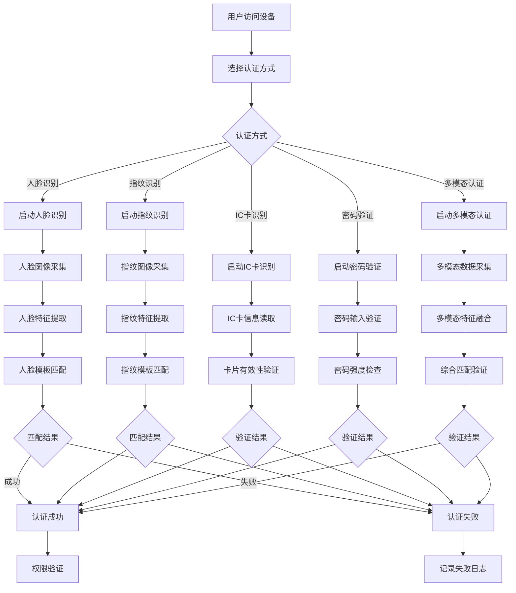
```mermaid
flowchart TD
    A[用户访问设备] --> B[选择认证方式]
    B --> C{认证方式}

    C -->|人脸识别| D[启动人脸识别]
    C -->|指纹识别| E[启动指纹识别]
    C -->|IC卡识别| F[启动IC卡识别]
    C -->|密码验证| G[启动密码验证]
    C -->|多模态认证| H[启动多模态认证]

    D --> I[人脸图像采集]
    I --> J[人脸特征提取]
    J --> K[人脸模板匹配]
    K --> L{匹配结果}

    E --> M[指纹图像采集]
    M --> N[指纹特征提取]
    N --> O[指纹模板匹配]
    O --> P{匹配结果}

    F --> Q[IC卡信息读取]
    Q --> R[卡片有效性验证]
    R --> S{验证结果}

    G --> T[密码输入验证]
    T --> U[密码强度检查]
    U --> V{验证结果}

    H --> W[多模态数据采集]
    W --> X[多模态特征融合]
    X --> Y[综合匹配验证]
    Y --> Z{验证结果}

    L -->|成功| AA[认证成功]
    L -->|失败| BB[认证失败]
    P --> AA
    P --> BB
    S --> AA
    S --> BB
    V --> AA
    V --> BB
    Z --> AA
    Z --> BB

    AA --> CC[权限验证]
    BB --> DD[记录失败日志]
```

### 2. 通行处理流程

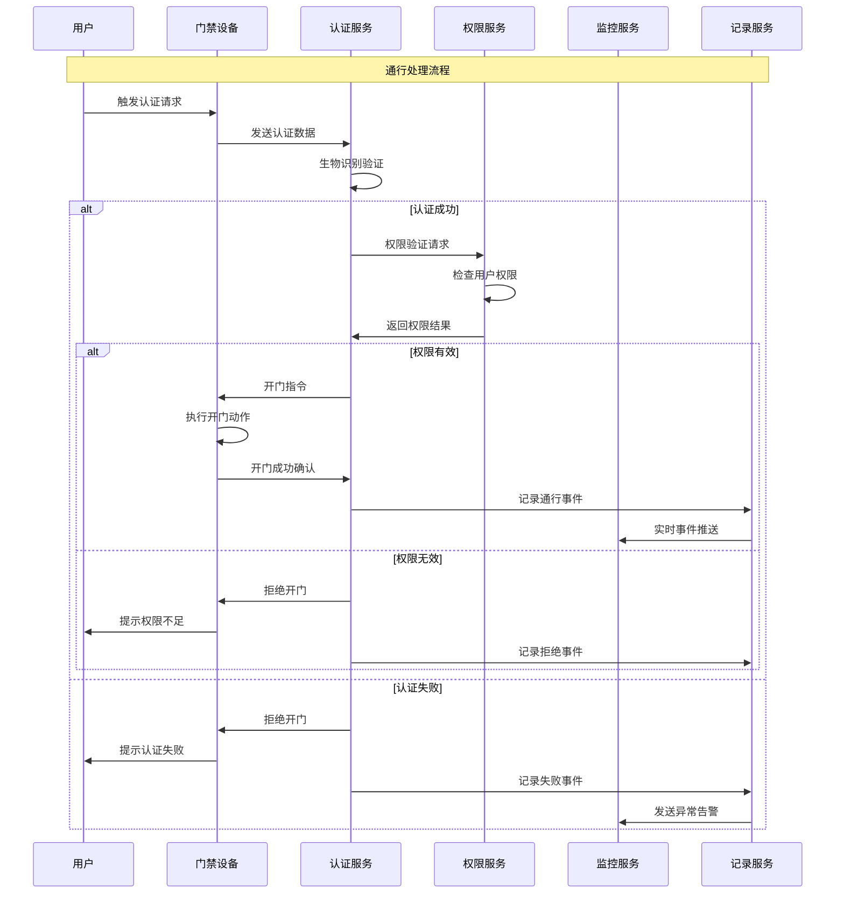
```mermaid
sequenceDiagram
    participant User as 用户
    participant Device as 门禁设备
    participant Auth as 认证服务
    participant Permission as 权限服务
    participant Monitor as 监控服务
    participant Record as 记录服务

    Note over User,Record: 通行处理流程

    User->>Device: 触发认证请求
    Device->>Auth: 发送认证数据
    Auth->>Auth: 生物识别验证

    alt 认证成功
        Auth->>Permission: 权限验证请求
        Permission->>Permission: 检查用户权限
        Permission->>Auth: 返回权限结果

        alt 权限有效
            Auth->>Device: 开门指令
            Device->>Device: 执行开门动作
            Device->>Auth: 开门成功确认
            Auth->>Record: 记录通行事件
            Record->>Monitor: 实时事件推送
        else 权限无效
            Auth->>Device: 拒绝开门
            Device->>User: 提示权限不足
            Auth->>Record: 记录拒绝事件
        end
    else 认证失败
        Auth->>Device: 拒绝开门
        Device->>User: 提示认证失败
        Auth->>Record: 记录失败事件
        Record->>Monitor: 发送异常告警
    end
```

### 3. 异常处理流程

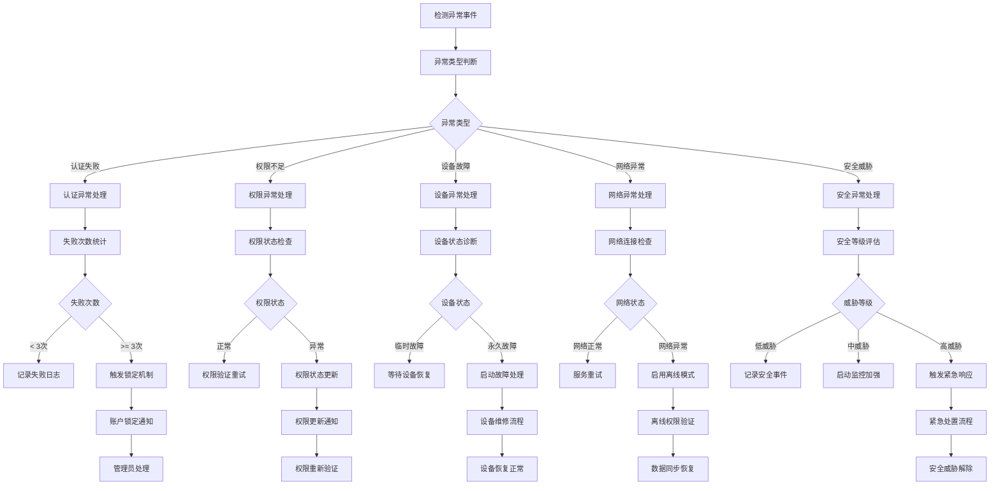
```mermaid
flowchart TD
    A[检测异常事件] --> B[异常类型判断]
    B --> C{异常类型}

    C -->|认证失败| D[认证异常处理]
    C -->|权限不足| E[权限异常处理]
    C -->|设备故障| F[设备异常处理]
    C -->|网络异常| G[网络异常处理]
    C -->|安全威胁| H[安全异常处理]

    D --> I[失败次数统计]
    I --> J{失败次数}
    J -->|< 3次| K[记录失败日志]
    J -->|>= 3次| L[触发锁定机制]

    E --> M[权限状态检查]
    M --> N{权限状态}
    N -->|正常| O[权限验证重试]
    N -->|异常| P[权限状态更新]

    F --> Q[设备状态诊断]
    Q --> R{设备状态}
    R -->|临时故障| S[等待设备恢复]
    R -->|永久故障| T[启动故障处理]

    G --> U[网络连接检查]
    U --> V{网络状态}
    V -->|网络正常| W[服务重试]
    V -->|网络异常| X[启用离线模式]

    H --> Y[安全等级评估]
    Y --> Z{威胁等级}
    Z -->|低威胁| AA[记录安全事件]
    Z -->|中威胁| BB[启动监控加强]
    Z -->|高威胁| CC[触发紧急响应]

    L --> DD[账户锁定通知]
    DD --> EE[管理员处理]

    P --> FF[权限更新通知]
    FF --> GG[权限重新验证]

    T --> HH[设备维修流程]
    HH --> II[设备恢复正常]

    X --> JJ[离线权限验证]
    JJ --> KK[数据同步恢复]

    CC --> LL[紧急处置流程]
    LL --> MM[安全威胁解除]
```

---

## 📊 实时监控流程

### 1. 设备状态监控流程

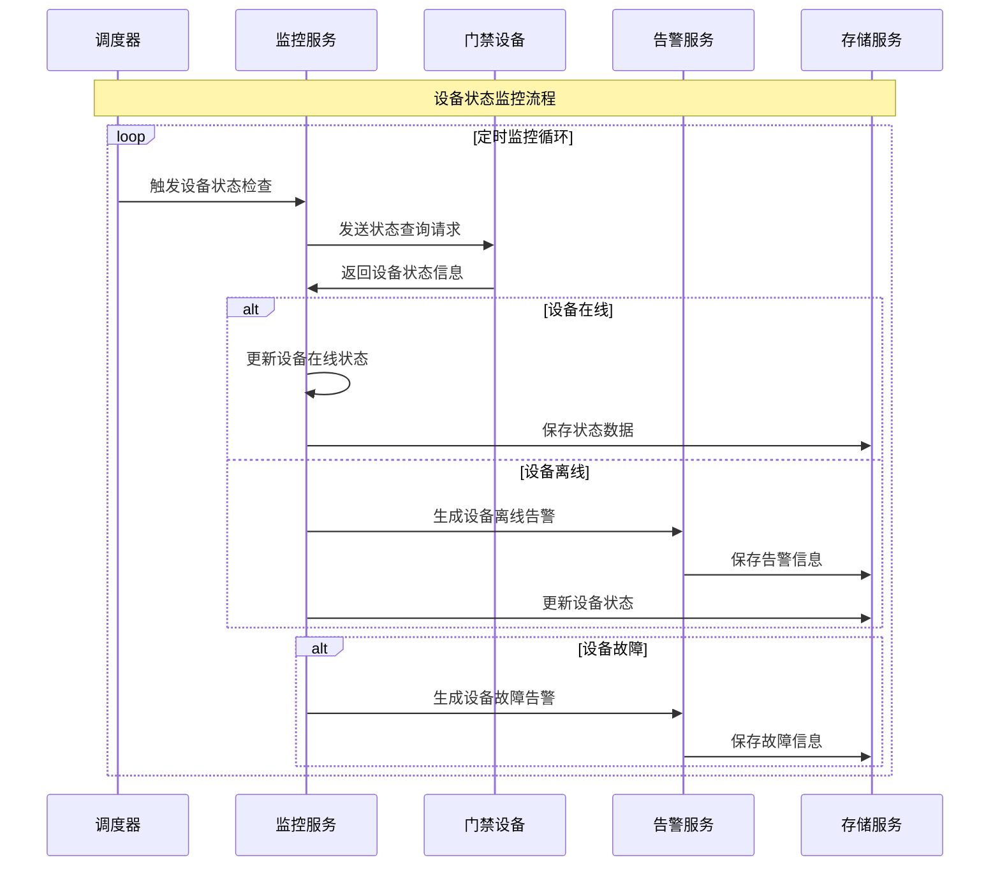
```mermaid
sequenceDiagram
    participant Scheduler as 调度器
    participant Monitor as 监控服务
    participant Device as 门禁设备
    participant Alert as 告警服务
    participant Storage as 存储服务

    Note over Scheduler,Storage: 设备状态监控流程

    loop 定时监控循环
        Scheduler->>Monitor: 触发设备状态检查
        Monitor->>Device: 发送状态查询请求
        Device->>Monitor: 返回设备状态信息

        alt 设备在线
            Monitor->>Monitor: 更新设备在线状态
            Monitor->>Storage: 保存状态数据
        else 设备离线
            Monitor->>Alert: 生成设备离线告警
            Alert->>Storage: 保存告警信息
            Monitor->>Storage: 更新设备状态
        end

        alt 设备故障
            Monitor->>Alert: 生成设备故障告警
            Alert->>Storage: 保存故障信息
        end
    end
```

### 2. 实时事件推送流程

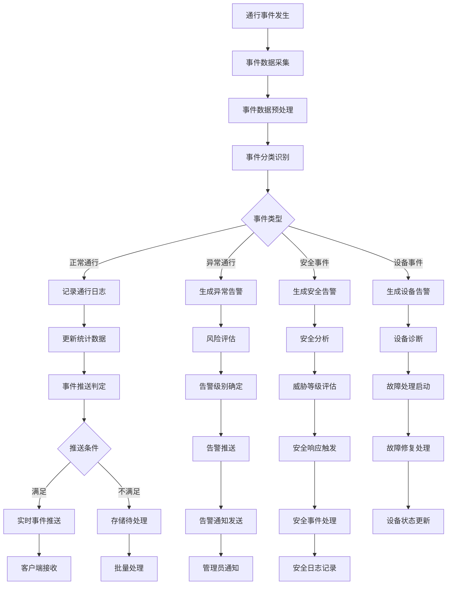
```mermaid
flowchart TD
    A[通行事件发生] --> B[事件数据采集]
    B --> C[事件数据预处理]
    C --> D[事件分类识别]
    D --> E{事件类型}

    E -->|正常通行| F[记录通行日志]
    E -->|异常通行| G[生成异常告警]
    E -->|安全事件| H[生成安全告警]
    E -->|设备事件| I[生成设备告警]

    F --> J[更新统计数据]
    J --> K[事件推送判定]

    G --> L[风险评估]
    L --> M[告警级别确定]
    M --> N[告警推送]

    H --> O[安全分析]
    O --> P[威胁等级评估]
    P --> Q[安全响应触发]

    I --> R[设备诊断]
    R --> S[故障处理启动]

    K --> T{推送条件}
    T -->|满足| U[实时事件推送]
    T -->|不满足| V[存储待处理]

    N --> W[告警通知发送]
    Q --> X[安全事件处理]
    S --> Y[故障修复处理]

    U --> Z[客户端接收]
    V --> AA[批量处理]
    W --> BB[管理员通知]
    X --> CC[安全日志记录]
    Y --> DD[设备状态更新]
```

### 3. 告警处理流程

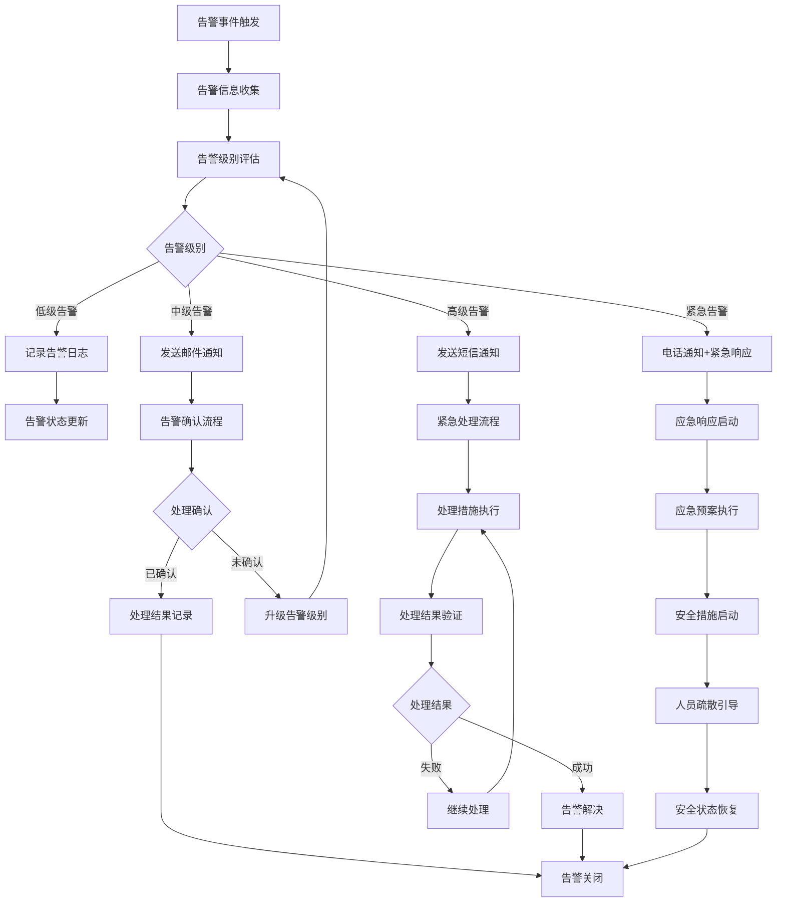
```mermaid
flowchart TD
    A[告警事件触发] --> B[告警信息收集]
    B --> C[告警级别评估]
    C --> D{告警级别}

    D -->|低级告警| E[记录告警日志]
    D -->|中级告警| F[发送邮件通知]
    D -->|高级告警| G[发送短信通知]
    D -->|紧急告警| H[电话通知+紧急响应]

    E --> I[告警状态更新]
    F --> J[告警确认流程]
    G --> K[紧急处理流程]
    H --> L[应急响应启动]

    J --> M{处理确认}
    M -->|已确认| N[处理结果记录]
    M -->|未确认| O[升级告警级别]

    K --> P[处理措施执行]
    P --> Q[处理结果验证]
    Q --> R{处理结果}
    R -->|成功| S[告警解决]
    R -->|失败| T[继续处理]

    L --> U[应急预案执行]
    U --> V[安全措施启动]
    V --> W[人员疏散引导]

    N --> X[告警关闭]
    O --> C
    S --> X
    T --> P
    W --> Y[安全状态恢复]
    Y --> X
```

---

## 🚨 应急处理流程

### 1. 紧急权限开放流程

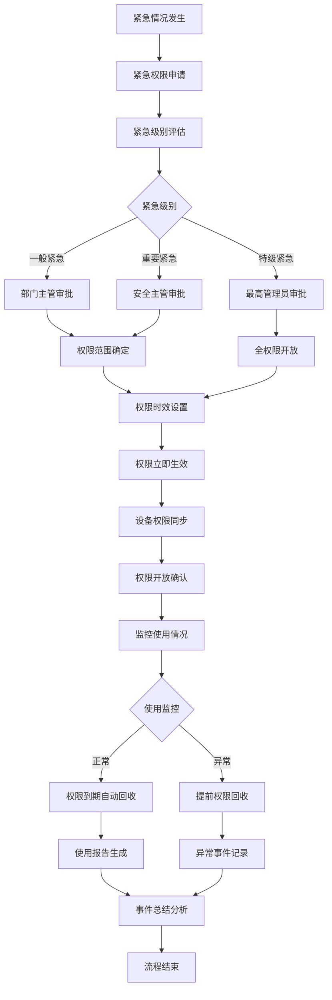
```mermaid
flowchart TD
    A[紧急情况发生] --> B[紧急权限申请]
    B --> C[紧急级别评估]
    C --> D{紧急级别}

    D -->|一般紧急| E[部门主管审批]
    D -->|重要紧急| F[安全主管审批]
    D -->|特级紧急| G[最高管理员审批]

    E --> H[权限范围确定]
    F --> H
    G --> I[全权限开放]

    H --> J[权限时效设置]
    I --> J

    J --> K[权限立即生效]
    K --> L[设备权限同步]
    L --> M[权限开放确认]

    M --> N[监控使用情况]
    N --> O{使用监控}
    O -->|正常| P[权限到期自动回收]
    O -->|异常| Q[提前权限回收]

    P --> R[使用报告生成]
    Q --> S[异常事件记录]

    R --> T[事件总结分析]
    S --> T
    T --> U[流程结束]
```

### 2. 区域封锁流程

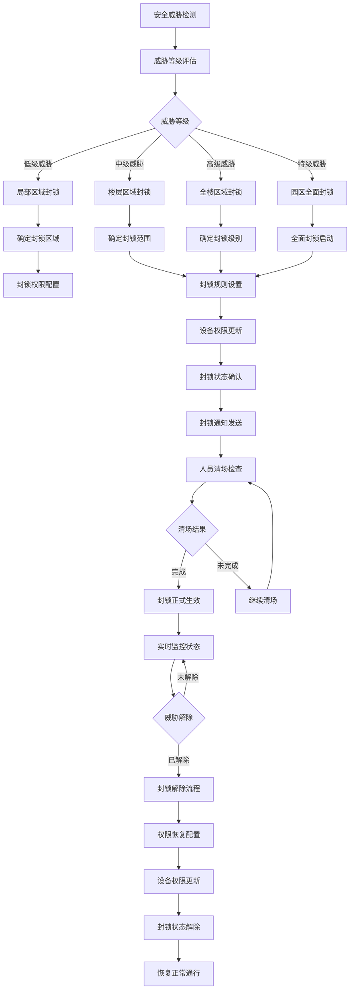
```mermaid
flowchart TD
    A[安全威胁检测] --> B[威胁等级评估]
    B --> C{威胁等级}

    C -->|低级威胁| D[局部区域封锁]
    C -->|中级威胁| E[楼层区域封锁]
    C -->|高级威胁| F[全楼区域封锁]
    C -->|特级威胁| G[园区全面封锁]

    D --> H[确定封锁区域]
    E --> I[确定封锁范围]
    F --> J[确定封锁级别]
    G --> K[全面封锁启动]

    H --> L[封锁权限配置]
    I --> M[封锁规则设置]
    J --> M
    K --> M

    M --> N[设备权限更新]
    N --> O[封锁状态确认]
    O --> P[封锁通知发送]

    P --> Q[人员清场检查]
    Q --> R{清场结果}
    R -->|完成| S[封锁正式生效]
    R -->|未完成| T[继续清场]

    S --> U[实时监控状态]
    T --> Q

    U --> V{威胁解除}
    V -->|未解除| U
    V -->|已解除| W[封锁解除流程]

    W --> X[权限恢复配置]
    X --> Y[设备权限更新]
    Y --> Z[封锁状态解除]
    Z --> AA[恢复正常通行]
```

### 3. 人员疏散流程

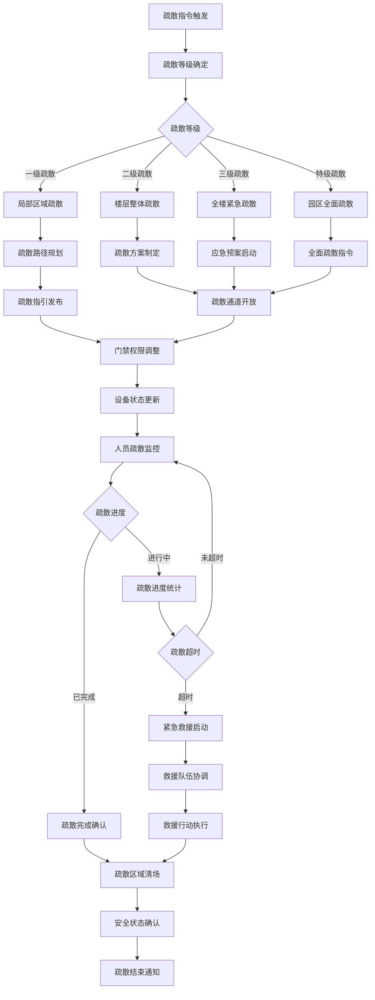
```mermaid
flowchart TD
    A[疏散指令触发] --> B[疏散等级确定]
    B --> C{疏散等级}

    C -->|一级疏散| D[局部区域疏散]
    C -->|二级疏散| E[楼层整体疏散]
    C -->|三级疏散| F[全楼紧急疏散]
    C -->|特级疏散| G[园区全面疏散]

    D --> H[疏散路径规划]
    E --> I[疏散方案制定]
    F --> J[应急预案启动]
    G --> K[全面疏散指令]

    H --> L[疏散指引发布]
    I --> M[疏散通道开放]
    J --> M
    K --> M

    L --> N[门禁权限调整]
    M --> N

    N --> O[设备状态更新]
    O --> P[人员疏散监控]
    P --> Q{疏散进度}

    Q -->|进行中| R[疏散进度统计]
    Q -->|已完成| S[疏散完成确认]

    R --> T{疏散超时}
    T -->|未超时| P
    T -->|超时| U[紧急救援启动]

    S --> V[疏散区域清场]
    V --> W[安全状态确认]
    W --> X[疏散结束通知]

    U --> Y[救援队伍协调]
    Y --> Z[救援行动执行]
    Z --> V
```

---

## 📈 数据统计流程

### 1. 通行数据统计流程

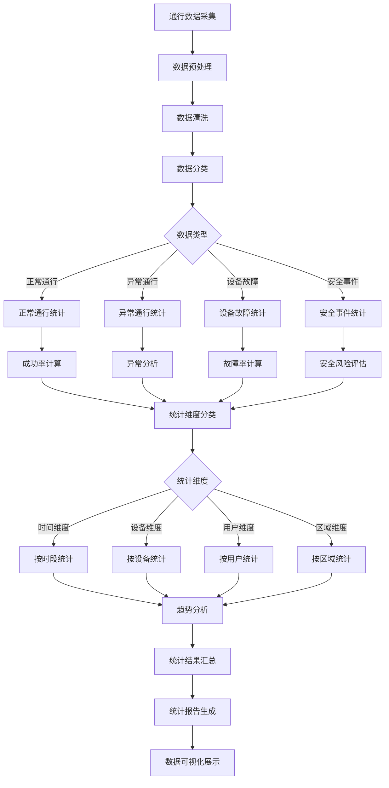
```mermaid
flowchart TD
    A[通行数据采集] --> B[数据预处理]
    B --> C[数据清洗]
    C --> D[数据分类]
    D --> E{数据类型}

    E -->|正常通行| F[正常通行统计]
    E -->|异常通行| G[异常通行统计]
    E -->|设备故障| H[设备故障统计]
    E -->|安全事件| I[安全事件统计]

    F --> J[成功率计算]
    G --> K[异常分析]
    H --> L[故障率计算]
    I --> M[安全风险评估]

    J --> N[统计维度分类]
    K --> N
    L --> N
    M --> N

    N --> O{统计维度}
    O -->|时间维度| P[按时段统计]
    O -->|设备维度| Q[按设备统计]
    O -->|用户维度| R[按用户统计]
    O -->|区域维度| S[按区域统计]

    P --> T[趋势分析]
    Q --> T
    R --> T
    S --> T

    T --> U[统计结果汇总]
    U --> V[统计报告生成]
    V --> W[数据可视化展示]
```

### 2. 设备使用分析流程

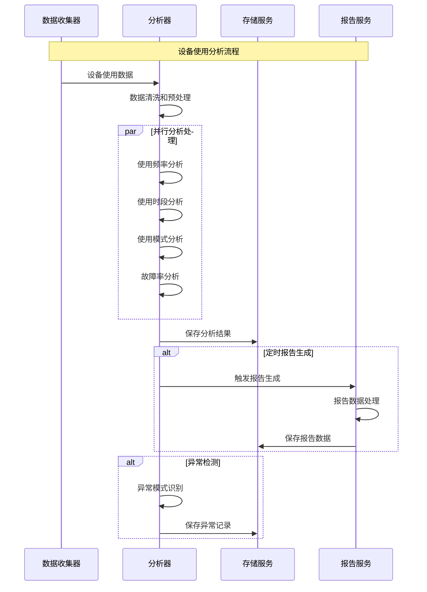
```mermaid
sequenceDiagram
    participant Collector as 数据收集器
    participant Analyzer as 分析器
    participant Storage as 存储服务
    participant Reporter as 报告服务

    Note over Collector,Reporter: 设备使用分析流程

    Collector->>Analyzer: 设备使用数据
    Analyzer->>Analyzer: 数据清洗和预处理

    par 并行分析处理
        Analyzer->>Analyzer: 使用频率分析
        Analyzer->>Analyzer: 使用时段分析
        Analyzer->>Analyzer: 使用模式分析
        Analyzer->>Analyzer: 故障率分析
    end

    Analyzer->>Storage: 保存分析结果

    alt 定时报告生成
        Analyzer->>Reporter: 触发报告生成
        Reporter->>Reporter: 报告数据处理
        Reporter->>Storage: 保存报告数据
    end

    alt 异常检测
        Analyzer->>Analyzer: 异常模式识别
        Analyzer->>Storage: 保存异常记录
    end
```

### 3. 安全风险评估流程

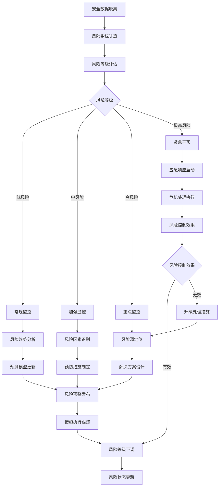
```mermaid
flowchart TD
    A[安全数据收集] --> B[风险指标计算]
    B --> C[风险等级评估]
    C --> D{风险等级}

    D -->|低风险| E[常规监控]
    D -->|中风险| F[加强监控]
    D -->|高风险| G[重点监控]
    D -->|极高风险| H[紧急干预]

    E --> I[风险趋势分析]
    F --> J[风险因素识别]
    G --> K[风险源定位]
    H --> L[应急响应启动]

    I --> M[预测模型更新]
    J --> N[预防措施制定]
    K --> O[解决方案设计]
    L --> P[危机处理执行]

    M --> Q[风险预警发布]
    N --> Q
    O --> Q
    P --> R[风险控制效果]

    Q --> S[措施执行跟踪]
    R --> T{风险控制效果}
    T -->|有效| U[风险等级下调]
    T -->|无效| V[升级处理措施]

    S --> U
    V --> K
    U --> W[风险状态更新]
```

---

## 🔄 流程优化机制

### 1. 自动化流程优化

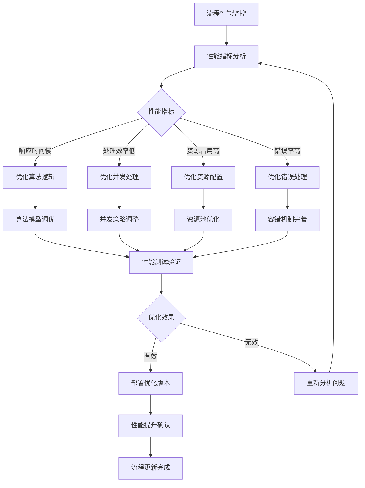
```mermaid
flowchart TD
    A[流程性能监控] --> B[性能指标分析]
    B --> C{性能指标}

    C -->|响应时间慢| D[优化算法逻辑]
    C -->|处理效率低| E[优化并发处理]
    C -->|资源占用高| F[优化资源配置]
    C -->|错误率高| G[优化错误处理]

    D --> H[算法模型调优]
    E --> I[并发策略调整]
    F --> J[资源池优化]
    G --> K[容错机制完善]

    H --> L[性能测试验证]
    I --> L
    J --> L
    K --> L

    L --> M{优化效果}
    M -->|有效| N[部署优化版本]
    M -->|无效| O[重新分析问题]

    N --> P[性能提升确认]
    O --> B
    P --> Q[流程更新完成]
```

### 2. 智能化决策支持

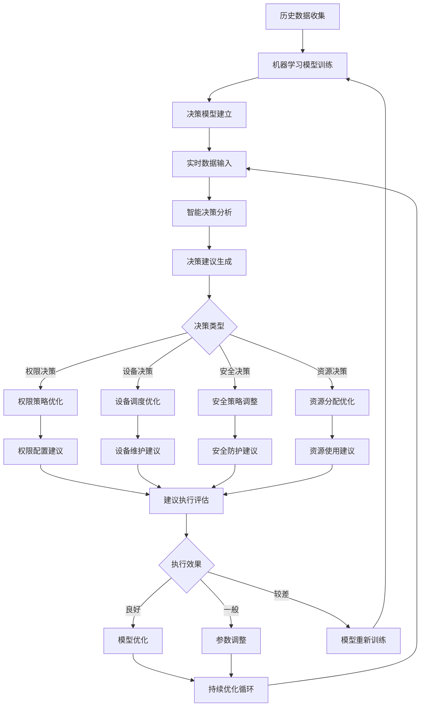
```mermaid
flowchart TD
    A[历史数据收集] --> B[机器学习模型训练]
    B --> C[决策模型建立]
    C --> D[实时数据输入]
    D --> E[智能决策分析]
    E --> F[决策建议生成]

    F --> G{决策类型}
    G -->|权限决策| H[权限策略优化]
    G -->|设备决策| I[设备调度优化]
    G -->|安全决策| J[安全策略调整]
    G -->|资源决策| K[资源分配优化]

    H --> L[权限配置建议]
    I --> M[设备维护建议]
    J --> N[安全防护建议]
    K --> O[资源使用建议]

    L --> P[建议执行评估]
    M --> P
    N --> P
    O --> P

    P --> Q{执行效果}
    Q -->|良好| R[模型优化]
    Q -->|一般| S[参数调整]
    Q -->|较差| T[模型重新训练]

    R --> U[持续优化循环]
    S --> U
    T --> B
    U --> D
```

---

## 📝 流程规范标准

### 1. 流程设计原则

#### 标准化原则
- **统一标准**: 所有流程遵循统一的设计标准
- **模块化设计**: 流程模块化，便于维护和扩展
- **接口标准化**: 流程间的接口和数据格式标准化
- **错误处理**: 统一的错误处理和异常恢复机制

#### 优化原则
- **效率优先**: 优化流程效率，减少不必要的步骤
- **用户体验**: 关注用户操作体验，简化操作流程
- **自动化程度**: 提高自动化程度，减少人工干预
- **可监控性**: 流程状态可监控，问题可追踪

### 2. 流程质量指标

#### 效率指标
- **处理时间**: 流程平均处理时间
- **响应时间**: 流程响应时间
- **吞吐量**: 单位时间处理量
- **并发能力**: 同时处理的流程数量

#### 质量指标
- **准确率**: 流程处理准确率
- **成功率**: 流程执行成功率
- **错误率**: 流程错误率
- **用户满意度**: 用户满意度评分

#### 可靠性指标
- **可用性**: 系统可用性
- **稳定性**: 系统稳定性
- **恢复能力**: 故障恢复能力
- **数据一致性**: 数据一致性保证

---

## 🎯 未来发展规划

### 1. 流程智能化升级

#### AI驱动优化
- **智能决策**: 基于AI的智能决策支持
- **预测分析**: 流程执行预测和优化建议
- **自适应调整**: 流程参数自适应调整
- **异常检测**: 智能异常检测和处理

#### 机器学习应用
- **模式识别**: 用户行为模式识别
- **趋势预测**: 业务趋势预测分析
- **资源优化**: 资源使用优化建议
- **风险评估**: 智能风险评估和预警

### 2. 流程集成扩展

#### 系统集成
- **第三方集成**: 与更多第三方系统集成
- **API扩展**: 丰富的API接口和集成能力
- **数据互通**: 跨系统数据无缝互通
- **业务协同**: 多系统业务协同处理

#### 生态建设
- **开放平台**: 建设开放的技术平台
- **伙伴生态**: 构建合作伙伴生态系统
- **标准制定**: 参与行业标准制定
- **技术推广**: 技术方案推广和普及

---

**📞 技术支持**: 如有流程设计相关问题，请联系IOE-DREAM业务分析团队。

---

*本文档遵循IOE-DREAM业务流程设计规范，确保流程设计的完整性和可执行性。*