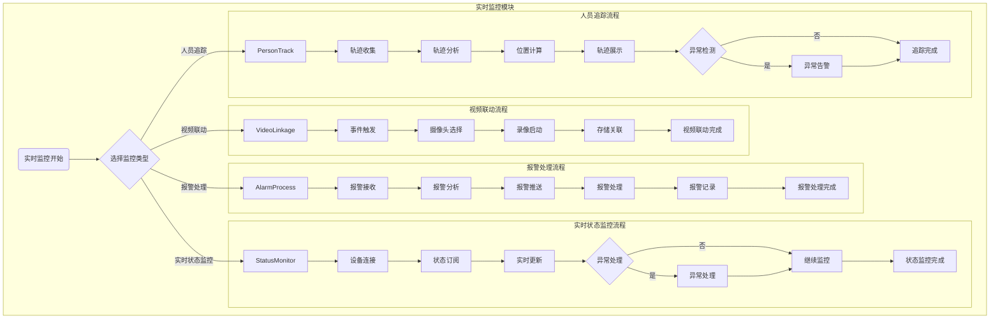

# 门禁系统 - 实时监控管理模块

> **版本**: v1.0.0  
> **创建日期**: 2025-12-17  
> **适用范围**: IOE-DREAM智慧园区门禁系统

---

## 📋 功能说明

### 模块概述

实时监控管理模块负责门禁系统的实时状态监控、报警处理、视频联动和人员追踪等核心功能，提供全方位的门禁设备和人员动态监控能力。

### 核心功能

| 功能模块 | 功能描述 | 优先级 |
|---------|---------|--------|
| 实时状态监控 | 设备连接、状态订阅、实时更新、异常处理 | P0 |
| 报警处理 | 报警接收、分析、推送、处理、记录 | P0 |
| 视频联动 | 事件触发、摄像头选择、录像启动、存储关联 | P1 |
| 人员追踪 | 轨迹收集、分析、位置计算、轨迹展示 | P1 |

---

## 📖 用户故事

### US-MON-001: 实时状态监控
**作为** 安保人员  
**我希望** 能够实时查看所有门禁设备的状态  
**以便** 及时发现和处理设备异常

**验收标准**:
- 设备状态更新延迟不超过5秒
- 设备离线时立即显示告警
- 支持按区域、设备类型筛选

### US-MON-002: 报警处理
**作为** 安保人员  
**我希望** 收到实时的门禁报警通知  
**以便** 在第一时间响应和处理安全事件

**验收标准**:
- 紧急报警在30秒内响应
- 报警信息包含详细的事件描述
- 支持报警确认和处理记录

### US-MON-003: 视频联动
**作为** 安保人员  
**我希望** 门禁事件能自动触发视频录制  
**以便** 保留完整的事件证据

**验收标准**:
- 视频联动响应时间≤2秒
- 视频文件与门禁事件自动关联
- 支持事件回放查看

### US-MON-004: 人员追踪
**作为** 安保管理员  
**我希望** 能够追踪人员在园区内的移动轨迹  
**以便** 了解人员动态和异常行为

**验收标准**:
- 位置计算误差≤2米
- 支持历史轨迹回放
- 异常轨迹自动告警

---

## 🔄 业务流程图

### 实时状态监控流程



---

## 📊 数据结构设计

### 核心数据表

#### 1. 设备状态实时表 (t_access_device_status)

```sql
CREATE TABLE `t_access_device_status` (
    `id` BIGINT(20) NOT NULL AUTO_INCREMENT COMMENT '主键ID',
    `device_id` BIGINT(20) NOT NULL COMMENT '设备ID',
    `device_status` VARCHAR(20) NOT NULL COMMENT '设备状态: ONLINE/OFFLINE/MAINTENANCE',
    `connection_status` VARCHAR(20) NOT NULL COMMENT '连接状态',
    `last_heartbeat` DATETIME NOT NULL COMMENT '最后心跳时间',
    `online_duration` BIGINT COMMENT '在线时长(秒)',
    `cpu_usage` DECIMAL(5,2) COMMENT 'CPU使用率',
    `memory_usage` DECIMAL(5,2) COMMENT '内存使用率',
    `network_latency` INT COMMENT '网络延迟(ms)',
    `create_time` DATETIME NOT NULL DEFAULT CURRENT_TIMESTAMP,
    `update_time` DATETIME NOT NULL DEFAULT CURRENT_TIMESTAMP ON UPDATE CURRENT_TIMESTAMP,
    PRIMARY KEY (`id`),
    KEY `idx_device_id` (`device_id`),
    KEY `idx_last_heartbeat` (`last_heartbeat`)
) ENGINE=InnoDB DEFAULT CHARSET=utf8mb4 COMMENT='设备状态实时表';
```

#### 2. 报警事件表 (t_access_alert)

```sql
CREATE TABLE `t_access_alert` (
    `alert_id` BIGINT(20) NOT NULL AUTO_INCREMENT COMMENT '报警ID',
    `device_id` BIGINT(20) NOT NULL COMMENT '设备ID',
    `alert_type` VARCHAR(50) NOT NULL COMMENT '报警类型',
    `alert_level` VARCHAR(20) NOT NULL COMMENT '报警级别: LOW/MEDIUM/HIGH/CRITICAL',
    `alert_content` TEXT NOT NULL COMMENT '报警内容',
    `alert_time` DATETIME NOT NULL COMMENT '报警时间',
    `handle_status` VARCHAR(20) NOT NULL DEFAULT 'PENDING' COMMENT '处理状态',
    `handler_id` BIGINT(20) COMMENT '处理人ID',
    `handle_time` DATETIME COMMENT '处理时间',
    `handle_result` TEXT COMMENT '处理结果',
    `related_event_id` BIGINT(20) COMMENT '关联事件ID',
    `related_video_id` BIGINT(20) COMMENT '关联视频ID',
    `create_time` DATETIME NOT NULL DEFAULT CURRENT_TIMESTAMP,
    `update_time` DATETIME NOT NULL DEFAULT CURRENT_TIMESTAMP ON UPDATE CURRENT_TIMESTAMP,
    PRIMARY KEY (`alert_id`),
    KEY `idx_device_id` (`device_id`),
    KEY `idx_alert_time` (`alert_time`),
    KEY `idx_handle_status` (`handle_status`)
) ENGINE=InnoDB DEFAULT CHARSET=utf8mb4 COMMENT='报警事件表';
```

#### 3. 人员轨迹表 (t_access_person_track)

```sql
CREATE TABLE `t_access_person_track` (
    `track_id` BIGINT(20) NOT NULL AUTO_INCREMENT COMMENT '轨迹ID',
    `user_id` BIGINT(20) NOT NULL COMMENT '用户ID',
    `device_id` BIGINT(20) NOT NULL COMMENT '设备ID',
    `area_id` BIGINT(20) NOT NULL COMMENT '区域ID',
    `access_type` VARCHAR(20) NOT NULL COMMENT '通行类型: IN/OUT',
    `access_time` DATETIME NOT NULL COMMENT '通行时间',
    `latitude` DECIMAL(10,7) COMMENT '纬度',
    `longitude` DECIMAL(10,7) COMMENT '经度',
    `floor_level` INT COMMENT '楼层',
    `create_time` DATETIME NOT NULL DEFAULT CURRENT_TIMESTAMP,
    PRIMARY KEY (`track_id`),
    KEY `idx_user_id` (`user_id`),
    KEY `idx_access_time` (`access_time`),
    KEY `idx_area_id` (`area_id`)
) ENGINE=InnoDB DEFAULT CHARSET=utf8mb4 COMMENT='人员轨迹表';
```

---

## 🎯 性能指标

| 指标 | 目标值 | 说明 |
|-----|-------|------|
| 设备状态更新频率 | ≤ 1秒 | 实时性要求 |
| 报警响应时间 | ≤ 30秒 | 紧急报警响应 |
| 视频联动响应时间 | ≤ 2秒 | 录像启动时间 |
| 轨迹数据采集频率 | ≤ 3秒 | 位置更新频率 |
| 异常检测准确率 | ≥ 95% | 异常行为识别 |
| 设备状态监控延迟 | ≤ 5秒 | 状态同步延迟 |

---

## ⚠️ 关键控制点

### 数据实时性
- 监控数据更新延迟不超过5秒
- 报警事件上报延迟不超过3秒
- 视频联动启动延迟不超过2秒
- 人员轨迹更新延迟不超过5秒

### 报警响应时间
- 报警接收时间 ≤ 3秒
- 报警分析处理 ≤ 10秒
- 通知推送时间 ≤ 5秒
- 人员响应确认 ≤ 12秒

### 视频联动准确性
- 摄像头与门禁点预先绑定
- 多摄像头场景下智能选择最佳视角
- 视频录制与事件时间戳精确同步
- 视频文件与门禁事件自动关联

### 人员追踪精度
- 多点验证提高定位准确性
- 轨迹平滑算法减少跳点
- 信号强度补偿算法
- 环境因素自动校正

---

## 📝 实时监控与告警操作指南

### 心跳对接
- 在边缘控制器/设备代理中集成 `/api/smart/biometric/monitor/status` 接口
- 心跳间隔推荐 10 秒，接口需携带算法状态、成功/失败次数、资源占用等字段
- 若 30 秒内未收到心跳，系统将把节点标记为 `stale` 并推送告警

### 仪表盘查看
- 赋予账号权限码 `smart:biometric:monitor:read` 后，可在"实时监控"页面查看仪表盘
- 仪表盘会展示引擎数量、成功率、平均耗时以及逾期告警列表，可通过 WebSocket 自动刷新

### 告警处理流程
- 触发告警：系统自动触发，也可在"告警中心"使用 `smart:biometric:monitor:alert` 权限手动创建
- 处理 SLA：30 秒内需要确认或解决，每次操作都要填写处理意见
- 关闭告警：调用 `/alerts/{alertId}/resolve` 或在前端界面点击"关闭"

### 运营建议
- 大屏轮询 `/dashboard` 周期为 5 秒，避免更高频率对后端造成压力
- 对 CRITICAL 告警开启企业微信/飞书 Webhook 同步，确保夜间值班及时响应
- 每周导出 `t_biometric_alert_log` 数据，与设备厂商共享，分析算法准确率波动

---

## 📚 非功能需求

### 可靠性要求
- 系统可用性 ≥ 99.99%
- 监控数据零丢失
- 支持故障自动恢复

### 安全性要求
- 监控数据加密传输
- 访问权限严格控制
- 完整的操作审计日志

### 扩展性要求
- 支持水平扩展
- 支持多区域部署
- 支持动态设备接入

---

## ✅ 验收标准

### 功能验收
- [ ] 实时状态监控功能正常，数据更新延迟≤5秒
- [ ] 报警推送功能正常，响应时间≤30秒
- [ ] 视频联动功能正常，启动时间≤2秒
- [ ] 人员追踪功能正常，定位误差≤2米

### 性能验收
- [ ] 支持1000+设备同时监控
- [ ] 报警处理TPS≥100
- [ ] 系统可用性≥99.99%

### 安全验收
- [ ] 通过安全审计
- [ ] 敏感数据加密存储
- [ ] 操作日志完整记录

---

**📝 文档维护**
- **创建人**: IOE-DREAM架构团队
- **最后更新**: 2025-12-17
