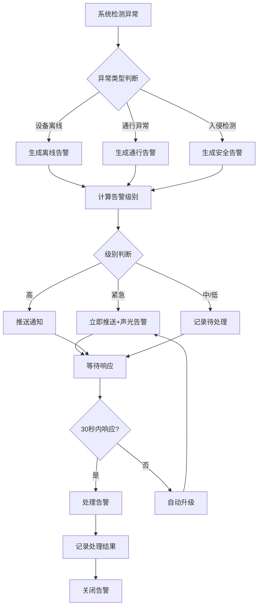
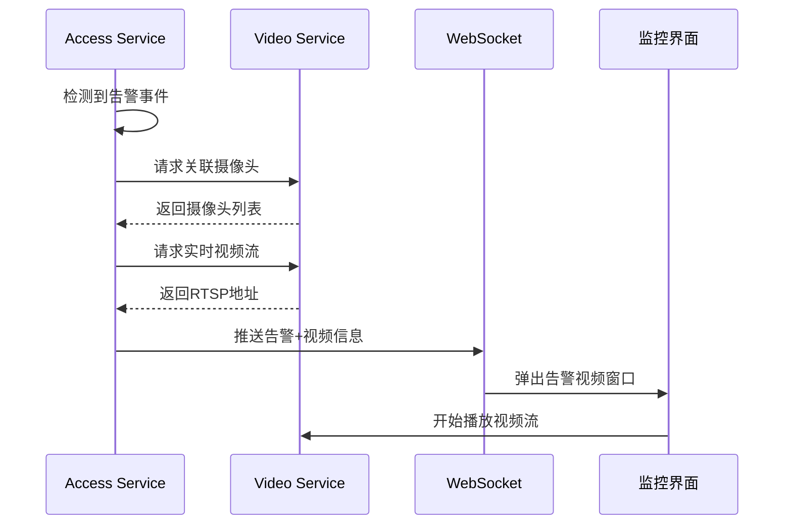
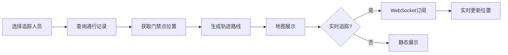

# 实时监控管理 - 业务流程图

> **版本**: v1.0.0  
> **创建日期**: 2025-12-17

---

## 📊 告警处理流程

```mermaid
flowchart TD
    A[系统检测异常] --> B{异常类型判断}
    B -->|设备离线| C[生成离线告警]
    B -->|通行异常| D[生成通行告警]
    B -->|入侵检测| E[生成安全告警]
    
    C --> F[计算告警级别]
    D --> F
    E --> F
    
    F --> G{级别判断}
    G -->|紧急| H[立即推送+声光告警]
    G -->|高| I[推送通知]
    G -->|中/低| J[记录待处理]
    
    H --> K[等待响应]
    I --> K
    J --> K
    
    K --> L{30秒内响应?}
    L -->|是| M[处理告警]
    L -->|否| N[自动升级]
    N --> H
    
    M --> O[记录处理结果]
    O --> P[关闭告警]
```

---

## 📊 视频联动流程

```mermaid
sequenceDiagram
    participant AS as Access Service
    participant VS as Video Service
    participant WS as WebSocket
    participant UI as 监控界面
    
    AS->>AS: 检测到告警事件
    AS->>VS: 请求关联摄像头
    VS-->>AS: 返回摄像头列表
    AS->>VS: 请求实时视频流
    VS-->>AS: 返回RTSP地址
    AS->>WS: 推送告警+视频信息
    WS->>UI: 弹出告警视频窗口
    UI->>VS: 开始播放视频流
```

---

## 📊 人员追踪流程

```mermaid
flowchart LR
    A[选择追踪人员] --> B[查询通行记录]
    B --> C[获取门禁点位置]
    C --> D[生成轨迹路线]
    D --> E[地图展示]
    E --> F{实时追踪?}
    F -->|是| G[WebSocket订阅]
    G --> H[实时更新位置]
    F -->|否| I[静态展示]
```

---

**📝 文档维护**: IOE-DREAM架构团队 | 2025-12-17
