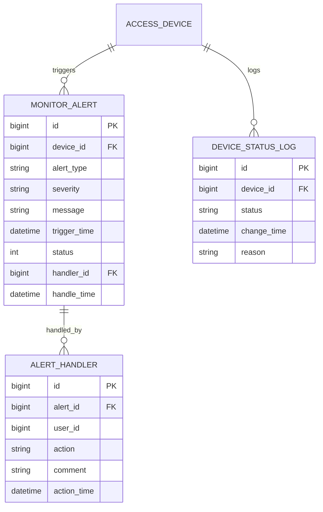

# 实时监控管理 - 数据结构设计

> **版本**: v1.0.0  
> **创建日期**: 2025-12-17

---

## 📊 ER图



---

## 📋 表结构设计

### t_monitor_alert (告警记录表)

| 字段 | 类型 | 约束 | 说明 |
|------|------|------|------|
| id | BIGINT | PK | 主键 |
| device_id | BIGINT | FK, NOT NULL | 设备ID |
| alert_type | VARCHAR(50) | NOT NULL | 告警类型 |
| severity | VARCHAR(20) | NOT NULL | 严重级别 |
| message | VARCHAR(500) | - | 告警消息 |
| trigger_time | DATETIME | NOT NULL | 触发时间 |
| status | TINYINT | DEFAULT 0 | 0待处理/1已处理/2已关闭 |
| handler_id | BIGINT | FK | 处理人ID |
| handle_time | DATETIME | - | 处理时间 |
| resolution | VARCHAR(500) | - | 处理说明 |

### t_device_status_log (状态日志表)

| 字段 | 类型 | 约束 | 说明 |
|------|------|------|------|
| id | BIGINT | PK | 主键 |
| device_id | BIGINT | FK, NOT NULL | 设备ID |
| status | VARCHAR(20) | NOT NULL | 状态 |
| change_time | DATETIME | NOT NULL | 变更时间 |
| reason | VARCHAR(200) | - | 变更原因 |

---

## 🔑 索引设计

```sql
-- 告警表索引
CREATE INDEX idx_alert_device ON t_monitor_alert(device_id);
CREATE INDEX idx_alert_time ON t_monitor_alert(trigger_time);
CREATE INDEX idx_alert_status ON t_monitor_alert(status);

-- 状态日志索引
CREATE INDEX idx_status_device ON t_device_status_log(device_id);
CREATE INDEX idx_status_time ON t_device_status_log(change_time);
```

---

**📝 文档维护**: IOE-DREAM架构团队 | 2025-12-17
