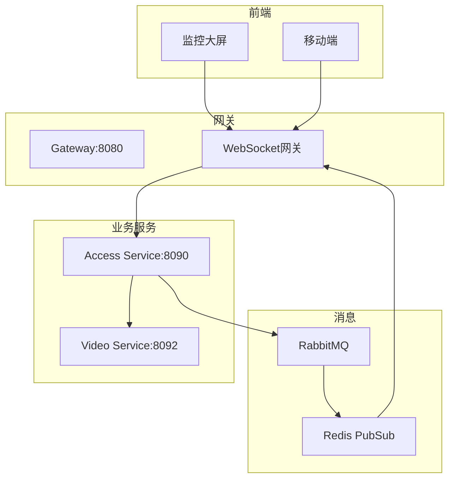

# 实时监控管理 - 概要设计说明书

> **版本**: v1.0.0  
> **创建日期**: 2025-12-17

---

## 🏗️ 系统架构

---

## 📦 模块设计

| 模块 | 职责 | 关键类 |
|------|------|--------|
| 状态监控 | 设备心跳检测、状态同步 | DeviceHealthService |
| 告警管理 | 告警生成、推送、处理 | MonitorAlertService |
| 视频联动 | 摄像头关联、视频流获取 | VideoLinkageMonitorService |
| 消息推送 | WebSocket实时推送 | WebSocketHandler |

---

## 🔧 技术选型

| 技术 | 选型 | 理由 |
|------|------|------|
| 实时通信 | WebSocket | 双向实时推送 |
| 消息队列 | RabbitMQ | 可靠消息传递 |
| 缓存 | Redis | 状态缓存+发布订阅 |
| 视频流 | RTSP | 标准视频协议 |

---

**📝 文档维护**: IOE-DREAM架构团队 | 2025-12-17
