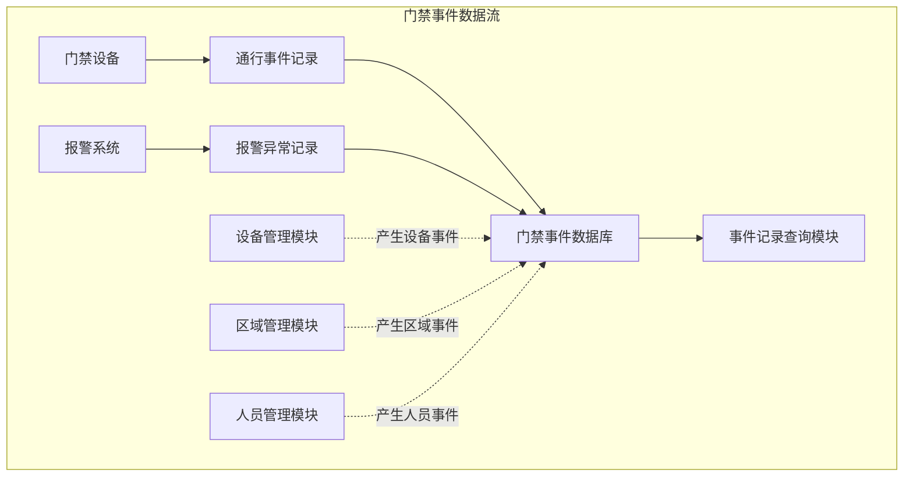
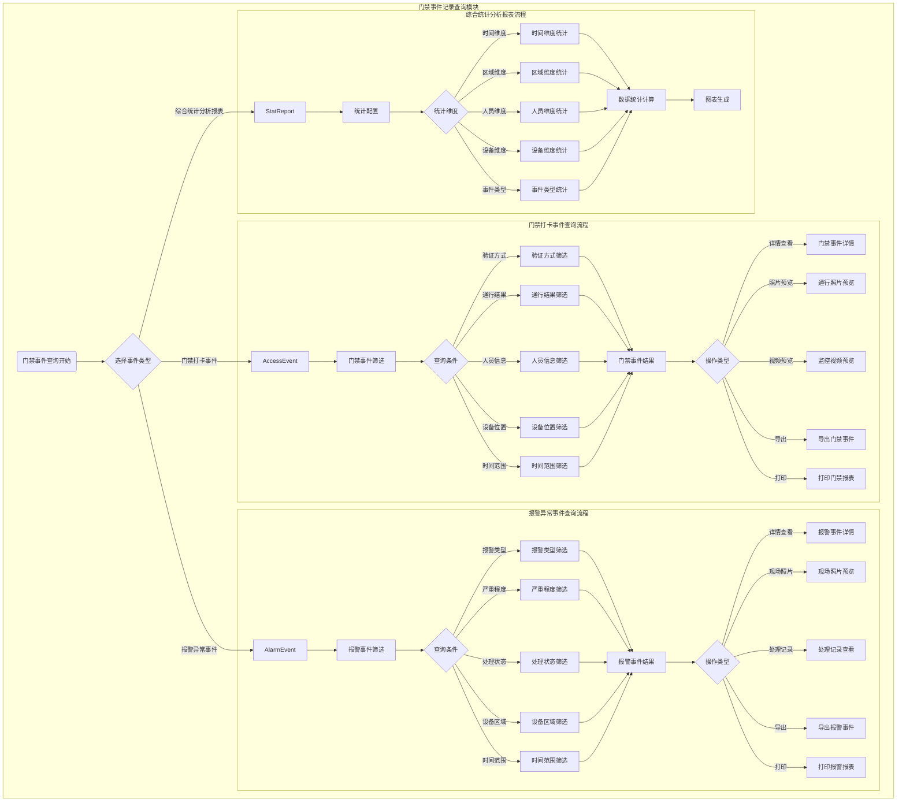

# 门禁系统 - 事件记录管理模块

> **版本**: v1.0.0  
> **创建日期**: 2025-12-17  
> **适用范围**: IOE-DREAM智慧园区门禁系统

---

## 📋 功能说明

### 模块概述

事件记录管理模块作为门禁系统的专属事件记录中心，专注于处理门禁核心业务事件：
- **门禁打卡事件记录**：刷卡、人脸识别、指纹等所有通行验证事件
- **报警异常记录**：非法通行、设备异常、安全告警等异常事件
- 门禁事件报表生成和分析
- 事件数据的照片、视频预览、导出、打印

### 事件记录分类

#### 1. 门禁打卡事件记录
- **刷卡通行事件**：IC卡、ID卡刷卡验证记录
- **生物识别事件**：人脸识别、指纹验证、掌纹识别记录
- **密码输入事件**：密码键盘输入验证记录
- **二维码事件**：手机二维码扫描验证记录
- **多重验证事件**：多种验证方式组合验证记录

#### 2. 报警异常记录
- **非法通行事件**：无权限通行、尾随、胁迫等异常事件
- **设备异常事件**：设备离线、故障、通讯异常等设备告警
- **安全告警事件**：防拆报警、门磁异常、强制开门等安全事件
- **系统异常事件**：验证超时、数据异常、系统错误等系统事件

---

## 📖 用户故事

### US-EVT-001: 门禁打卡事件查询
**作为** 安保管理员  
**我希望** 能够查询所有门禁打卡事件记录  
**以便** 了解人员通行情况

**验收标准**:
- 支持按验证方式、通行结果、人员信息、设备位置、时间范围筛选
- 支持通行照片预览和视频预览
- 支持数据导出（Excel/PDF/CSV）

### US-EVT-002: 报警异常事件查询
**作为** 安保人员  
**我希望** 能够查询所有报警异常事件  
**以便** 进行安全分析和处理

**验收标准**:
- 支持按报警类型、严重程度、处理状态、设备区域筛选
- 支持现场照片预览和处理记录查看
- 支持报警事件导出和打印

### US-EVT-003: 综合统计分析
**作为** 管理人员  
**我希望** 能够查看门禁事件的统计分析报表  
**以便** 了解整体通行情况和趋势

**验收标准**:
- 支持按时间、区域、人员、设备、事件类型多维度统计
- 支持统计图表可视化展示
- 支持报表导出和打印

---

## 🔄 业务流程图

### 事件数据流程



### 事件记录查询流程



---

## 📊 数据结构设计

### 核心数据表

#### 1. 通行记录表 (t_access_record)

```sql
CREATE TABLE `t_access_record` (
    `record_id` BIGINT(20) NOT NULL AUTO_INCREMENT COMMENT '记录ID',
    `user_id` BIGINT(20) COMMENT '用户ID',
    `device_id` BIGINT(20) NOT NULL COMMENT '设备ID',
    `area_id` BIGINT(20) NOT NULL COMMENT '区域ID',
    `card_no` VARCHAR(50) COMMENT '卡片号',
    `verify_type` VARCHAR(20) NOT NULL COMMENT '验证类型: CARD/FACE/FINGERPRINT/PASSWORD/QRCODE',
    `access_type` VARCHAR(20) NOT NULL COMMENT '通行类型: IN/OUT',
    `access_result` VARCHAR(20) NOT NULL COMMENT '通行结果: SUCCESS/FAILED/DENIED',
    `access_time` DATETIME NOT NULL COMMENT '通行时间',
    `match_score` DECIMAL(5,2) COMMENT '匹配分数',
    `verify_duration` INT COMMENT '验证时长(ms)',
    `photo_url` VARCHAR(500) COMMENT '抓拍照片URL',
    `video_url` VARCHAR(500) COMMENT '视频片段URL',
    `fail_reason` VARCHAR(200) COMMENT '失败原因',
    `device_snapshot` TEXT COMMENT '设备快照(JSON)',
    `create_time` DATETIME NOT NULL DEFAULT CURRENT_TIMESTAMP COMMENT '创建时间',
    PRIMARY KEY (`record_id`),
    KEY `idx_user_id` (`user_id`),
    KEY `idx_device_id` (`device_id`),
    KEY `idx_access_time` (`access_time`),
    KEY `idx_verify_type` (`verify_type`),
    KEY `idx_access_result` (`access_result`)
) ENGINE=InnoDB DEFAULT CHARSET=utf8mb4 COMMENT='门禁通行记录表';
```

#### 2. 事件统计表 (t_access_event_stat)

```sql
CREATE TABLE `t_access_event_stat` (
    `stat_id` BIGINT(20) NOT NULL AUTO_INCREMENT COMMENT '统计ID',
    `stat_date` DATE NOT NULL COMMENT '统计日期',
    `stat_hour` INT COMMENT '统计小时(0-23)',
    `area_id` BIGINT(20) COMMENT '区域ID',
    `device_id` BIGINT(20) COMMENT '设备ID',
    `verify_type` VARCHAR(20) COMMENT '验证类型',
    `total_count` INT NOT NULL DEFAULT 0 COMMENT '总数',
    `success_count` INT NOT NULL DEFAULT 0 COMMENT '成功数',
    `failed_count` INT NOT NULL DEFAULT 0 COMMENT '失败数',
    `avg_verify_time` INT COMMENT '平均验证时长(ms)',
    `create_time` DATETIME NOT NULL DEFAULT CURRENT_TIMESTAMP,
    `update_time` DATETIME NOT NULL DEFAULT CURRENT_TIMESTAMP ON UPDATE CURRENT_TIMESTAMP,
    PRIMARY KEY (`stat_id`),
    UNIQUE KEY `uk_stat_key` (`stat_date`, `stat_hour`, `area_id`, `device_id`, `verify_type`),
    KEY `idx_stat_date` (`stat_date`)
) ENGINE=InnoDB DEFAULT CHARSET=utf8mb4 COMMENT='门禁事件统计表';
```

---

## 🎯 关键功能说明

### 1. 门禁打卡事件查询
**数据来源**：所有门禁设备的通行验证记录  
**关键字段筛选**：
- 验证方式（刷卡、人脸、指纹、密码、二维码）
- 通行结果（成功、失败、异常）
- 人员信息（姓名、工号、部门）
- 设备位置（区域、门点、设备名称）
- 时间范围（日期、时间段）

**媒体预览**：通行时的抓拍照片、监控视频片段  
**功能**：通行详情查看、照片预览、视频预览、导出、打印

### 2. 报警异常事件查询
**数据来源**：门禁系统产生的所有报警和异常记录  
**关键字段筛选**：
- 报警类型（非法通行、设备异常、安全告警、系统异常）
- 严重程度（低、中、高、紧急）
- 处理状态（未处理、处理中、已处理）
- 设备区域（设备编号、所属区域）
- 时间范围（报警时间、处理时间）

**媒体预览**：报警时的现场照片、相关视频片段  
**功能**：报警详情查看、现场照片预览、处理记录查看、导出、打印

### 3. 综合统计分析报表
**数据来源**：门禁打卡事件和报警异常事件的汇总统计  
**统计维度**：
- 时间维度（按日/周/月/年统计通行量和报警数）
- 区域维度（各区域通行统计、报警分布）
- 人员维度（人员通行频次、异常行为统计）
- 设备维度（设备使用率、故障率统计）
- 事件类型维度（各类事件占比分析）

---

## 🔧 统一功能特性

### 关键字段筛选功能
1. **多条件组合筛选**：支持多字段组合查询
2. **模糊搜索**：支持关键字模糊匹配
3. **时间范围筛选**：灵活的时间范围选择
4. **快速筛选**：常用条件快捷筛选

### 照片视频预览功能
1. **照片预览**：支持人员照片、通行照片预览
2. **视频预览**：支持监控视频片段在线预览
3. **媒体管理**：支持媒体文件下载、保存
4. **缩略图展示**：列表形式展示缩略图

### 数据导出功能
1. **多格式导出**：支持Excel、PDF、CSV格式
2. **自定义字段**：支持选择导出字段
3. **批量导出**：支持大量数据分批导出
4. **导出权限**：基于用户权限控制导出范围

### 报表打印功能
1. **报表模板**：提供标准报表模板
2. **自定义排版**：支持自定义报表排版
3. **批量打印**：支持批量打印报表
4. **打印权限**：基于用户权限控制打印范围

### 权限验证机制
1. **数据权限**：基于用户角色控制数据访问范围
2. **操作权限**：基于用户权限控制操作功能
3. **字段权限**：控制敏感字段的访问权限
4. **审计日志**：记录所有报表访问和操作日志

---

## 🎯 性能指标

| 指标 | 目标值 | 说明 |
|-----|-------|------|
| 数据完整性 | 100% | 事件记录零丢失 |
| 查询响应时间 | ≤ 3秒 | 复杂查询响应时间 |
| 导出响应时间 | ≤ 10秒 | 1万条数据导出 |
| 统计计算时间 | ≤ 5秒 | 月度统计报表 |

---

## ⚠️ 关键控制点

### 数据完整性
- 事件基本信息完整性验证
- 关联人员信息存在性检查
- 关联设备信息有效性验证
- 多媒体证据文件完整性校验

### 查询性能
- 索引优化覆盖常用查询条件
- 查询结果分页处理
- 历史数据分区存储
- 查询缓存机制

### 数据安全
- 个人身份信息字段级加密
- 敏感操作记录完整加密
- 加密密钥定期轮换
- 访问权限严格控制

### 报表准确性
- 数据源一致性验证
- 计算公式正确性检查
- 统计维度完整性验证
- 数据抽样核对机制

---

## ✅ 验收标准

### 功能验收
- [ ] 门禁打卡事件查询功能完整
- [ ] 报警异常事件查询功能完整
- [ ] 综合统计分析报表功能完整
- [ ] 照片视频预览功能正常
- [ ] 数据导出打印功能正常

### 性能验收
- [ ] 查询响应时间 ≤ 3秒
- [ ] 支持100万+事件记录查询
- [ ] 导出响应时间 ≤ 10秒

### 安全验收
- [ ] 敏感数据加密存储
- [ ] 权限控制正确有效
- [ ] 审计日志完整记录

---

**📝 文档维护**
- **创建人**: IOE-DREAM架构团队
- **最后更新**: 2025-12-17
