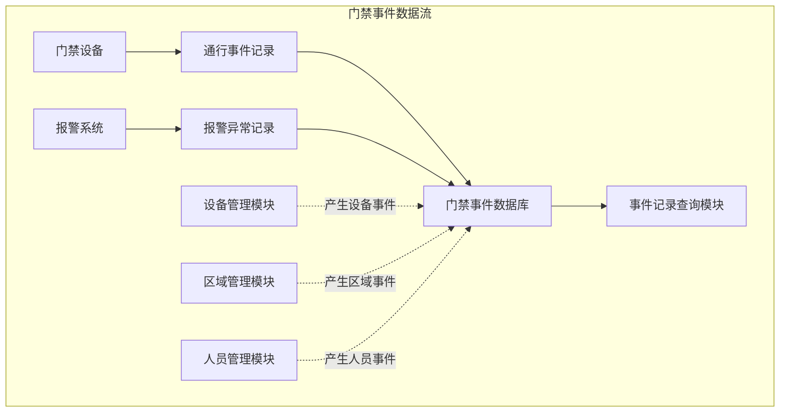
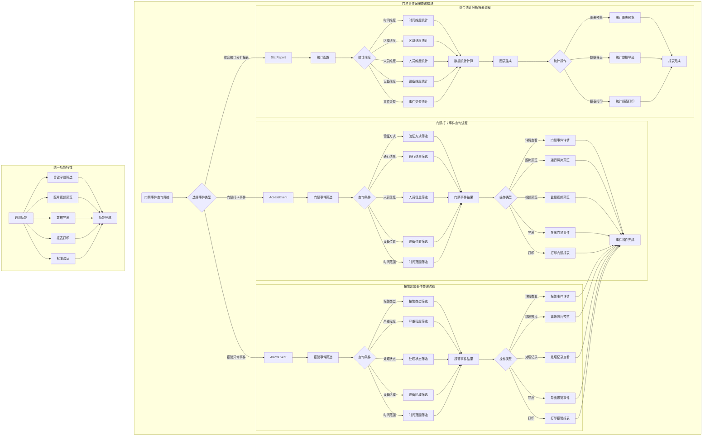

# 门禁事件记录管理 - 业务流程图

> **版本**: v1.0.0  
> **创建日期**: 2025-12-17  

---

## 📊 门禁事件数据流

---

## 🔄 门禁事件记录查询模块流程图

---

## 📝 流程说明

### 门禁打卡事件查询流程

1. **门禁事件筛选**: 根据条件筛选门禁通行记录
2. **多条件组合查询**: 支持验证方式、通行结果、人员、设备、时间等多维度筛选
3. **结果操作**: 详情查看、照片预览、视频预览、导出、打印

### 报警异常事件查询流程

1. **报警事件筛选**: 根据条件筛选报警异常记录
2. **多条件组合查询**: 支持报警类型、严重程度、处理状态、设备区域、时间等筛选
3. **结果操作**: 详情查看、现场照片预览、处理记录、导出、打印

### 综合统计分析报表流程

1. **统计配置**: 配置统计参数和范围
2. **多维度统计**: 时间、区域、人员、设备、事件类型等维度
3. **结果输出**: 图表预览、数据导出、报表打印

---

**📝 文档维护**
- **创建人**: IOE-DREAM架构团队
- **最后更新**: 2025-12-17
