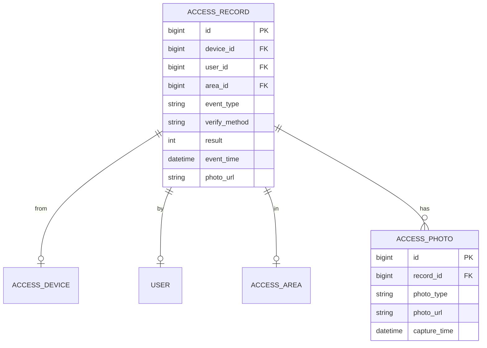

# 事件记录管理 - 数据结构设计

> **版本**: v1.0.0  
> **创建日期**: 2025-12-17

---

## 📊 ER图



---

## 📋 表结构设计

### t_access_record (通行记录表)

| 字段 | 类型 | 约束 | 说明 |
|------|------|------|------|
| id | BIGINT | PK | 主键 |
| device_id | BIGINT | FK, NOT NULL | 设备ID |
| user_id | BIGINT | FK | 用户ID |
| area_id | BIGINT | FK | 区域ID |
| event_type | VARCHAR(50) | NOT NULL | 事件类型 |
| verify_method | VARCHAR(30) | - | 验证方式(CARD/FACE/FP) |
| result | TINYINT | NOT NULL | 结果(1成功/0失败) |
| fail_reason | VARCHAR(200) | - | 失败原因 |
| event_time | DATETIME | NOT NULL | 事件时间 |
| direction | VARCHAR(10) | - | 方向(IN/OUT) |
| photo_url | VARCHAR(500) | - | 抓拍照片 |
| card_no | VARCHAR(50) | - | 卡号 |
| temperature | DECIMAL(4,1) | - | 体温 |

---

## 🔑 索引设计

```sql
CREATE INDEX idx_record_device ON t_access_record(device_id);
CREATE INDEX idx_record_user ON t_access_record(user_id);
CREATE INDEX idx_record_time ON t_access_record(event_time);
CREATE INDEX idx_record_area ON t_access_record(area_id);
CREATE INDEX idx_record_result ON t_access_record(result);
-- 复合索引
CREATE INDEX idx_record_time_device ON t_access_record(event_time, device_id);
```

---

## 📦 分区策略

```sql
-- 按月分区
ALTER TABLE t_access_record PARTITION BY RANGE (TO_DAYS(event_time)) (
  PARTITION p202512 VALUES LESS THAN (TO_DAYS('2026-01-01')),
  PARTITION p202601 VALUES LESS THAN (TO_DAYS('2026-02-01'))
);
```

---

**📝 文档维护**: IOE-DREAM架构团队 | 2025-12-17
