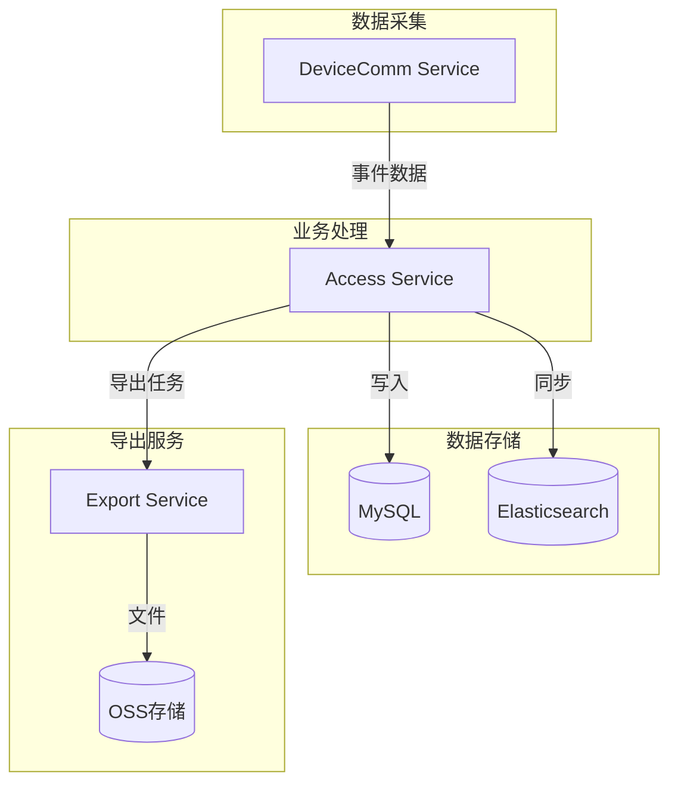

# 事件记录管理 - 概要设计说明书

> **版本**: v1.0.0  
> **创建日期**: 2025-12-17

---

## 🏗️ 系统架构

---

## 📦 模块设计

| 模块 | 职责 | 说明 |
|------|------|------|
| 事件接收 | 接收设备上报事件 | 消息队列消费 |
| 数据存储 | 事件持久化 | MySQL分区存储 |
| 查询服务 | 提供查询API | ES加速查询 |
| 统计服务 | 数据统计分析 | 定时聚合 |
| 导出服务 | 异步导出文件 | 队列处理 |

---

## 🔧 技术选型

| 技术 | 选型 | 理由 |
|------|------|------|
| 主存储 | MySQL 8.0 | 关系型存储，分区支持 |
| 搜索引擎 | Elasticsearch | 复杂查询加速 |
| 消息队列 | RabbitMQ | 异步处理 |
| 文件存储 | MinIO/OSS | 导出文件存储 |

---

**📝 文档维护**: IOE-DREAM架构团队 | 2025-12-17
